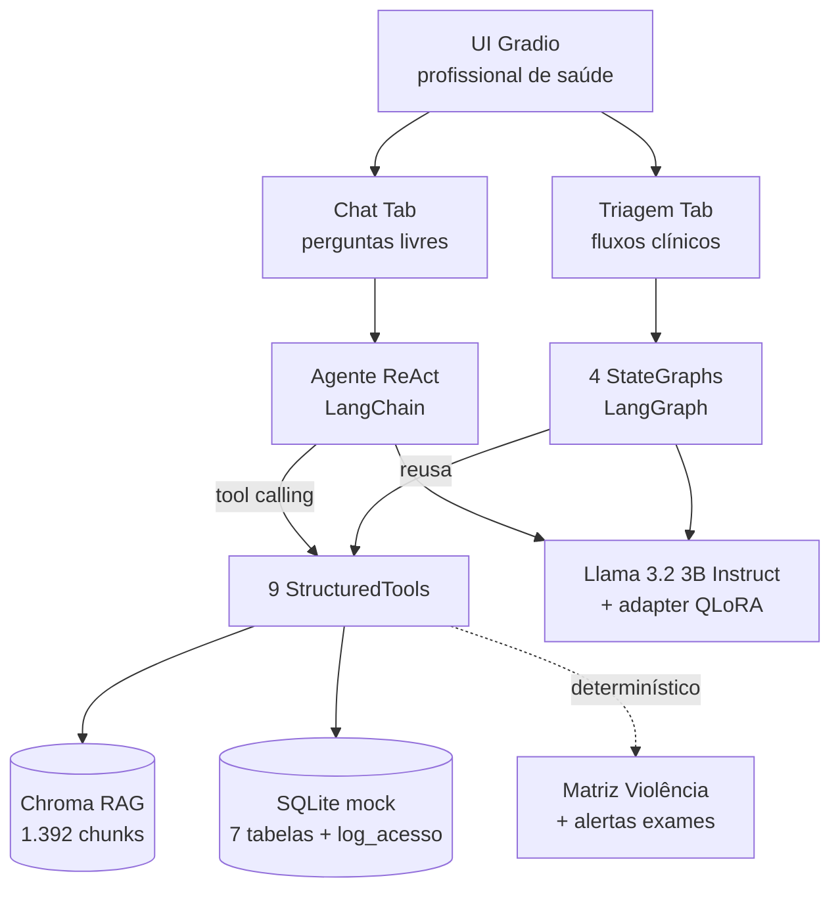
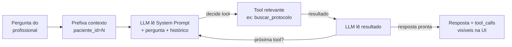
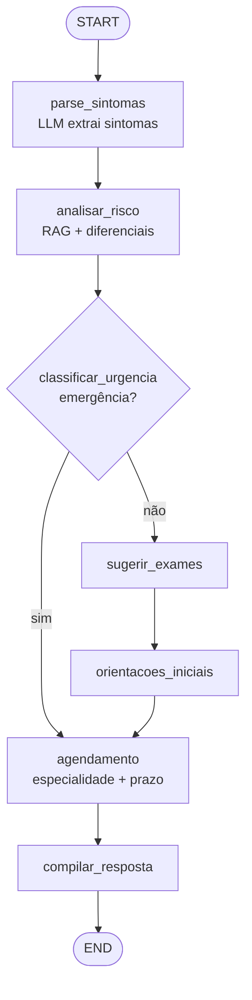
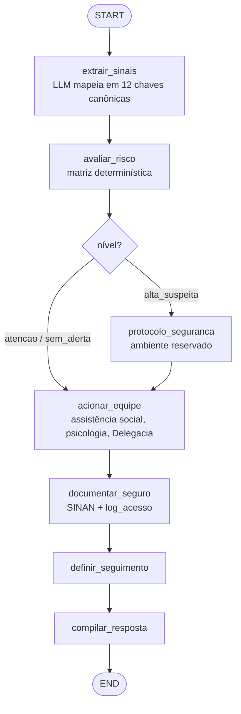
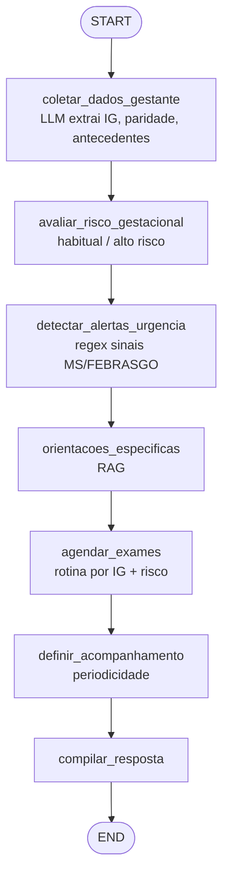
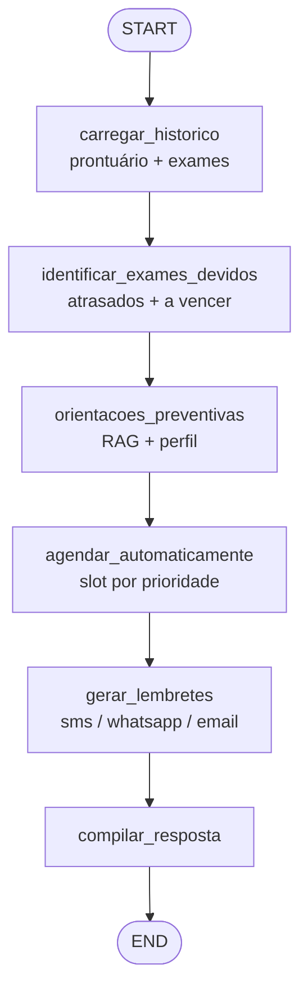

# Relatório Técnico — Assistente Clínico Hospitalar em Saúde da Mulher

**Tech Challenge FIAP — Pós Tech em IA para Devs — Fase 3**
**Grupo:**
   *- Evandro Rosa Sampaio
    - Gustavo Brasil Pires Octaviano
    - Paulo Roberto Goncalves
    - Wallace Gomes da Silva*

Apresentação: https://www.youtube.com/watch?v=4Wgx4tiHWQw
Repositório: https://drive.google.com/drive/folders/1kEkWSSvDFLWd-Slddb83B8r4_Ff1fdFx?usp=sharing

---

## 1. Sumário Executivo

Assistente virtual de apoio à **equipe de saúde** (médicos, enfermeiros, residentes, técnicos) especializado em **saúde e segurança da mulher**. Combina:

- **Fine-tuning QLoRA** do Llama 3.2 3B Instruct sobre 6.414 pares Q&A sintéticos derivados de 39 PDFs de protocolos do MS, FEBRASGO, OMS e INCA
- **RAG** com Chroma sobre 1.392 chunks dos mesmos protocolos
- **9 tools LangChain** consultando SQLite mock (50 pacientes) com auditoria LGPD
- **4 workflows LangGraph** com StateGraph explícito cobrindo Triagem Ginecológica, Detecção de Violência, Obstétrico e Prevenção
- **UI Gradio** demonstrativa

---

## 2. Arquitetura

**Princípio central:** o LLM dá o **tom** clínico (fine-tuning); o RAG dá a **fonte** citável; as regras determinísticas (matriz SINAN, alertas de exames) dão as **garantias** que não podem depender do LLM.

Detalhes em [`ARQUITETURA.md`](ARQUITETURA.md).

---

## 3. Fluxograma LangChain — Agente Conversacional

Usado no chat livre da UI para responder perguntas clínicas gerais via ReAct (`create_react_agent`).

**As 9 tools disponíveis:**

| # | Tool | Tipo |
|---|---|---|
| 1 | `buscar_protocolo(query, categoria?)` | RAG Chroma |
| 2 | `consultar_prontuario(paciente_id)` | SQL |
| 3 | `historico_exames(paciente_id, tipo?)` | SQL |
| 4 | `exames_atrasados(paciente_id)` | Regras MS (papa/mamo) |
| 5 | `consultar_medicamento(termo)` | SQL + categoria gestacional |
| 6 | `calendario_menstrual(paciente_id)` | SQL + média móvel |
| 7 | `avaliar_padrao_violencia(sinais)` | Matriz 12 sinais |
| 8 | `consultar_violencia(paciente_id, motivo)` | **Auditado LGPD** |
| 9 | `registrar_violencia(paciente_id, ...)` | **Auditado LGPD + SINAN** |

Código em [`lib/agent.py`](lib/agent.py) e [`lib/tools.py`](lib/tools.py).

---

## 4. Fluxograma LangGraph — Fluxos Clínicos
Usados na aba "Triagem Ativa" da UI quando o cenário é predeterminado. Cada workflow é um StateGraph com nodes (LLM + determinísticos) e edges (incluindo condicionais por gravidade). Todo workflow encerra em `compilar_resposta`, devolvendo `{conduta, raciocinio[], fontes[], confianca}` — atendendo o requisito de **explainability**.
### 4.1 Triagem Ginecológica

Edge crítica: `emergência?` → pula sugestão ambulatorial. Garantia: lista `SINAIS_EMERGENCIA` hard-coded.

### 4.2 Detecção de Violência Doméstica

Edge crítica: `nível?` → ativa protocolo de segurança. Garantia: matriz de 12 sinais com pesos (Norma Técnica MS).
### 4.3 Obstétrico

Edge crítica: `emergência obstétrica?` → PS obstétrico. Garantia: regex de sinais de alarme MS/FEBRASGO.
### 4.4 Prevenção

Garantia determinística: thresholds papa 25-64a / 3a, mamo 50-69a / 2a.

Código em [`lib/workflows/`](lib/workflows/). Diagramas auto-gerados também disponíveis em [`09_demo_workflows.ipynb`](09_demo_workflows.ipynb) via `wf.get_graph().draw_mermaid()`.

---

## 5. Stack Técnico

| Camada | Tecnologia |
|---|---|
| LLM base | `meta-llama/Llama-3.2-3B-Instruct` + adapter QLoRA |
| Gerador do dataset | `meta-llama/Llama-3.1-8B-Instruct` (4-bit NF4) |
| Fine-tuning | QLoRA (r=16, α=32, 7 projeções) + TRL SFTTrainer |
| Embeddings | `paraphrase-multilingual-MiniLM-L12-v2` (384d) |
| Vector store | Chroma persistente |
| Orquestração | LangChain + LangGraph (StateGraph + ReAct) |
| Base estruturada | SQLite (7 tabelas + log_acesso LGPD) |
| UI | Gradio Blocks |
| Runtime | Google Colab Pro (A100/L4) |

---

## 6. Resultados do Fine-Tuning

Comparação base vs FT (run `llama32-3b-saude-mulher_20260524_0217`) em 30 amostras aleatórias do test set (n=640):

| Métrica | Base | Fine-tuned | Direção desejada |
|---|---|---|---|
| ROUGE-L | 0.101 | 0.095 (-5.9%) | ⬆ |
| Cita serviço da rede em sensitive | ~33% | **~100%** | ⬆ |
| Comprimento médio (chars) | 1.239 | 1.470 (+18.6%) | — |

**Vitória central:** em casos sensitive (violência, saúde mental), citação dos serviços da rede (SINAN, Ligue 180, CVV, CAPS) saltou de ~33% para ~100% — era o objetivo primário do prompt diferenciado durante geração do dataset.

**Regressão identificada:** ~60% das respostas FT apresentam loops degenerativos. Mitigação aplicada em [`lib/llm.py`](lib/llm.py): `repetition_penalty=1.2` + `no_repeat_ngram_size=4` + `max_new_tokens=256`.

Análise crítica completa em [`RELATORIO_TECNICO_DETALHADO.md` §4.3](RELATORIO_TECNICO_DETALHADO.md#43-análise-crítica-honesta-dos-resultados).

---

## 7. Segurança e LGPD

| Mecanismo | Implementação |
|---|---|
| Limites no system prompt | Nunca prescrever, nunca diagnosticar, nunca direcionar à paciente |
| Tools com validação | `consultar_violencia` exige motivo ≥ 5 chars; recusa silenciosa caso contrário |
| Kill-switch nos workflows | `documentar_seguro` só registra com `confirmacao_clinica=True` |
| Auditoria LGPD | Tabela `log_acesso` (timestamp, profissional, paciente_id, motivo) |
| Matriz determinística | Decisão de notificar SINAN é por regra, não pelo LLM |
| Identificação por ID | Tools sempre recebem `paciente_id: int`, sem busca por nome |
| CPF protegido | Hash SHA-256, nunca CPF em claro (mesmo no mock) |

**Não implementado (justificado no relatório detalhado §4.5):**
- Criptografia at-rest (dados são mock 100% sintético via Faker pt_BR)
- Segundo passe LLM para validar a resposta (substituído por 5 mecanismos determinísticos para preservar a latência clínica de 5-15s já existente)

---

## 8. Atendimento aos Requisitos da Fase 3

| Requisito | Atendimento |
|---|---|
| **1. Fine-tuning LLM especializado** | ✅ QLoRA em 5.134 ex SFT derivados de 39 PDFs MS/FEBRASGO/OMS/INCA |
| **1.b — Modelos de documentos** | ✅ 6 templates em [`lib/templates/`](lib/templates/) (BI-RADS, colposcopia, receita hormonal, pré-natal/puerpério, SINAN, relatório de violência) |
| **2. Assistente LangChain** | ✅ Agente ReAct + RAG + 9 tools + UI Gradio |
| **3. Fluxos LangGraph** | ✅ 4 StateGraphs explícitos com edges condicionais por gravidade |
| **4. Segurança e validação** | ✅ Limites no prompt + log_acesso LGPD + SINAN obrigatório em alta suspeita; ⚠️ criptografia at-rest e segundo passe LLM omitidos com justificativa (ver §7) |
| **4.b — Relatórios de utilização** | ✅ [`10_relatorio_utilizacao.ipynb`](10_relatorio_utilizacao.ipynb) |
| **Repositório Git** | ✅ 10 notebooks + módulos `lib/` + dataset sintético + templates |
| **Relatório técnico** | ✅ este documento + [`RELATORIO_TECNICO_DETALHADO.md`](RELATORIO_TECNICO_DETALHADO.md) |
| **Diagramas dos fluxos** | ✅ Mermaid (§3 e §4 acima) + auto-gerados em [`09_demo_workflows.ipynb`](09_demo_workflows.ipynb) |
| **Avaliação especializada** | ✅ ROUGE + heurísticas alinhadas ao enunciado (§6) |
| **Vídeo até 15 min** | ✅ Ver [`ROTEIRO_VIDEO.md`](ROTEIRO_VIDEO.md) |

---

## 9. Limitações Reconhecidas

1. **Validação clínica formal pendente** — dataset sintético gerado por LLM; sem revisão por especialistas em ginecologia/obstetrícia
2. **Tamanho amostral pequeno** na avaliação (n=30 de 640 no test set)
3. **ROUGE-L é proxy fraco** para conteúdo clínico (mede sobreposição lexical, não correção)
4. **Tool calling do 3B** pode ter taxa de erro maior em cenários complexos (fallback ReAct presente)
5. **Sem análise quantitativa de disparidade por subgrupo demográfico** (raça, classe, região)

---

## 10. Próximos Passos

1. Validação clínica formal por especialistas em ginecologia/obstetrícia
2. Iteração 2 do treino com early stopping baseado em ROUGE no val
3. Análise de equidade por subgrupo demográfico
4. Criptografia at-rest (Fernet ou KMS) para registros sensíveis
5. Deploy: FastAPI + PostgreSQL + pgvector + UI React

---

## Anexo — Pipeline Reproducível (10 Notebooks)

| # | Notebook | Output |
|---|---|---|
| 01 | `01_extrair_protocolos.ipynb` | PDFs → JSON estruturado |
| 02 | `02_gerar_dataset_sft.ipynb` | 6.414 pares Q&A (5134/640/640) |
| 03 | `03_treinar_qlora.ipynb` | Adapter LoRA (~30-50 MB) |
| 04 | `04_avaliar_modelo.ipynb` | `eval_report.json` + sidebyside |
| 05 | `05_gerar_dados_mock.ipynb` | `hospital.db` (50 pacientes) |
| 06 | `06_indexar_protocolos.ipynb` | Chroma (1.392 chunks) |
| 07 | `07_testar_tools_alertas.ipynb` | Sanity check das 9 tools |
| 08 | `08_app_gradio.ipynb` | URL pública do app |
| 09 | `09_demo_workflows.ipynb` | Demos + Mermaid auto-gerado |
| 10 | `10_relatorio_utilizacao.ipynb` | Relatório gerencial |

---
