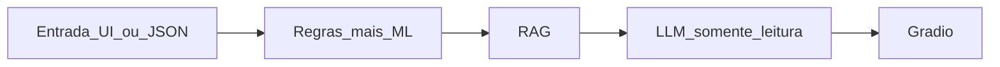
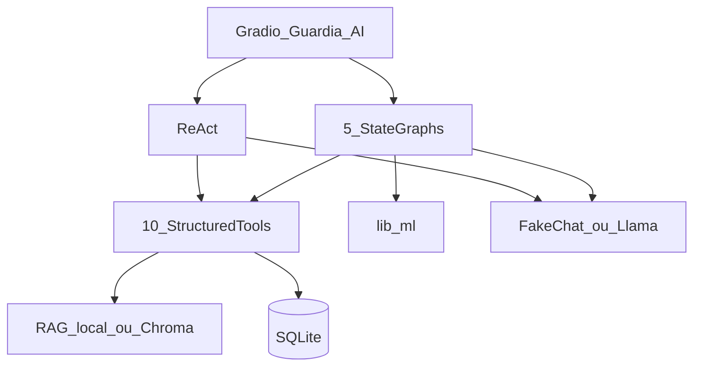

# Relatório Técnico — Guardiã AI (Saúde e Segurança da Mulher)

**Tech Challenge FIAP — Pós Tech em IA para Devs — Fase 5**  
**Grupo:** Evandro Rosa Sampaio, Gustavo Brasil Pires Octaviano, Paulo Roberto Goncalves, Wallace Gomes da Silva

**Vídeo (≤ 15 min):** a gravar — roteiro em [`ROTEIRO_VIDEO.md`](ROTEIRO_VIDEO.md). O link YouTube da Fase 3 (`watch?v=4Wgx4tiHWQw`) **não** é a apresentação desta entrega.  
**PDF:** gerar HTML com `python scripts/export_pdf_html.py` e imprimir em PDF (Chrome: Imprimir → Salvar como PDF). `RELATORIO_TECNICO.html` acompanha este Markdown.

> Projeto acadêmico. **Não substitui avaliação clínica.** O classificador de risco gestacional usa **dados 100 % sintéticos**. Sem validação por especialistas.

---

## 1. Problema

A **Guardiã AI** apoia a **equipe de saúde** (não a paciente) em dois eixos do desafio:

1. **Triagem de gestante** — estimar risco habitual vs. alto risco a partir de variáveis estruturadas, com regras de alarme **antes** do modelo.
2. **Relato de segurança** — fluxo de violência (matriz SINAN, auditoria LGPD), sem decisão automática de notificação.

O LLM **não classifica** o risco obstétrico: lê números já calculados (ADR-001 / contrato anti-alucinação). No perfil CPU/Docker usa-se `FakeChatModel`; Llama 3.2 3B + QLoRA permanece no pipeline Colab da Fase 3.

---

## 2. Fluxo da Fase 5


```mermaid
flowchart LR
  entrada[Entrada_UI_ou_JSON]
  ml[Regras_mais_ML]
  rag[RAG]
  llm[LLM_somente_leitura]
  ui[Gradio]
  entrada --> ml --> rag --> llm --> ui
```

Implementação: [`lib/workflows/risco_ml.py`](lib/workflows/risco_ml.py) + 6ª aba em [`lib/ui.py`](lib/ui.py).

---

## 3. Dados e preparação

| Atributo | Valor | Evidência |
|---|---|---|
| Natureza | Sintético (gerador latente + Bernoulli; ADR-004) | `artifacts/data/risco_gestacional_v1.manifest.json` |
| n | 8 000 linhas, 24 features | mesmo manifesto |
| Semente | 42 | manifesto |
| SHA-256 | `6a3b6aefe9e2cf1bb3ec9123386cac4812fd4ef1602657d7950668d5abc20e2f` | manifesto |
| Splits | 5 600 / 1 200 / 1 200 | manifesto |
| Prevalência alto risco | 0,20575 | manifesto |

Não há PHI. O mock de prontuário (50 pacientes, Faker pt_BR) é independente do dataset tabular.

---

## 4. Modelos e métricas

Comparação no **mesmo split de teste**. Métrica de escolha: **PR-AUC** (classe positiva desbalanceada). Acurácia **não** decide o modelo (`acuracia_nao_decisoria`).

Fonte: `artifacts/metrics/comparacao.json` e `logistic_regression_teste.json`.

| Modelo | PR-AUC (teste) | Observação |
|---|---|---|
| Dummy (prior) | 0,206 | baseline de prevalência |
| Regra clínica | 0,263 | baseline determinístico |
| **Regressão logística** | **0,590** | **vencedor**; recall+ 0,955 no limiar 0,278 (limiar **da validação**) |
| Random Forest | 0,557 | segundo |

Limiar operacional 0,278 **não** é 0,5. Explicabilidade no CPU: `coef_linear` (LogReg) ou permutação global (RF). SHAP é opcional e **não** está no ambiente padrão (`requirements-ml.txt`).

---

## 5. RAG

| Perfil | Mecanismo | `doc_id` |
|---|---|---|
| **demo-cpu / Docker** | Retriever lexical [`lib/rag_local.py`](lib/rag_local.py) sobre [`artifacts/rag/protocolos_subset.json`](artifacts/rag/protocolos_subset.json) | arquivos `.pdf` estáveis (recorte didático) |
| Colab / GPU | Chroma + MiniLM; notebook [`06_indexar_protocolos.ipynb`](06_indexar_protocolos.ipynb) com `CHUNK_SIZE=1000`, overlap 200 | índice fora do Git (Drive) |

A ferramenta `buscar_protocolo` e o nó RAG de `risco_ml` usam o mesmo retriever injetado. Sem índice, o fluxo devolve `retrieved_sources: []` sem abortar.

---

## 6. LLM

- **CPU/Docker:** `FakeChatModel` — declara o modo; não inventa métricas (validador em `lib/ml/llm_contract.py`).
- **Colab:** Llama 3.2 3B Instruct + adapter QLoRA (Fase 3). Human-in-the-loop: o profissional confirma conduta; o sistema não prescreve.

---

## 7. Arquitetura (produto nesta branch)

- 10 tools LangChain (inclui `predizer_risco_gestacional`)
- 5 grafos LangGraph (Triagem, Violência, Obstétrico, Prevenção, `risco_ml`)
- 6 abas Gradio (título **Guardiã AI**)
- SQLite: tabelas da Fase 3 + `predicoes_ml` (hash de features, sem payload clínico em claro)
- Docker `demo-cpu`: sklearn + FakeChatModel, sem Llama


```mermaid
flowchart TB
  UI[Gradio_Guardia_AI]
  UI --> Agent[ReAct]
  UI --> WFs[5_StateGraphs]
  Agent --> Tools[10_StructuredTools]
  WFs --> Tools
  Tools --> RAG[RAG_local_ou_Chroma]
  Tools --> DB[(SQLite)]
  WFs --> ML[lib_ml]
  Agent --> LLM[FakeChat_ou_Llama]
  WFs --> LLM
```

---

## 8. Segurança, ética e limites

- Nunca prescrever; nunca diagnosticar de forma definitiva; nunca falar com a paciente.
- Violência: `log_acesso` com motivo ≥ 5 caracteres; SINAN por regra, não pelo LLM.
- Sinais de alarme obstétrico **bypassam** o ML.
- Sem criptografia at-rest (mock acadêmico). Sem SSO.

---

## 9. Entregáveis do enunciado

| Item | Estado |
|---|---|
| Git + README | este repositório |
| UI | Gradio, `python scripts/app.py` |
| Dockerfile | perfil `demo-cpu` |
| Relatório técnico | este arquivo + HTML |
| Vídeo ≤ 15 min | **pendente** (humano) |
| RAG com citação | subset CPU + Chroma no Colab |

---

## 10. Limitações

1. Métricas de ML **não** são validação clínica.
2. Subset RAG CPU é recorte educacional, não os 39 PDFs completos.
3. Vídeo e merge para `main` (se a banca clonar `main`) ficam fora deste Markdown.
4. `pip-audit` documentado, pins não alteradas.

---

## Anexo — Como reproduzir no CPU

```text
pip install -r requirements.txt -r requirements-ml.txt
python scripts/train.py --verificar-dataset
python -m pytest -q
python scripts/run_demo.py
python scripts/app.py
python scripts/export_pdf_html.py
```
