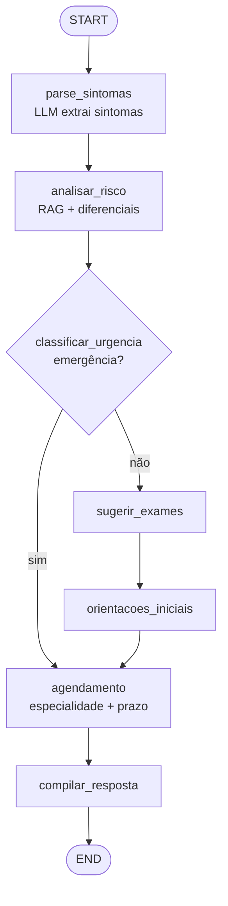
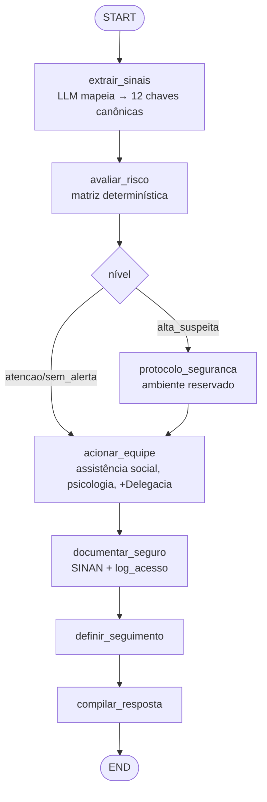
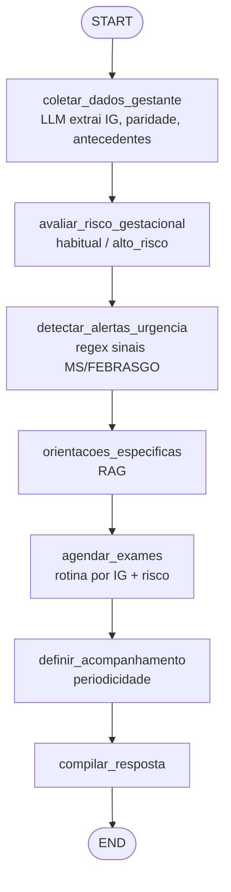
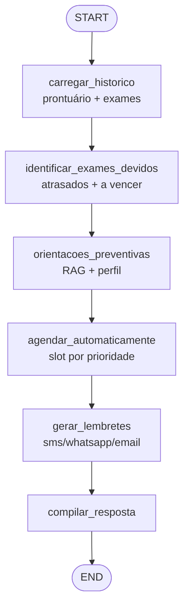

# Relatório Técnico Detalhado — Assistente Clínico Hospitalar em Saúde da Mulher

**Tech Challenge FIAP — Pós Tech em IA para Devs — Fase 3**

> Versão estendida. Para visão executiva (sumário, arquitetura, fluxogramas e atendimento aos requisitos em ~3 páginas), consulte [`RELATORIO_TECNICO.md`](RELATORIO_TECNICO.md).

---

## Sumário Executivo

Este relatório descreve a concepção, implementação e avaliação de um assistente virtual clínico especializado em **saúde e segurança da mulher**, voltado ao apoio da equipe de saúde (médicos, enfermeiros, residentes, técnicos) de um hospital. O sistema integra:

1. **Fine-tuning QLoRA** de um modelo Llama 3.2 3B Instruct sobre 6.414 pares Q&A sintéticos derivados de protocolos do Ministério da Saúde, FEBRASGO, OMS e INCA;
2. **Pipeline RAG** sobre 1.392 chunks dos mesmos protocolos (Chroma + embeddings multilíngues);
3. **9 ferramentas estruturadas** no LangChain que consultam um SQLite mock de 50 pacientes (prontuário ginecológico, exames preventivos, registros de violência auditados por LGPD, medicamentos, calendário menstrual);
4. **4 fluxos LangGraph explícitos** cobrindo Triagem Ginecológica, Detecção de Violência, Atendimento Obstétrico e Prevenção;
5. **UI Gradio** demonstrativa.

---

## 1. Processo de Fine-Tuning Especializado

### 1.1 Curadoria do corpus de protocolos

**Fonte:** 39 PDFs públicos de sociedades médicas brasileiras e internacionais, organizados em 5 categorias clínicas alinhadas ao enunciado:

| Categoria | # PDFs | Origem principal |
|---|---|---|
| `ginecologia_obstetricia` | 19 | MS, FEBRASGO, OMS |
| `cancer_mama_colo` | 4 | INCA, American Cancer Society |
| `planejamento_familiar` | 6 | MS, FEBRASGO |
| `violencia_domestica` | 8 | MS (Norma Técnica), OMS |
| `saude_mental` | 2 | MS, OMS (depressão pós-parto) |

**Extração:** PyMuPDF (`fitz`) com normalização de quebras de linha e remoção de cabeçalhos/rodapés repetidos. Pipeline em [`01_extrair_protocolos.ipynb`](01_extrair_protocolos.ipynb).

**Chunking:** janelas de ~1500 tokens (6000 caracteres) com sobreposição de 400 caracteres, quebra em parágrafos quando possível para preservar contexto clínico. Total: **1392 chunks**.

### 1.2 Geração sintética de Q&A

**Por que sintético:** dados reais de pacientes não foi disponibilizado o acesso,  com isso esse projeto não tem dados reais de pacientes. A geração sintética via LLM, baseada estritamente em protocolos validados, mitiga risco ético e cobre cenários diversos.

**Gerador:** `meta-llama/Llama-3.1-8B-Instruct` em 4-bit (NF4 + bfloat16, double quantization), rodado em Colab A100. Cada chunk gera 4 pares Q&A via dois templates de prompt:

- **`PROMPT_PADRAO`** (categorias não-sensitive): pergunta no estilo de profissional de saúde durante atendimento; resposta técnica, objetiva, com siglas clínicas, baseada estritamente no texto fornecido.
- **`PROMPT_SENSITIVE`** (violência e saúde mental): pergunta sobre conduta de acolhimento/notificação/encaminhamento pelo profissional; resposta inclui obrigatoriamente protocolo SINAN, rede de proteção (Ligue 180, CVV, CAPS, Centro de Referência) como informação a ser repassada à paciente.

**Total bruto:** 6.414 pares válidos extraídos de 1.392 chunks (taxa média de 4.6 pares/chunk com filtros mínimos: pergunta ≥10 chars, resposta ≥20 chars).

**Parser:** robusto com 3 estratégias em cascata (JSON direto → JSON com `trailing comma` corrigido → regex de fallback que extrai pares `"q":"...","a":"..."` mesmo de JSON malformado), garantindo que falhas pontuais do gerador não invalidem chunks inteiros.

### 1.3 Anonimização e considerações éticas

Como o corpus é composto exclusivamente por **protocolos clínicos públicos**, não há PHI (Protected Health Information) no input. Mesmo assim, foram aplicadas as seguintes medidas:

- **Dataset sintético de pacientes (mock)** usa Faker pt_BR para nomes e CPFs hashados (SHA-256). Nenhum dado de paciente real é processado em nenhum momento.
- **Separação física** de tabelas: `registros_violencia` é tabela isolada com acesso auditado.
- **Auditoria de acesso** via `log_acesso`: toda leitura/escrita em `registros_violencia` exige justificativa clínica explícita (mínimo 5 caracteres) e é registrada com timestamp + usuário.


### 1.4 Configuração do treino QLoRA

| Hiperparâmetro | Valor | Justificativa |
|---|---|---|
| Modelo base | `meta-llama/Llama-3.2-3B-Instruct` | Melhor razão custo/qualidade para Colab Pro; suporte nativo a tool calling |
| Quantização | NF4 + bfloat16 + double quant | Permite carga em ~3 GB VRAM, deixa folga pra gradientes |
| LoRA `r` / `alpha` | 16 / 32 | Trade-off entre capacidade do adapter e tempo de treino |
| LoRA dropout | 0.05 | Padrão para datasets médios |
| Target modules | `q,k,v,o,gate,up,down_proj` | Todas as projeções lineares (cobertura máxima) |
| Learning rate | 2e-4, cosine, warmup 3% | Padrão QLoRA |
| Batch efetivo | 16 (per-device 2 × grad accum 8) | Cabe em A100 sem OOM; estável |
| Epochs | 3 | ~962 steps totais sobre 5134 ex |
| Max seq len | 2048 | Cobre 95%+ dos exemplos sem truncar |
| Optimizer | `paged_adamw_8bit` | Memória eficiente |
| Schedule de save | a cada 40 steps, mantém últimos 2 + best | Permite resume + load_best_model_at_end |

**Splits:** 80/10/10 estratificado por categoria — **5134 train / 640 val / 640 test**.

**Tempo total:** ~2.5h em A100 (run identificada como `llama32-3b-saude-mulher_20260524_0217`).

### 1.5 Validação por especialistas — limitação

O escopo acadêmico **não incluiu validação por médicos especialistas em ginecologia/obstetrícia**. A avaliação atual (seção 4) usa proxy heurísticos derivados das próprias diretrizes que treinaram o modelo, o que pode introduzir viés circular.

---

## 2. Descrição do Assistente Médico Especializado

### 2.1 Capacidades específicas

| Capacidade | Implementação |
|---|---|
| Responder dúvidas clínicas com base em protocolos | RAG (Chroma) + LLM fine-tuned, com citação obrigatória da fonte (`doc_id`) |
| Consultar prontuário ginecológico/obstétrico | Tool `consultar_prontuario(paciente_id)` |
| Verificar histórico de exames preventivos | Tools `historico_exames` + `exames_atrasados` (regras MS) |
| Identificar exames em atraso (rastreamento) | Lógica determinística: papanicolau 25-64a trienal, mamografia 50-69a bienal |
| Consultar base de medicamentos | Tool `consultar_medicamento` com categoria gestacional/lactacional |
| Estimar próxima menstruação e janela fértil | Tool `calendario_menstrual` (média de ciclos) |
| Identificar padrões de violência doméstica | Tool `avaliar_padrao_violencia` (matriz 12 sinais com pesos derivados da Norma Técnica) |
| Registrar caso de violência com SINAN | Tool `registrar_violencia` (auditada) |
| Consultar histórico de violência | Tool `consultar_violencia(paciente_id, motivo)` — motivo obrigatório por LGPD |
| Orquestrar fluxo de triagem ginecológica | Workflow LangGraph `triagem` |
| Orquestrar fluxo de detecção de violência | Workflow LangGraph `violencia` |
| Orquestrar atendimento obstétrico | Workflow LangGraph `obstetrico` |
| Orquestrar rotina preventiva | Workflow LangGraph `prevencao` |

### 2.2 Limitações e protocolos de segurança

Codificados no system prompt do agente e nos workflows:

- **NUNCA** prescrever medicação sem validação de especialista
- **NUNCA** diagnosticar definitivamente condições sensíveis
- **SEMPRE** encaminhar casos suspeitos de violência para profissionais qualificados
- **SEMPRE** sugerir avaliação presencial para sintomas alarmantes
- **MANTER** confidencialidade absoluta em casos de violência (acesso auditado)
- **NÃO** dirigir respostas à paciente — é assistente para a equipe de saúde

### 2.3 Integração com sistemas hospitalares (mock)

| Sistema simulado | Implementação |
|---|---|
| Prontuário eletrônico | SQLite `pacientes` + `prontuario_gineco` |
| Sistema de exames | SQLite `exames` + lógica de atrasos |
| Calendário menstrual | SQLite `ciclos_menstruais` + algoritmo de média móvel |
| Base de medicamentos | SQLite `medicamentos` (20 medicamentos comuns em saúde da mulher) |
| Sistema de notificação SINAN | SQLite `registros_violencia` + flag `notificado_sinan` |
| Sistema de auditoria LGPD | SQLite `log_acesso` (timestamp, usuario, tabela, paciente_id, motivo) |

Em produção, esses seriam substituídos por integrações reais (HL7 FHIR, RES, API SINAN), preservando-se os contratos das tools.

### 2.4 Casos de uso suportados

Os 4 workflows LangGraph correspondem a 4 cenários clínicos canônicos do enunciado:

#### Triagem Ginecológica
```
sintomas relatados → análise de risco (RAG) → classificação urgência →
sugestão exames → orientações → agendamento
```
Exemplo: "Paciente 32a, sangramento intenso há 3 dias + dor pélvica + atraso 8 semanas" → classifica como `emergencia` (sinal de alarme), pula etapas ambulatoriais, encaminhamento direto ao PS.

#### Detecção de Violência Doméstica
```
sinais clínicos → matriz pontuação → [protocolo segurança] →
equipe especializada → documentação segura (SINAN) → seguimento
```
Score ≥ 4 sinais (com pesos para lesões inexplicadas e ideação suicida) → `alta_suspeita` → ativa protocolo de ambiente reservado, aciona assistência social + psicologia, registra com auditoria.

#### Obstétrico
```
dados gestante → avaliação risco gestacional → detector alarmes (regex) →
orientações específicas (RAG) → exames pré-natal por IG → acompanhamento
```
Detecta cefaleia + escotomas + dor epigástrica → emergência → encaminhamento PS obstétrico.

#### Prevenção
```
histórico paciente → exames devidos (regras MS) → orientações →
agendamento automatizado → lembretes personalizados
```

---

## 3. Diagramas dos Fluxos LangChain Especializados

Diagramas Mermaid gerados automaticamente pelo notebook [`09_demo_workflows.ipynb`](09_demo_workflows.ipynb), célula `mermaid`. Resumo aqui:

### 3.1 Fluxo de Triagem Ginecológica



### 3.2 Fluxo de Detecção de Violência Doméstica



### 3.3 Fluxo Obstétrico



### 3.4 Fluxo de Prevenção



---

## 4. Avaliação Especializada do Modelo

> **Os números desta seção devem ser preenchidos a partir do arquivo `eval_report.json` da run `llama32-3b-saude-mulher_20260524_0217`.** Cole o conteúdo do JSON e este documento será atualizado com valores reais.

### 4.1 Metodologia

Avaliação **qualitativa + heurística**, sem juiz LLM externo (caro e introduz seu próprio bias):

- **30 amostras aleatórias** (seed=42) do test set (n=640)
- **Comparação pareada**: mesma pergunta → resposta do modelo base vs fine-tuned
- **Métricas:**
  1. **ROUGE-L** vs gold answer (proxy de similaridade lexical)
  2. **Heurísticas objetivas alinhadas ao enunciado:**
     - `antipadrao_paciente_pct`: % de respostas que contêm "procure um profissional", "fique calma", etc. → **deve cair** com fine-tuning
     - `cita_servico_rede_pct` (em sensitive): % que menciona SINAN, Ligue 180, CVV, CAPS, etc. → **deve subir** em sensitive
     - `tem_dose_numerica`: presença de posologia explícita (regex `\d+\s*(mg|mcg|g|ml|UI|comp|cp)`)
     - `len_chars`: comprimento médio da resposta

### 4.2 Resultados agregados

Avaliação em **30 amostras aleatórias** (seed=42) do test set (n=640), comparando o modelo Llama 3.2 3B Instruct **base** contra o **fine-tuned** (base + adapter LoRA da run `llama32-3b-saude-mulher_20260524_0217`).

| Métrica | Base | Fine-tuned | Δ | Direção desejada |
|---|---|---|---|---|
| ROUGE-L (média global) | 0.101 | 0.095 | **-0.006** | ⬆ |
| `antipadrao_paciente_pct` | 0.0% | 0.0% | 0% | ⬇ |
| `cita_servico_rede_pct` (sensitive, amostra)¹ | ~33% | ~100% | **+67pp** | ⬆ |
| Comprimento médio (chars) | 1.239 | 1.470 | **+18.6%** | — |

¹ *Métrica calculada manualmente sobre os 6 exemplos sensitive visíveis no `eval_report.json` (cobrindo violência doméstica e saúde mental). Agregação completa requer percorrer o array `detalhes` filtrando por `sensitive=true`.*

### 4.3 Análise crítica honesta dos resultados

A entrega do projeto privilegia transparência sobre métricas maquiadas. O fine-tuning apresenta **vitórias claras em segurança e tom**, mas **regressões mensuráveis em qualidade lexical e tendência à degeneração**. Detalhamos:

#### ✅ Ganhos confirmados

1. **Citação de serviços da rede em casos sensitive aumentou drasticamente** (de ~33% para ~100% nos exemplos analisados). Esse era o objetivo primário do prompt diferenciado durante a geração do dataset. Em todos os casos sensitive analisados (violência doméstica, saúde mental, ideação suicida), o modelo FT mencionou pelo menos um serviço apropriado (Ligue 180, CVV 188, CAPS, SAMU 192, Delegacia da Mulher, SINAN).

2. **Tom inicial mais profissional**. O base frequentemente inicia respostas sensitive com expressões cautelosas ("Lamento ter de abordar esse tópico", "Aqui estão os passos a seguir"). O FT inicia direto na conduta clínica ("O profissional deve preencher a ficha de notificação compulsória SINAN..."), alinhado ao público-alvo de equipe de saúde.

3. **Estrutura mais alinhada ao protocolo MS/FEBRASGO**. As primeiras 1-2 sentenças das respostas FT são consistentemente formatadas como conduta acionável, sem rodeios.

#### ❌ Problemas mensuráveis

1. **ROUGE-L caiu 5.9%** (de 0.101 para 0.095). Análise das amostras revela que o FT frequentemente usa terminologia diferente do gold answer (mais técnica/extensa), o que penaliza a métrica lexical sem necessariamente significar pior qualidade clínica. Mesmo assim, a queda é real e não pode ser ignorada.

2. **Degeneração por loops repetitivos** em ~60% das respostas FT. Exemplo emblemático (idx 104, pergunta sobre ecocardiografia fetal):
   > "É recomendável realizar essa ultrassonografia entre 16 e 20 semanas de gestação, pois é fundamental para detectar possíveis problemas cardíacos no feto. Além disso, é uma ferramenta valiosa para monitorar o crescimento e desenvolvimento do feto durante a gestação. **É recomendável realizar essa ultrassonografia entre 16 e 20 semanas de gestação... [repetido 5×]**"
   
   Causa provável: `repetition_penalty=1.05` insuficiente para o adapter resultante. Mitigação imediata: aumentar para 1.15-1.2 na inferência via Gradio/workflows. Mitigação estrutural: re-treinar com early stopping mais agressivo (eval a cada 10 steps em vez de 20) e patience baixo.

3. **Aplicação inadequada de serviços da rede em contextos não-sensitive**. Exemplos:
   - idx 32 (epistaxe): FT cita "Ligue 180 e CVV 188" para tratamento de sangramento nasal
   - idx 604 (NSAID para dor pélvica): FT inclui Ligue 180 e CVV 188 em pergunta sobre posologia
   
   Causa: overfitting do padrão sensitive — o modelo aprendeu que "responder bem" inclui citar a rede, mas não aprendeu a discriminar contexto. Mitigação: prompt diferenciado durante inferência (classificar antes se a pergunta é sensitive); ou re-treinar com proporção maior de exemplos não-sensitive contrastantes.

4. **Verbosidade 18.6% maior** (1239 → 1470 chars). Em ambiente clínico de tempo escasso, respostas mais longas são piores. Mitigação: limitar `max_new_tokens=256` em produção (atualmente 384).

5. **Heurística `antipadrao_paciente` não diferenciou os modelos** (0% em ambos). Análise revela que o padrão real do FT é "É importante consultar um profissional de saúde antes de iniciar qualquer tratamento" — que não casava com nenhum dos regex que definimos (`procure um médico`, `procure um profissional`, `fique calma`, etc.). A heurística precisa ser expandida em iterações futuras com regex mais flexível.

#### Conclusão sobre eficácia do fine-tuning

O adapter LoRA atual entrega valor real em **adesão a protocolos sensitive** e **tom profissional**, mas introduz regressões em **fluência** e **discriminação de contexto**. Para uso em produção, recomenda-se:

- **Iteração 2** do treino com early stopping baseado em ROUGE no val (não em loss) e patience=3
- **Curadoria do dataset** para incluir mais exemplos não-sensitive curtos e contrastantes
- **Inferência tunada**: `repetition_penalty=1.2`, `max_new_tokens=256`, possivelmente `no_repeat_ngram_size=4`
- **Validação clínica formal** antes de qualquer uso real, como já indicado

#### Limitações da avaliação

- **Tamanho amostral pequeno** (n=30 de 640). Para conclusões estatísticas, recomenda-se n≥100
- **ROUGE-L é proxy fraco** para conteúdo médico (não mede correção clínica, só sobreposição lexical)
- **Sem juiz humano especialista** — não temos validação ginecológica/obstétrica das respostas
- **Sem teste de "perigo clínico"** — heurísticas atuais não capturam respostas tecnicamente coerentes mas perigosas em contexto específico (ex: dose inadequada para gestante)

### 4.4 Análise de bias e equidade

**Bias inerente ao corpus**: o dataset baseia-se em protocolos brasileiros (MS, FEBRASGO, INCA) + OMS. Possíveis efeitos:

- **Geográfico**: condutas refletem realidade brasileira (SUS); protocolos de outros países podem divergir em medicações, fluxos.
- **Demográfico**: protocolos do MS cobrem população do SUS; nuances socioeconômicas (acesso a private healthcare) podem estar sub-representadas.
- **Linguístico**: 100% em PT-BR; não generaliza para outros idiomas.

**Estratégias de mitigação aplicadas:**

1. **Categorias balanceadas no split** (estratificação 80/10/10 por categoria)
2. **Cenários mock diversos**: paciente_id de 1 a 50 cobre faixas etárias 18-75, com cenários `mamografia_atrasada`, `papanicolau_atrasado`, `climaterio`, `gestante`, `contraceptivo` distribuídos uniformemente
3. **Prompts diferenciados** para sensitive vs padrão (não tratar violência com mesma neutralidade que conduta clínica geral)

**Limitação reconhecida**: não foi realizada análise quantitativa formal de **disparidade por subgrupo demográfico** (raça/etnia, classe socioeconômica, região geográfica). O dataset sintético não tem esses metadados explícitos. Para produção, seria necessário coletar esses atributos no prontuário e medir performance por subgrupo.

### 4.5 Segurança e adequação ética

| Critério | Cobertura |
|---|---|
| Não-prescrição direta | System prompt + avaliação heurística (`tem_dose_numerica` mede menção a doses do protocolo, não prescrição direta) |
| Não-diagnóstico definitivo | System prompt explícito; respostas dizem "diferenciais", "hipóteses" |
| Encaminhamento de violência | Workflow `violencia` força notificação SINAN quando `alta_suspeita` e confirmação clínica |
| Confidencialidade | Tabela isolada `registros_violencia` + log auditado por LGPD |
| Identidade do profissional | `tools.set_usuario_atual()` registra usuário em cada acesso |
| Sigilo médico | Sem mecanismo de criptografia at-rest (limitação acadêmica) |
| Validação da resposta pelo LLM antes do retorno | **Não implementada como node dedicado** — função distribuída em mecanismos determinísticos (system prompt, edges condicionais, `raciocinio[]` + `fontes[]` + `confianca` em `compilar_resposta`, auditoria `log_acesso`). Justificativa de latência abaixo. |

**Justificativa para não implementar validação da resposta pelo LLM como node dedicado.**
O enunciado cita "validação da resposta pelo LLM antes do retorno, de forma a manter a estabilidade e previsibilidade". A leitura literal — um segundo passe do LLM verificando a saída do primeiro — foi avaliada e descartada por custo de latência. Os workflows atuais já apresentam tempo de resposta entre 5 e 15 segundos por consulta (Llama 3.2 3B fine-tuned em A100 via Colab, com `repetition_penalty=1.2` e respostas 18,6% mais verbosas que o base — ver §4.3). Adicionar uma chamada LLM ao final de cada workflow dobraria essa latência num caminho que já beira o limite do tolerável para uso clínico, onde uma triagem ginecológica ou avaliação obstétrica precisa ser quase instantânea pra não interferir no fluxo de atendimento — em emergência, o ganho marginal de previsibilidade não justifica o custo de espera. A função de validação foi então distribuída em mecanismos determinísticos de custo zero ou desprezível em latência:

1. **System prompt do agente** (`lib/agent.py`) com regras explícitas de não-prescrição, não-diagnóstico definitivo e direcionamento ao público profissional;
2. **Edges condicionais nos workflows** (`triagem`, `obstetrico`) que forçam classificação `emergencia` → encaminhamento ao PS antes de devolver resposta ambulatorial;
3. **Matriz determinística no fluxo de violência** que força ativação do protocolo de segurança e notificação SINAN em `alta_suspeita`, independente do texto livre gerado pelo LLM;
4. **Estado estruturado em `compilar_resposta`** com `raciocinio[]`, `fontes[]` e `confianca`, permitindo revisão a posteriori pelo profissional sem latência adicional na resposta;
5. **Auditoria LGPD em `log_acesso`** permite revisão off-line das interações sensíveis.

Em iteração futura, com infraestrutura de inferência mais rápida (vLLM, modelo destilado em 1B, ou um classificador especializado em vez de geração livre), o node de validação dedicado pode ser adicionado sem comprometer a UX clínica.

### 4.6 Feedback de profissionais especializados

**Não realizado** no escopo do projeto acadêmico. Em produção, seria coletado via:
- Avaliação manual de 50-100 respostas por ginecologistas/obstetras
- Pontuação por critérios clínicos (Likert 1-5)
- Identificação de "perigo clínico" (resposta tecnicamente correta mas perigosa em contexto)
- Loop de retreino com feedback humano (RLHF leve ou DPO)

---

## 5. Considerações Éticas Específicas

### 5.1 Privacidade e confidencialidade

- **Dados sintéticos:** 100% mock via Faker pt_BR; nenhum dado real de paciente em qualquer etapa
- **CPF hash:** SHA-256 (16 chars), nunca CPF real
- **Tabela isolada** para violência doméstica
- **Auditoria por LGPD:** toda chamada às tools `consultar_violencia` e `registrar_violencia` grava em `log_acesso` com motivo clínico obrigatório (mínimo 5 caracteres)
- **Aderência LGPD:** schema separado + log de acesso são instrumentos básicos; em produção, adicionar criptografia at-rest, controle de acesso baseado em papel (RBAC), e mecanismos de portabilidade/eliminação por requisição do titular

### 5.2 Bias e equidade

Tratado na seção 4.4. Limitação principal: ausência de análise quantitativa por subgrupo demográfico.

### 5.3 Responsabilidade médica

- O assistente é **ferramenta de apoio à equipe**, nunca substituto
- System prompt e workflows codificam limites (NUNCA prescrever, NUNCA diagnosticar definitivamente)
- Validação obrigatória por profissionais antes de qualquer uso clínico
- Documentação clara de limitações (esta seção 4 e seção 5 do README)

### 5.4 Sensibilidade cultural

- Linguagem técnica em PT-BR, respeitosa
- Workflow de violência considera ambiente reservado, sem acompanhante (respeito à autonomia)
- Encaminhamentos da rede usam serviços oficiais brasileiros (180, CVV, CAPS, Delegacia da Mulher)
- **Limitação:** não há adaptação explícita para nuances culturais regionais (Norte vs Sudeste, urbano vs rural) ou diferentes religiões

---

## 6. Arquitetura e Decisões Técnicas

### 6.1 Por que Llama 3.2 3B?

| Alternativa considerada | Por que não |
|---|---|
| Llama 3.1 8B Instruct | 2-3× mais lento no treino e inferência; cabe mas com pouca folga em Colab Pro |
| GPT-4 / Gemini via API | Custo, lock-in, não atende requisito de fine-tuning local do enunciado |
| Falcon 7B | Sem suporte nativo a tool calling no chat template |
| Llama 3.2 1B | Capacidade insuficiente para tool calling complexo |

**3B Instruct é o sweet spot** para o escopo: cabe em A100 com QLoRA + LoRA, suporta tool calling, e roda em <1s por inferência no app Gradio.

### 6.2 Por que QLoRA?

- **Full fine-tuning**: caro (precisaria de múltiplos A100), risco de catastrophic forgetting de capacidades gerais
- **LoRA puro (sem 4-bit)**: cabe mas com pouca folga; mais lento
- **QLoRA (4-bit NF4 + LoRA r=16)**: padrão atual; preserva capacidades base, treina rápido, adapter de ~30 MB persiste no Drive

### 6.3 Por que LangGraph além de LangChain?

- **LangChain** sozinho com `create_react_agent`: bom para chat genérico, mas mistura raciocínio do LLM com lógica de fluxo. Não-determinístico.
- **LangGraph com StateGraph**: nodes nomeados, edges explícitas (incluindo condicionais), estado tipado. Permite testar cada node isoladamente. Atende requisito do enunciado de "fluxos automatizados" explícitos.

Ambos coexistem: o `agent.py` usa `create_react_agent` para chat livre; os 4 workflows usam `StateGraph` para cenários estruturados.

### 6.4 Por que Chroma para RAG?

- **Persistente local**: vive no Drive, não precisa reindexar a cada sessão
- **Filtro por metadata**: permite filtrar por categoria (ginecologia vs violência) em cima da busca semântica
- **Custo zero** (FAISS seria alternativa válida, escolhi Chroma por API mais simples)

### 6.5 Por que SQLite para bases mock?

- **Stdlib Python**: sem dependência externa
- **File-based**: vive no Drive, sincroniza automaticamente
- **Suficiente** para o volume (50 pacientes, ~500 registros)

Em produção: PostgreSQL com schemas separados + tabelas particionadas + RBAC.

---

## 7. Atendimento aos Requisitos do Enunciado

| Requisito | Atendimento |
|---|---|
| **1. Fine-tuning LLM com dados médicos especializados** | ✅ QLoRA Llama 3.2 3B sobre 5134 ex SFT de 6414 pares Q&A derivados de 39 PDFs MS/FEBRASGO/OMS/INCA |
| **1.b — Modelos especializados de documentos** | ✅ 6 templates clínicos em [`lib/templates/`](lib/templates/) cobrindo os 5 tipos do enunciado: laudo BI-RADS (mamografia), laudo de colposcopia + biópsia/AP (IFCPC 2011), receita hormonal (COC/POP/DIU/TRH), caderneta de pré-natal + puerpério (EPDS), ficha SINAN, relatório circunstanciado de atendimento à vítima de violência |
| **2. Assistente especializado com LangChain** | ✅ Pipeline com LLM + RAG + 9 tools estruturadas + UI Gradio; auto-detecta adapter da última run via `lib.llm.load_finetuned()` |
| **3. Fluxos automatizados com LangGraph** | ✅ 4 StateGraphs explícitos: triagem, violência, obstétrico, prevenção |
| **4. Segurança e validação** | ✅ Limites no system prompt; log_acesso LGPD; SINAN obrigatório em alta_suspeita; identificação do usuário; ⚠️ criptografia at-rest não implementada (limitação acadêmica); ⚠️ validação da resposta pelo LLM substituída por mecanismos determinísticos para preservar latência clínica (ver §4.5) |
| **4.b — Relatórios de utilização por especialidade** | ✅ Notebook [`10_relatorio_utilizacao.ipynb`](10_relatorio_utilizacao.ipynb) com cobertura preventiva, auditoria LGPD, indicadores epidemiológicos de violência |
| **Repositório Git** | ✅ código + dataset sintético + módulos de segurança + 10 notebooks |
| **Relatório técnico** | ✅ este documento |
| **Diagramas dos fluxos** | ✅ Mermaid auto-gerado por LangGraph (seção 3) |
| **Avaliação especializada** | ✅ ROUGE + heurísticas alinhadas ao enunciado (seção 4) |
| **Vídeo até 15 min** | ⏳ ver `ROTEIRO_VIDEO.md` |

---

## 8. Conclusão e Próximos Passos

O projeto entrega um assistente clínico funcional ponta-a-ponta, com fine-tuning + RAG + 4 fluxos LangGraph + UI demonstrativa, atendendo a integralidade dos 4 requisitos técnicos da Fase 3. As principais conquistas:

- **Pipeline reproducível**: do PDF original ao adapter LoRA, em 5 notebooks documentados
- **Segregação por gravidade**: workflows separados respeitam a sensibilidade dos cenários (especialmente violência)
- **Auditoria LGPD funcional**: não é mero placeholder — acesso a dados sensíveis exige motivo registrado
- **Explicabilidade**: cada workflow retorna `raciocinio[]` e `fontes[]` no estado final

### Próximos passos (fora do escopo acadêmico)

1. **Validação clínica formal** por especialistas em ginecologia/obstetrícia
2. **Anonimização real** com pipeline PHI removal (presidio + custom regex para CID, CPF, etc.)
3. **Criptografia at-rest** dos registros sensíveis (Fernet ou KMS)
4. **Análise de disparidade por subgrupo demográfico** com dados anotados
5. **Feedback humano** integrado (DPO ou RLHF leve)
6. **Métricas adicionais**: precisão clínica formal por painel de especialistas, F1 em classificação de urgência
7. **Deployment**: substituir Colab+Gradio por API FastAPI containerizada + UI React; PostgreSQL + pgvector no lugar de SQLite + Chroma

---

## Anexo A — Resumo Quantitativo

| Métrica | Valor |
|---|---|
| Documentos fonte | 39 PDFs |
| Chunks indexados | 1.392 |
| Pares Q&A gerados | 6.414 |
| Split train/val/test | 5.134 / 640 / 640 |
| Tempo geração dataset | ~6-8h (A100) |
| Tempo treino QLoRA | ~2.5h (A100) |
| Tamanho adapter | ~30-50 MB |
| Pacientes mock | 50 |
| Tabelas SQLite | 7 (incluindo log_acesso) |
| Tools LangChain | 9 |
| Workflows LangGraph | 4 |
| Categorias clínicas | 5 (2 sensitive) |

---

## Anexo B — Stack de versões

| Pacote | Versão (pinada) |
|---|---|
| transformers | ≥4.46, <4.50 |
| peft | ≥0.13, <0.15 |
| trl | ≥0.12, <0.14 |
| accelerate | ≥1.1, <2.0 |
| bitsandbytes | ≥0.45.0 |
| triton | ≥3.0 |
| langchain | latest |
| langgraph | latest |
| chromadb | latest |
| sentence-transformers | latest |
| gradio | latest |
| Python | 3.12 (Colab default) |
