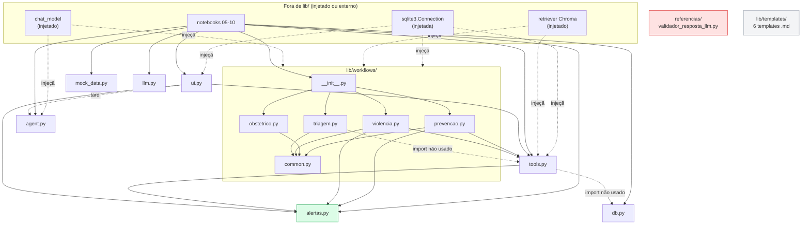

# 02 — Mapa de Componentes

**Agente responsável:** `ProjectDiscoveryAgent`
**Ciclo:** 1 — Descoberta e diagnóstico
**Commit base:** `a8b26cd`
**Método:** leitura direta de `lib/*.py`, `lib/workflows/*.py`, `referencias/*.py` e busca de
importadores por varredura de `*.py` e `*.ipynb`. Marcadores de origem conforme
`docs/01_ESTADO_ATUAL.md`.

> **Escopo:** este documento mapeia **o que existe**. O catálogo do que será criado está em
> `docs/arquitetura/COMPONENTES.md` e `docs/arquitetura/CONTRATOS_DE_COMPONENTES.md`.

---

## 1. Inventário de módulos

`[COD]` 14 módulos Python versionados em `lib/`, mais 1 em `referencias/`.

### 1.1 `lib/__init__.py`

| Campo | Conteúdo |
|---|---|
| Responsabilidade | Marcar `lib` como pacote. Apenas docstring. |
| Funções públicas | — |
| Importa | — |
| Importado por | implicitamente por todo `from lib import ...` |
| Acoplamento | nulo |

`[COD]` Não reexporta nada. Cada consumidor importa o submódulo explicitamente.

### 1.2 `lib/db.py`

| Campo | Conteúdo |
|---|---|
| Responsabilidade | Conexão SQLite e bootstrap do schema de 7 tabelas |
| Funções públicas | `get_db_path()`, `connect(path=None)`, `init_schema(conn)`, `reset_database(conn)` |
| Constantes | `DEFAULT_DB_PATH` (`db.py:12`), `SCHEMA_SQL` (`db.py:30-103`) |
| Importa | `os`, `sqlite3`, `pathlib` — **nenhum módulo interno** |
| Importado por | `lib/tools.py:16` (**import não utilizado**, ver §3.6), notebooks 05, 07, 08, 09 |
| Acoplamento | Folha da árvore de dependências internas. Único acoplamento externo é o caminho Colab |

`[COD]` Tabelas criadas: `pacientes`, `prontuario_gineco`, `exames`, `registros_violencia`,
`log_acesso`, `medicamentos`, `ciclos_menstruais`. `connect()` abre com
`check_same_thread=False` (necessário porque o Gradio cria thread por requisição, `db.py:22-24`) e
liga `PRAGMA foreign_keys = ON`.

### 1.3 `lib/mock_data.py`

| Campo | Conteúdo |
|---|---|
| Responsabilidade | Gerar as 50 pacientes sintéticas e popular todas as tabelas |
| Funções públicas | `hash_cpf`, `gerar_pacientes`, `gerar_prontuario`, `gerar_exames`, `gerar_ciclos`, `gerar_registros_violencia`, `populate(conn, n_pacientes=50, seed=42, ...)` |
| Constantes | `TODAY` (`mock_data.py:20`), `TIPOS_VIOLENCIA`, `METODOS_CONTRACEPTIVOS`, `MEDICAMENTOS_BASE` (20 fármacos) |
| Importa | `hashlib`, `random`, `datetime`, `faker` — **nenhum módulo interno** |
| Importado por | notebook 05 |
| Acoplamento | Acopla-se ao schema de `db.py` por SQL literal (`INSERT INTO ...`), não por import |

`[COD]` Determinístico por `seed=42` (`random.Random(seed)` + `Faker.seed(seed)`). Os cenários
clínicos (`gestante`, `climaterio`, `mamografia_atrasada`, `papanicolau_atrasado`, `contraceptivo`,
`normal`) são atribuídos em `_cenario_paciente` (`mock_data.py:156-169`) e guiam a coerência dos
dados gerados.

### 1.4 `lib/alertas.py`

| Campo | Conteúdo |
|---|---|
| Responsabilidade | **Toda a lógica determinística de alerta do sistema.** Sem LLM |
| Funções públicas | `exames_atrasados(conn, paciente_id)`, `avaliar_padrao_violencia(sinais)`, `proximo_periodo_menstrual(conn, paciente_id)` |
| Tipos públicos | `ExameAtrasado` (dataclass), `AvaliacaoViolencia` (dataclass) |
| Constantes | `TODAY` (`alertas.py:16`), `DIAS_ANO`, `SINAIS_VIOLENCIA` (12 chaves) |
| Importa | `sqlite3`, `dataclasses`, `datetime`, `typing` — **nenhum módulo interno** |
| Importado por | `lib/tools.py:15`, `lib/ui.py:17`, `lib/workflows/violencia.py:33`, `lib/workflows/prevencao.py:31`, notebooks 07, 09 |
| Acoplamento | **Módulo mais importado do pacote.** Acopla-se ao SQLite por query literal; a assinatura recebe `conn`, o que o mantém testável por injeção |

`[COD]` É o módulo com melhor razão valor/risco do projeto: puro, determinístico, sem dependência de
rede ou GPU, e já é a camada 6 (regras de segurança) da arquitetura alvo — ADR-006 determina que
**não será alterado**.

### 1.5 `lib/tools.py`

| Campo | Conteúdo |
|---|---|
| Responsabilidade | Implementações de acesso a dados + adaptadores `StructuredTool` do LangChain |
| Funções públicas | `set_usuario_atual`, `get_usuario_atual`, `consultar_prontuario`, `historico_exames`, `exames_atrasados`, `consultar_medicamento`, `calendario_menstrual`, `registrar_violencia`, `consultar_violencia`, `avaliar_padrao_violencia`, `buscar_protocolo`, `build_langchain_tools(conn, retriever)` |
| Schemas Pydantic | `ConsultarProntuarioInput`, `HistoricoExamesInput`, `ConsultarMedicamentoInput`, `RegistroViolenciaInput`, `ConsultarViolenciaInput`, `AvaliarPadraoViolenciaInput` |
| Estado de módulo | `_USUARIO_ATUAL` (`tools.py:21`) — variável global mutável |
| Importa | `sqlite3`, `datetime`, `pydantic`; internos: `alertas` (usado), `db` (**não usado**); `langchain_core.tools` em import tardio dentro de `build_langchain_tools` |
| Importado por | `lib/ui.py:18`, `lib/workflows/violencia.py:34`, `lib/workflows/prevencao.py:30`, `lib/workflows/triagem.py:35` (**não usado**), notebooks 07, 08 |
| Acoplamento | Alto por natureza — é a fronteira entre dados, regras e LangChain. O import tardio do LangChain permite usar as funções puras sem o framework instalado |

`[COD]` `_USUARIO_ATUAL` é **estado global de módulo**: `set_usuario_atual` é chamado pela UI
(`ui.py:318`) e pelo nó `documentar_seguro` do workflow de violência (`violencia.py:157`). Em
execução concorrente (o Gradio cria uma thread por requisição), duas sessões simultâneas
compartilham o mesmo identificador de profissional — a atribuição de responsabilidade no
`log_acesso` pode ficar incorreta. `[INF]`

### 1.6 `lib/llm.py`

| Campo | Conteúdo |
|---|---|
| Responsabilidade | Carregar Llama 3.2 3B + adapter LoRA e expor como `ChatModel` do LangChain |
| Funções públicas | `load_finetuned(adapter_dir=None, base_model_id=..., use_4bit=True)`, `generate(model, tokenizer, messages, ...)`, `build_chat_model(model, tokenizer, ...)` |
| Função privada | `_latest_adapter_dir` (`llm.py:24-32`) |
| Constantes | `DEFAULT_BASE_MODEL = 'meta-llama/Llama-3.2-3B-Instruct'` |
| Importa | `os`, `pathlib`; tardios: `torch`, `transformers`, `peft`, `langchain_huggingface` — **nenhum módulo interno** |
| Importado por | notebooks 08, 09 |
| Acoplamento | Único módulo que exige GPU. Não é importado por nenhum outro módulo de `lib/` — o LLM sempre chega aos workflows por **injeção** (`chat_model`) |

`[COD]` O desacoplamento por injeção é a propriedade mais importante deste módulo para a nova fase:
é o que torna possível o perfil `demo-cpu` com `FakeChatModel` (ADR-005) sem tocar em `llm.py`.

### 1.7 `lib/agent.py`

| Campo | Conteúdo |
|---|---|
| Responsabilidade | Agente ReAct (LangGraph `create_react_agent`) + prompt de sistema |
| Funções públicas | `build_agent(chat_model, tools_list, system_prompt=SYSTEM_PROMPT, max_iterations=6)`, `run_consulta(agent, pergunta, paciente_id=None, historico=None, recursion_limit=12)` |
| Constantes | `SYSTEM_PROMPT` (`agent.py:25-51`) |
| Importa | `typing`; tardios: `langgraph.prebuilt`, `langchain_core.messages` — **nenhum módulo interno** |
| Importado por | `lib/ui.py:304` (import tardio de `run_consulta`), notebook 08 |
| Acoplamento | Baixo. Recebe modelo e tools por parâmetro |

### 1.8 `lib/ui.py`

| Campo | Conteúdo |
|---|---|
| Responsabilidade | Camada de apresentação Gradio: sidebar, 5 abas, renderizadores de estado → Markdown |
| Funções públicas | `build_ui(agent, conn, default_usuario='sessao_demo', workflows=None)` |
| Funções privadas | `_lista_pacientes`, `_alertas_paciente`, `_render_trace_e_fontes`, `_render_triagem`, `_render_violencia_wf`, `_render_obstetrico`, `_render_prevencao` |
| Constantes | `SINAIS_VIOLENCIA` (derivada de `alertas`), `URGENCIA_ICON`, `RISCO_ICON`, `PRIORIDADE_ICON` |
| Importa | `typing`; internos: `alertas`, `tools`, e `agent.run_consulta` (tardio); `gradio` (tardio, com mensagem de erro dedicada) |
| Importado por | notebook 08 |
| Acoplamento | **Maior fan-in de dependências internas do pacote.** Consome `conn`, `agent` e `workflows` por injeção, o que evita acoplamento de construção |

`[COD]` Os renderizadores leem sempre `state['resposta_estruturada']` — ou seja, o contrato entre
workflow e UI é **um único dicionário**, produzido pelo nó `compilar_resposta` de cada fluxo. É o
ponto de extensão natural para a nova aba de ML.

### 1.9 `lib/workflows/__init__.py`

| Campo | Conteúdo |
|---|---|
| Responsabilidade | Reexportar os 4 builders e os 4 tipos de estado |
| Exporta | `build_triagem_workflow`/`TriagemState`, `build_violencia_workflow`/`ViolenciaState`, `build_obstetrico_workflow`/`ObstetricoState`, `build_prevencao_workflow`/`PrevencaoState` |
| Importa | os 4 módulos de workflow |
| Importado por | notebooks 08, 09 |
| Acoplamento | `import lib.workflows` carrega **os quatro** workflows. Um erro de sintaxe em qualquer um derruba os demais |

### 1.10 `lib/workflows/common.py`

| Campo | Conteúdo |
|---|---|
| Responsabilidade | Utilidades compartilhadas pelos 4 fluxos |
| Funções públicas | `llm_json(chat_model, user_prompt, system_prompt=None, default=None)`, `llm_text(...)`, `rag_search(retriever, query, categoria=None, k=4)`, `citar_fontes(fontes)`, `estimar_confianca(n_fontes, n_decisoes_llm, dados_paciente_disponiveis)` |
| Função privada | `_strip_fences` |
| Importa | `json`, `re`; tardio: `langchain_core.messages` — **nenhum módulo interno** |
| Importado por | os 4 workflows |
| Acoplamento | Folha. É o único ponto onde o parsing de JSON do LLM acontece |

`[COD]` `llm_json` tem três níveis de fallback: parse direto, extração do primeiro `{...}` ou
`[...]` por regex, e por fim o `default` do chamador. **O terceiro nível é silencioso** — nenhum
chamador distingue "o LLM respondeu isso" de "o parse falhou e isto é o default". No nó obstétrico
de risco, esse default é `'habitual'` (`obstetrico.py:136`), ou seja, falso negativo silencioso.

### 1.11 `lib/workflows/triagem.py`

| Campo | Conteúdo |
|---|---|
| Responsabilidade | Fluxo de triagem ginecológica (7 nós, 1 aresta condicional) |
| Público | `build_triagem_workflow(chat_model, conn, retriever)`, `TriagemState`, `SINAIS_EMERGENCIA` |
| Importa | `common` (usado); `tools` (**não usado**, `triagem.py:35`); `langgraph.graph` tardio |
| Importado por | `workflows/__init__.py`, notebooks 08, 09 |
| Acoplamento | `conn` é aceito na assinatura **apenas por consistência** — o fluxo não consulta o banco (`triagem.py:249-253`) |

### 1.12 `lib/workflows/violencia.py`

| Campo | Conteúdo |
|---|---|
| Responsabilidade | Fluxo de detecção de violência (7 nós, 1 aresta condicional) |
| Público | `build_violencia_workflow(chat_model, conn, retriever)`, `ViolenciaState`, `SINAIS_KEYS` |
| Importa | `common`, `alertas`, `tools` — todos usados |
| Importado por | `workflows/__init__.py`, notebooks 08, 09 |
| Acoplamento | **Único workflow que escreve no banco** (via `tools.registrar_violencia`). `retriever` é aceito e ignorado (`violencia.py:265-270`) |

### 1.13 `lib/workflows/obstetrico.py`

| Campo | Conteúdo |
|---|---|
| Responsabilidade | Fluxo obstétrico (7 nós, **grafo linear**) |
| Público | `build_obstetrico_workflow(chat_model, conn, retriever)`, `ObstetricoState`, `SINAIS_ALARME_OBST`, `CRITERIOS_ALTO_RISCO` |
| Importa | apenas `common` |
| Importado por | `workflows/__init__.py`, notebooks 08, 09 |
| Acoplamento | Mais baixo dos quatro. `conn` é aceito e não usado |

`[COD]` `CRITERIOS_ALTO_RISCO` (`obstetrico.py:50-66`, 15 itens) será reaproveitado como **baseline
determinístico** do ML — ver `docs/ml/MODELOS_AVALIADOS.md`.

### 1.14 `lib/workflows/prevencao.py`

| Campo | Conteúdo |
|---|---|
| Responsabilidade | Fluxo de prevenção e rastreamento (6 nós, **grafo linear**) |
| Público | `build_prevencao_workflow(chat_model, conn, retriever)`, `PrevencaoState` |
| Constantes | `TODAY` (`prevencao.py:34`) — **divergente**, ver §3.1 |
| Importa | `common`, `tools`, `alertas` — todos usados |
| Importado por | `workflows/__init__.py`, notebooks 08, 09 |
| Acoplamento | Consulta o banco por SQL literal dentro do nó (`prevencao.py:100-104, 118-122`), em vez de passar por `tools`/`alertas` — pequena quebra da estratificação |

### 1.15 `lib/templates/` (7 arquivos Markdown)

`[COD]` 6 templates clínicos (`acompanhamento_prenatal_puerperio`, `ficha_notificacao_sinan_violencia`,
`laudo_colposcopia_biopsia`, `laudo_mamografia_birads`, `receita_terapia_hormonal`,
`relatorio_atendimento_violencia`) + `README.md`.

**`[COD]` Nenhum módulo Python os referencia.** Busca por `templates` em `lib/*.py` e
`lib/workflows/*.py` retorna zero ocorrências fora do próprio diretório. São material documental,
não componentes executáveis.

### 1.16 `referencias/validador_resposta_llm.py`

| Campo | Conteúdo |
|---|---|
| Responsabilidade | Validador de resposta do LLM: determinístico (regex) + baseado em LLM |
| Estado | **Deliberadamente fora do pacote.** `_esboco_integracao_NAO_USE` (linhas 217-242) termina em `raise NotImplementedError('Esboço apenas — não integrar antes da entrega')` (linha 242) |
| Importa | stdlib apenas |
| Importado por | **ninguém** |
| Acoplamento | Zero — código isolado, com `__main__` de autoteste |

`[COD]` ADR-010 decide promovê-lo a `lib/validacao.py`, separando o validador determinístico (regex,
custo de microssegundos) do validador por LLM (segunda chamada ao modelo, motivo original da não
integração).

---

## 2. Grafo de dependências de `lib/`

`[COD]` Arestas confirmadas por leitura dos `import`. Linhas tracejadas são imports declarados e
**não utilizados**; linhas pontilhadas são dependências injetadas em tempo de execução (não são
`import`).

### 2.1 Leitura do grafo

`[COD]`

| Observação | Consequência |
|---|---|
| **Não há ciclo de importação.** A ordem topológica é `db`/`alertas`/`common`/`llm` → `tools` → workflows → `ui` | A inserção de `lib/ml/` como novo nível entre `alertas` e os workflows não cria ciclo |
| `alertas.py` tem fan-in 4 e fan-out 0 | É a base determinística; alterá-lo afetaria tudo, e por isso ADR-001 o declara intocável |
| `llm.py` tem fan-in 0 dentro de `lib/` | Todo LLM chega por injeção — a substituição por dublê no perfil `demo-cpu` não exige mudança de código |
| `ui.py` tem fan-out 3 e fan-in 0 | É folha de saída; acrescentar uma aba é aditivo por construção |
| `referencias/` é um componente órfão | Código testado sem consumidor (ADR-010 o promove) |
| `lib/templates/` é órfão | Material documental, não executável |

---

## 3. Achados de acoplamento e defeitos

`[COD]` Todos verificados no commit `a8b26cd`. Cada achado alimenta uma lacuna em
`docs/03_LACUNAS_E_RISCOS.md`.

### 3.1 `TODAY` duplicado em quatro pontos, com um valor divergente

| Local | Valor | Como é usado |
|---|---|---|
| `lib/alertas.py:16` | `date(2026, 5, 22)` | Cálculo de idade e de atraso de exames |
| `lib/mock_data.py:20` | `date(2026, 5, 22)` | Geração de todas as datas sintéticas |
| `lib/tools.py:100` | `date(2026, 5, 22)` | Literal inline dentro de `consultar_prontuario`, sem constante nomeada |
| `lib/workflows/prevencao.py:34` | **`date(2026, 5, 23)`** | Vencimento em ≤ 90 dias (`prevencao.py:107, 125`) e datas propostas de agendamento (`prevencao.py:185-191`) |

O congelamento da data é uma decisão defensável — torna o comportamento determinístico. O problema
é a **replicação com divergência de um dia**: `prevencao.py` decide o que está a vencer contra uma
data diferente da usada por `alertas.exames_atrasados`, que é a função da qual ele consome os
atrasos. Em fronteiras exatas (exame vencendo em 90 ou 91 dias), os dois módulos discordam.
→ `LAC-04`.

### 3.2 `buscar_protocolo` é a única tool sem `args_schema`

`[COD]` `lib/tools.py:301-306`. As outras 8 declaram um modelo Pydantic; esta é registrada com um
`lambda query, categoria=None: ...` e **sem** `args_schema`, delegando ao LangChain a inferência da
assinatura. Como é justamente a tool de RAG — a mais usada segundo o `SYSTEM_PROMPT`
(`agent.py:34`) — e o modelo é de 3B, é o ponto mais provável de falha de tool calling.
→ `LAC-05`.

### 3.3 Docstring do obstétrico desenha um ramo que o código não constrói

`[COD]` `obstetrico.py:1-27` desenha `emergência? → alerta_emerg`;
`build_obstetrico_workflow` (`obstetrico.py:344-366`) usa **somente** `add_edge`. Não existe nó
`alerta_emerg` nem `add_conditional_edges` no arquivo. A emergência vira apenas um booleano lido
pelos nós posteriores — o caminho de execução é idêntico para gestante em eclâmpsia iminente e para
gestante de risco habitual. → `LAC-06`.

### 3.4 `violencia.py` monta a lista `medidas` e nunca a devolve

`[COD]` `_protocolo_seguranca` (`violencia.py:105-119`) constrói `medidas` com 6 condutas
(`violencia.py:107-113`) e o `return` (`violencia.py:115-119`) devolve apenas
`protocolo_seguranca_ativado` e `raciocinio`. As seis medidas — ambiente reservado, profissional do
mesmo gênero, perguntas-chave da Norma Técnica, documentação objetiva, avaliação de segurança
imediata e avaliação de risco para dependentes — **nunca chegam ao estado nem à interface**.
É perda silenciosa de conteúdo clínico no fluxo mais sensível do sistema. → `LAC-07`.

### 3.5 `lib/agent.py:54-55` declara `max_iterations` e nunca o usa

`[COD]` A assinatura é `build_agent(chat_model, tools_list, system_prompt=SYSTEM_PROMPT,
max_iterations: int = 6)`, mas o corpo (`agent.py:65-69`) chama `create_react_agent(model, tools,
prompt)` **sem** repassar o parâmetro. O limite efetivo é `recursion_limit=12`, aplicado em
`run_consulta` (`agent.py:74, 94`). Parâmetro morto que sugere um controle que não existe — quem ler
a assinatura concluirá que o agente para em 6 iterações. → `LAC-08`.

### 3.6 Imports declarados e não utilizados

`[COD]`

| Import | Local | Situação |
|---|---|---|
| `from . import db as db_mod` | `lib/tools.py:16` | `db_mod` não aparece em nenhum outro ponto do arquivo |
| `from .. import tools as tools_mod` | `lib/workflows/triagem.py:35` | `tools_mod` não aparece em nenhum outro ponto do arquivo |

Sem efeito funcional, mas criam arestas falsas no grafo de dependências e sugerem acoplamento que
não existe. → `LAC-09`.

### 3.7 Parâmetros aceitos e ignorados nas assinaturas de workflow

`[COD]` Os quatro builders têm a mesma assinatura `(chat_model, conn, retriever)`, por consistência
declarada em docstring:

| Workflow | Ignora | Documentado no código? |
|---|---|---|
| `triagem` | `conn` | sim (`triagem.py:249-253`) |
| `violencia` | `retriever` | sim (`violencia.py:265-270`) |
| `obstetrico` | `conn` | não |
| `prevencao` | — (usa os três) | — |

A uniformidade da assinatura é uma escolha razoável e facilita o registro dos workflows num
dicionário em `build_ui`. Registrado como observação, não como defeito.

### 3.8 Estado global mutável em `tools.py`

`[COD]` `_USUARIO_ATUAL` (`tools.py:21`) é variável de módulo escrita por `set_usuario_atual`
(`ui.py:318`, `violencia.py:157`) e lida em toda inserção de `log_acesso` (`tools.py:33-39`). Com o
Gradio criando uma thread por requisição, duas sessões simultâneas compartilham o mesmo valor.
Para a demonstração de um usuário, é inócuo; para a afirmação "a auditoria identifica o
profissional", é uma fragilidade que precisa ser declarada. `[INF]` → `LAC-10`.

### 3.9 Contagem de registros de violência fora do caminho auditado

`[COD]` `ui.py:63-66` executa `SELECT COUNT(*) FROM registros_violencia WHERE paciente_id = ?`
diretamente, sem passar por `tools.consultar_violencia` — que é a função que exige motivo e grava em
`log_acesso`. A contagem não expõe conteúdo, mas expõe **existência** de registro de violência sem
deixar rastro de quem consultou. → `LAC-11`.

### 3.10 Duplicação do wrapper de RAG

`[COD]` `common.rag_search` (`common.py:63-80`) e `tools.buscar_protocolo` (`tools.py:215-237`)
implementam o mesmo algoritmo — `invoke`, fatia `k*2`, filtro de categoria em pós-processamento,
corte em `k` — com diferença apenas nos defaults de chaves ausentes (`None` vs `'?'`). Duas
implementações do mesmo contrato significam dois lugares para corrigir qualquer mudança de
metadados do índice. → `LAC-12`.

---

## 4. Nota de precisão sobre referências de linha

`[COD]` As referências deste documento foram reconferidas linha a linha no commit `a8b26cd`. Duas
delas divergem, por deslocamento de uma a cinco linhas, de citações feitas em documentos anteriores:

| Item | Referência verificada | Aparece em outro documento como |
|---|---|---|
| `DEFAULT_DB_PATH` (caminho Colab do banco) | `lib/db.py:12` | `lib/db.py:13` |
| Default de `DRIVE_BASE` (caminho Colab do adapter) | `lib/llm.py:51` | `lib/llm.py:56` |

O conteúdo das afirmações é idêntico; apenas o número da linha foi ajustado. Documentos futuros
devem usar as referências desta tabela.

---

## 5. Próximo documento

`docs/03_LACUNAS_E_RISCOS.md` — lacunas do presente (com severidade e requisito bloqueado) e riscos
do futuro (com probabilidade, impacto e mitigação).
