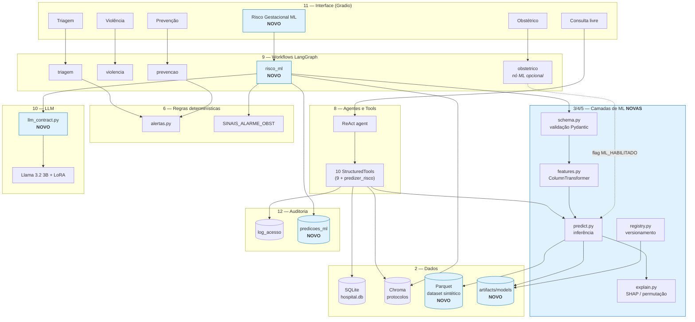
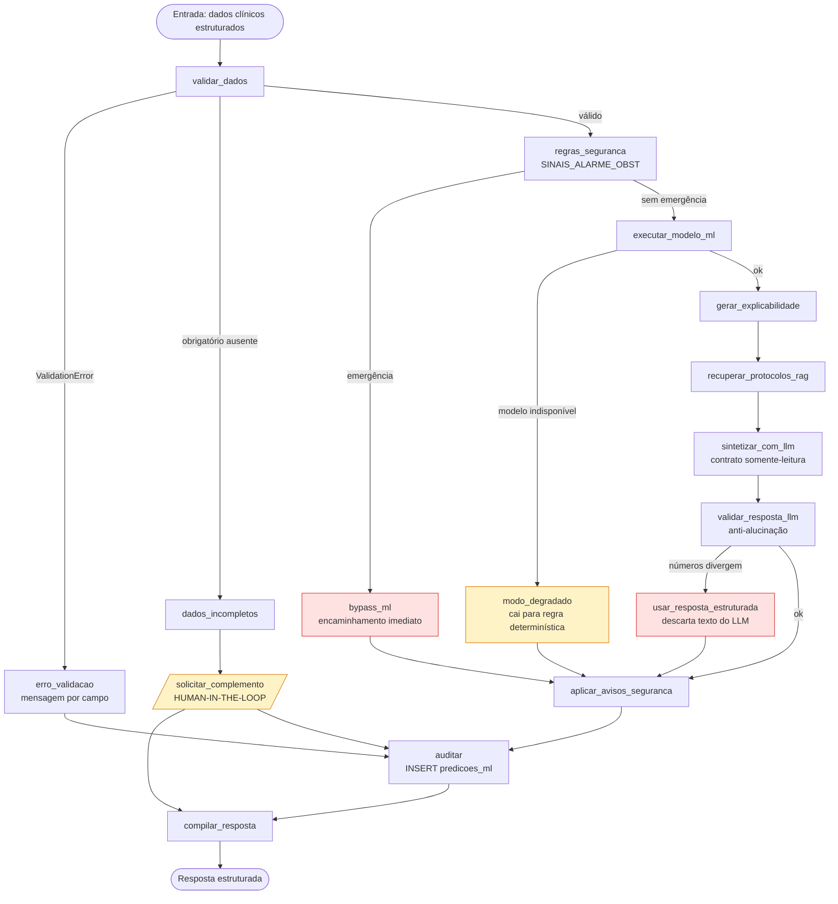

# Arquitetura Alvo

**Agente responsável:** `ArchitectureAgent`
**Status:** Proposta — nenhuma linha de código de produção alterada ainda
**Princípio norteador:** evolução aditiva. Nada do que funciona hoje é removido.

---

## 1. Postura da evolução

A arquitetura atual (ver `ARQUITETURA_ATUAL.md`) é sólida no que se propôs a fazer: LLM
fine-tuned + RAG + tools + 4 workflows LangGraph + UI. O problema não é qualidade — é **cobertura**:
falta a camada de ML supervisionado, e faltam as camadas de infraestrutura que permitiriam rodar o
sistema fora do Colab.

Por isso a evolução é **aditiva e por camada**, não uma reescrita:

| Ação | Aplicação |
|---|---|
| **Criar** | `lib/ml/`, `lib/config.py`, `lib/validacao.py`, `lib/workflows/risco_ml.py`, `tests/`, `scripts/`, `Dockerfile` |
| **Estender (aditivo, retrocompatível)** | `lib/tools.py` (+1 tool), `lib/db.py` (+1 tabela), `lib/ui.py` (+1 aba), `lib/workflows/obstetrico.py` (nó de ML opcional, sob flag) |
| **Não tocar** | `lib/alertas.py`, `lib/mock_data.py`, `lib/llm.py`, `lib/agent.py`, `lib/workflows/{triagem,violencia,prevencao}.py`, `lib/templates/`, os 10 notebooks |

O compromisso concreto: **após a evolução, os notebooks 05 a 10 devem continuar executando sem
alteração.** Isso é verificado por um teste de regressão, não por inspeção visual.

---

## 2. Camadas

A arquitetura alvo separa doze camadas com responsabilidade única.

| # | Camada | Módulos | Responsabilidade |
|---|---|---|---|
| 1 | **Configuração** | `lib/config.py` *(novo)* | Resolve caminhos e credenciais por variável de ambiente. Elimina os defaults Colab espalhados. |
| 2 | **Dados** | `lib/db.py`, `lib/mock_data.py`, `lib/ml/dataset.py` *(novo)* | Persistência SQLite + geração do dataset sintético |
| 3 | **Pré-processamento** | `lib/ml/schema.py`, `lib/ml/features.py` *(novos)* | Validação Pydantic + `ColumnTransformer` sklearn |
| 4 | **Machine Learning** | `lib/ml/train.py`, `evaluate.py`, `predict.py`, `registry.py` *(novos)* | Treino, avaliação, inferência, versionamento |
| 5 | **Explicabilidade** | `lib/ml/explain.py` *(novo)* | SHAP com fallback para importância por permutação |
| 6 | **Regras de segurança** | `lib/alertas.py`, `SINAIS_ALARME_OBST` | Determinístico. **Precede e pode anular o ML.** |
| 7 | **RAG** | `lib/workflows/common.py::rag_search`, `tools.buscar_protocolo` | Recuperação de protocolos com metadados de fonte |
| 8 | **Agentes e tools** | `lib/agent.py`, `lib/tools.py` | ReAct + 10 StructuredTools (9 atuais + `predizer_risco_gestacional`) |
| 9 | **Workflows** | `lib/workflows/*` + `risco_ml.py` *(novo)* | Orquestração LangGraph com estado tipado |
| 10 | **LLM** | `lib/llm.py`, `lib/ml/llm_contract.py` *(novo)* | Síntese, sob contrato somente-leitura dos números |
| 11 | **Interface** | `lib/ui.py` | Gradio, +1 aba "Risco Gestacional (ML)" |
| 12 | **Auditoria e observabilidade** | `lib/db.py::predicoes_ml`, `lib/observabilidade.py` *(novo)* | Rastro de predições + logging estruturado |

---

## 3. Diagrama de componentes



Em azul, tudo que é novo. Nada em preto é removido.

---

## 4. Fluxo de execução do workflow de ML



Quatro caminhos de exceção estão desenhados desde o início, porque nenhum dos workflows atuais tem
tratamento de erro (achado registrado em `docs/03_LACUNAS_E_RISCOS.md`):

| Caminho | Gatilho | Comportamento |
|---|---|---|
| `dados_incompletos` → HIL | Campo obrigatório faltando | Não prediz. Devolve a lista de campos e pede complemento humano. |
| `bypass_ml` | Sinal de alarme obstétrico | Encaminhamento imediato. Probabilidade do modelo é irrelevante. |
| `modo_degradado` | Modelo não carrega / erro de inferência | Cai para a regra determinística e **declara** que está degradado |
| `usar_resposta_estruturada` | LLM contradisse os números | Descarta o texto gerado e devolve a saída estruturada |

**Invariante de auditoria:** *toda* invocação do workflow grava exatamente uma linha em
`predicoes_ml`, inclusive quando não houve inferência. Os caminhos de erro de validação e de dados
incompletos passam pelo nó `auditar` com `modo='incompleto'` e `probabilidade = NULL`. Uma
invocação que não deixa rastro é indistinguível de uma que nunca aconteceu, o que quebraria a
rastreabilidade exigida.

---

## 5. Contratos entre camadas

O acoplamento entre camadas é por **estrutura de dados**, não por chamada direta. Detalhamento em
`CONTRATOS_DE_COMPONENTES.md`.

### 5.1 Pré-processamento → ML

```python
GestanteFeatures (Pydantic, validado)  →  pd.DataFrame de 1 linha  →  Pipeline sklearn
```

### 5.2 ML → Explicabilidade → LLM

O objeto que atravessa a fronteira, e que o LLM recebe:

```json
{
  "model_name": "RandomForestClassifier",
  "model_version": "1.0.0",
  "dataset_version": "v1.0.0",
  "prediction": "alto_risco",
  "threshold": 0.31,
  "probabilities": { "habitual": 0.25, "alto_risco": 0.75 },
  "explanation_method": "shap_tree_explainer",
  "explanation_scope": "local",
  "top_features": [
    { "feature": "has_cronica", "value": true, "contribution": 0.31, "direction": "aumenta" }
  ],
  "dados_imputados": ["hemoglobina_g_dl"],
  "retrieved_sources": [{ "doc_id": "...", "category": "...", "trecho": "..." }],
  "regras_disparadas": [],
  "safety_notice": "Resultado de apoio à decisão. Não substitui avaliação profissional.",
  "aviso_dados_sinteticos": "Modelo treinado em dados sintéticos. Sem validação clínica."
}
```

**Invariante central:** `prediction`, `probabilities`, `threshold` e `contribution` são gerados
**exclusivamente** pela camada 4/5. O LLM os consome como texto e não pode alterá-los. A verificação
é feita depois da geração, comparando os números presentes no texto com os do payload — ver
`docs/llm/POLITICA_ANTI_ALUCINACAO.md`.

### 5.3 Workflow → Auditoria

```sql
CREATE TABLE IF NOT EXISTS predicoes_ml (
    id                INTEGER PRIMARY KEY,
    timestamp         DATETIME NOT NULL DEFAULT CURRENT_TIMESTAMP,
    usuario           TEXT NOT NULL,
    paciente_id       INTEGER,
    modelo_nome       TEXT NOT NULL,
    modelo_versao     TEXT NOT NULL,
    dataset_versao    TEXT NOT NULL,
    features_hash     TEXT NOT NULL,   -- SHA-256 das features; NÃO os valores
    predicao          TEXT NOT NULL,
    probabilidade     REAL,            -- NULL quando não houve inferência (ver nota)
    threshold         REAL,            -- NULL nos mesmos casos
    explicacao_metodo TEXT,            -- 'shap_tree_explainer'|'coef_linear'|'permutacao'|NULL
    top_features      TEXT,            -- JSON: apenas feature/contribution/direction, SEM value
    regras_disparadas TEXT,            -- JSON
    modo              TEXT NOT NULL,   -- 'normal'|'degradado'|'bypass_regra'|'incompleto'
    FOREIGN KEY (paciente_id) REFERENCES pacientes(paciente_id)
);
```

Três decisões nesse DDL merecem justificativa explícita:

**`features_hash` em vez dos valores brutos.** Permite provar que duas predições partiram das
mesmas entradas — reprodutibilidade e rastreabilidade — sem duplicar dados clínicos sensíveis numa
segunda tabela. Ver `docs/seguranca/LGPD_E_PRIVACIDADE.md`.

**`probabilidade` e `threshold` são anuláveis.** Em três dos quatro modos não existe probabilidade
de modelo: `bypass_regra` (a regra decidiu, o ML não rodou), `degradado` (o modelo não carregou) e
`incompleto` (a validação barrou antes da inferência). Declarar `NOT NULL` obrigaria a gravar um
valor sentinela — e um `0.0` gravado como se fosse probabilidade é exatamente o tipo de número
falso que este sistema existe para evitar. `NULL` significa "não houve inferência", que é a verdade.

**`top_features` persiste sem o campo `value`.** O payload enviado ao LLM e exibido na interface
inclui o valor da variável (`"value": true`), porque a explicação precisa dele para fazer sentido.
A auditoria persiste apenas `feature`, `contribution` e `direction`. Gravar os valores clínicos em
claro na tabela de auditoria anularia parcialmente a proteção obtida com `features_hash`.

---

## 6. Perfis de execução

O maior obstáculo prático hoje é que **o sistema inteiro depende de GPU + Colab + Drive**. Isso
torna impossível testar Docker de verdade, que é requisito explícito.

Solução: três perfis, selecionados por variável de ambiente `PERFIL_EXECUCAO`.

| Perfil | LLM | RAG | ML | Roda em Docker CPU? | Uso |
|---|---|---|---|---|---|
| `ml-only` | desabilitado | desabilitado | **sim** | **Sim** | Treino, avaliação, testes, CI |
| `demo-cpu` | `FakeChatModel` determinístico | Chroma local reindexado | **sim** | **Sim** | Demonstração ponta a ponta, testes e2e, **build Docker validado** |
| `full-gpu` | Llama 3.2 3B + LoRA | Chroma completo | **sim** | Não (precisa GPU) | Colab, demonstração com LLM real |

`FakeChatModel` é um `BaseChatModel` que devolve respostas fixas por padrão de prompt. Ele não
substitui o LLM na demonstração final — serve para que o pipeline seja testável e o Docker seja
verificável sem 6 GB de pesos e uma GPU. Sem isso, "Dockerfile funcional" seria uma afirmação
impossível de comprovar nesta máquina.

---

## 7. Estrutura de diretórios alvo

```
TechChallenger4/
├── lib/
│   ├── config.py                    NOVO  — configuração por ambiente
│   ├── observabilidade.py           NOVO  — logging estruturado
│   ├── validacao.py                 NOVO  — promove referencias/validador_resposta_llm.py
│   ├── db.py                        ESTENDIDO — +tabela predicoes_ml
│   ├── tools.py                     ESTENDIDO — +predizer_risco_gestacional
│   ├── ui.py                        ESTENDIDO — +aba Risco Gestacional
│   ├── alertas.py  llm.py  agent.py  mock_data.py       INALTERADOS
│   ├── ml/                          NOVO
│   │   ├── __init__.py
│   │   ├── schema.py                contratos Pydantic
│   │   ├── dataset.py               gerador sintético
│   │   ├── features.py              ColumnTransformer
│   │   ├── train.py                 treino + seleção
│   │   ├── evaluate.py              métricas + comparação
│   │   ├── predict.py               inferência
│   │   ├── explain.py               SHAP / permutação
│   │   ├── registry.py              versionamento
│   │   └── llm_contract.py          payload + prompt + verificação
│   ├── workflows/
│   │   ├── risco_ml.py              NOVO
│   │   ├── obstetrico.py            ESTENDIDO — nó ML sob flag
│   │   └── triagem.py  violencia.py  prevencao.py  common.py   INALTERADOS
│   └── templates/                   INALTERADO
├── scripts/                         NOVO — train, evaluate, predict, run_demo
├── tests/                           NOVO — unit, integration, e2e, regression
├── artifacts/                       NOVO — models, metrics, explainability, data
├── docs/                            NOVO — esta documentação
├── Dockerfile  .dockerignore  docker-compose.yml        NOVOS
├── requirements.txt  requirements-ml.txt  requirements-llm.txt   NOVOS
├── .env.example  pyproject.toml     NOVOS
└── *.ipynb  *.md                    INALTERADOS
```

Três arquivos de requisitos, não um: `requirements.txt` (base), `requirements-ml.txt`
(scikit-learn, pandas, shap) e `requirements-llm.txt` (torch, transformers, peft, bitsandbytes).
A imagem `demo-cpu` instala os dois primeiros e fica em torno de algumas centenas de MB, em vez de
vários GB — o que é a diferença entre um build que pode ser validado e um que não pode.

---

## 8. Princípios que a arquitetura precisa preservar

| Princípio | Como é garantido |
|---|---|
| Regra determinística > inferência probabilística | Nó de regras precede o nó de ML; `bypass_ml` documentado e testado |
| LLM não inventa números | Contrato somente-leitura + verificação pós-geração + descarte do texto em divergência |
| Toda predição é auditável | `predicoes_ml` com modelo, versão, limiar, hash das features e modo |
| Nada sem suporte documental | Fontes RAG anexadas ao payload; resposta cita `doc_id` |
| Incerteza é exibida | Probabilidade, limiar e campos imputados aparecem na UI |
| Falha é explícita | Modo degradado é declarado ao usuário, nunca silencioso |
| Dados sintéticos são declarados | `aviso_dados_sinteticos` é campo obrigatório do payload |
