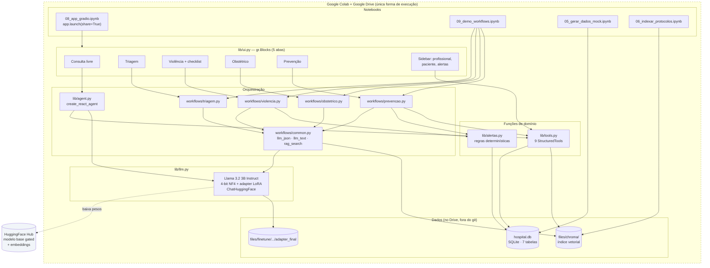
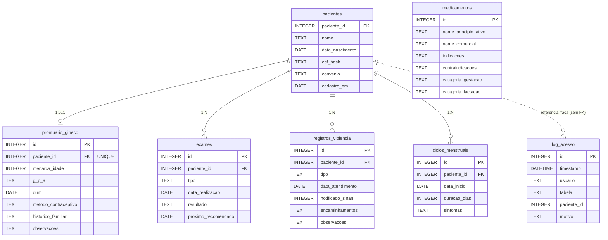

# Arquitetura Atual (as-is)

**Agente responsável:** `ArchitectureAgent`
**Base de evidência:** leitura direta de `lib/*.py`, `lib/workflows/*.py` e dos notebooks. Cada
afirmação deste documento é verificável no código.
**Escopo:** descreve **o que existe hoje**. Nada aqui é plano. O que é plano está em
`ARQUITETURA_ALVO.md`.

---

## 1. Resumo em uma frase

O sistema atual é uma **aplicação de notebook** que carrega um Llama 3.2 3B fine-tunado por QLoRA,
o expõe como `ChatModel` do LangChain, e o usa de duas formas: (a) como agente ReAct com 9 tools
sobre um SQLite de 50 pacientes sintéticos e um índice Chroma de protocolos clínicos, e (b) como
motor de decisão dentro de 4 workflows LangGraph de estado tipado — tudo renderizado numa UI
Gradio de 5 abas.

Não há camada de configuração, não há tratamento de erro, não há testes, não há ML supervisionado
e não há ponto de entrada executável fora do Google Colab.

---

## 2. Camadas reais

O código não declara camadas, mas elas são discerníveis por módulo e por dependência. Esta é a
estratificação efetiva:

| # | Camada de fato | Módulos | Observação |
|---|---|---|---|
| 1 | Persistência | `lib/db.py` | SQLite, 7 tabelas, bootstrap idempotente |
| 2 | Geração de dados | `lib/mock_data.py` | Faker `pt_BR`, semente 42, 50 pacientes |
| 3 | Regras determinísticas | `lib/alertas.py` | Rastreamento e matriz de violência; sem LLM |
| 4 | Ferramentas | `lib/tools.py` | 9 `StructuredTool` + schemas Pydantic de entrada |
| 5 | LLM | `lib/llm.py` | Carregamento 4-bit + adapter LoRA + wrapper LangChain |
| 6 | Agente | `lib/agent.py` | `create_react_agent` + `SYSTEM_PROMPT` |
| 7 | Orquestração | `lib/workflows/` | 4 `StateGraph` + `common.py` |
| 8 | Interface | `lib/ui.py` | `gr.Blocks`, 5 abas, sidebar |
| 9 | Auditoria parcial | `log_acesso` + `tools._log_acesso` | Cobre **apenas** `registros_violencia` |

Não existem, hoje: camada de configuração, camada de validação de saída, camada de ML, camada de
explicabilidade, camada de observabilidade.

---

## 3. Diagrama do estado atual



O retângulo tracejado é literal: **tudo** roda dentro de uma sessão Colab com o Drive montado.
Não há artefato que rode fora dele sem edição de código.

---

## 4. Fluxo de dados atual

### 4.1 Preparação (executada uma vez, por notebook)

1. `05_gerar_dados_mock.ipynb` chama `lib.mock_data` com `random.Random(42)` e Faker `pt_BR` e
   popula `hospital.db` via `lib.db.connect()` + `init_schema()`.
2. `01_extrair_protocolos.ipynb` extrai texto de 39 PDFs para `fontes_saude_mulher_v2.json`.
3. `06_indexar_protocolos.ipynb` fragmenta esse JSON e indexa em Chroma com
   `paraphrase-multilingual-MiniLM-L12-v2` (384 dimensões, normalizado), gravando
   `doc_id`, `category` e `chunk_id` nos metadados de cada chunk.

### 4.2 Execução (sessão Gradio)

```
Usuário (profissional) → aba da UI → handler Python em lib/ui.py
        → agente ReAct  ou  workflow.invoke(payload)
        → chat_model.invoke(mensagens)          [LLM]
        → retriever.invoke(query)               [Chroma]
        → conn.execute(SQL parametrizado)       [SQLite]
        → dicionário `resposta_estruturada`
        → _render_*(state) devolve Markdown
        → gr.Markdown na aba
```

Nada é persistido no caminho de volta, exceto dois casos:
- `tools.registrar_violencia` faz `INSERT` em `registros_violencia`;
- `tools._log_acesso` faz `INSERT` em `log_acesso`.

Nenhuma consulta livre, nenhuma triagem, nenhuma avaliação obstétrica e nenhum plano preventivo
deixa rastro persistente. A única memória entre turnos é o dicionário `historico_estado` mantido
numa closure de `build_ui` (`lib/ui.py:313`) — memória de processo, compartilhada por todas as
requisições.

---

## 5. Os 4 workflows, conforme o código compilado

Todos seguem a mesma forma: `build_<nome>_workflow(chat_model, conn, retriever)` devolve um
`StateGraph(...).compile()`. Todos carregam em estado uma lista `raciocinio` que funciona como
trace de execução, e todos terminam num nó `compilar_resposta` que produz
`resposta_estruturada` e `confianca` (via `common.estimar_confianca`).

> **Aviso de leitura:** os *docstrings* no topo de `obstetrico.py` e de `prevencao.py` desenham
> ramificações que **não existem** no grafo compilado. Os grafos abaixo foram derivados das
> funções `build_*`, não dos docstrings.

### 5.1 Triagem Ginecológica — `lib/workflows/triagem.py`

7 nós, **1 aresta condicional**.

| Nó | Tipo de decisão |
|---|---|
| `parse_sintomas` | LLM (`llm_json`) |
| `analisar_risco` | RAG + LLM |
| `classificar_urgencia` | **Regra primeiro** (`SINAIS_EMERGENCIA`), LLM como fallback |
| `sugerir_exames` | RAG + LLM |
| `orientacoes_iniciais` | LLM (`llm_text`) |
| `agendamento` | Determinístico (mapa urgência → especialidade/prazo) |
| `compilar_resposta` | Determinístico |

A função de roteamento é `_rota_urgencia` (`triagem.py:243`): se `urgencia == 'emergencia'`, salta
`sugerir_exames` e `orientacoes_iniciais` e vai direto a `agendamento`.

`classificar_urgencia` é o melhor padrão existente no projeto: faz *substring matching* contra a
lista `SINAIS_EMERGENCIA` (14 termos) e só consulta o LLM se nenhum casar. É exatamente o padrão
"determinístico antes de probabilístico" que a ADR-006 generaliza.

### 5.2 Detecção de Violência — `lib/workflows/violencia.py`

7 nós, **1 aresta condicional**.

| Nó | Tipo de decisão |
|---|---|
| `extrair_sinais` | LLM mapeia texto livre → chaves canônicas de `SINAIS_VIOLENCIA`; a saída é filtrada contra a lista válida |
| `avaliar_risco` | **Determinístico** — `alertas.avaliar_padrao_violencia` |
| `protocolo_seguranca` | Determinístico |
| `acionar_equipe` | Determinístico |
| `documentar_seguro` | Determinístico + escrita no banco |
| `definir_seguimento` | Determinístico |
| `compilar_resposta` | Determinístico |

Roteamento por `_rota_nivel` (`violencia.py:258`): `alta_suspeita` → `protocolo_seguranca`;
qualquer outro nível → `acionar_equipe`. As duas rotas reconvergem em `acionar_equipe`.

O único uso do LLM é a extração de sinais. A pontuação, o nível e a conduta vêm inteiramente da
matriz determinística. `documentar_seguro` só grava quando `nivel == 'alta_suspeita'` **e**
`confirmacao_clinica is True` **e** existe `paciente_id` — é o único gate humano formal do sistema,
e ele é um checkbox na UI.

**Achado de código:** `_protocolo_seguranca` (`violencia.py:105`) monta uma lista local `medidas`
com seis itens e **não a devolve** no dicionário de retorno. As medidas nunca chegam ao estado nem
à UI. É código morto.

### 5.3 Obstétrico — `lib/workflows/obstetrico.py`

7 nós, **nenhuma aresta condicional — o grafo é estritamente linear.**

```
START → coletar_dados_gestante → avaliar_risco_gestacional → detectar_alertas_urgencia
      → orientacoes_especificas → agendar_exames → definir_acompanhamento
      → compilar_resposta → END
```

O docstring do arquivo (`obstetrico.py:3-26`) desenha um losango `emergência?` com um nó
`alerta_emerg`. Nem o losango nem o nó existem: `build_obstetrico_workflow`
(`obstetrico.py:344-366`) usa **apenas** `add_edge`, e não existe nó chamado `alerta_emerg` no
módulo. A emergência é tratada como *flag* de estado (`eh_emergencia`), lida depois por
`_orientacoes_especificas` (para prefixar o prompt) e por `_definir_acompanhamento` (para forçar
encaminhamento imediato) — não como desvio de fluxo.

| Nó | Tipo de decisão |
|---|---|
| `coletar_dados_gestante` | LLM extrai IG, paridade, antecedentes de texto livre |
| `avaliar_risco_gestacional` | **LLM classifica `habitual` / `alto_risco`** |
| `detectar_alertas_urgencia` | Determinístico — *keyword matching* sobre 10 sinais de `SINAIS_ALARME_OBST` |
| `orientacoes_especificas` | RAG + LLM |
| `agendar_exames` | Determinístico — rotina de pré-natal por faixa de IG |
| `definir_acompanhamento` | Determinístico — periodicidade por IG × risco × emergência |
| `compilar_resposta` | Determinístico |

`_avaliar_risco_gestacional` (`obstetrico.py:124-144`) é o ponto arquitetural mais importante deste
documento: a classificação binária de risco gestacional é delegada a um modelo de 3 bilhões de
parâmetros, recebendo os 15 itens de `CRITERIOS_ALTO_RISCO` como texto concatenado no prompt, sem
probabilidade, sem limiar, e com `default={'classificacao': 'habitual', ...}` quando o parse de
JSON falha. Ou seja: **falha de parse produz falso negativo silencioso.** É a lacuna que motiva a
ADR-002.

Observe também a ordem: `avaliar_risco_gestacional` roda **antes** de `detectar_alertas_urgencia`.
A classificação de risco é feita antes de se saber se há sinal de alarme.

### 5.4 Prevenção e Rastreamento — `lib/workflows/prevencao.py`

6 nós, **nenhuma aresta condicional — o grafo é linear.**

```
START → carregar_historico → identificar_exames_devidos → orientacoes_preventivas
      → agendar_automaticamente → gerar_lembretes → compilar_resposta → END
```

| Nó | Tipo de decisão |
|---|---|
| `carregar_historico` | Leitura via `tools.consultar_prontuario` + `tools.historico_exames` |
| `identificar_exames_devidos` | **Determinístico** — `alertas.exames_atrasados` + projeção de vencimento em 90 dias |
| `orientacoes_preventivas` | RAG (categoria `cancer_mama_colo`) + LLM |
| `agendar_automaticamente` | Determinístico — prazo por prioridade, especialidade por exame |
| `gerar_lembretes` | LLM, com *fallback* determinístico se o LLM devolver menos lembretes que agendamentos |
| `compilar_resposta` | Determinístico |

É o workflow com maior proporção determinística: o LLM só produz linguagem.

**Achado de código:** `prevencao.py:34` define `TODAY = date(2026, 5, 23)`, enquanto
`alertas.py:16`, `mock_data.py:20` e `tools.py:100` usam `date(2026, 5, 22)`. Há **um dia de
divergência** entre a data congelada do módulo de prevenção e a do resto do sistema.

### 5.5 Comparativo dos grafos

| Workflow | Nós | Arestas condicionais | Função de rota | Decisões por LLM | Decisões determinísticas |
|---|---|---|---|---|---|
| `triagem` | 7 | 1 | `_rota_urgencia` | 4 | 3 |
| `violencia` | 7 | 1 | `_rota_nivel` | 1 | 6 |
| `obstetrico` | 7 | **0** | — | 3 | 4 |
| `prevencao` | 6 | **0** | — | 2 | 4 |

Nenhum dos quatro tem `checkpointer`, `interrupt`, nó de erro, retry ou *timeout*.

---

## 6. As 9 ferramentas

`lib/tools.py::build_langchain_tools(conn, retriever)` devolve uma lista de 9 `StructuredTool`.
A conexão e o retriever são capturados em *closures* — o agente não os recebe como argumento.

| # | Tool | `args_schema` | Acesso | Auditoria |
|---|---|---|---|---|
| 1 | `consultar_prontuario` | `ConsultarProntuarioInput` | leitura SQL | não |
| 2 | `historico_exames` | `HistoricoExamesInput` | leitura SQL | não |
| 3 | `exames_atrasados` | `ConsultarProntuarioInput` | leitura + regra | não |
| 4 | `consultar_medicamento` | `ConsultarMedicamentoInput` | leitura SQL (`LIKE`) | não |
| 5 | `calendario_menstrual` | `ConsultarProntuarioInput` | leitura + cálculo | não |
| 6 | `registrar_violencia` | `RegistroViolenciaInput` | **`INSERT`** | **sim** |
| 7 | `consultar_violencia` | `ConsultarViolenciaInput` | leitura SQL | **sim** (motivo ≥ 5 caracteres, senão recusa) |
| 8 | `avaliar_padrao_violencia` | `AvaliarPadraoViolenciaInput` | puro (sem I/O) | não |
| 9 | `buscar_protocolo` | **ausente** | leitura Chroma | não |

Três observações confirmadas no código:

1. A tool 9 é a única sem `args_schema` (`tools.py:301-306`). O LangChain infere a assinatura do
   `lambda`, o que é a configuração menos estável possível para *tool calling* num modelo de 3B.
2. `_USUARIO_ATUAL` (`tools.py:21`) é uma variável global de módulo, mutável por
   `set_usuario_atual`. Como o Gradio atende requisições em *threads*, o identificador do
   profissional é **global ao processo**, não à sessão.
3. `consultar_prontuario` calcula idade com `date(2026, 5, 22)` escrito *inline* — a mesma
   constante que `alertas.TODAY`, duplicada.

---

## 7. Caminho de RAG

Há **duas** implementações de recuperação, com a mesma lógica e contratos ligeiramente diferentes:

| | `tools.buscar_protocolo` | `workflows.common.rag_search` |
|---|---|---|
| Usado por | agente ReAct (tool 9) | os 4 workflows |
| Assinatura | `(query, retriever, k=4, categoria=None)` | `(retriever, query, categoria=None, k=4)` |
| Chaves devolvidas | `trecho`, `doc_id`, `category`, `chunk_id` | idênticas |
| Default de metadado ausente | `None` | `'?'` |

Ambas chamam `retriever.invoke(query)`, cortam em `docs[:k*2]`, filtram por `category` em
pós-processamento e param em `k` resultados. O filtro é aplicado **depois** da busca — se os
`2k` primeiros vizinhos não contiverem a categoria pedida, o resultado volta vazio, sem aviso.
O comentário em `tools.py:220-222` declara que a filtragem é pós-processada por incompatibilidade
entre versões do LangChain.

A ordem dos parâmetros é invertida entre as duas funções (`query` primeiro numa, `retriever`
primeiro na outra), o que é uma armadilha de manutenção.

---

## 8. Caminho de carregamento do LLM

`lib/llm.py` expõe três funções:

- `load_finetuned(adapter_dir=None, base_model_id='meta-llama/Llama-3.2-3B-Instruct', use_4bit=True)`
  — se `adapter_dir` é `None`, resolve `$DRIVE_BASE/files/finetune` (default
  `/content/drive/MyDrive/AssistenteHospitalar`), faz `glob('llama32-3b-saude-mulher_*')`, ordena
  lexicograficamente e pega o último, esperando `adapter_final/` dentro. Se nada for encontrado,
  devolve o modelo base e **imprime** o aviso — não levanta exceção.
- `generate(...)` — geração direta via `apply_chat_template`, com
  `repetition_penalty=1.2`, `no_repeat_ngram_size=4` e `max_new_tokens=256`. Os *defaults* trazem
  no docstring a justificativa: mitigar os loops degenerativos e a verbosidade observados na
  avaliação da run `0217`.
- `build_chat_model(...)` — embrulha num `pipeline('text-generation')`, depois
  `HuggingFacePipeline`, depois `ChatHuggingFace`, que é o objeto com `bind_tools()` consumido
  por `agent.build_agent`.

Quantização: `BitsAndBytesConfig(load_in_4bit=True, bnb_4bit_quant_type='nf4',
bnb_4bit_compute_dtype=bfloat16, double_quant=True)` com `device_map='auto'`. Isso **exige GPU** —
`bitsandbytes` em 4-bit não tem caminho de CPU utilizável aqui. É a raiz do acoplamento a Colab.

O modelo base é *gated* na HuggingFace: sem `HF_TOKEN` aprovado pela Meta, o carregamento falha.

---

## 9. Schema SQLite atual

`lib/db.py::SCHEMA_SQL` cria **7 tabelas** e 3 índices, de forma idempotente
(`CREATE TABLE IF NOT EXISTS`).



Pontos do schema real que importam para a evolução:

- `log_acesso.paciente_id` **não** tem chave estrangeira, deliberadamente: o log precisa
  sobreviver à remoção de uma paciente.
- A conexão é aberta com `check_same_thread=False` e `PRAGMA foreign_keys = ON`
  (`db.py:24-27`). O comentário inline declara a premissa: *"seguro pra workload de demo
  (1 usuário)"*.
- `reset_database` (`db.py:111`) faz `DROP TABLE` numa ordem fixa que respeita as dependências,
  usando interpolação de string sobre uma **lista literal** de nomes — não há entrada externa
  nesse caminho.
- Não existe nenhuma tabela para desfechos clínicos, sinais vitais, resultados laboratoriais
  numéricos ou comorbidades estruturadas. É por isso que não há variável alvo para ML
  (ver `docs/dados/CONTRATO_DE_DADOS.md` §1).

---

## 10. Interface

`lib/ui.py::build_ui(agent, conn, default_usuario='sessao_demo', workflows=None)` devolve um
`gr.Blocks`. Se `workflows` não for passado, só a aba de consulta livre e o checklist heurístico
funcionam — as demais devolvem a string `'⚠️ Workflow não disponível.'`.

A estrutura é: sidebar (identificador do profissional, dropdown de pacientes, painel de alertas
recalculado a cada troca de paciente) + 5 abas. A aba de violência tem sub-abas: workflow completo
e checklist determinístico sem LLM.

Cada workflow tem um formatador `_render_*(state) -> str` que converte `resposta_estruturada` em
Markdown, e todos terminam chamando `_render_trace_e_fontes`, que emite um bloco `<details>` com
a lista `raciocinio` e os `doc_id` únicos consultados. **Esse bloco é a única observabilidade
existente no sistema**, e ela é *in-band*: vive dentro da resposta ao usuário.

Duas características estruturais:

- `historico_estado = {'mensagens': []}` (`ui.py:313`) é criado **uma vez** por `build_ui` e
  capturado por closure. Todas as sessões que acessarem o link Gradio compartilham o mesmo
  histórico de conversa.
- Nenhum handler tem `try/except`. Qualquer exceção em `workflow.invoke` ou `run_consulta` sobe
  até o Gradio.

---

## 11. O que o sistema **não** tem

Confirmado por busca exaustiva no repositório:

| Ausência | Evidência |
|---|---|
| Qualquer código scikit-learn / ML supervisionado | busca por `sklearn`, `train_test_split`, `RandomForest`, `fit_transform` → zero ocorrências |
| Testes automatizados | não existe `tests/`, `pytest.ini`, `conftest.py` |
| `requirements.txt`, `pyproject.toml`, `Dockerfile` | não existem |
| Camada de configuração | os defaults Colab estão em `db.py:13`, `llm.py:56` e em células de notebook |
| Ponto de entrada executável (CLI, `main.py`, serviço) | não existe |
| Tratamento de erro em qualquer workflow | nenhum `try`/`except` em `lib/workflows/` |
| Validação da saída do LLM | implementada em `referencias/validador_resposta_llm.py`, **deliberadamente não integrada** (`_esboco_integracao_NAO_USE` levanta `NotImplementedError`) |
| Persistência de qualquer decisão que não seja violência | `log_acesso` só é escrito por `tools._log_acesso` |

---

## 12. Limitações arquiteturais do desenho atual

Esta seção é a razão de existir do documento. As limitações abaixo não são defeitos de
implementação — são consequências diretas de decisões de arquitetura tomadas na Fase 2.

### 12.1 Acoplamento total ao Colab e ao Drive

Três acoplamentos independentes, cada um suficiente para impedir execução local:

1. **Caminhos absolutos.** `db.DEFAULT_DB_PATH` e o default de `DRIVE_BASE` apontam para
   `/content/drive/MyDrive/...`. `HOSPITAL_DB_PATH` permite sobrescrever o primeiro; não há
   equivalente para o adapter LoRA além de `DRIVE_BASE`.
2. **Quantização 4-bit.** `load_finetuned(use_4bit=True)` depende de `bitsandbytes` com CUDA.
   Não há caminho de execução sem GPU.
3. **Ponto de entrada.** A aplicação só nasce dentro de uma célula de notebook. Não há função ou
   script que a instancie de fora.

Consequência: a afirmação "o sistema roda" não pode ser verificada em nenhuma máquina que não
seja uma sessão Colab com o Drive do autor montado. É isso que a ADR-005 endereça com os três
perfis de execução.

### 12.2 Ausência completa de tratamento de erro

Nenhum dos 27 nós dos 4 workflows tem `try`/`except`. Os modos de falha concretos:

| Falha | Comportamento atual |
|---|---|
| `chat_model.invoke` lança (OOM, timeout, token expirado) | exceção sobe até o handler do Gradio |
| `retriever.invoke` lança (Chroma ausente ou corrompido) | idem |
| LLM devolve JSON inválido | `common.llm_json` devolve o `default` — **silenciosamente** |
| `conn.execute` falha | exceção sobe |
| Paciente inexistente | `consultar_prontuario` devolve `{'erro': ...}`, que os nós a jusante tratam como dicionário normal |

O segundo e o quarto casos são os graves. O `default` de `llm_json` transforma uma falha do modelo
em um resultado plausível: em `_avaliar_risco_gestacional`, o default é `'habitual'`. Uma gestante
de alto risco cuja avaliação falhou por erro de parse sai do sistema classificada como risco
habitual, e o único vestígio é a ausência de fatores na lista.

### 12.3 Ausência de camada de configuração

Não há `lib/config.py`. As consequências são cumulativas:

- a mesma constante de data está em quatro lugares, e **um deles diverge** (`prevencao.py:34`
  usa 2026-05-23; os demais, 2026-05-22);
- não há `.env.example`, então o conjunto de variáveis necessárias (`HF_TOKEN`,
  `HOSPITAL_DB_PATH`, `DRIVE_BASE`) só é descobrível lendo o código;
- não há como alternar comportamento por ambiente, o que torna Docker e CI inviáveis sem editar
  módulos.

### 12.4 O LLM toma decisões estruturadas que não deveriam ser dele

Esta é a limitação mais consequente. Mapeando as decisões por natureza:

| Decisão | Onde | Natureza real | Quem decide hoje | Deveria ser |
|---|---|---|---|---|
| Risco gestacional `habitual`/`alto_risco` | `obstetrico.py:124` | classificação binária sobre variáveis estruturadas | **LLM** | modelo supervisionado com probabilidade e limiar |
| Urgência da triagem | `triagem.py:123` | classificação em 4 classes | regra primeiro, **LLM** no fallback | aceitável hoje; candidato a ML (registrado como extensão futura na ADR-002) |
| Extração de sinais de violência | `violencia.py:71` | mapeamento texto → taxonomia | **LLM** (com filtro de chaves válidas) | adequado — é tarefa de linguagem |
| Nível de suspeita de violência | `violencia.py:91` | pontuação | determinístico | correto; deve permanecer determinístico (ADR-002) |
| Exames por IG | `obstetrico.py:219` | tabela de protocolo | determinístico | correto |
| Exames em atraso | `alertas.py:34` | regra etária e temporal | determinístico | correto |

O padrão é claro: onde a decisão é sobre **variáveis estruturadas com critério publicado**, o
determinismo já venceu — exceto no risco gestacional, que é justamente o caso em que os critérios
foram jogados dentro de um prompt como texto. Um LLM de 3B respondendo `{"classificacao": ...}`
não oferece probabilidade, não oferece limiar ajustável, não oferece atribuição por variável, e
não é reprodutível o suficiente para ser auditado.

### 12.5 Auditoria parcial

`log_acesso` registra acesso a `registros_violencia` e nada mais. Não há registro de:
qual triagem foi feita, qual classificação de risco foi emitida, qual versão de modelo produziu
qual resposta, quais protocolos foram citados. Um sistema de apoio à decisão clínica que não
registra as decisões que apoiou não é auditável — é apenas reativo.

### 12.6 Sem testes

Não há um único teste automatizado. As consequências práticas: as regras de `alertas.py`
(que são as mais fáceis de testar e as mais críticas) não têm verificação; não é possível provar
que uma alteração em `lib/` não quebrou os notebooks; e o validador de
`referencias/validador_resposta_llm.py` só é exercitado se alguém rodar o arquivo à mão, porque
seus 6 casos estão num bloco `if __name__ == '__main__'`.

### 12.7 Premissa de usuário único embutida no código

Três pontos assumem um único usuário simultâneo, e nenhum deles é configurável:

- `sqlite3.connect(..., check_same_thread=False)` com uma conexão única compartilhada;
- `_USUARIO_ATUAL` como global de módulo;
- `historico_estado` como dicionário de closure compartilhado entre sessões.

Combinado a `app.launch(share=True)` — que publica um túnel público — o desenho permite que dois
acessos concorrentes vejam o histórico um do outro e gravem em `log_acesso` sob a identidade
errada. Isso é aceitável para uma demonstração acadêmica de usuário único, mas precisa estar
declarado; ver `ESTRATEGIA_DE_ESCALABILIDADE.md` e `ESTRATEGIA_DE_SEGURANCA.md`.

### 12.8 Divergência entre documentação e código

Casos confirmados, que servem de alerta metodológico para esta nova fase:

| Onde | Documentação diz | Código faz |
|---|---|---|
| `obstetrico.py` docstring | ramo condicional `emergência? → alerta_emerg` | grafo linear; nó inexistente |
| `prevencao.py` docstring | (não desenha ramo) — mas o inventário registra aresta condicional | grafo linear, sem `add_conditional_edges` |
| `ARQUITETURA.md` §2.4 | 8 tools | 9 tools em `build_langchain_tools` |
| `ARQUITETURA.md` §2.5 | UI é `ChatInterface` | UI é `gr.Blocks` com 5 abas e sidebar |
| `ARQUITETURA.md` §2.3 | `registros_violencia` sem `observacoes`; `notificado_sinan BOOLEAN` | coluna `observacoes` existe; tipo é `INTEGER` |

Nenhuma dessas divergências quebra o sistema. Todas quebram a confiança na documentação, que é
exatamente o que a nova fase precisa restaurar.

---

## 13. O que a arquitetura atual acerta

Para não distorcer o diagnóstico: o desenho atual tem três qualidades que a evolução deve
preservar, e que tornam a ADR-001 (evolução aditiva) viável.

1. **Pontos de extensão limpos.** `build_langchain_tools` devolve uma lista; `build_ui` recebe um
   dicionário de workflows; cada `build_*_workflow` tem assinatura uniforme
   `(chat_model, conn, retriever)`. Adicionar uma tool, uma aba ou um workflow não exige tocar em
   nada existente.
2. **Separação já existente entre regra e inferência.** `lib/alertas.py` não importa nada de LLM.
   `triagem.py` e `violencia.py` já implementam o padrão "regra decide, LLM complementa".
3. **Estado tipado e trace embutido.** `TypedDict` por workflow e a lista `raciocinio` acumulada
   nó a nó dão, de graça, a base sobre a qual a camada de observabilidade será construída.

---

## 14. Documentos relacionados

| Documento | Conteúdo |
|---|---|
| `ARQUITETURA_ALVO.md` | Para onde a arquitetura vai — 12 camadas, perfis de execução |
| `DECISOES_ARQUITETURAIS.md` | ADR-001 a ADR-012 |
| `PRINCIPIOS_ARQUITETURA.md` | Princípios que governam a evolução |
| `DIAGRAMA_LANGGRAPH.md` | Grafos de cada workflow em detalhe |
| `docs/00_INVENTARIO_PROJETO.md` | Inventário completo do repositório |
