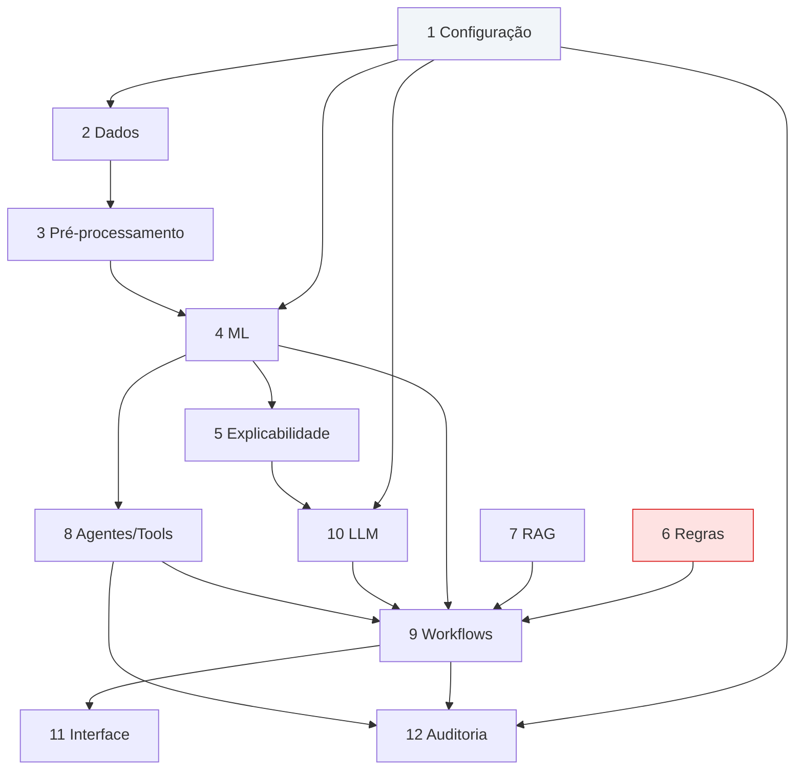

# Catálogo de Componentes

**Agente responsável:** `ArchitectureAgent`
**Camadas:** as 12 definidas em `ARQUITETURA_ALVO.md` §2.
**Aviso:** componentes marcados `novo` ou `estendido` **não existem ainda**. As assinaturas
apresentadas para eles são projetadas, não lidas do código. Componentes `existente` foram lidos
diretamente do fonte.

---

## Legenda de status

| Status | Significado |
|---|---|
| `existente` | Está no repositório hoje e **não será alterado** |
| `estendido` | Está no repositório hoje e receberá **adições retrocompatíveis** |
| `novo` | Não existe; será criado |
| `existente (depreciado)` | Está no repositório; permanece por compatibilidade, mas o uso migra |

---

## Mapa geral

| Camada | Componentes | Existentes | Estendidos | Novos |
|---|---|---|---|---|
| 1 Configuração | `config.py` | 0 | 0 | 1 |
| 2 Dados | `db.py`, `mock_data.py`, `ml/dataset.py` | 1 | 1 | 1 |
| 3 Pré-processamento | `ml/schema.py`, `ml/features.py` | 0 | 0 | 2 |
| 4 Machine Learning | `ml/train.py`, `ml/evaluate.py`, `ml/predict.py`, `ml/registry.py` | 0 | 0 | 4 |
| 5 Explicabilidade | `ml/explain.py` | 0 | 0 | 1 |
| 6 Regras de segurança | `alertas.py`, `SINAIS_ALARME_OBST`, `SINAIS_EMERGENCIA` | 3 | 0 | 0 |
| 7 RAG | `common.rag_search`, `tools.buscar_protocolo` | 2 | 0 | 0 |
| 8 Agentes e tools | `agent.py`, `tools.py` | 1 | 1 | 0 |
| 9 Workflows | 4 existentes + `risco_ml.py` | 3 | 1 | 1 |
| 10 LLM | `llm.py`, `ml/llm_contract.py`, `validacao.py`, dublê de chat | 1 | 0 | 3 |
| 11 Interface | `ui.py` | 0 | 1 | 0 |
| 12 Auditoria e observabilidade | `log_acesso`, `predicoes_ml`, `observabilidade.py` | 1 | 0 | 2 |

---

# Camada 1 — Configuração

## `lib/config.py`

| Campo | Valor |
|---|---|
| **Camada** | 1 — Configuração |
| **Status** | **novo** (ADR-009) |
| **Responsabilidade** | Resolver, em um único lugar, todos os caminhos, credenciais e flags. Preservar os defaults Colab para não quebrar os notebooks. |
| **Entradas** | Variáveis de ambiente: `PERFIL_EXECUCAO`, `HOSPITAL_DB_PATH`, `DRIVE_BASE`, `HF_TOKEN`, `CHROMA_PATH`, `ARTIFACTS_PATH`, `ML_RISCO_HABILITADO`, `LOG_LEVEL`, `RANDOM_SEED` |
| **Saídas** | Objeto de configuração imutável, com os caminhos já resolvidos como `Path` |
| **Dependências** | Nenhuma além da biblioteca padrão (é o módulo mais baixo da pilha; não pode importar nada de `lib/`) |
| **Pontos de extensão** | Novas flags de funcionalidade; novos perfis de execução; `.env.example` versionado como documentação executável |

**Restrição de projeto.** `config.py` não pode importar `db`, `llm` nem `ml` — seria ciclo.
A direção é sempre: todo mundo importa `config`, `config` não importa ninguém.

**Compatibilidade obrigatória.** `HOSPITAL_DB_PATH` já é lido por `db.get_db_path()`; o default
Colab é preservado. `DRIVE_BASE` já é lido por `llm.load_finetuned`; idem. O módulo generaliza
um padrão existente, não introduz um novo (ADR-009).

---

# Camada 2 — Dados

## `lib/db.py`

| Campo | Valor |
|---|---|
| **Camada** | 2 — Dados |
| **Status** | **estendido** — `+1` tabela `predicoes_ml` em `SCHEMA_SQL` |
| **Responsabilidade** | Abrir conexão SQLite e materializar o schema de forma idempotente |
| **Entradas** | `HOSPITAL_DB_PATH` (env) ou caminho explícito em `connect(path)` |
| **Saídas** | `sqlite3.Connection` com `row_factory = sqlite3.Row` e `PRAGMA foreign_keys = ON` |
| **Dependências** | `os`, `sqlite3`, `pathlib` |
| **Pontos de extensão** | `SCHEMA_SQL` é executado por `executescript` com `CREATE TABLE IF NOT EXISTS` — acrescentar uma tabela é seguro e idempotente. `reset_database` tem lista explícita de tabelas, que precisa incluir a nova. |

**Interface atual (lida do código):** `DEFAULT_DB_PATH`, `get_db_path()`, `connect(path=None)`,
`SCHEMA_SQL`, `init_schema(conn)`, `reset_database(conn)`. Sete tabelas:
`pacientes`, `prontuario_gineco`, `exames`, `registros_violencia`, `log_acesso`, `medicamentos`,
`ciclos_menstruais`.

**Extensão planejada:** oitava tabela `predicoes_ml`, DDL em `ARQUITETURA_ALVO.md` §5.3.
A extensão é puramente aditiva: nenhuma coluna de tabela existente é alterada — decisão explícita
do `CONTRATO_DE_DADOS.md` §4, para não tornar o banco inconsistente com os notebooks 05, 07 e 10.

**Cuidado de implementação.** `reset_database` faz `DROP TABLE` em ordem que respeita as chaves
estrangeiras. `predicoes_ml` referencia `pacientes`, logo deve ser dropada **antes** dela.

## `lib/mock_data.py`

| Campo | Valor |
|---|---|
| **Camada** | 2 — Dados |
| **Status** | **existente** — não será alterado |
| **Responsabilidade** | Gerar 50 pacientes sintéticos com Faker `pt_BR`, semente 42 |
| **Entradas** | Conexão SQLite; semente |
| **Saídas** | Linhas nas 7 tabelas de `hospital.db` |
| **Dependências** | `faker`, `random`, `datetime`, `lib.db` |
| **Pontos de extensão** | Nenhum planejado. É intencional: o banco de demonstração fica como está. |

Contém `TODAY = date(2026, 5, 22)`, uma das quatro cópias da data congelada.

## `lib/ml/dataset.py`

| Campo | Valor |
|---|---|
| **Camada** | 2 — Dados |
| **Status** | **novo** |
| **Responsabilidade** | Gerar, persistir, carregar e verificar o dataset sintético `risco_gestacional_sintetico v1.0.0` (8 000 registros, **24 features**, alvo `alto_risco`) |
| **Entradas** | Semente (`42`), número de registros, caminho de saída |
| **Saídas** | `artifacts/data/risco_gestacional_v1.parquet` (não versionado) + `risco_gestacional_v1.manifest.json` (versionado, com SHA-256) |
| **Dependências** | `numpy` (`default_rng`), `pandas`, `pyarrow`, `lib.config` |
| **Pontos de extensão** | Nova versão do contrato de dados ⇒ novo MAJOR e novo arquivo; o carregador aceita `dataset_version` como parâmetro |

**Obrigação crítica.** O carregador **remove explicitamente** a coluna `risco_latente` da matriz
de features. Ela é a probabilidade real do processo gerador; incluí-la causaria vazamento total.
`tests/unit/test_dataset_sem_vazamento.py` falha se ela aparecer
(`docs/dados/CONTRATO_DE_DADOS.md` §3.6).

Também remove as colunas de rastreabilidade `registro_id`, `dataset_version` e `split` da matriz
de features — elas existem para auditoria e particionamento, não para o modelo.

---

# Camada 3 — Pré-processamento

## `lib/ml/schema.py`

| Campo | Valor |
|---|---|
| **Camada** | 3 — Pré-processamento |
| **Status** | **novo** |
| **Responsabilidade** | Definir `GestanteFeatures` (Pydantic) como fronteira única de entrada do modelo, com validação de domínio e validadores cruzados obstétricos; oferecer a ponte `features_de_paciente(conn, paciente_id)` |
| **Entradas** | Dicionário de features (da UI, de uma tool ou de um teste); opcionalmente uma conexão e um `paciente_id` |
| **Saídas** | Instância validada de `GestanteFeatures`; ou `ValidationError`; ou `DadosIncompletosError` com a lista de campos obrigatórios ausentes |
| **Dependências** | `pydantic`, `sqlite3` (só na ponte), `lib.db` |
| **Pontos de extensão** | Novos campos opcionais; novos validadores cruzados; novas fontes de preenchimento além do `hospital.db` |

**Regras do contrato** (detalhe em `CONTRATOS_DE_COMPONENTES.md` §1):
`extra='forbid'`; obrigatório ausente **não é imputado**; `partos + abortos > gestacoes` é
rejeitado; `pad_mmhg >= pas_mmhg` é rejeitado.

**Sobre a ponte com o banco.** `features_de_paciente` monta um `GestanteFeatures` **parcial** a
partir do prontuário real e declara quais campos ficaram ausentes. Como `hospital.db` não tem
pressão arterial, IMC nem comorbidades estruturadas, essa ponte quase sempre dispara o caminho de
dados incompletos — o que torna o cenário de demonstração genuíno em vez de encenado
(`CONTRATO_DE_DADOS.md` §4).

## `lib/ml/features.py`

| Campo | Valor |
|---|---|
| **Camada** | 3 — Pré-processamento |
| **Status** | **novo** |
| **Responsabilidade** | Construir o `ColumnTransformer` (imputação → escalonamento → codificação) e declarar os grupos de colunas por tipo |
| **Entradas** | Nada em tempo de construção; `pd.DataFrame` em `fit`/`transform` |
| **Saídas** | `ColumnTransformer` não ajustado; nomes de features pós-transformação (`get_feature_names_out`) |
| **Dependências** | `scikit-learn`, `pandas` |
| **Pontos de extensão** | Novos grupos de colunas; codificação ordinal para `proteinuria_fita`; interações explícitas se a análise de erros indicar necessidade |

**Invariante de anti-vazamento.** O transformador **nunca** é ajustado fora de um `Pipeline`
sklearn, e o `Pipeline` só sofre `fit` sobre o conjunto de treino
(`docs/ml/DEFINICAO_DO_PROBLEMA.md` §6). Ajustar o escalonador sobre treino + validação é o
vazamento mais comum e o mais fácil de cometer sem perceber.

**Acoplamento a ser respeitado.** Os nomes devolvidos por `get_feature_names_out()` são a chave
que liga a explicabilidade (camada 5) às features originais. `explain.py` depende deles; mudá-los
quebra o payload.

---

# Camada 4 — Machine Learning

## `lib/ml/train.py`

| Campo | Valor |
|---|---|
| **Camada** | 4 — Machine Learning |
| **Status** | **novo** |
| **Responsabilidade** | Treinar os 4 modelos (dummy, baseline determinístico, regressão logística, random forest), selecionar hiperparâmetros e escolher o limiar operacional |
| **Entradas** | Parquet do dataset; semente; grade de hiperparâmetros |
| **Saídas** | `artifacts/models/<nome>_<versao>.joblib` + `model_card.json` por modelo |
| **Dependências** | `scikit-learn`, `joblib`, `pandas`, `lib.ml.{dataset,features,registry}`, `lib.config` |
| **Pontos de extensão** | Novos estimadores (`GradientBoosting`, `XGBoost`) entram como itens de uma lista de candidatos — fora do escopo obrigatório (`DEFINICAO_DO_PROBLEMA.md` §4) |

**Protocolo fixo:** split 70/15/15 estratificado; `GridSearchCV` com `StratifiedKFold(5)`
**apenas sobre o treino**, otimizando `average_precision`; `class_weight='balanced'`; limiar
escolhido na **validação** como o menor que atinge recall ≥ 0,90; conjunto de teste aberto
**uma única vez**.

**Baseline determinístico.** É o componente mais importante da lista: implementa
`CRITERIOS_ALTO_RISCO` de `obstetrico.py:50-66` como regra "qualquer critério presente → alto
risco". Ele **é** o comportamento atual do sistema. O ML só se justifica se o superar.

## `lib/ml/evaluate.py`

| Campo | Valor |
|---|---|
| **Camada** | 4 |
| **Status** | **novo** |
| **Responsabilidade** | Calcular todas as métricas obrigatórias e a análise de erros; produzir a tabela comparativa entre modelos |
| **Entradas** | Modelos treinados; split de validação e de teste |
| **Saídas** | `artifacts/metrics/*.json`, matrizes de confusão, curvas PR/ROC/calibração, intervalos de confiança por bootstrap (1000 reamostragens) |
| **Dependências** | `scikit-learn`, `numpy`, `matplotlib`, `lib.ml.registry` |
| **Pontos de extensão** | Novas métricas; análise de subgrupo adicional |

**Proibição explícita.** Acurácia é reportada, nunca usada como critério de seleção
(`DEFINICAO_DO_PROBLEMA.md` §5.3). Com 22 % de prevalência, prever sempre "habitual" já entrega
78 %.

## `lib/ml/predict.py`

| Campo | Valor |
|---|---|
| **Camada** | 4 |
| **Status** | **novo** |
| **Responsabilidade** | Inferência de linha única em produção. É o **único** ponto por onde uma predição entra no sistema. |
| **Entradas** | `GestanteFeatures` validado |
| **Saídas** | `ResultadoPredicao` (contrato em `CONTRATOS_DE_COMPONENTES.md` §2) |
| **Dependências** | `lib.ml.registry` (carrega o artefato), `pandas`, `scikit-learn` |
| **Pontos de extensão** | Predição em lote; cache de modelo em memória; troca de artefato sem reinício |

**Por que o único ponto importa.** A ADR-012 cria dois caminhos para a mesma decisão — o workflow
`risco_ml.py` e o nó opcional em `obstetrico.py`. A mitigação declarada é que **ambos chamam
`predict.py`**. Se alguém instanciar um modelo em outro lugar, a mitigação evapora.

**Comportamento na falha.** Modelo ausente, artefato corrompido ou `dataset_version` incompatível
não produzem exceção que suba até a UI: produzem `ModeloIndisponivelError`, que o workflow
converte em `modo_degradado` declarado (Princípio 5).

## `lib/ml/registry.py`

| Campo | Valor |
|---|---|
| **Camada** | 4 |
| **Status** | **novo** |
| **Responsabilidade** | Versionar, salvar, localizar e carregar artefatos de modelo com seus metadados |
| **Entradas** | Nome e versão do modelo, ou "o mais recente compatível" |
| **Saídas** | Tupla (pipeline sklearn, `model_card`) |
| **Dependências** | `joblib`, `json`, `lib.config` |
| **Pontos de extensão** | Registro remoto; promoção por estágio (`staging`/`producao`) |

**Regra de compatibilidade.** O `model_card.json` carrega `dataset_version`. Carregar um modelo
cuja MAJOR difira da do dataset presente é **erro**, não aviso
(`CONTRATO_DE_DADOS.md` §6).

---

# Camada 5 — Explicabilidade

## `lib/ml/explain.py`

| Campo | Valor |
|---|---|
| **Camada** | 5 — Explicabilidade |
| **Status** | **novo** (ADR-008) |
| **Responsabilidade** | Produzir atribuição por variável para uma predição individual, declarando o método usado |
| **Entradas** | Pipeline treinado; a linha de features transformada; nomes das features |
| **Saídas** | `ResultadoExplicacao` com `top_features` e `metodo` (contrato em `CONTRATOS_DE_COMPONENTES.md` §3) |
| **Dependências** | `shap` (**opcional**), `scikit-learn` (`permutation_importance`), `numpy` |
| **Pontos de extensão** | Novos explicadores por tipo de estimador; explicação global agregada para o relatório |

**Cascata de métodos, em ordem de preferência:**

| Ordem | Método | Quando | Escopo |
|---|---|---|---|
| 1 | SHAP `TreeExplainer` | `shap` importável **e** estimador baseado em árvores | local, exato |
| 2 | Contribuição linear `coef × valor_padronizado` | estimador linear (regressão logística) | local |
| 3 | `permutation_importance` | demais casos | **global**, não local |

**Obrigação de honestidade.** O método usado é registrado no resultado e propagado ao payload,
para que uma importância por permutação nunca seja apresentada como SHAP. A detecção de
disponibilidade acontece em tempo de importação — nunca dentro do laço de inferência.

**Motivo do fallback.** O ambiente local é Python 3.13; `shap` tem dependências compiladas e
histórico de atraso no suporte a versões novas. Explicabilidade é requisito; depender de um único
pacote seria ponto único de falha.

---

# Camada 6 — Regras de segurança

## `lib/alertas.py`

| Campo | Valor |
|---|---|
| **Camada** | 6 — Regras de segurança |
| **Status** | **existente** — não será alterado |
| **Responsabilidade** | Regras determinísticas de rastreamento preventivo e matriz de suspeita de violência |
| **Entradas** | `sqlite3.Connection` + `paciente_id`; ou lista de chaves de sinais |
| **Saídas** | `list[ExameAtrasado]`; `AvaliacaoViolencia`; `dict` de calendário menstrual |
| **Dependências** | `sqlite3`, `datetime` — **nenhuma dependência de LLM** |
| **Pontos de extensão** | Nenhum planejado. É deliberado (ADR-002): a matriz de violência permanece determinística e auditável. |

Interface: `TODAY = date(2026, 5, 22)`, `exames_atrasados(conn, paciente_id)`,
`SINAIS_VIOLENCIA` (12 chaves), `avaliar_padrao_violencia(sinais)`,
`proximo_periodo_menstrual(conn, paciente_id)`.

Este módulo é o exemplo do que a camada 4 deve imitar em auditabilidade: entrada explícita,
saída tipada, zero dependência de inferência.

## `SINAIS_ALARME_OBST` (constante em `lib/workflows/obstetrico.py`)

| Campo | Valor |
|---|---|
| **Camada** | 6 |
| **Status** | **existente** — consumida por um componente novo |
| **Responsabilidade** | Dicionário de 10 sinais de alarme obstétrico com descrição clínica |
| **Entradas** | — (constante) |
| **Saídas** | `dict[str, str]` |
| **Dependências** | nenhuma |
| **Pontos de extensão** | `risco_ml.py` a importa para o nó `regras_seguranca`, que produz o `bypass_ml` (ADR-006) |

Hoje ela é consumida por `_detectar_alertas_urgencia`, que faz *substring matching* com
heurísticas por chave. O workflow novo reutiliza a mesma constante; se a detecção passar a ser
compartilhada, a função de detecção — e não a constante — é o que precisa ser extraído.

## `SINAIS_EMERGENCIA` (constante em `lib/workflows/triagem.py`)

| Campo | Valor |
|---|---|
| **Camada** | 6 |
| **Status** | **existente** — não será alterada |
| **Responsabilidade** | Lista de 14 termos que forçam urgência `emergencia` antes de qualquer consulta ao LLM |
| **Pontos de extensão** | Nenhum |

É a implementação original do Princípio 2 no projeto (`triagem.py:127-136`).

---

# Camada 7 — RAG

## `lib/workflows/common.py::rag_search`

| Campo | Valor |
|---|---|
| **Camada** | 7 — RAG |
| **Status** | **existente** — consumida por um componente novo, sem alteração |
| **Responsabilidade** | Recuperar trechos de protocolo com metadados de fonte |
| **Entradas** | `(retriever, query, categoria=None, k=4)` |
| **Saídas** | `list[dict]` com chaves `trecho`, `doc_id`, `category`, `chunk_id` (defaults `'?'`) |
| **Dependências** | qualquer objeto com `.invoke(query) -> list[Document]` |
| **Pontos de extensão** | O nó `recuperar_protocolos_rag` de `risco_ml.py` a chama diretamente |

**Limitação conhecida, preservada.** O filtro por categoria é pós-processado sobre os `2k`
primeiros vizinhos. Se nenhum deles for da categoria pedida, o retorno é lista vazia, sem sinal de
erro. O componente novo deve tratar lista vazia como um estado legítimo — protocolo não
encontrado é informação, não falha.

## `lib/tools.py::buscar_protocolo`

| Campo | Valor |
|---|---|
| **Camada** | 7 |
| **Status** | **existente** |
| **Responsabilidade** | Mesma recuperação, exposta ao agente ReAct |
| **Entradas** | `(query, retriever, k=4, categoria=None)` — ordem de parâmetros **invertida** em relação a `rag_search` |
| **Saídas** | mesmas chaves; defaults `None` em vez de `'?'` |
| **Pontos de extensão** | Nenhum planejado |

A duplicação e a inversão de ordem são dívida técnica registrada em `ARQUITETURA_ATUAL.md` §7.
Unificar as duas seria alteração não aditiva num caminho crítico do agente; fica registrado como
extensão futura, não como ação desta fase.

---

# Camada 8 — Agentes e tools

## `lib/agent.py`

| Campo | Valor |
|---|---|
| **Camada** | 8 — Agentes e tools |
| **Status** | **existente** — não será alterado |
| **Responsabilidade** | Construir o agente ReAct e executar consultas livres, extraindo o rastro de tool calls |
| **Entradas** | `chat_model` com `bind_tools`; lista de tools; pergunta; `paciente_id` opcional; histórico |
| **Saídas** | `{'resposta': str, 'tool_calls': list[dict], 'mensagens': list[BaseMessage]}` |
| **Dependências** | `langgraph.prebuilt.create_react_agent`, `langchain_core` |
| **Pontos de extensão** | A nova tool entra pela lista passada em `build_agent`, sem tocar no módulo |

**Observação de código.** `build_agent` declara o parâmetro `max_iterations: int = 6` e **não o
utiliza**; o controle efetivo é `recursion_limit=12` em `run_consulta`. Fica registrado; corrigir
é alteração não aditiva num módulo classificado como intocado.

## `lib/tools.py`

| Campo | Valor |
|---|---|
| **Camada** | 8 |
| **Status** | **estendido** — `+1` tool `predizer_risco_gestacional` |
| **Responsabilidade** | Expor funções de domínio como `StructuredTool` com schema Pydantic de entrada e auditoria onde exigido |
| **Entradas** | `build_langchain_tools(conn, retriever)` |
| **Saídas** | `list[StructuredTool]` — hoje 9, depois 10 |
| **Dependências** | `pydantic`, `langchain_core.tools`, `lib.alertas`, `lib.db` |
| **Pontos de extensão** | A lista de retorno é o ponto de extensão; os 9 nomes existentes e suas assinaturas são contrato de regressão |

**Extensão planejada:** `predizer_risco_gestacional`, com `args_schema` derivado de
`GestanteFeatures`, chamando `lib.ml.predict` e gravando em `predicoes_ml`. Contrato completo em
`CONTRATOS_DE_COMPONENTES.md` §7.

**Dívida herdada relevante.** `_USUARIO_ATUAL` é global de módulo, mutável por
`set_usuario_atual`. A nova tool grava `usuario` na auditoria a partir dele; herda, portanto, a
premissa de usuário único (`ESTRATEGIA_DE_ESCALABILIDADE.md`).

---

# Camada 9 — Workflows

## `lib/workflows/triagem.py`

| Campo | Valor |
|---|---|
| **Camada** | 9 |
| **Status** | **existente** — não será alterado |
| **Responsabilidade** | Triagem ginecológica: queixa livre → urgência → exames → orientações → agendamento |
| **Entradas** | `{'queixa': str, 'paciente_id': int \| None}` |
| **Saídas** | `TriagemState` com `resposta_estruturada` e `confianca` |
| **Dependências** | `chat_model`, `retriever`, `common` |
| **Pontos de extensão** | Nenhum nesta fase. Classificação de urgência por ML é extensão futura registrada na ADR-002. |

7 nós, 1 aresta condicional (`_rota_urgencia`).

## `lib/workflows/violencia.py`

| Campo | Valor |
|---|---|
| **Camada** | 9 |
| **Status** | **existente** — não será alterado |
| **Responsabilidade** | Detecção de violência: extração de sinais → matriz determinística → protocolo → equipe → registro auditado → seguimento |
| **Entradas** | `{'descricao_caso', 'paciente_id', 'profissional', 'confirmacao_clinica'}` |
| **Saídas** | `ViolenciaState` com `resposta_estruturada`; possivelmente `INSERT` em `registros_violencia` e `log_acesso` |
| **Dependências** | `chat_model`, `conn`, `alertas`, `tools` |
| **Pontos de extensão** | **Nenhum, por decisão ética explícita** (ADR-002) |

7 nós, 1 aresta condicional (`_rota_nivel`).

**Defeito conhecido, não corrigido nesta fase:** `_protocolo_seguranca` monta a lista `medidas`
e não a devolve. Registrado em `ARQUITETURA_ATUAL.md` §5.2.

## `lib/workflows/obstetrico.py`

| Campo | Valor |
|---|---|
| **Camada** | 9 |
| **Status** | **estendido** — nó de ML opcional sob flag `ML_RISCO_HABILITADO` (ADR-012) |
| **Responsabilidade** | Atendimento obstétrico: dados da gestante → risco → alarmes → orientações → exames por IG → acompanhamento |
| **Entradas** | `{'descricao_caso', 'paciente_id', 'ig_semanas'?}` |
| **Saídas** | `ObstetricoState` com `resposta_estruturada` |
| **Dependências** | `chat_model`, `retriever`, `common`; passará a depender de `lib.ml.predict` quando a flag estiver ligada |
| **Pontos de extensão** | O nó `avaliar_risco_gestacional` ganha um caminho alternativo: com a flag ligada, chama `predict.py`; desligada, mantém exatamente o comportamento por LLM de hoje |

7 nós, **grafo linear** — o docstring desenha uma ramificação que não existe.

**Compromisso de regressão.** Com `ML_RISCO_HABILITADO` desligada, o comportamento deve ser
byte-a-byte o atual. Testado nos dois estados da flag.

## `lib/workflows/prevencao.py`

| Campo | Valor |
|---|---|
| **Camada** | 9 |
| **Status** | **existente** — não será alterado |
| **Responsabilidade** | Plano preventivo: histórico → exames devidos → orientações → agendamento → lembretes |
| **Entradas** | `{'paciente_id': int}` |
| **Saídas** | `PrevencaoState` com `resposta_estruturada` |
| **Dependências** | `conn`, `chat_model`, `retriever`, `alertas`, `tools` |
| **Pontos de extensão** | Nenhum |

6 nós, **grafo linear**. Contém `TODAY = date(2026, 5, 23)` — divergente das outras três cópias.

## `lib/workflows/common.py`

| Campo | Valor |
|---|---|
| **Camada** | 9 (e 7, via `rag_search`) |
| **Status** | **existente** — não será alterado |
| **Responsabilidade** | Helpers compartilhados: `llm_json`, `llm_text`, `rag_search`, `citar_fontes`, `estimar_confianca` |
| **Entradas** | variadas |
| **Saídas** | variadas |
| **Dependências** | `langchain_core.messages`, `json`, `re` |
| **Pontos de extensão** | `risco_ml.py` reutiliza `rag_search` e `citar_fontes`; **não** usa `llm_json` no caminho numérico — ali vale o contrato de `llm_contract.py` |

**Por que não usar `llm_json` no caminho de ML.** Seu `default` silencioso é exatamente o
antipadrão que o Princípio 5 proíbe.

## `lib/workflows/risco_ml.py`

| Campo | Valor |
|---|---|
| **Camada** | 9 |
| **Status** | **novo** (ADR-012) |
| **Responsabilidade** | Workflow completo de predição de risco gestacional, com os quatro caminhos de exceção |
| **Entradas** | `{'dados_clinicos': dict, 'paciente_id': int \| None, 'usuario': str}` |
| **Saídas** | `RiscoMLState` com `resposta_estruturada`, `modo`, `payload_llm`, `raciocinio` |
| **Dependências** | `lib.ml.{schema,predict,explain,llm_contract}`, `lib.validacao`, `lib.alertas`, `common.rag_search`, `conn`, `chat_model` |
| **Pontos de extensão** | Novos caminhos de exceção; checkpointer para human-in-the-loop persistente |

Nós, conforme `ARQUITETURA_ALVO.md` §4: `validar_dados`, `erro_validacao`, `dados_incompletos`,
`solicitar_complemento`, `regras_seguranca`, `bypass_ml`, `executar_modelo_ml`, `modo_degradado`,
`gerar_explicabilidade`, `recuperar_protocolos_rag`, `sintetizar_com_llm`, `validar_resposta_llm`,
`usar_resposta_estruturada`, `aplicar_avisos_seguranca`, `auditar`, `compilar_resposta`.

Grafo completo em `DIAGRAMA_LANGGRAPH.md` §5.

---

# Camada 10 — LLM

## `lib/llm.py`

| Campo | Valor |
|---|---|
| **Camada** | 10 |
| **Status** | **existente** — não será alterado |
| **Responsabilidade** | Carregar Llama 3.2 3B em 4-bit com adapter LoRA e embrulhá-lo como `ChatHuggingFace` |
| **Entradas** | `adapter_dir` opcional; `DRIVE_BASE`; `HF_TOKEN` (implícito) |
| **Saídas** | `(model, tokenizer)`; `ChatHuggingFace` |
| **Dependências** | `torch`, `transformers`, `bitsandbytes`, `peft`, `langchain_huggingface` |
| **Pontos de extensão** | Nenhum. O perfil `demo-cpu` **não carrega este módulo** — troca o objeto `chat_model`, não a forma de carregá-lo. |

Exige GPU: `load_in_4bit=True` com `bitsandbytes`. É a raiz do acoplamento a Colab.

## `lib/ml/llm_contract.py`

| Campo | Valor |
|---|---|
| **Camada** | 10 |
| **Status** | **novo** (ADR-007) |
| **Responsabilidade** | Montar o payload somente-leitura, construir o prompt de síntese e verificar a resposta contra os números do payload |
| **Entradas** | `ResultadoPredicao`, `ResultadoExplicacao`, fontes RAG, regras disparadas |
| **Saídas** | `dict` do payload (formato exato em `ARQUITETURA_ALVO.md` §5.2); prompt; `ResultadoVerificacao` |
| **Dependências** | `re`, `json`, `lib.validacao` |
| **Pontos de extensão** | Novos campos no payload; tolerância de arredondamento configurável; novos padrões de contradição de rótulo |

**Invariante central.** `prediction`, `probabilities`, `threshold` e `contribution` são gerados
exclusivamente pelas camadas 4 e 5. Este módulo os transporta e os confere; não os produz nem os
altera.

## `lib/validacao.py`

| Campo | Valor |
|---|---|
| **Camada** | 10 |
| **Status** | **novo** — promoção de `referencias/validador_resposta_llm.py` (ADR-010) |
| **Responsabilidade** | Validação determinística da saída textual: não-diagnóstico, não-prescrição sem disclaimer, serviços da rede em categorias sensíveis, citação de fonte, tom dirigido ao profissional — **mais** a coerência numérica do ADR-007 |
| **Entradas** | `resposta: str`, `categoria: str \| None`, `fontes: list[dict]`, e (novo) `payload: dict` |
| **Saídas** | `ResultadoValidacao(aprovada, violacoes, avisos, disclaimer_sugerido)` |
| **Dependências** | `re`, `dataclasses` — stdlib apenas |
| **Pontos de extensão** | Novos padrões regex; novas categorias sensíveis; o `ValidadorLLM` permanece disponível e **desabilitado por padrão** |

**Por que a promoção é barata.** O motivo original da não integração — latência de 5–10 s — vale
para `ValidadorLLM` (segunda chamada ao modelo), **não** para `ValidadorDeterministico`, que é
regex. A decisão anterior estava correta para a classe errada. Os 6 casos de teste do bloco
`__main__` viram testes de `pytest`.

**Compatibilidade.** `referencias/validador_resposta_llm.py` é mantido com nota de depreciação,
para não quebrar referências dos relatórios da Fase 3.

## Dublê determinístico de chat (`FakeChatModel`)

| Campo | Valor |
|---|---|
| **Camada** | 10 |
| **Status** | **novo** (ADR-005) |
| **Responsabilidade** | Implementar `BaseChatModel` devolvendo respostas fixas por padrão de prompt, para que o pipeline seja testável e a imagem Docker verificável sem GPU |
| **Entradas** | lista de mensagens |
| **Saídas** | `AIMessage` determinística |
| **Dependências** | `langchain_core` |
| **Pontos de extensão** | Novos padrões de resposta por cenário de teste |

**Ponto em aberto.** `ARQUITETURA_ALVO.md` §7 não fixa o arquivo em que este componente vive, e
`lib/llm.py` está classificado como inalterado. Proposta: módulo próprio em `lib/`, a ser
confirmado por ADR antes da implementação. Registrado aqui como pendência, não como decisão.

**Limite de uso.** Ele não substitui o LLM na demonstração final. Isso precisa estar declarado
no `GUIA_DEMO.md` e no roteiro de vídeo (ADR-005, consequência negativa).

---

# Camada 11 — Interface

## `lib/ui.py`

| Campo | Valor |
|---|---|
| **Camada** | 11 |
| **Status** | **estendido** — `+1` aba "Risco Gestacional (ML)" |
| **Responsabilidade** | Montar o `gr.Blocks`: sidebar de sessão + abas por cenário, e converter `resposta_estruturada` em Markdown |
| **Entradas** | `build_ui(agent, conn, default_usuario='sessao_demo', workflows=None)` |
| **Saídas** | `gr.Blocks` pronto para `.launch()` |
| **Dependências** | `gradio`, `lib.alertas`, `lib.tools`, `lib.agent` |
| **Pontos de extensão** | O dicionário `workflows` — acrescentar a chave `risco_ml` não altera as demais; e um novo `_render_risco_ml(state)` ao lado dos quatro formatadores existentes |

**Obrigações da nova aba** (Princípio 6): exibir probabilidade, limiar, campos imputados, método
de explicação, modo de execução e os dois avisos obrigatórios.

**Premissas herdadas, a declarar e não a resolver nesta fase:** `historico_estado` é dicionário de
closure compartilhado entre sessões; nenhum handler tem `try/except`.

---

# Camada 12 — Auditoria e observabilidade

## Tabela `log_acesso`

| Campo | Valor |
|---|---|
| **Camada** | 12 |
| **Status** | **existente** — não será alterada |
| **Responsabilidade** | Registrar acesso a `registros_violencia` com usuário, timestamp e motivo |
| **Entradas** | `tools._log_acesso(conn, tabela, paciente_id, motivo)` |
| **Saídas** | Linha em `log_acesso` |
| **Pontos de extensão** | Nenhum. A auditoria de predições vai para tabela própria, não para esta. |

Sem chave estrangeira em `paciente_id`, deliberadamente: o log sobrevive à remoção da paciente.

## Tabela `predicoes_ml`

| Campo | Valor |
|---|---|
| **Camada** | 12 |
| **Status** | **novo** |
| **Responsabilidade** | Rastro completo de cada predição: modelo, versão, dataset, limiar, hash das features, resultado e modo |
| **Entradas** | `INSERT` do nó `auditar` de `risco_ml.py` e da tool `predizer_risco_gestacional` |
| **Saídas** | Linhas consultáveis por paciente, por modelo e por modo |
| **Dependências** | `pacientes` (FK opcional em `paciente_id`) |
| **Pontos de extensão** | Novas colunas são aditivas; consultas de relatório gerencial |

DDL em `ARQUITETURA_ALVO.md` §5.3. **`features_hash` guarda SHA-256, nunca os valores clínicos** —
decisão de privacidade que permite provar reprodutibilidade sem duplicar dado sensível.

**Lacuna identificada.** A DDL não tem coluna para o método de explicação (exigido pela ADR-008)
nem para `dados_imputados` (exigido pelo Princípio 6). Ambos cabem em `top_features`, que é JSON,
mas a decisão precisa ser explícita. Registrado em `CONTRATOS_DE_COMPONENTES.md` §8.

## `lib/observabilidade.py`

| Campo | Valor |
|---|---|
| **Camada** | 12 |
| **Status** | **novo** |
| **Responsabilidade** | Logging estruturado com ID de correlação por requisição e emissão de métricas de execução |
| **Entradas** | Eventos das camadas; `LOG_LEVEL` |
| **Saídas** | Linhas JSON em stdout; contadores e latências |
| **Dependências** | `logging`, `json`, `uuid`, `time`, `lib.config` |
| **Pontos de extensão** | Novos *sinks*; exportador de métricas |

**Restrição absoluta.** Valores clínicos, nomes de pacientes e CPF **nunca** são logados.
Detalhe em `ESTRATEGIA_DE_OBSERVABILIDADE.md`.

---

# Componentes fora de `lib/`

| Componente | Camada | Status | Responsabilidade |
|---|---|---|---|
| `scripts/train.py` | 4 | **novo** | Gerar dataset, treinar, selecionar limiar, salvar artefatos. Flags: `--gerar-dataset`, `--verificar-dataset` |
| `scripts/evaluate.py` | 4 | **novo** | Avaliar e comparar modelos; escrever `artifacts/metrics/` |
| `scripts/predict.py` | 4 | **novo** | Predição por linha de comando, para demonstração e teste manual |
| `scripts/run_demo.py` | 11 | **novo** | Subir a demonstração fora do notebook, respeitando `PERFIL_EXECUCAO` |
| `tests/unit/` | todas | **novo** | Regras, schema, features, explicabilidade, validação |
| `tests/integration/` | 9 | **novo** | Workflow ponta a ponta com dublês |
| `tests/e2e/` | 9, 11 | **novo** | Perfil `demo-cpu` completo |
| `tests/regression/` | 1, 8, 9, 11 | **novo** | Contratos que os notebooks 05–10 consomem; predição estável |
| `Dockerfile`, `.dockerignore`, `docker-compose.yml` | — | **novo** | Empacotamento por perfil (ADR-005) |
| `requirements*.txt` | — | **novo** | Três arquivos: base, ML, LLM |
| `.env.example` | 1 | **novo** | Documentação executável das variáveis |
| `referencias/validador_resposta_llm.py` | 10 | **existente (depreciado)** | Mantido com nota; a lógica migra para `lib/validacao.py` |
| `lib/templates/` | 10 | **existente** | 6 templates clínicos em Markdown; inalterados |

---

## Grafo de dependências entre camadas

Duas regras de dependência que o código deve respeitar:

1. **A camada 1 não importa ninguém.** Se `config.py` precisar de algo de `lib/`, o desenho está
   errado.
2. **A camada 6 não importa as camadas 4, 5 ou 10.** `alertas.py` hoje não conhece LLM; essa
   independência é o que permite que a regra anule a inferência sem ciclo (Princípio 2).
