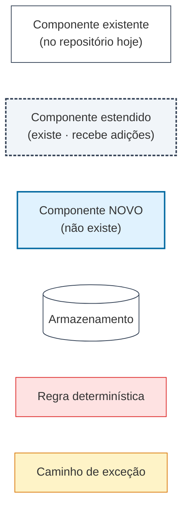
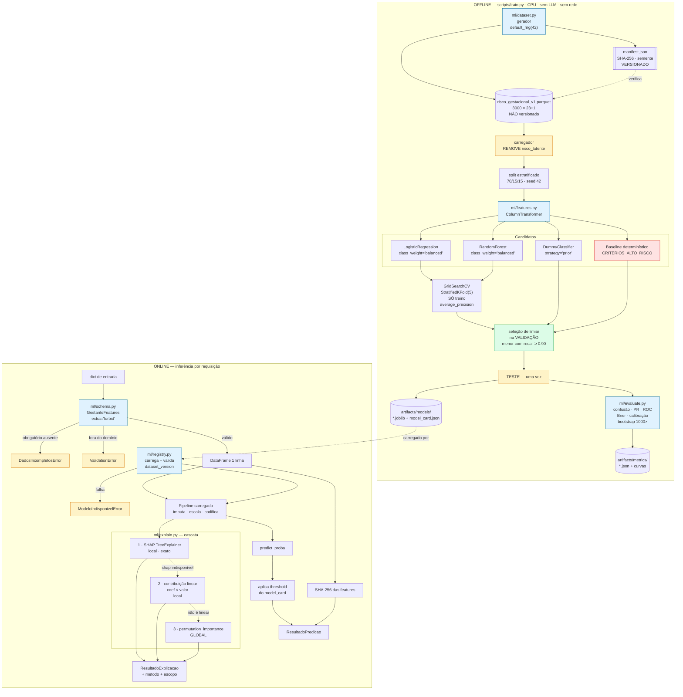
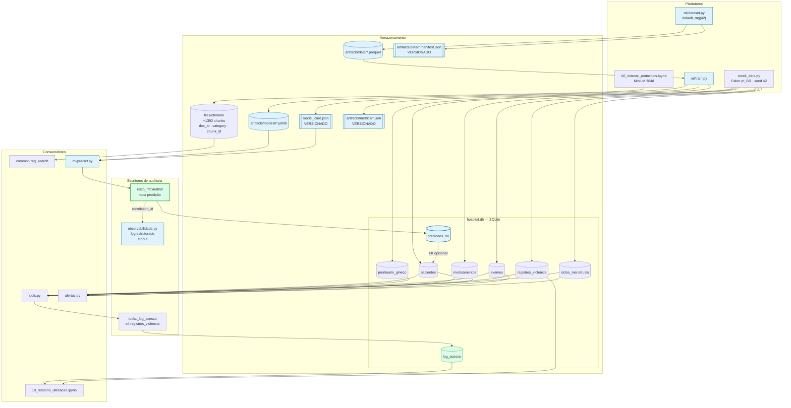

# Diagramas de Componentes

**Agente responsável:** `ArchitectureAgent`
**Status:** Os componentes em azul **não existem**. Os demais foram lidos do código.
**Camadas:** as 12 de `ARQUITETURA_ALVO.md` §2.

---

## Legenda

Vale para todos os diagramas deste documento.

| Aparência | Significado |
|---|---|
| Branco, borda fina | **Existente** — não será alterado |
| Cinza, borda tracejada | **Estendido** — adição retrocompatível a módulo existente |
| Azul | **Novo** — a criar |
| Cilindro | Armazenamento (banco, índice, arquivo) |
| Vermelho | Regra determinística de segurança (precede e pode anular o ML — ADR-006) |
| Âmbar | Caminho de exceção / degradação declarada |
| Seta tracejada | Dependência condicional (flag, perfil de execução ou rede externa) |

---

## (a) Sistema completo

Zoom mais afastado: as 12 camadas e as dependências entre elas.

```mermaid
graph TB
    subgraph L1["1 · Configuração"]
        CFG["config.py"]
    end

    subgraph L11["11 · Interface"]
        UI["ui.py<br/>gr.Blocks · 5 abas"]
        UIML["aba Risco Gestacional ML"]
    end

    subgraph L9["9 · Workflows LangGraph"]
        WT["triagem.py<br/>7 nós · 1 cond."]
        WV["violencia.py<br/>7 nós · 1 cond."]
        WO["obstetrico.py<br/>7 nós · linear<br/>+ nó ML sob flag"]
        WP["prevencao.py<br/>6 nós · linear"]
        WM["risco_ml.py<br/>16 nós · 4 exceções"]
        CMN["common.py<br/>llm_json · llm_text<br/>rag_search"]
    end

    subgraph L8["8 · Agentes e Tools"]
        AGT["agent.py<br/>create_react_agent"]
        TLS["tools.py<br/>9 tools"]
        TNEW["predizer_risco_gestacional"]
    end

    subgraph L345["3·4·5 · ML"]
        SCH["ml/schema.py"]
        FEA["ml/features.py"]
        TRN["ml/train.py"]
        EVA["ml/evaluate.py"]
        PRD["ml/predict.py"]
        REG["ml/registry.py"]
        EXP["ml/explain.py"]
    end

    subgraph L6["6 · Regras determinísticas"]
        ALE["alertas.py"]
        SAO["SINAIS_ALARME_OBST"]
        SEM["SINAIS_EMERGENCIA"]
    end

    subgraph L7["7 · RAG"]
        RGS["common.rag_search"]
        BPR["tools.buscar_protocolo"]
    end

    subgraph L10["10 · LLM"]
        LLM["llm.py<br/>Llama 3.2 3B + LoRA"]
        LCT["ml/llm_contract.py"]
        VAL["validacao.py"]
        FAKE["dublê determinístico<br/>de chat"]
    end

    subgraph L2["2 · Dados"]
        DBM["db.py"]
        MCK["mock_data.py"]
        DST["ml/dataset.py"]
        DB[("hospital.db<br/>7 tabelas")]
        CHR[("Chroma<br/>protocolos")]
        PQT[("Parquet<br/>+ manifesto")]
        ART[("artifacts/models<br/>artifacts/metrics")]
    end

    subgraph L12["12 · Auditoria e observabilidade"]
        LOGA[("log_acesso")]
        PML[("predicoes_ml")]
        OBS["observabilidade.py"]
    end

    CFG --> DBM & LLM & REG & OBS

    UI --> WT & WV & WO & WP & AGT
    UIML --> WM
    UI -.-> UIML

    WT & WV & WO & WP --> CMN
    WM --> SCH --> FEA --> PRD --> EXP
    WM --> SAO
    WM --> RGS
    WM --> LCT --> LLM
    WM --> VAL
    WM --> PML
    WO -.flag ML_RISCO_HABILITADO.-> PRD

    AGT --> TLS
    TLS --> TNEW --> PRD
    TLS --> DB
    TLS --> BPR --> CHR
    TLS --> LOGA
    CMN --> RGS --> CHR
    CMN --> LLM

    WT --> SEM
    WV --> ALE
    WP --> ALE
    ALE --> DB
    DBM --> DB
    MCK --> DB
    DST --> PQT --> TRN --> ART
    TRN --> EVA
    REG --> ART
    PRD --> REG
    LCT --> VAL
    LLM -.perfil demo-cpu troca por.-> FAKE

    WM --> OBS
    WT & WV & WO & WP -.futuro.-> OBS

    style UIML fill:#e0f2fe,stroke:#0369a1,stroke-width:2px
    style WM fill:#e0f2fe,stroke:#0369a1,stroke-width:2px
    style TNEW fill:#e0f2fe,stroke:#0369a1,stroke-width:2px
    style SCH fill:#e0f2fe,stroke:#0369a1,stroke-width:2px
    style FEA fill:#e0f2fe,stroke:#0369a1,stroke-width:2px
    style TRN fill:#e0f2fe,stroke:#0369a1,stroke-width:2px
    style EVA fill:#e0f2fe,stroke:#0369a1,stroke-width:2px
    style PRD fill:#e0f2fe,stroke:#0369a1,stroke-width:2px
    style REG fill:#e0f2fe,stroke:#0369a1,stroke-width:2px
    style EXP fill:#e0f2fe,stroke:#0369a1,stroke-width:2px
    style DST fill:#e0f2fe,stroke:#0369a1,stroke-width:2px
    style PQT fill:#e0f2fe,stroke:#0369a1,stroke-width:2px
    style ART fill:#e0f2fe,stroke:#0369a1,stroke-width:2px
    style CFG fill:#e0f2fe,stroke:#0369a1,stroke-width:2px
    style OBS fill:#e0f2fe,stroke:#0369a1,stroke-width:2px
    style PML fill:#e0f2fe,stroke:#0369a1,stroke-width:2px
    style LCT fill:#e0f2fe,stroke:#0369a1,stroke-width:2px
    style VAL fill:#e0f2fe,stroke:#0369a1,stroke-width:2px
    style FAKE fill:#e0f2fe,stroke:#0369a1,stroke-width:2px
    style UI fill:#f1f5f9,stroke:#334155,stroke-width:2px,stroke-dasharray: 4 2
    style TLS fill:#f1f5f9,stroke:#334155,stroke-width:2px,stroke-dasharray: 4 2
    style DBM fill:#f1f5f9,stroke:#334155,stroke-width:2px,stroke-dasharray: 4 2
    style WO fill:#f1f5f9,stroke:#334155,stroke-width:2px,stroke-dasharray: 4 2
    style ALE fill:#fee2e2,stroke:#dc2626
    style SAO fill:#fee2e2,stroke:#dc2626
    style SEM fill:#fee2e2,stroke:#dc2626
```

### Leitura do diagrama

Três coisas ficam visíveis aqui e em nenhum outro lugar:

1. **A camada 6 é alcançada por todo mundo e não alcança ninguém.** `alertas.py`,
   `SINAIS_ALARME_OBST` e `SINAIS_EMERGENCIA` não têm setas de saída para ML nem para LLM. É essa
   ausência de dependência que permite que a regra anule a inferência sem criar ciclo.
2. **`predict.py` tem três entradas** — `risco_ml.py`, a nova tool e o nó opcional do obstétrico.
   Isso é a materialização da mitigação da ADR-012: dois caminhos para a mesma decisão, mas um
   único ponto de inferência.
3. **A camada 1 só tem setas de saída.** `config.py` não importa nada de `lib/`.

---

## (b) Camada de ML em detalhe

Zoom nas camadas 3, 4 e 5. Separa o que roda **offline** (treino) do que roda **online**
(inferência).

### Três detalhes que o diagrama torna explícitos

| Detalhe | Por que importa |
|---|---|
| `LOAD` está destacado em âmbar | É onde `risco_latente` é removida. Esquecer isso invalida todo o experimento (`CONTRATO_DE_DADOS.md` §3.6). |
| `M1` está em vermelho, entre os candidatos | O baseline determinístico é a régua, não um concorrente qualquer: ele **é** o comportamento atual do sistema. |
| `TST` recebe seta de `THR`, nunca o contrário | O limiar é escolhido na validação. Seta invertida seria vazamento pelo limiar. |

---

## (c) Camada de workflows

Zoom na camada 9: os cinco workflows, com sua topologia real e suas dependências.

```mermaid
graph TB
    subgraph EXIST["Workflows existentes — inalterados"]
        direction TB
        subgraph T["triagem · 7 nós"]
            T1[parse_sintomas] --> T2[analisar_risco] --> T3[classificar_urgencia]
            T3 -->|"_rota_urgencia"| T4[sugerir_exames]
            T3 -->|emergencia| T6[agendamento]
            T4 --> T5[orientacoes_iniciais] --> T6 --> T7[compilar_resposta]
        end
        subgraph V["violencia · 7 nós"]
            V1[extrair_sinais] --> V2[avaliar_risco]
            V2 -->|"_rota_nivel"| V3[protocolo_seguranca]
            V2 -->|atencao/sem_alerta| V4[acionar_equipe]
            V3 --> V4 --> V5[documentar_seguro] --> V6[definir_seguimento] --> V7[compilar_resposta]
        end
        subgraph P["prevencao · 6 nós · LINEAR"]
            P1[carregar_historico] --> P2[identificar_exames_devidos] --> P3[orientacoes_preventivas]
            P3 --> P4[agendar_automaticamente] --> P5[gerar_lembretes] --> P6[compilar_resposta]
        end
    end

    subgraph EXT["obstetrico · 7 nós · LINEAR · ESTENDIDO"]
        direction TB
        O1[coletar_dados_gestante] --> O2[avaliar_risco_gestacional]
        O2 --> O3[detectar_alertas_urgencia] --> O4[orientacoes_especificas]
        O4 --> O5[agendar_exames] --> O6[definir_acompanhamento] --> O7[compilar_resposta]
        O2 -.flag ligada.-> OML["chama ml/predict.py"]
        O2 -.flag desligada.-> OLLM["classifica por LLM<br/>comportamento atual"]
    end

    subgraph NOVO["risco_ml · NOVO · 4 caminhos de exceção"]
        direction TB
        R1[validar_dados]
        R1 -->|erro| R2[erro_validacao]
        R1 -->|incompleto| R3[dados_incompletos] --> R4[/solicitar_complemento/]
        R1 -->|ok| R5[regras_seguranca]
        R5 -->|alarme| R6[bypass_ml]
        R5 -->|sem alarme| R7[executar_modelo_ml]
        R7 -->|indisponível| R8[modo_degradado]
        R7 -->|ok| R9[gerar_explicabilidade] --> R10[recuperar_protocolos_rag]
        R10 --> R11[sintetizar_com_llm] --> R12[validar_resposta_llm]
        R12 -->|reprovado| R13[usar_resposta_estruturada]
        R12 -->|ok| R14[aplicar_avisos_seguranca]
        R13 --> R14
        R6 --> R14
        R8 --> R14
        R2 --> R14
        R4 --> R14
        R14 --> R15[(auditar)] --> R16[compilar_resposta]
    end

    CMN["common.py<br/>llm_json · llm_text<br/>rag_search · citar_fontes<br/>estimar_confianca"]
    T -.-> CMN
    V -.-> CMN
    P -.-> CMN
    EXT -.-> CMN
    NOVO -.só rag_search e citar_fontes.-> CMN

    style NOVO fill:#e0f2fe,stroke:#0369a1,stroke-width:2px
    style EXT fill:#f1f5f9,stroke:#334155,stroke-width:2px,stroke-dasharray: 4 2
    style OML fill:#e0f2fe,stroke:#0369a1
    style R5 fill:#fee2e2,stroke:#dc2626
    style R6 fill:#fee2e2,stroke:#dc2626
    style R13 fill:#fee2e2,stroke:#dc2626
    style R3 fill:#fef3c7,stroke:#d97706
    style R4 fill:#fef3c7,stroke:#d97706
    style R8 fill:#fef3c7,stroke:#d97706
    style R2 fill:#fef3c7,stroke:#d97706
    style R15 fill:#dcfce7,stroke:#16a34a
```

### Contraste que o diagrama expõe

| | Workflows existentes | `risco_ml` |
|---|---|---|
| Caminhos de exceção | **zero** | **quatro** |
| Auditoria | só `violencia`, e só o registro SINAN | toda invocação, em todos os modos |
| Validação de entrada | nenhuma | Pydantic com domínio e invariantes |
| Verificação de saída | nenhuma | numérica + clínica |

Os quatro workflows existentes convergem todos em `compilar_resposta` sem nunca passar por um nó
de erro. É a tradução visual do achado registrado em `ARQUITETURA_ATUAL.md` §12.2.

**Note também** que `risco_ml` usa apenas `rag_search` e `citar_fontes` de `common.py`. Ele
**não** usa `llm_json`, cujo `default` silencioso é o antipadrão que o Princípio 5 proíbe.

---

## (d) Camada de dados e auditoria

Zoom nas camadas 2 e 12.

### O que muda na auditoria

| | Hoje | Depois |
|---|---|---|
| Tabelas de auditoria | 1 (`log_acesso`) | 2 (`+ predicoes_ml`) |
| Eventos cobertos | acesso a `registros_violencia` | idem **+** toda predição, em todos os modos |
| Dado clínico persistido na trilha nova | — | **nenhum** — só `features_hash` |
| Versão de modelo rastreável | não existe modelo | `modelo_nome`, `modelo_versao`, `dataset_versao` |
| Log estruturado | inexistente | `observabilidade.py`, com `correlation_id` |

### Política de versionamento dos artefatos

Visível no diagrama pela forma do nó: cilindro é binário não versionado; retângulo duplo (`[[ ]]`)
é metadado versionado no git.

| Versionado no git | Não versionado |
|---|---|
| `*.manifest.json` (SHA-256 do dataset) | `*.parquet` |
| `model_card.json` (versão, limiar, hiperparâmetros) | `*.joblib` |
| `artifacts/metrics/*.json` | `hospital.db`, `files/chroma/` |

Critério: **binário grande e regenerável, não; metadado pequeno e probatório, sim** (ADR-011).

---

## Resumo por camada

| Camada | Existentes | Estendidos | Novos | Componente de maior risco de integração |
|---|---|---|---|---|
| 1 Configuração | — | — | `config.py` | quebrar os defaults Colab e invalidar os notebooks |
| 2 Dados | `mock_data.py` | `db.py` | `ml/dataset.py` | `reset_database` esquecer `predicoes_ml` na ordem de `DROP` |
| 3 Pré-processamento | — | — | `schema.py`, `features.py` | `get_feature_names_out` mudar e quebrar a explicabilidade |
| 4 ML | — | — | 4 módulos | dois caminhos de predição divergirem (ADR-012) |
| 5 Explicabilidade | — | — | `explain.py` | apresentar importância global como explicação local |
| 6 Regras | 3 | — | — | nenhum — não é tocada |
| 7 RAG | 2 | — | — | lista vazia tratada como erro em vez de estado |
| 8 Agentes/Tools | `agent.py` | `tools.py` | — | modelo de 3B não conseguir preencher 11 parâmetros |
| 9 Workflows | 3 | `obstetrico.py` | `risco_ml.py` | comportamento mudar com a flag desligada |
| 10 LLM | `llm.py` | — | 3 | o dublê de chat vazar para a demonstração final |
| 11 Interface | — | `ui.py` | — | nova aba quebrar o layout das 5 existentes |
| 12 Auditoria | `log_acesso` | — | 2 | resposta entregue sem registro correspondente |
