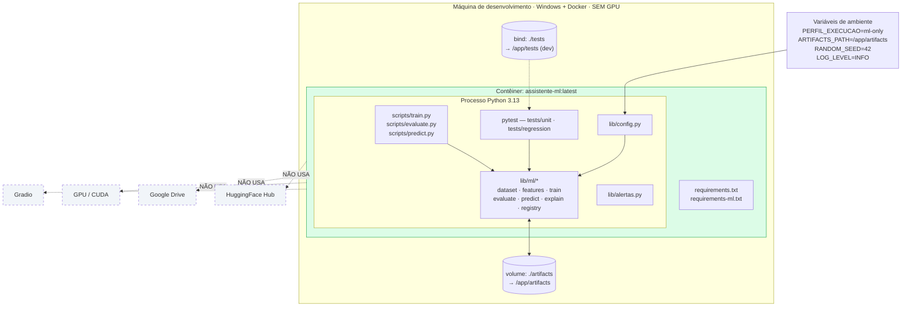
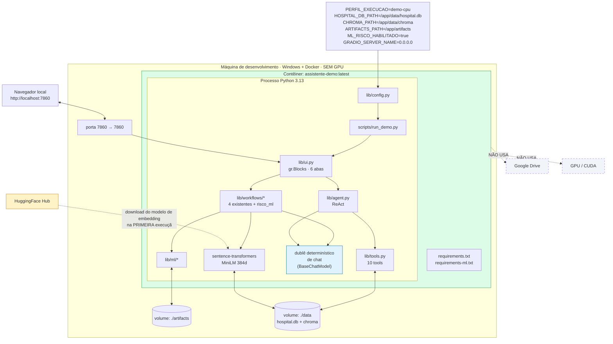
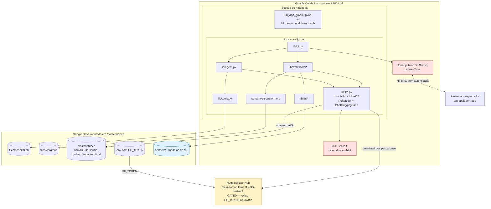
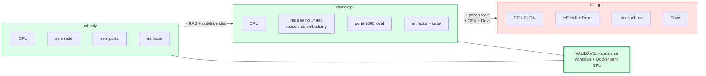

# Diagramas de Deployment

**Agente responsável:** `ArchitectureAgent`
**Status:** Projeto. **Nenhuma imagem foi construída e nenhum contêiner foi executado.** A
ADR-005 está registrada como *"Aceita — pendente de validação por execução real do build"*, e
nenhum documento pode afirmar que o Docker funciona antes de o log de `docker build` e
`docker run` estar anexado em `docs/deploy/EXECUCAO_DOCKER.md`.

---

## 1. O problema que os perfis resolvem

Hoje o sistema só existe dentro de uma sessão Colab com o Drive montado. Três acoplamentos
independentes impedem a execução local, e cada um bastaria sozinho:

| Acoplamento | Evidência no código |
|---|---|
| Caminhos absolutos do Drive | `db.DEFAULT_DB_PATH`; default de `DRIVE_BASE` em `llm.py:56` |
| Quantização 4-bit exigindo CUDA | `BitsAndBytesConfig(load_in_4bit=True)` em `llm.py:56-61` |
| Ausência de ponto de entrada | a aplicação só nasce dentro de uma célula de notebook |

Uma imagem única com PyTorch CUDA, `bitsandbytes` e os pesos do Llama 3B passa de 8 GB e não pode
ser **executada** na máquina de desenvolvimento (Windows 10.0.26200 + Docker 29.3.1, sem GPU
confirmada). Declarar Docker funcional sem rodá-lo seria inventar evidência.

A saída é separar o que precisa de GPU do que não precisa. A camada de ML — o núcleo da nova
fase — é inteiramente CPU.

---

## 2. Os três perfis

Selecionados pela variável `PERFIL_EXECUCAO`, resolvida por `lib/config.py`.

| Perfil | LLM | RAG | ML | Requisitos instalados | Docker CPU? | Uso |
|---|---|---|---|---|---|---|
| `ml-only` | desabilitado | desabilitado | **sim** | base + ml | **sim** | treino, avaliação, testes, CI |
| `demo-cpu` | dublê determinístico | Chroma local reindexado | **sim** | base + ml | **sim** | demonstração ponta a ponta, e2e, **build validável** |
| `full-gpu` | Llama 3.2 3B + LoRA | Chroma completo | **sim** | base + ml + llm | **não** | Colab, demonstração com LLM real |

### Por que três arquivos de requisitos

| Arquivo | Conteúdo | Ordem de grandeza |
|---|---|---|
| `requirements.txt` | pandas, pydantic, langchain-core, langgraph, gradio | dezenas de MB |
| `requirements-ml.txt` | scikit-learn, numpy, pyarrow, joblib, shap (opcional) | centenas de MB |
| `requirements-llm.txt` | torch, transformers, peft, bitsandbytes, accelerate, sentence-transformers | vários GB |

A imagem `demo-cpu` instala os dois primeiros. Essa é a diferença entre um build que pode ser
validado e um que não pode.

---

## 3. Perfil `ml-only`

| Aspecto | Valor |
|---|---|
| Portas expostas | **nenhuma** — não é serviço |
| Volumes | `./artifacts` (leitura e escrita); `./tests` em desenvolvimento |
| Dependências externas | **nenhuma**. Sem rede, sem Drive, sem GPU |
| Artefatos produzidos | Parquet, manifesto, `.joblib`, `model_card.json`, métricas |
| Artefatos consumidos | os mesmos, em execuções subsequentes |
| Comando típico | `docker run --rm -v ${PWD}/artifacts:/app/artifacts assistente-ml python scripts/train.py` |

**É o perfil de menor superfície e o único adequado a CI.** Não toca em dado clínico digitado,
não abre porta, não fala com a rede.

---

## 4. Perfil `demo-cpu`

| Aspecto | Valor |
|---|---|
| Portas | `7860` (Gradio). `GRADIO_SERVER_NAME=0.0.0.0` é necessário para o contêiner aceitar conexão do host |
| Volumes | `./artifacts` (modelos e métricas); `./data` (`hospital.db` regenerado + índice Chroma) |
| Dependências externas | **uma**: download do modelo de embedding na primeira execução. Depois disso, opera offline se o cache estiver no volume |
| `share=True`? | **não** — acesso por `localhost`, sem túnel público |
| Artefatos que precisam existir antes | `hospital.db` (via `mock_data`) e o índice Chroma (via reindexação local) |

### O que muda em relação ao `full-gpu`

| | `full-gpu` | `demo-cpu` |
|---|---|---|
| Objeto `chat_model` | `ChatHuggingFace(Llama 3.2 3B + LoRA)` | dublê determinístico |
| Qualidade do texto | real | fixa, por padrão de prompt |
| Números da predição | **idênticos** | **idênticos** |
| Regras, ML, explicabilidade, auditoria | **idênticos** | **idênticos** |

A única diferença é a redação. A injeção de dependência já existente torna a troca trivial:
`build_*_workflow(chat_model, conn, retriever)` aceita qualquer `chat_model`.

### Declaração obrigatória

O dublê **não substitui o LLM na demonstração final**. Ele existe para que o pipeline seja
testável e o Docker verificável. Isso precisa estar dito com todas as letras no `GUIA_DEMO.md` e
no roteiro de vídeo (ADR-005, consequência negativa).

### Dependência de rede na primeira execução

`sentence-transformers` baixa `paraphrase-multilingual-MiniLM-L12-v2` do HuggingFace Hub na
primeira reindexação. É modelo aberto, sem token. Para um build completamente offline seria
preciso pré-baixá-lo para o volume ou embuti-lo na imagem — decisão a tomar quando o build for
executado de fato.

---

## 5. Perfil `full-gpu`

| Aspecto | Valor |
|---|---|
| Portas | gerenciadas pelo Colab; o túnel do Gradio expõe uma URL pública |
| Volumes | `/content/drive/MyDrive/AssistenteHospitalar` montado |
| Dependências externas | HuggingFace Hub (modelo **gated**, exige `HF_TOKEN` com aprovação da Meta); Google Drive; GPU CUDA |
| Docker? | **não**. Este perfil não é containerizado. |
| Variáveis | `PERFIL_EXECUCAO=full-gpu`, `HF_TOKEN`, `DRIVE_BASE`, `HOSPITAL_DB_PATH` |

### Pontos de fragilidade declarados

| Ponto | Consequência |
|---|---|
| Modelo base é *gated* | Sem aprovação da Meta para a conta, o carregamento falha e não há caminho alternativo |
| Adapter vive só no Drive | `.gitignore` exclui `**/adapter_final/` e `*.safetensors`; perdido o Drive, perde-se o fine-tuning |
| `_latest_adapter_dir` escolhe por ordem lexicográfica | O "mais recente" é o último alfabeticamente; funciona porque o nome tem timestamp, mas é acoplamento a convenção de nomenclatura |
| Falha de carga não levanta exceção | `load_finetuned` **imprime** o aviso e devolve o modelo base. A degradação é silenciosa — contraexemplo do Princípio 5 |
| `share=True` | Publica a aplicação, sem autenticação, para qualquer pessoa com o link, por cerca de 72 horas |

---

## 6. Comparação lado a lado

| Dimensão | `ml-only` | `demo-cpu` | `full-gpu` |
|---|---|---|---|
| Containerizado | sim | sim | não |
| GPU | não | não | **sim** |
| Validável em Windows + Docker sem GPU | **sim** | **sim** | não |
| Rede na execução | nenhuma | primeiro uso | HF Hub + Drive |
| Porta exposta | nenhuma | 7860 | túnel |
| Pipeline de ML completo | sim | sim | sim |
| Texto do LLM real | — | não | sim |
| Adequado a CI | **sim** | sim | não |
| Superfície de exposição | mínima | baixa | **alta** (túnel público) |

**Os dois primeiros perfis são validáveis localmente.** É isso que transforma "Dockerfile
funcional" de afirmação em evidência — desde que o log seja anexado.

---

## 7. Onde cada artefato vive

| Artefato | `ml-only` | `demo-cpu` | `full-gpu` |
|---|---|---|---|
| `hospital.db` | não usado | volume `./data` | Drive |
| Índice Chroma | não usado | volume `./data` | Drive |
| Parquet do dataset | volume `./artifacts` | volume `./artifacts` | Drive |
| Manifesto do dataset | **git** | **git** | **git** |
| `.joblib` dos modelos | volume `./artifacts` | volume `./artifacts` | Drive |
| `model_card.json` | **git** + volume | **git** + volume | **git** + Drive |
| Métricas | **git** + volume | **git** + volume | **git** + Drive |
| Adapter LoRA | não usado | **não usado** | Drive |
| Pesos do Llama base | não usado | **não usado** | cache do HF Hub |
| `predicoes_ml` | dentro do `hospital.db`, se houver | volume `./data` | Drive |

O único artefato **sempre versionado no git** é o metadado probatório: manifesto, model card e
métricas. Binários regeneráveis, nunca (ADR-011).

---

## 8. Variáveis de ambiente por perfil

| Variável | `ml-only` | `demo-cpu` | `full-gpu` |
|---|---|---|---|
| `PERFIL_EXECUCAO` | `ml-only` | `demo-cpu` | `full-gpu` |
| `ARTIFACTS_PATH` | `/app/artifacts` | `/app/artifacts` | `$DRIVE_BASE/artifacts` |
| `HOSPITAL_DB_PATH` | — | `/app/data/hospital.db` | default Colab |
| `CHROMA_PATH` | — | `/app/data/chroma` | `$DRIVE_BASE/files/chroma` |
| `DRIVE_BASE` | — | — | `/content/drive/MyDrive/AssistenteHospitalar` |
| `HF_TOKEN` | — | — | **obrigatória** |
| `ML_RISCO_HABILITADO` | — | `true` | `true` ou `false` |
| `RANDOM_SEED` | `42` | `42` | `42` |
| `LOG_LEVEL` | `INFO` | `INFO` | `INFO` |
| `GRADIO_SERVER_NAME` | — | `0.0.0.0` | — |

`HF_TOKEN` **nunca** é escrito em `docker-compose.yml`, em `Dockerfile` ou em arquivo versionado.
Passa por `--env-file` ou por `-e` na linha de comando. O `.gitignore` já exclui `.env` e
`.env.*`, preservando `.env.example`.

---

## 9. Estrutura projetada do `docker-compose.yml`

Descrição, não arquivo pronto:

| Serviço | Perfil | Imagem | Portas | Volumes | Comando |
|---|---|---|---|---|---|
| `treino` | `ml-only` | `assistente-ml` | — | `./artifacts` | `python scripts/train.py` |
| `avaliacao` | `ml-only` | `assistente-ml` | — | `./artifacts` | `python scripts/evaluate.py` |
| `testes` | `ml-only` | `assistente-ml` | — | `./artifacts`, `./tests` | `pytest -q` |
| `demo` | `demo-cpu` | `assistente-demo` | `7860:7860` | `./artifacts`, `./data` | `python scripts/run_demo.py` |

Dois estágios de build compartilhando a camada base, para que `requirements.txt` e
`requirements-ml.txt` sejam instalados uma vez só.

---

## 10. O que precisa ser provado antes de qualquer afirmação

Sequência de validação a executar, com log anexado em `docs/deploy/EXECUCAO_DOCKER.md`:

| # | Verificação | Evidência esperada |
|---|---|---|
| 1 | `docker build` do estágio `ml-only` | log completo + tamanho final da imagem |
| 2 | `docker run` executando `scripts/train.py` | artefatos criados em `./artifacts` |
| 3 | `docker run` executando `pytest` | suíte verde dentro do contêiner |
| 4 | `docker build` do estágio `demo-cpu` | log + tamanho |
| 5 | `docker run -p 7860:7860` e acesso a `localhost:7860` | captura de tela da UI respondendo |
| 6 | Predição ponta a ponta no perfil `demo-cpu` | linha correspondente em `predicoes_ml` |

Até que os seis passos tenham log anexado, todo texto sobre Docker neste conjunto de documentos
descreve **projeto**, não resultado. Esta seção existe para que a distinção não se perca.
