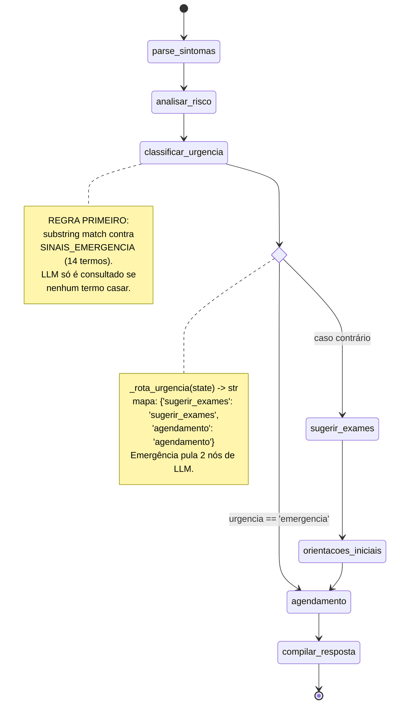
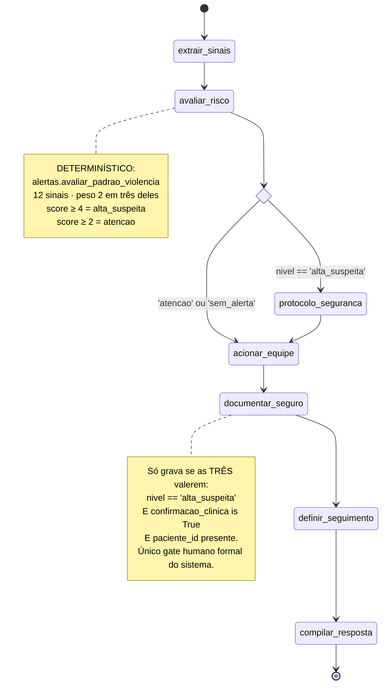
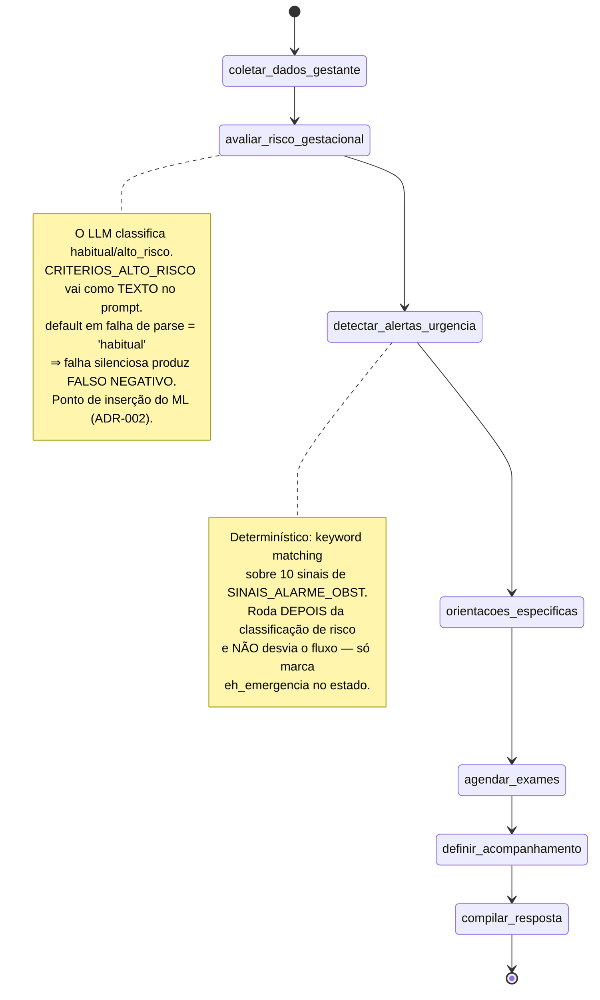
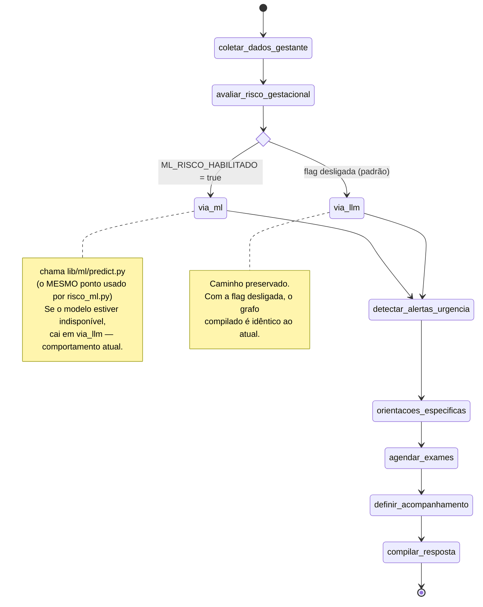
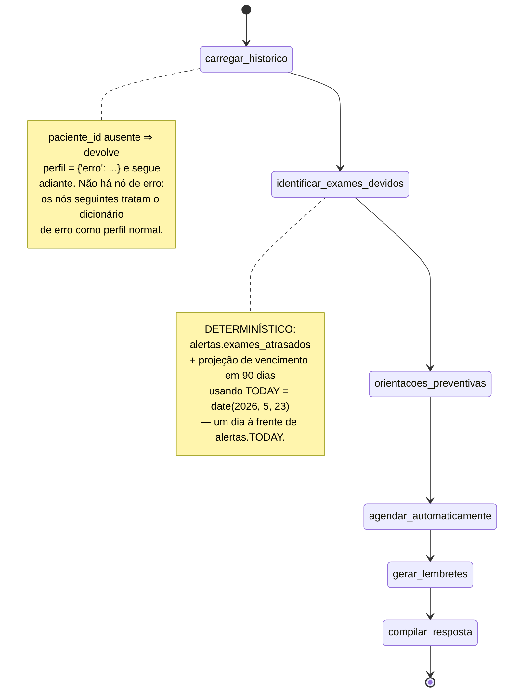
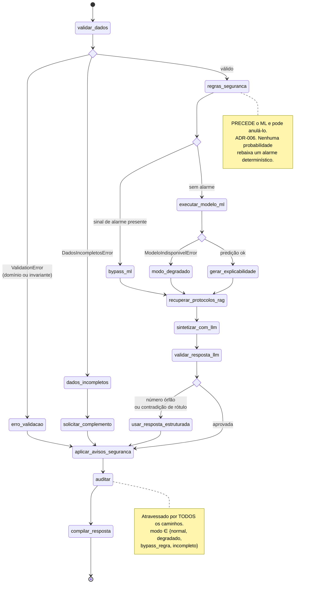

# Diagramas LangGraph

**Agente responsável:** `ArchitectureAgent`
**Fonte dos quatro primeiros grafos:** as funções `build_*_workflow` de `lib/workflows/`, lidas
diretamente. **Os docstrings dos módulos não foram usados** — dois deles desenham topologias que
não existem.
**Fonte do quinto grafo:** `ARQUITETURA_ALVO.md` §4. Ele **não existe** ainda.

---

## Observação técnica comum aos cinco

Os quatro workflows existentes usam `TypedDict` com `total=False` e **sem redutores**
(`Annotated[..., operator.add]`). Consequência prática: o dicionário devolvido por um nó
**substitui** as chaves correspondentes no estado, em vez de acumulá-las. É por isso que todos os
nós escrevem manualmente:

```python
'raciocinio': state.get('raciocinio', []) + ['nova linha']
```

Se alguém acrescentar um nó que devolva `{'raciocinio': ['x']}` sem concatenar, o trace anterior
é perdido silenciosamente. O workflow novo mantém a mesma convenção, por consistência.

Nenhum dos quatro tem `checkpointer`, `interrupt`, retry ou timeout.

---

## 1. Triagem Ginecológica — `lib/workflows/triagem.py`

**7 nós · 1 aresta condicional · função de rota `_rota_urgencia`**



### Nós

| Nó | Função | Natureza | Escreve no estado |
|---|---|---|---|
| `parse_sintomas` | `_parse_sintomas(chat_model)` | LLM (`llm_json`) | `sintomas_extraidos`, `raciocinio` |
| `analisar_risco` | `_analisar_risco(chat_model, retriever)` | RAG + LLM | `diferenciais`, `fontes`, `raciocinio` |
| `classificar_urgencia` | `_classificar_urgencia(chat_model)` | **Regra → LLM** | `urgencia`, `sinais_alarme`, `justificativa_urgencia`, `raciocinio` |
| `sugerir_exames` | `_sugerir_exames(chat_model, retriever)` | RAG + LLM | `exames_sugeridos`, `fontes`, `raciocinio` |
| `orientacoes_iniciais` | `_orientacoes_iniciais(chat_model)` | LLM (`llm_text`) | `orientacoes_iniciais`, `raciocinio` |
| `agendamento` | `_agendamento` | determinístico | `agendamento`, `raciocinio` |
| `compilar_resposta` | `_compilar_resposta` | determinístico | `confianca`, `resposta_estruturada` |

### Arestas

```
START                → parse_sintomas
parse_sintomas       → analisar_risco
analisar_risco       → classificar_urgencia
classificar_urgencia → [condicional via _rota_urgencia] → {sugerir_exames | agendamento}
sugerir_exames       → orientacoes_iniciais
orientacoes_iniciais → agendamento
agendamento          → compilar_resposta
compilar_resposta    → END
```

### Estado tipado — `TriagemState(TypedDict, total=False)`

| Grupo | Campos |
|---|---|
| Entrada | `queixa: str`, `paciente_id: int \| None` |
| Intermediário | `sintomas_extraidos: list[str]`, `diferenciais: list[str]`, `sinais_alarme: list[str]`, `urgencia: str`, `justificativa_urgencia: str`, `exames_sugeridos: list[str]`, `orientacoes_iniciais: str`, `agendamento: dict` |
| Explicabilidade | `raciocinio: list[str]`, `fontes: list[dict]`, `confianca: str` |
| Saída | `resposta_estruturada: dict` |

`urgencia` assume `'emergencia' | 'urgente' | 'agendado' | 'rotina'`; `agendamento` é
`{especialidade, prazo}`.

### Por que este grafo importa para a evolução

`_classificar_urgencia` é a implementação original do Princípio 2 no projeto: regra determinística
primeiro, LLM como complemento. O workflow novo generaliza exatamente esse padrão, com a
diferença de que a regra passa a ter nó próprio e aresta condicional, em vez de ser um `if` dentro
do nó.

---

## 2. Detecção de Violência — `lib/workflows/violencia.py`

**7 nós · 1 aresta condicional · função de rota `_rota_nivel`**



### Nós

| Nó | Função | Natureza | Escreve no estado |
|---|---|---|---|
| `extrair_sinais` | `_extrair_sinais(chat_model)` | LLM, com filtro contra chaves válidas | `sinais_identificados`, `raciocinio` |
| `avaliar_risco` | `_avaliar_risco` | **determinístico** | `score`, `nivel`, `conduta_sugerida`, `encaminhamentos`, `raciocinio` |
| `protocolo_seguranca` | `_protocolo_seguranca` | determinístico | `protocolo_seguranca_ativado`, `raciocinio` |
| `acionar_equipe` | `_acionar_equipe` | determinístico | `equipe_acionada`, `raciocinio` |
| `documentar_seguro` | `lambda s: _documentar_seguro(s, conn)` | determinístico + escrita no banco | `notificacao_sinan`, `registro_id`, `raciocinio` |
| `definir_seguimento` | `_definir_seguimento` | determinístico | `seguimento`, `raciocinio` |
| `compilar_resposta` | `_compilar_resposta` | determinístico | `confianca`, `resposta_estruturada` |

### Arestas

```
START               → extrair_sinais
extrair_sinais      → avaliar_risco
avaliar_risco       → [condicional via _rota_nivel] → {protocolo_seguranca | acionar_equipe}
protocolo_seguranca → acionar_equipe        (reconvergência)
acionar_equipe      → documentar_seguro
documentar_seguro   → definir_seguimento
definir_seguimento  → compilar_resposta
compilar_resposta   → END
```

### Estado tipado — `ViolenciaState(TypedDict, total=False)`

| Grupo | Campos |
|---|---|
| Entrada | `descricao_caso: str`, `paciente_id: int \| None`, `profissional: str`, `confirmacao_clinica: bool` |
| Intermediário | `sinais_identificados: list[str]`, `score: int`, `nivel: str`, `conduta_sugerida: str`, `encaminhamentos: list[str]`, `protocolo_seguranca_ativado: bool`, `equipe_acionada: list[str]`, `notificacao_sinan: bool`, `registro_id: int \| None`, `seguimento: dict` |
| Explicabilidade | `raciocinio: list[str]`, `fontes: list[dict]`, `confianca: str` |
| Saída | `resposta_estruturada: dict` |

`fontes` está declarado mas **nunca é preenchido**: este fluxo é guiado por matriz, não por RAG.
`_compilar_resposta` chama `estimar_confianca(n_fontes=0, ...)` explicitamente.

### Defeito confirmado no código

`_protocolo_seguranca` monta uma lista local `medidas` com seis itens e **não a devolve** no
dicionário de retorno. As medidas nunca chegam ao estado nem à UI. Registrado; não corrigido
nesta fase (o módulo está classificado como intocado — ADR-001).

### Decisão ética registrada

Este é o workflow que **não** receberá ML. Transformar detecção de violência doméstica em escore
probabilístico de caixa-preta, treinado em dados sintéticos, é irresponsável. A matriz de
`alertas.py` é auditável e permanece determinística (**ADR-002**).

---

## 3. Obstétrico — `lib/workflows/obstetrico.py`

**7 nós · ZERO arestas condicionais · grafo estritamente LINEAR**

> O docstring em `obstetrico.py:3-26` desenha um losango `emergência?` e um nó `alerta_emerg`.
> **Nenhum dos dois existe.** `build_obstetrico_workflow` usa apenas `add_edge`, e não há função
> chamada `alerta_emerg` no módulo. O diagrama abaixo vem da função de construção.



### Nós

| Nó | Função | Natureza | Escreve no estado |
|---|---|---|---|
| `coletar_dados_gestante` | `_coletar_dados_gestante(chat_model)` | LLM | `dados_gestante`, `ig_semanas`, `raciocinio` |
| `avaliar_risco_gestacional` | `_avaliar_risco_gestacional(chat_model)` | **LLM** | `classificacao_risco`, `fatores_risco_identificados`, `raciocinio` |
| `detectar_alertas_urgencia` | `_detectar_alertas_urgencia` | determinístico | `alertas_urgencia`, `eh_emergencia`, `raciocinio` |
| `orientacoes_especificas` | `_orientacoes_especificas(chat_model, retriever)` | RAG + LLM | `orientacoes_especificas`, `fontes`, `raciocinio` |
| `agendar_exames` | `_agendar_exames` | determinístico | `exames_agendados`, `raciocinio` |
| `definir_acompanhamento` | `_definir_acompanhamento` | determinístico | `acompanhamento`, `raciocinio` |
| `compilar_resposta` | `_compilar_resposta` | determinístico | `confianca`, `resposta_estruturada` |

### Arestas — todas incondicionais

```
START                     → coletar_dados_gestante
coletar_dados_gestante    → avaliar_risco_gestacional
avaliar_risco_gestacional → detectar_alertas_urgencia
detectar_alertas_urgencia → orientacoes_especificas
orientacoes_especificas   → agendar_exames
agendar_exames            → definir_acompanhamento
definir_acompanhamento    → compilar_resposta
compilar_resposta         → END
```

### Estado tipado — `ObstetricoState(TypedDict, total=False)`

| Grupo | Campos |
|---|---|
| Entrada | `descricao_caso: str`, `paciente_id: int \| None`, `ig_semanas: int \| None` |
| Intermediário | `dados_gestante: dict`, `classificacao_risco: str`, `fatores_risco_identificados: list[str]`, `alertas_urgencia: list[str]`, `eh_emergencia: bool`, `orientacoes_especificas: str`, `exames_agendados: list[dict]`, `acompanhamento: dict` |
| Explicabilidade | `raciocinio: list[str]`, `fontes: list[dict]`, `confianca: str` |
| Saída | `resposta_estruturada: dict` |

`classificacao_risco` assume `'habitual' | 'alto_risco'` — é o vocabulário que a ADR-003 preserva
na saída do modelo.

### Como a emergência é tratada hoje, já que não há desvio

`eh_emergencia` é uma flag lida por dois nós posteriores:

- `_orientacoes_especificas` prefixa o prompt com `'🚨 EMERGÊNCIA OBSTÉTRICA detectada. '`;
- `_definir_acompanhamento` força `proxima_consulta_em_dias = 0` e periodicidade
  `'Encaminhar IMEDIATAMENTE para pronto-socorro obstétrico'`.

Funciona, mas a decisão fica distribuída em dois nós em vez de explícita na topologia. É o que a
ADR-006 corrige no workflow novo.

### Extensão planejada — nó de ML sob flag (ADR-012)



**Compromisso de regressão:** com `ML_RISCO_HABILITADO` desligada, o comportamento deve ser
exatamente o atual. Testado nos dois estados da flag.

---

## 4. Prevenção e Rastreamento — `lib/workflows/prevencao.py`

**6 nós · ZERO arestas condicionais · grafo LINEAR**



### Nós

| Nó | Função | Natureza | Escreve no estado |
|---|---|---|---|
| `carregar_historico` | `lambda s: _carregar_historico(s, conn)` | leitura via tools | `perfil`, `exames_historicos`, `raciocinio` |
| `identificar_exames_devidos` | `lambda s: _identificar_exames_devidos(s, conn)` | **determinístico** | `exames_atrasados`, `exames_devidos`, `raciocinio` |
| `orientacoes_preventivas` | `_orientacoes_preventivas(chat_model, retriever)` | RAG + LLM | `orientacoes_preventivas`, `fontes`, `raciocinio` |
| `agendar_automaticamente` | `_agendar_automaticamente` | determinístico | `agendamentos_propostos`, `raciocinio` |
| `gerar_lembretes` | `_gerar_lembretes(chat_model)` | LLM com fallback determinístico | `lembretes`, `raciocinio` |
| `compilar_resposta` | `_compilar_resposta` | determinístico | `confianca`, `resposta_estruturada` |

### Arestas — todas incondicionais

```
START                      → carregar_historico
carregar_historico         → identificar_exames_devidos
identificar_exames_devidos → orientacoes_preventivas
orientacoes_preventivas    → agendar_automaticamente
agendar_automaticamente    → gerar_lembretes
gerar_lembretes            → compilar_resposta
compilar_resposta          → END
```

### Estado tipado — `PrevencaoState(TypedDict, total=False)`

| Grupo | Campos |
|---|---|
| Entrada | `paciente_id: int` |
| Intermediário | `perfil: dict`, `exames_historicos: list[dict]`, `exames_atrasados: list[dict]`, `exames_devidos: list[dict]`, `orientacoes_preventivas: str`, `agendamentos_propostos: list[dict]`, `lembretes: list[dict]` |
| Explicabilidade | `raciocinio: list[str]`, `fontes: list[dict]`, `confianca: str` |
| Saída | `resposta_estruturada: dict` |

### Duas correções ao que a documentação anterior afirmava

1. **Não há aresta condicional.** `build_prevencao_workflow` usa exclusivamente `add_edge`. O
   inventário registrava "sim" na coluna de aresta condicional; está incorreto.
2. **`TODAY = date(2026, 5, 23)`** neste módulo, contra `date(2026, 5, 22)` em `alertas.py`,
   `mock_data.py` e `tools.py`. Divergência de um dia entre as datas congeladas.

### Bom padrão a replicar

`_gerar_lembretes` tem **fallback determinístico explícito**: se o LLM devolver menos lembretes
do que há agendamentos, o nó completa a lista com mensagens montadas por template. É a única
degradação graciosa presente no código atual — e ela é declarada no `raciocinio`.

---

## 5. Risco Gestacional por ML — `lib/workflows/risco_ml.py`  **(NOVO)**

**16 nós · 4 arestas condicionais · 4 caminhos de exceção**
Derivado de `ARQUITETURA_ALVO.md` §4. **Não existe ainda.**



### Nós

| # | Nó | Natureza | Caminho |
|---|---|---|---|
| 1 | `validar_dados` | Pydantic | sempre |
| 2 | `erro_validacao` | determinístico | exceção |
| 3 | `dados_incompletos` | determinístico | exceção |
| 4 | `solicitar_complemento` | determinístico (HIL) | exceção |
| 5 | `regras_seguranca` | **determinístico** | feliz |
| 6 | `bypass_ml` | determinístico | exceção |
| 7 | `executar_modelo_ml` | ML | feliz |
| 8 | `modo_degradado` | determinístico | exceção |
| 9 | `gerar_explicabilidade` | SHAP / fallback | feliz |
| 10 | `recuperar_protocolos_rag` | RAG | convergência |
| 11 | `sintetizar_com_llm` | LLM | convergência |
| 12 | `validar_resposta_llm` | determinístico (regex) | convergência |
| 13 | `usar_resposta_estruturada` | determinístico | exceção |
| 14 | `aplicar_avisos_seguranca` | determinístico | **sempre** |
| 15 | `auditar` | escrita no banco | **sempre** |
| 16 | `compilar_resposta` | determinístico | **sempre** |

### Funções de roteamento projetadas

| Função | Origem | Destinos | Critério |
|---|---|---|---|
| `_rota_validacao(state)` | `validar_dados` | `erro_validacao` · `dados_incompletos` · `regras_seguranca` | tipo da exceção capturada, ou sucesso |
| `_rota_regras(state)` | `regras_seguranca` | `bypass_ml` · `executar_modelo_ml` | `len(state['regras_disparadas']) > 0` |
| `_rota_modelo(state)` | `executar_modelo_ml` | `modo_degradado` · `gerar_explicabilidade` | `state['resultado_predicao'] is None` |
| `_rota_validacao_llm(state)` | `validar_resposta_llm` | `usar_resposta_estruturada` · `aplicar_avisos_seguranca` | `not state['verificacao'].aprovada` |

### Estado tipado projetado — `RiscoMLState(TypedDict, total=False)`

| Grupo | Campos |
|---|---|
| Entrada | `dados_clinicos: dict`, `paciente_id: int \| None`, `usuario: str`, `descricao_clinica: str \| None` |
| Validação | `features: GestanteFeatures \| None`, `campos_faltantes: list[str]`, `erros_validacao: list[dict]` |
| Regras | `regras_disparadas: list[str]` |
| ML | `resultado_predicao: ResultadoPredicao \| None`, `dados_imputados: list[str]` |
| Explicabilidade | `resultado_explicacao: ResultadoExplicacao \| None` |
| RAG | `fontes: list[dict]` |
| LLM | `payload_llm: dict`, `texto_llm: str`, `verificacao: ResultadoVerificacao` |
| Controle | `modo: str`, `correlation_id: str` |
| Trace | `raciocinio: list[str]` |
| Auditoria | `auditoria_id: int \| None` |
| Saída | `resposta_estruturada: dict` |

`modo` assume `'normal' | 'degradado' | 'bypass_regra' | 'incompleto'` — o mesmo domínio da coluna
`predicoes_ml.modo`, e o valor é definido pelo nó que ativou o caminho.

### Convergência obrigatória

Três nós são atravessados por **todos** os caminhos, sem exceção:

```
... → aplicar_avisos_seguranca → auditar → compilar_resposta → END
```

Isso é o que faz valer, simultaneamente, o Princípio 4 (toda saída auditável) e o Princípio 9
(avisos clínicos obrigatórios). Um caminho que alcance `compilar_resposta` sem passar por
`auditar` é violação estrutural, detectável por inspeção do grafo compilado.

---

## Comparativo dos cinco grafos

| | triagem | violencia | obstetrico | prevencao | **risco_ml** |
|---|---|---|---|---|---|
| Nós | 7 | 7 | 7 | 6 | **16** |
| Arestas condicionais | 1 | 1 | **0** | **0** | **4** |
| Funções de rota | `_rota_urgencia` | `_rota_nivel` | — | — | 4 |
| Caminhos de exceção | 0 | 0 | 0 | 0 | **4** |
| Decisões por LLM | 4 | 1 | 3 | 2 | 1 (só redação) |
| Nós determinísticos | 3 | 6 | 4 | 4 | 11 |
| Escreve auditoria | não | condicional | não | não | **sempre** |
| Valida entrada | não | não | não | não | **sim** |
| Valida saída | não | não | não | não | **sim** |
| Docstring bate com o código | sim | sim | **não** | — | n/a |

A coluna `risco_ml` é o alvo; as quatro primeiras são o ponto de partida. A diferença entre "0
caminhos de exceção" e "4" é a distância entre um protótipo que funciona no caminho feliz e um
sistema que declara as próprias falhas.
