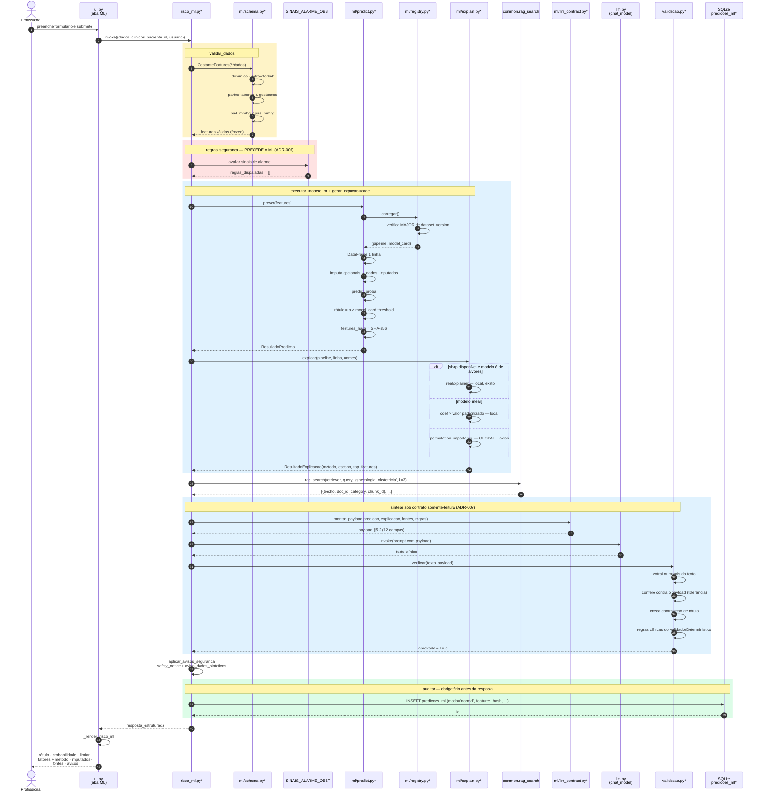
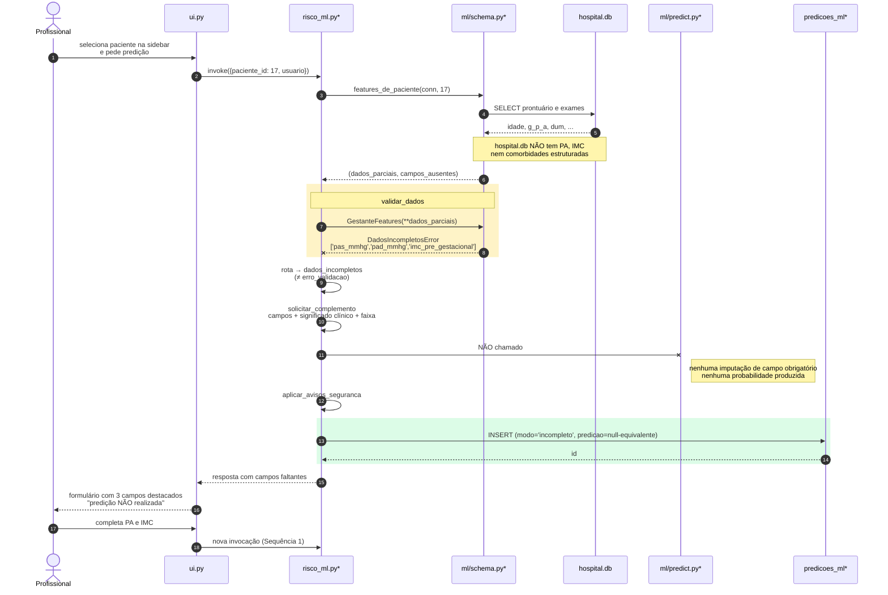
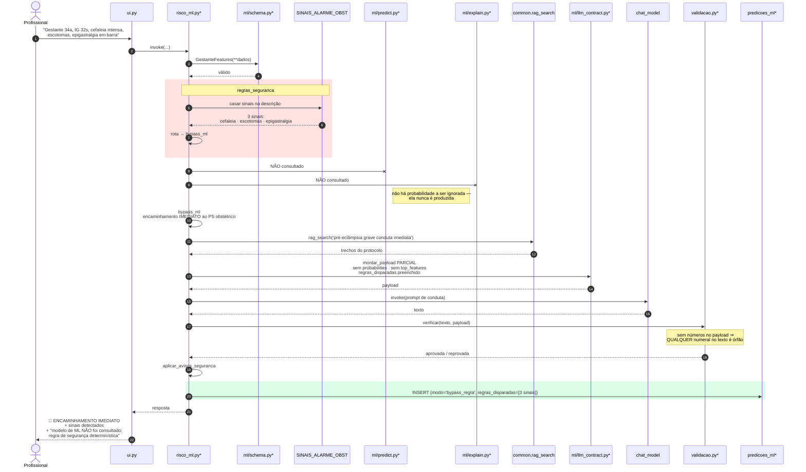
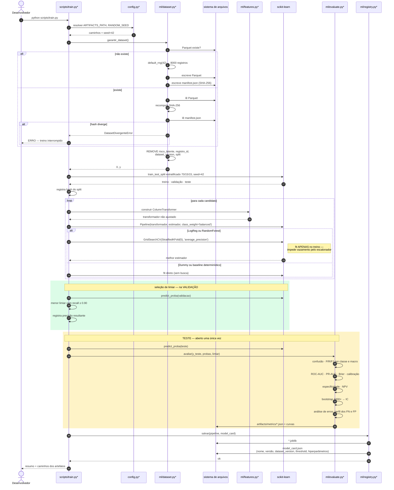

# Diagramas de Sequência

**Agente responsável:** `ArchitectureAgent`
**Status:** As sequências 1 a 4 descrevem comportamento **projetado**. A sequência 5 descreve o
fluxo **existente**, derivado de `lib/ui.py`, `lib/agent.py` e `lib/tools.py`.
**Convenção:** participantes com sufixo `*` são componentes novos.

---

## Índice

| # | Sequência | Status |
|---|---|---|
| 1 | Predição completa de risco gestacional, ponta a ponta | projetado |
| 2 | Dados incompletos → human-in-the-loop | projetado |
| 3 | Emergência obstétrica com bypass do ML | projetado |
| 4 | Treinamento de modelo | projetado |
| 5 | Consulta livre com agente ReAct e tool calling | **existente** |

---

## 1. Predição completa de risco gestacional, ponta a ponta



### Três ordens que não podem ser trocadas

| Ordem | Consequência de inverter |
|---|---|
| `regras_seguranca` **antes** de `executar_modelo_ml` | Uma probabilidade baixa poderia rebaixar um sinal de emergência (ADR-006) |
| Verificação **depois** da geração | Prompt não é controle; sem verificação posterior não há garantia |
| `auditar` **antes** de responder | Falha de renderização apagaria o rastro da decisão |

---

## 2. Dados incompletos → human-in-the-loop



### Por que o registro de auditoria acontece mesmo sem predição

Porque "houve uma tentativa e ela foi recusada" é informação de auditoria. Sem esse registro, a
taxa de dados incompletos — que é uma métrica de qualidade do processo assistencial, não do
modelo — seria invisível.

### Nota sobre human-in-the-loop sem estado

O ciclo de volta é feito pela UI: o workflow **termina**, o profissional completa, e uma nova
invocação começa. Não há `interrupt` nem `checkpointer` do LangGraph — nenhum workflow atual tem,
e introduzir persistência de estado seria escopo maior do que o problema exige.

---

## 3. Emergência obstétrica com bypass do ML



### Observação sobre a verificação neste caminho

Como o payload parcial não contém `probabilities` nem `threshold`, a regra 1 da verificação fica
mais restritiva por consequência natural: **qualquer** numeral no texto é órfão. Isso é desejável
— num encaminhamento de emergência, o LLM não tem número legítimo a citar além do que vier
textualmente do protocolo recuperado. Se a prática mostrar rejeições espúrias por causa de
números presentes no trecho do protocolo (doses, prazos), a tolerância precisará considerar
também os numerais de `retrieved_sources`. Registrado como ponto a validar em
`docs/llm/POLITICA_ANTI_ALUCINACAO.md`.

### Contraste com o obstétrico existente

Em `obstetrico.py`, `_detectar_alertas_urgencia` roda **depois** de `_avaliar_risco_gestacional` e
não desvia o fluxo — apenas marca `eh_emergencia`, lida adiante por dois nós. Aqui, a regra vem
antes e **desvia**.

---

## 4. Treinamento de modelo



### Duas guardas que o diagrama torna explícitas

1. **`DatasetDivergenteError` interrompe o treino.** Não é aviso. Treinar sobre um dataset que
   não corresponde ao manifesto produziria métricas não reproduzíveis — exatamente o que a
   ADR-011 existe para impedir.
2. **O bloco do teste aparece uma única vez, no fim.** Se em alguma iteração futura aparecer uma
   seta de `teste` de volta para `seleção de limiar` ou para `GridSearchCV`, há vazamento.

---

## 5. Consulta livre com agente ReAct e tool calling  **(fluxo existente)**

Derivado de `lib/ui.py::on_chat`, `lib/agent.py::run_consulta` e `lib/tools.py`.

```mermaid
sequenceDiagram
    autonumber
    actor P as Profissional
    participant UI as ui.py::on_chat
    participant AG as agent.py::run_consulta
    participant RE as create_react_agent<br/>(LangGraph)
    participant LM as ChatHuggingFace<br/>Llama 3.2 3B + LoRA
    participant TL as StructuredTool
    participant DB as hospital.db
    participant CH as Chroma
    participant LG as log_acesso

    P->>UI: "Paciente tem exames em atraso?<br/>Qual a conduta?"
    UI->>UI: mensagem vazia? não
    UI->>AG: run_consulta(agent, pergunta,<br/>paciente_id=7, historico)

    alt paciente_id informado
        AG->>AG: prefixa "[Contexto: paciente_id=7]"
    end
    AG->>AG: historico + HumanMessage
    AG->>RE: invoke({messages}, recursion_limit=12)

    RE->>LM: mensagens + SYSTEM_PROMPT + tools vinculadas
    LM-->>RE: tool_call: exames_atrasados(paciente_id=7)
    RE->>TL: exames_atrasados
    TL->>DB: SELECT data_nascimento / exames<br/>(SQL parametrizado)
    DB-->>TL: linhas
    TL->>TL: alertas.exames_atrasados<br/>(regra determinística)
    TL-->>RE: ToolMessage com a lista

    RE->>LM: mensagens + resultado da tool
    LM-->>RE: tool_call: buscar_protocolo(query='rastreamento ...')
    note right of TL: única tool SEM args_schema —<br/>assinatura inferida pelo LangChain
    RE->>TL: buscar_protocolo
    TL->>CH: retriever.invoke(query)
    CH-->>TL: Documents
    TL->>TL: filtra categoria em pós-processamento<br/>corta em k=4
    TL-->>RE: [{trecho, doc_id, category, chunk_id}]

    RE->>LM: mensagens + trechos do protocolo
    LM-->>RE: resposta final em texto
    RE-->>AG: estado com todas as mensagens

    AG->>AG: percorre mensagens casando<br/>tool_call.id ↔ ToolMessage.tool_call_id
    AG-->>UI: {resposta, tool_calls, mensagens}

    UI->>UI: anexa bloco &lt;details&gt;<br/>"🔧 Ferramentas usadas"
    UI->>UI: historico_estado['mensagens'] = mensagens
    UI-->>P: Chatbot renderiza

    opt se a tool fosse consultar_violencia
        TL->>TL: motivo tem ≥ 5 caracteres?
        TL->>LG: INSERT (usuario, tabela, paciente_id, motivo)
        note right of LG: usuario vem de _USUARIO_ATUAL —<br/>global de módulo, não de sessão
    end
```

### O que este diagrama revela sobre o desenho atual

| Observação | Implicação |
|---|---|
| Não há participante de tratamento de erro | Exceção em qualquer ponto sobe até o Gradio |
| `historico_estado` é escrito no fim | Duas sessões concorrentes sobrescrevem o histórico uma da outra |
| `_USUARIO_ATUAL` é global de módulo | Auditoria de LGPD pode registrar o profissional errado sob concorrência |
| `buscar_protocolo` sem `args_schema` | Ponto mais frágil do tool calling num modelo de 3B |
| Nenhuma escrita em auditoria, exceto violência | A consulta em si não deixa rastro |

Nenhum desses pontos será alterado (ADR-001). Estão documentados para que a decisão de não mexer
seja deliberada.

### Onde a evolução entra

Num único ponto: a lista de tools passa a ter 10 itens. Se o modelo escolher
`predizer_risco_gestacional`, a sequência ganha uma chamada a `ml/predict.py` e um `INSERT` em
`predicoes_ml`. Caso contrário, é idêntica à atual.

---

## Comparação das cinco sequências

| Dimensão | 1 Normal | 2 Incompleto | 3 Bypass | 4 Treino | 5 ReAct |
|---|---|---|---|---|---|
| Participantes | 12 | 6 | 11 | 7 | 8 |
| Chama o LLM | sim | **não** | sim | **não** | sim |
| Chama o modelo de ML | sim | **não** | **não** | treina | só se a tool for escolhida |
| Escreve auditoria | sim | sim | sim | não | só tools de violência |
| Requer GPU | só no perfil `full-gpu` | não | só no `full-gpu` | **não** | sim |
| Executável em CI | sim (`demo-cpu`) | sim | sim | **sim** | não |

A penúltima linha é a que sustenta a ADR-005: quatro das cinco sequências são verificáveis sem
GPU. É por isso que "Dockerfile testado" pode deixar de ser afirmação e virar evidência — desde
que o log de `docker build` e `docker run` seja anexado em `docs/deploy/EXECUCAO_DOCKER.md`.
