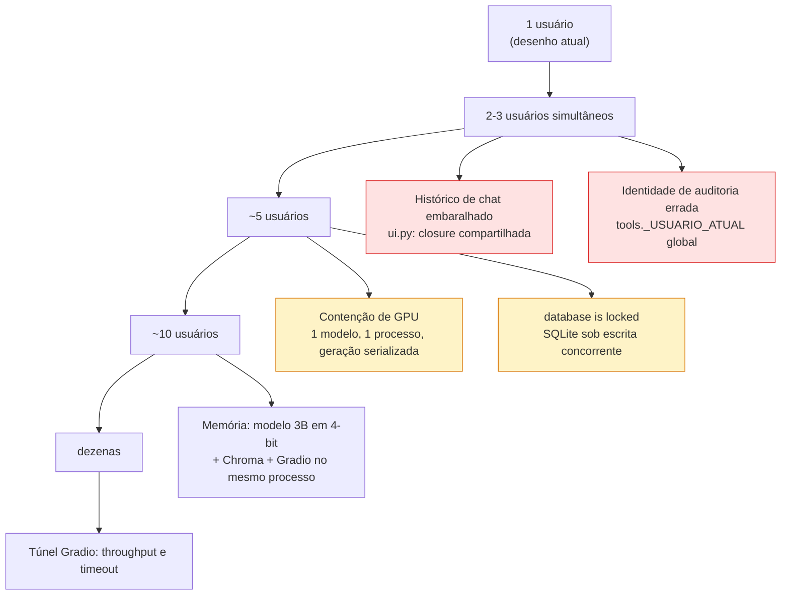
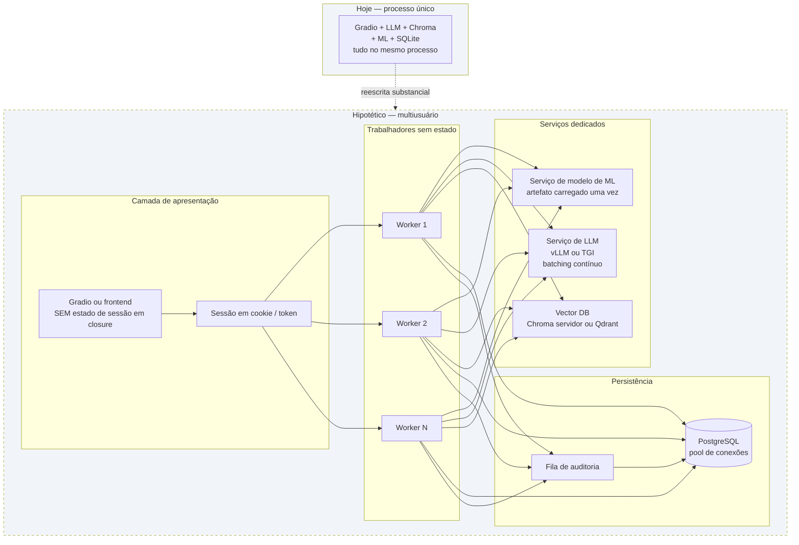

# Estratégia de Escalabilidade

**Agente responsável:** `ArchitectureAgent`
**Status:** Análise. A maior parte deste documento descreve **o que está fora de escopo** e por
quê.
**Posição de partida, sem rodeios:** o sistema atual é uma demonstração acadêmica de **usuário
único**, e a evolução planejada **não muda isso**. Este documento existe para dizer onde o
desenho quebra, não para prometer que ele escala.

---

## 1. Premissa de usuário único, embutida no código

Não é uma limitação implícita: é uma decisão registrada em comentário no fonte.

```
# check_same_thread=False permite uso cross-thread (Gradio cria threads por requisição).
# SQLite serializa writes internamente, então é seguro pra workload de demo (1 usuário).
```
— `lib/db.py:22-23`

Três pontos independentes assumem um único usuário simultâneo:

| # | Ponto | Local | Efeito com dois usuários |
|---|---|---|---|
| 1 | Conexão SQLite única, `check_same_thread=False` | `db.py:24` | Escritas serializadas; `database is locked` sob concorrência de escrita |
| 2 | `_USUARIO_ATUAL` como global de módulo | `tools.py:21` | O `log_acesso` pode registrar o profissional **errado** |
| 3 | `historico_estado` como dicionário de closure | `ui.py:313` | Duas sessões veem e sobrescrevem o histórico uma da outra |

O ponto 2 é o mais grave dos três, porque é justamente o mecanismo de auditoria de LGPD. Se dois
profissionais usam a aplicação ao mesmo tempo e um deles troca o identificador na sidebar, o
acesso do outro a `registros_violencia` pode ser atribuído a quem não o fez.

Some-se a isso o `app.launch(share=True)` do notebook 08, que publica um túnel **sem
autenticação**, e o resultado é um desenho em que a concorrência não é improvável — é apenas
não testada.

---

## 2. O que quebra primeiro, em ordem



### Detalhamento

| Ordem | Componente | Sintoma | Causa raiz |
|---|---|---|---|
| **1º** | Histórico de conversa | Usuário B vê mensagens de A | `historico_estado` é único por processo, não por sessão |
| **2º** | Auditoria de LGPD | `log_acesso.usuario` incorreto | `_USUARIO_ATUAL` é global mutável |
| **3º** | Inferência do LLM | Latência cresce linearmente | Um modelo, um processo, sem fila nem batching |
| **4º** | SQLite | `sqlite3.OperationalError: database is locked` | Escritas concorrentes numa conexão compartilhada |
| **5º** | Memória | OOM na GPU ou no host | Llama 3B em 4-bit + Chroma + Gradio + pipeline de ML coabitando |
| **6º** | Túnel público | Timeouts | Túnel do Gradio não é infraestrutura de produção |

**O gargalo real não é o banco nem o ML.** É o LLM: uma geração de 256 tokens num 3B custa
ordens de grandeza mais do que um `predict_proba` de Random Forest sobre uma linha, e não há
paralelismo. Os dois primeiros itens da lista são bugs de estado compartilhado, não problemas de
escala — aparecem com **dois** usuários, e nenhum volume os agrava ou alivia.

---

## 3. Efeito da camada de ML sobre a carga

Boa notícia, e pelo motivo certo: a camada nova é a mais barata do sistema.

| Operação | Custo dominante | Estado | Paralelizável |
|---|---|---|---|
| Validação Pydantic | microssegundos | sem estado | trivialmente |
| `predict_proba` sobre 1 linha | sub-milissegundo em CPU | modelo em memória, **somente leitura** | trivialmente |
| SHAP `TreeExplainer` sobre 1 linha | milissegundos | idem | trivialmente |
| Verificação anti-alucinação | microssegundos (regex) | sem estado | trivialmente |
| `INSERT` em `predicoes_ml` | 1 escrita | **compartilha a conexão** | não |
| Geração do LLM | **segundos** | modelo na GPU | não |

Dois pontos merecem registro:

1. **O modelo de ML é somente leitura depois de carregado.** Um `Pipeline` sklearn carregado com
   `joblib` pode ser compartilhado entre threads para inferência. Não há estado mutável.
2. **A camada de ML adiciona um gargalo novo, e é de escrita:** o `INSERT` de auditoria. Um por
   predição, na mesma conexão SQLite já compartilhada. É pouco, mas é escrita — e escrita é
   exatamente onde o SQLite serializa.

Em termos de escala, a evolução **melhora** a situação em um aspecto: quando a flag
`ML_RISCO_HABILITADO` está ligada, a classificação de risco gestacional deixa de custar uma
chamada ao LLM e passa a custar um `predict_proba`. Menos pressão no gargalo real.

---

## 4. O que seria necessário para multiusuário

Esta seção é **projeto hipotético**, explicitamente fora de escopo. Serve para mostrar que o
limite foi mapeado, não ignorado.



| Mudança | Por que seria necessária | Custo real |
|---|---|---|
| **Estado por sessão** | Eliminar `historico_estado` e `_USUARIO_ATUAL` globais | Baixo — é o consertos mais barato e o de maior impacto |
| **PostgreSQL ou pool de conexões** | SQLite serializa escritas; uma conexão compartilhada é ponto de contenção | Médio — todo SQL do projeto é parametrizado e portável, mas `DATE("now")` e detalhes de tipo mudariam |
| **Modelo de ML servido à parte** | Permitir escalar workers sem replicar o artefato em memória | Baixo — o modelo é somente leitura; poderia simplesmente ser compartilhado |
| **LLM via vLLM ou TGI** | Batching contínuo e *paged attention* mudam a ordem de grandeza da vazão | **Alto** — infraestrutura dedicada com GPU |
| **Vector DB em modo servidor** | Chroma embarcado não é feito para acesso concorrente | Médio |
| **Workers sem estado** | Escalar horizontalmente | Médio — exige extrair a lógica dos notebooks |
| **Fila para auditoria** | Desacoplar a escrita do caminho da resposta | Baixo |

### O consertos de melhor relação custo-benefício

Se fosse para fazer **uma** coisa: eliminar o estado global. `historico_estado` por sessão e
`_USUARIO_ATUAL` por requisição resolvem os dois primeiros modos de falha da lista da §2, e
ambos são mudanças pequenas e locais. Não escalariam o sistema, mas eliminariam o risco de
**correção** — que é pior do que o risco de lentidão, porque produz auditoria errada em silêncio.

**Mesmo assim, está fora de escopo desta fase** (§5). Fica registrado como a primeira coisa a
fazer se o escopo mudar.

---

## 5. Fora de escopo — declarado

Os itens abaixo **não serão implementados**, e nenhum documento deste conjunto deve sugerir o
contrário:

| Fora de escopo | Razão |
|---|---|
| Autenticação e autorização | Demonstração acadêmica; a identificação do profissional é uma caixa de texto, e isso está declarado desde a Fase 2 |
| Pool de conexões ou migração para Postgres | `hospital.db` tem 50 pacientes sintéticos; SQLite é a escolha correta para o porte |
| Serviço de modelo separado | O artefato é um `.joblib` de tamanho modesto; separá-lo adicionaria uma rede para resolver um problema inexistente |
| Serving de LLM com vLLM/TGI | Exigiria GPU dedicada; incompatível com o requisito de Docker validável sem GPU (ADR-005) |
| Vector DB em modo servidor | Chroma embarcado atende ~1392 chunks e um usuário |
| Escalonamento horizontal | Não há carga a distribuir |
| Cache distribuído | Não há carga que justifique cache |
| Balanceador, orquestração, HPA | Um contêiner |
| Rate limiting | Sem exposição pública controlada e sem custo por requisição |
| Teste de carga | Mediria um desenho que declaradamente não foi feito para carga |
| Alta disponibilidade, réplicas, failover | Demonstração |

### Por que dizer isso importa

Documentar uma "estratégia de escalabilidade" para um sistema de usuário único é uma tentação
comum e uma forma de desonestidade técnica: produz um documento que descreve uma arquitetura que
não existe e que ninguém vai construir. A informação útil aqui é **onde o desenho quebra e por
quê** — o que permite a quem avaliar entender os limites, e a quem der continuidade saber por
onde começar.

---

## 6. Limites operacionais realistas do desenho atual

Estimativas de ordem de grandeza, baseadas nas características do desenho. **Não são medições** —
nenhum teste de carga foi executado, e nenhum será.

| Dimensão | Limite prático estimado | Fator limitante |
|---|---|---|
| Usuários simultâneos | **1** | Estado global em `ui.py` e `tools.py` |
| Requisições por minuto (perfil `full-gpu`) | poucas unidades | Geração do LLM, serializada |
| Requisições por minuto (perfil `ml-only`) | centenas | Apenas `predict_proba`; na prática limitado pelo `INSERT` |
| Volume em `hospital.db` | milhares de linhas sem esforço | SQLite lida bem com isso |
| Volume em `predicoes_ml` | milhares de linhas | Crescimento linear; sem política de expurgo |
| Chunks no Chroma | ~1392 hoje; dezenas de milhares seriam viáveis | Memória do processo |
| Linhas no dataset de treino | 8 000; CPU trata 10× disso | Tempo de `GridSearchCV` |

A linha do `ml-only` é a interessante: **o perfil sem LLM é duas ordens de grandeza mais rápido**
que o perfil completo. Isso não é otimização — é a constatação de que o LLM domina tudo.

---

## 7. Decisões da evolução que não pioram a escalabilidade

Registro de que o problema foi considerado no desenho, ainda que não resolvido:

| Decisão | Efeito sobre carga |
|---|---|
| Modelo de ML carregado uma vez pelo `registry` | Evita recarregar o `.joblib` a cada predição |
| `Pipeline` sklearn é somente leitura após `fit` | Compartilhável entre threads sem trava |
| Verificação anti-alucinação por **regex**, não por segunda chamada ao LLM | Evita dobrar o custo do gargalo real (ADR-007) |
| `ValidadorLLM` desabilitado por padrão | O motivo original da não integração era exatamente latência (ADR-010) |
| `predicoes_ml` é apenas `INSERT`, sem `UPDATE` nem `DELETE` | Minimiza contenção de escrita |
| `features_hash` em vez dos valores | Registro menor; menos I/O por predição |
| Perfil `ml-only` sem LLM | O caminho de CI não paga o custo do gargalo |
| Nó de ML no obstétrico substitui uma chamada ao LLM | **Reduz** a carga quando ligado |

A última linha é a mais relevante: no caso do obstétrico, trocar o LLM por ML **melhora** a
latência do fluxo, além de melhorar a auditabilidade. Os dois objetivos apontam na mesma direção,
o que é incomum e vale notar.

---

## 8. Se este projeto virasse produção

Não vai. Mas se virasse, a ordem seria esta — e não a ordem que uma lista de "boas práticas de
escalabilidade" sugeriria:

| Fase | Ação | Por quê vem antes |
|---|---|---|
| 0 | **Autenticação real** | Sem isso, a auditoria é ficção: `log_acesso.usuario` é uma caixa de texto |
| 1 | **Eliminar estado global** | Corrige os dois modos de falha que aparecem com 2 usuários |
| 2 | **Validação clínica do modelo em dados reais** | O modelo é treinado em dados sintéticos; sem isso, nada mais importa |
| 3 | Persistência com pool ou Postgres | Só então a contenção de escrita passa a ser o problema |
| 4 | Servir o LLM com batching | O gargalo real, mas o mais caro de atacar |
| 5 | Workers sem estado e orquestração | Última etapa, e só com demanda medida |

Escalabilidade é a **quarta** preocupação, não a primeira. Um sistema de apoio à decisão clínica
rápido, sem autenticação e sem validação clínica é pior do que um lento — e é exatamente o que
esta demonstração é, com todas as ressalvas declaradas.
