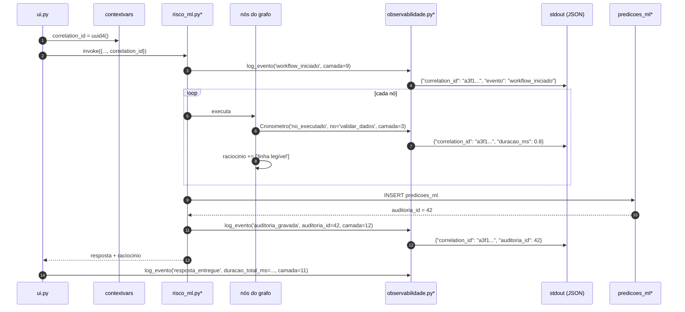

# Estratégia de Observabilidade

**Agente responsável:** `ArchitectureAgent`
**Status:** `lib/observabilidade.py` **não existe**. O que existe hoje está descrito na §1.
**Princípio que governa este documento:** falha explícita, nunca silenciosa (Princípio 5) — e a
restrição que o limita: valor clínico nunca entra em log (Princípio 9).

---

## 1. O que já existe: a lista `raciocinio`

Antes de propor qualquer coisa, o reconhecimento de que **já há observabilidade no projeto**, e
de um tipo incomum.

Os quatro workflows acumulam uma lista `raciocinio: list[str]` no estado tipado. Cada nó anexa
uma linha descrevendo o que fez:

| Workflow | Exemplos reais de linha |
|---|---|
| `triagem` | `'Sintomas extraídos: sangramento intenso, dor pélvica'` · `'Urgência = emergência (alarme: ...)'` |
| `violencia` | `'Score = 6, nível = alta_suspeita'` · `'Registro SINAN: ✅ id=12; log_acesso atualizado (usuario=...)'` |
| `obstetrico` | `'Risco gestacional: alto_risco \| fatores: HAS, idade >35a'` · `'Sinais de alarme detectados: 3'` |
| `prevencao` | `'2 atrasado(s), 1 a vencer.'` · `'3 lembrete(s) gerado(s).'` |

`ui.py::_render_trace_e_fontes` renderiza essa lista num bloco `<details>` colapsável, junto com
os `doc_id` únicos consultados e o nível de confiança.

### Por que isso conta como observabilidade

É um **trace de execução por nó**, produzido pelo próprio código de negócio, entregue ao usuário
junto com a resposta. Em terminologia de observabilidade, é telemetria *in-band*: viaja no mesmo
canal do produto.

| Propriedade | Avaliação |
|---|---|
| Cobertura | Boa — todos os 27 nós dos 4 workflows escrevem |
| Granularidade | Adequada — uma linha por decisão |
| Legibilidade | Excelente — escrita para humano, em português |
| Persistência | **Nenhuma** — some quando a aba é fechada |
| Agregabilidade | **Nenhuma** — é texto livre, não evento estruturado |
| Correlação entre requisições | **Nenhuma** — não há identificador |
| Segurança | **Risco** — `'Sintomas extraídos: sangramento intenso'` é dado clínico |

As três últimas linhas são o que falta. A observabilidade planejada **não substitui** o
`raciocinio` — ela o complementa com um canal *out-of-band* que é estruturado, correlacionável e
livre de dado sensível.

### Divisão de responsabilidades

| Canal | Público | Conteúdo | Persistência |
|---|---|---|---|
| `raciocinio` (in-band) | o profissional, na tela | narrativa clínica do que o sistema fez | efêmera |
| Log estruturado (out-of-band) | quem opera e depura | eventos técnicos, sem valor clínico | stdout |
| `predicoes_ml` | auditoria | decisão, versão, modo, hash | banco |

Os três são complementares e nenhum é redundante com os outros.

---

## 2. `lib/observabilidade.py` — desenho

### Formato do evento

Uma linha JSON por evento, em stdout — que é o que um contêiner espera e o que o Colab exibe:

```json
{
  "ts": "2026-09-18T12:34:56.789Z",
  "level": "INFO",
  "correlation_id": "a3f1c8e2-...",
  "camada": 4,
  "componente": "ml.predict",
  "evento": "predicao_concluida",
  "duracao_ms": 12.4,
  "modo": "normal",
  "modelo_versao": "1.0.0",
  "dataset_versao": "v1.0.0",
  "features_hash": "9f86d081...",
  "n_imputados": 1
}
```

Campos obrigatórios em **todo** evento: `ts`, `level`, `correlation_id`, `camada`, `componente`,
`evento`.

### Interface projetada

```python
def novo_correlation_id() -> str: ...

def log_evento(evento: str, *, camada: int, componente: str,
               level: str = 'INFO', **campos) -> None: ...

class Cronometro:
    """Context manager que emite duracao_ms ao sair, inclusive em exceção."""
    def __init__(self, evento: str, *, camada: int, componente: str, **campos): ...
```

O `correlation_id` é propagado por variável de contexto (`contextvars`), não por parâmetro — do
contrário seria preciso alterar a assinatura de todos os nós existentes, o que violaria a
aditividade (ADR-001).

---

## 3. Identificador de correlação atravessando o workflow



Com o `correlation_id` no log e o `auditoria_id` em `predicoes_ml`, uma investigação parte de
qualquer um dos dois e chega ao outro: linha de auditoria → `correlation_id` → todos os eventos
daquela requisição, com latência por nó e modo de execução.

---

## 4. Eventos por camada

| Camada | Componente | Eventos | Nível | Campos além dos obrigatórios |
|---|---|---|---|---|
| 1 Config | `config` | `perfil_resolvido` | INFO | `perfil`, `flags` |
| 1 Config | `config` | `variavel_ausente_default_usado` | WARNING | `variavel` |
| 2 Dados | `db` | `schema_inicializado`, `conexao_aberta` | DEBUG | `caminho_db` |
| 2 Dados | `ml.dataset` | `dataset_gerado`, `manifesto_verificado` | INFO | `n_registros`, `hash_confere` |
| 2 Dados | `ml.dataset` | `dataset_divergente` | **ERROR** | `hash_esperado`, `hash_obtido` |
| 3 Pré-proc. | `ml.schema` | `validacao_ok` | DEBUG | `n_campos_opcionais_ausentes` |
| 3 Pré-proc. | `ml.schema` | `validacao_falhou` | WARNING | `tipo_erro`, **nomes** dos campos |
| 3 Pré-proc. | `ml.schema` | `dados_incompletos` | WARNING | **nomes** dos campos faltantes |
| 4 ML | `ml.registry` | `modelo_carregado` | INFO | `modelo_nome`, `modelo_versao`, `dataset_versao` |
| 4 ML | `ml.registry` | `modelo_indisponivel` | **ERROR** | `causa` |
| 4 ML | `ml.predict` | `predicao_concluida` | INFO | `duracao_ms`, `modo`, `features_hash`, `n_imputados` |
| 5 Explic. | `ml.explain` | `explicacao_gerada` | INFO | `metodo`, `escopo`, `duracao_ms` |
| 5 Explic. | `ml.explain` | `fallback_explicacao` | WARNING | `metodo_tentado`, `metodo_usado`, `causa` |
| 6 Regras | `alertas` / `risco_ml` | `regra_disparada` | **WARNING** | `n_regras`, **chaves** dos sinais |
| 6 Regras | `risco_ml` | `bypass_ml` | **WARNING** | `n_regras` |
| 7 RAG | `common.rag_search` | `rag_consultado` | INFO | `k_solicitado`, `n_retornado`, `categoria`, `duracao_ms` |
| 7 RAG | `common.rag_search` | `rag_vazio` | WARNING | `categoria` |
| 8 Tools | `tools` | `tool_chamada` | INFO | `nome_tool`, `duracao_ms`, `sucesso` |
| 9 Workflow | `risco_ml` | `workflow_iniciado`, `no_executado`, `workflow_concluido` | INFO / DEBUG | `no`, `duracao_ms`, `modo` |
| 9 Workflow | `risco_ml` | `caminho_excecao` | WARNING | `caminho` |
| 10 LLM | `llm` | `geracao_concluida` | INFO | `duracao_ms`, `n_tokens_saida` |
| 10 LLM | `validacao` | `validacao_llm_aprovada` | INFO | `duracao_ms` |
| 10 LLM | `validacao` | `validacao_llm_rejeitada` | **WARNING** | `motivo`, `n_numeros_orfaos`, `contradicao_rotulo` |
| 11 UI | `ui` | `requisicao_recebida`, `resposta_entregue` | INFO | `aba`, `duracao_total_ms` |
| 11 UI | `ui` | `erro_nao_tratado` | **ERROR** | `tipo_excecao`, traceback |
| 12 Auditoria | `risco_ml` | `auditoria_gravada` | INFO | `auditoria_id`, `modo` |
| 12 Auditoria | `risco_ml` | `auditoria_falhou` | **CRITICAL** | `causa` |

### Justificativa de alguns níveis

| Evento | Nível | Por quê |
|---|---|---|
| `regra_disparada`, `bypass_ml` | WARNING | Não é erro, mas é desvio do caminho normal que precisa ser contável |
| `validacao_llm_rejeitada` | WARNING | O mecanismo funcionando. Frequência alta é informação sobre o modelo, não defeito do sistema |
| `dataset_divergente` | ERROR | Interrompe o treino; métricas não seriam reproduzíveis |
| `auditoria_falhou` | **CRITICAL** | Uma predição entregue sem rastro viola o Princípio 4. É o evento mais grave do sistema |

---

## 5. O que NUNCA pode ser logado

Restrição absoluta, derivada do Princípio 9 e de `docs/seguranca/`:

| Proibido | Exemplo do que **não** pode aparecer | Alternativa permitida |
|---|---|---|
| Valores clínicos | `pas_mmhg: 165`, `hemoglobina_g_dl: 8.2` | `features_hash`, `n_imputados` |
| Nome de paciente | `nome: "Maria ..."` | `paciente_id` (inteiro interno) |
| CPF, mesmo em hash | `cpf_hash: "..."` | nada |
| Texto livre da queixa ou descrição | `descricao_caso: "sangramento há 3 dias..."` | `n_caracteres`, `categoria` |
| Sintomas extraídos | `sintomas: ["sangramento intenso"]` | `n_sintomas` |
| Conteúdo de `registros_violencia` | qualquer campo | apenas o fato do acesso, que já vai para `log_acesso` |
| Prompt ou resposta do LLM | texto integral | `n_tokens`, `duracao_ms`, `aprovada` |
| `HF_TOKEN` ou qualquer credencial | — | nada |
| Valores de `top_features` | `{"feature": "has_cronica", "value": true}` | só o **nome** da feature |

### Casos de fronteira, decididos explicitamente

| Caso | Decisão | Razão |
|---|---|---|
| Nomes dos campos faltantes em `dados_incompletos` | **permitido** | Saber que faltou a pressão arterial não revela a pressão arterial |
| Nomes das features em `top_features` | **permitido** | O nome é metadado do modelo |
| **Valores** dessas features | **proibido** | `has_cronica: true` é diagnóstico |
| Chaves dos sinais de alarme disparados | **permitido**, com ressalva | É informação clínica indireta sobre a paciente. Combinada a `paciente_id`, aproxima-se de dado clínico. Se a ressalva se mostrar excessiva, registrar apenas `n_regras`. |
| `paciente_id` | **permitido** | Identificador interno; a associação a uma pessoa exige acesso ao banco, que tem sua própria auditoria |

A linha dos sinais de alarme é a mais delicada e fica registrada como decisão consciente, não
como descuido: o benefício de depuração é alto e o dado é indireto, mas se o
`SecurityAndComplianceAgent` entender diferente, a alternativa (`n_regras` apenas) já está
especificada.

---

## 6. Métricas a emitir

Derivadas dos eventos; nenhuma exige instrumentação adicional.

### Latência

| Métrica | Fonte | Uso |
|---|---|---|
| Duração por nó do workflow | `no_executado.duracao_ms` | Identificar o gargalo real (esperado: `sintetizar_com_llm`) |
| Tempo de inferência do modelo | `predicao_concluida.duracao_ms` | Deve ficar em milissegundos; crescimento indica recarga do artefato a cada chamada |
| Tempo de explicabilidade | `explicacao_gerada.duracao_ms` | SHAP é mais caro que o fallback; quantificar |
| Tempo de RAG | `rag_consultado.duracao_ms` | Detectar degradação do índice |
| Tempo de geração do LLM | `geracao_concluida.duracao_ms` | O gargalo dominante |
| Duração total | `resposta_entregue.duracao_total_ms` | Experiência percebida |

### Taxas

| Métrica | Cálculo | O que revela |
|---|---|---|
| **Taxa de acerto do RAG** | `1 − (rag_vazio / rag_consultado)` | Se a filtragem pós-processada por categoria está descartando tudo |
| **Taxa de rejeição do validador** | `validacao_llm_rejeitada / geracao_concluida` | Confiabilidade numérica do LLM (ADR-007). **Zero é suspeito**, não bom |
| **Taxa de modo degradado** | eventos com `modo='degradado'` / total | Disponibilidade do artefato de modelo |
| **Taxa de bypass** | `modo='bypass_regra'` / total | Frequência de emergências nos casos submetidos |
| **Taxa de dados incompletos** | `modo='incompleto'` / total | Qualidade dos dados na origem, não do modelo |
| **Taxa de fallback de explicabilidade** | `fallback_explicacao` / `explicacao_gerada` | Se SHAP está disponível no ambiente |
| **Taxa de erro não tratado** | `erro_nao_tratado` / requisições | Deve ser zero no workflow novo |

### Leitura conjunta das taxas

Duas combinações merecem alerta:

| Combinação | Interpretação |
|---|---|
| Taxa de rejeição = 0 **e** volume > 0 | Suspeitar que a verificação foi desligada, não que o modelo melhorou |
| Taxa de modo degradado alta **e** taxa de bypass baixa | O artefato de modelo não está sendo montado no contêiner |

### Distribuições, não só médias

Latência de LLM tem cauda longa. Média é enganosa; o que importa é o p95. Como o volume é de
demonstração, isso será calculado em análise posterior sobre o log, não por instrumentação
dedicada.

---

## 7. Escopo agora × escopo futuro

### Nesta fase

| Item | Alcance |
|---|---|
| `lib/observabilidade.py` | Logging estruturado JSON em stdout |
| `correlation_id` | Via `contextvars`, gerado na UI, presente em todo evento |
| Cobertura de eventos | **Apenas** `risco_ml.py` e a camada de ML. Os 4 workflows existentes não são instrumentados (ADR-001) |
| Métricas | Derivadas do log em análise posterior; sem exportador |
| Níveis | Controlados por `LOG_LEVEL` |
| Filtro de sensibilidade | Lista de chaves proibidas verificada em teste unitário |
| Destino | stdout — o que o Docker espera |

### Explicitamente fora de escopo

| Item | Razão |
|---|---|
| Prometheus, Grafana, exportador de métricas | Um contêiner, um usuário |
| OpenTelemetry, tracing distribuído | Um processo; o `correlation_id` já correlaciona |
| Agregação centralizada (ELK, Loki) | Sem volume |
| Alertas e paginação | Sem operação |
| Dashboards | O notebook 10 já produz o relatório gerencial |
| Instrumentar os 4 workflows existentes | Violaria a aditividade; eles já têm `raciocinio` |
| Amostragem, retenção, rotação de log | stdout do contêiner |

---

## 8. Como a observabilidade será verificada

| Verificação | Como |
|---|---|
| Todo evento tem os 6 campos obrigatórios | Teste unitário sobre a saída de `log_evento` |
| Nenhum valor clínico vaza | Teste que executa uma predição com valores sentinela e falha se algum aparecer no log |
| `correlation_id` é o mesmo do início ao fim | Teste de integração sobre um workflow completo |
| Cada caminho de exceção emite o evento correspondente | Um teste por caminho (4) |
| `auditoria_falhou` é CRITICAL e não é silenciado | Teste com banco somente leitura |
| A taxa de rejeição é contável a partir do log | Teste que força rejeição e conta o evento |

O segundo teste é o mais importante: injeta `pas_mmhg=137` (valor improvável e reconhecível),
executa o fluxo completo e falha se `137` aparecer em qualquer linha de log. É a forma de
transformar a restrição da §5 de promessa em verificação.

---

## 9. Relação com a auditoria

`predicoes_ml` e o log estruturado respondem perguntas diferentes e não se substituem:

| Pergunta | Onde se responde |
|---|---|
| Que decisão foi emitida para esta paciente, por qual modelo? | `predicoes_ml` |
| Por que aquela decisão demorou 8 segundos? | Log estruturado |
| Qual foi a taxa de modo degradado no último mês? | `predicoes_ml` (consulta SQL) |
| Em que nó o tempo foi gasto? | Log estruturado |
| A predição de ontem é reproduzível hoje? | `predicoes_ml.features_hash` + `modelo_versao` |
| O RAG voltou vazio naquela consulta? | Log estruturado |

`auditoria_id` e `correlation_id` são a ponte entre os dois. Sem essa ponte, cada um responde
metade da pergunta e a investigação para no meio.
