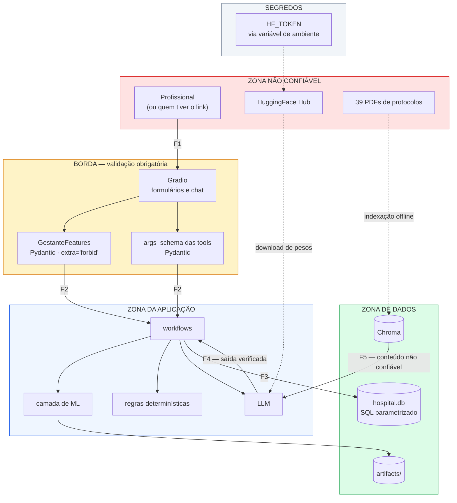
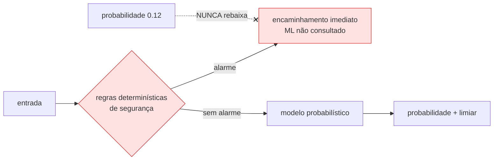

# Estratégia de Segurança — Perspectiva Arquitetural

**Agente responsável:** `ArchitectureAgent`
**Escopo:** postura de segurança **do desenho**. Conformidade legal, LGPD, base legal de
tratamento, direitos do titular e política de auditoria são responsabilidade do
`SecurityAndComplianceAgent`, em `docs/seguranca/`.
**Status:** o que está marcado **`[COD]`** foi verificado no código. O restante é projeto.
**Contexto que condiciona tudo:** demonstração acadêmica, usuário único, dados **sintéticos**.

---

## 1. Fronteiras de confiança



| Fronteira | Do que para onde | Controle |
|---|---|---|
| **F1** | Usuário → aplicação | **Nenhum.** Sem autenticação. Com `share=True`, qualquer pessoa com o link |
| **F2** | Entrada → domínio | Validação Pydantic com domínio, invariantes e `extra='forbid'` |
| **F3** | Aplicação → banco | Consultas parametrizadas em 100 % dos casos **`[COD]`** |
| **F4** | LLM → aplicação | Verificação numérica + validador clínico (ADR-007, ADR-010) |
| **F5** | Conteúdo recuperado → prompt | **Nenhum.** Trechos de protocolo entram no prompt sem sanitização |

As fronteiras F1 e F5 são as desprotegidas. F1 é decisão declarada (§7). F5 é risco residual
mitigado pela procedência do conteúdo (§3.4).

---

## 2. Superfície de ataque

| # | Vetor | Exposição | Gravidade no contexto | Mitigação |
|---|---|---|---|---|
| 1 | Túnel público do Gradio (`share=True`) | **alta** | moderada — dados sintéticos | Nenhuma. Limitação declarada |
| 2 | Injeção de SQL pelas tools | baixa | alta se existisse | Consultas parametrizadas **`[COD]`** |
| 3 | Injeção de prompt pela entrada do usuário | média | **baixa** — o LLM não tem poder de escrita relevante (§3.5) | Verificação de saída; tools com schema |
| 4 | Injeção indireta via conteúdo do RAG | baixa | baixa | Procedência controlada; indexação offline |
| 5 | Vazamento do `HF_TOKEN` | baixa | alta (é credencial) | Só por ambiente; `.gitignore` exclui `.env` **`[COD]`** |
| 6 | Desserialização de `.joblib` malicioso | **baixa** | alta se ocorresse | Artefato gerado localmente; nunca baixado de terceiros |
| 7 | Vazamento cruzado entre pacientes | baixa | alta | Toda tool recebe `paciente_id` explícito; sem busca por nome **`[COD]`** |
| 8 | Consulta não autorizada a `registros_violencia` | média | alta | Motivo obrigatório (≥5 caracteres) + `log_acesso` **`[COD]`** |
| 9 | Negação de serviço | alta | baixa | Nenhuma. Sem *rate limiting* |
| 10 | Exceção vazando detalhes internos | média | baixa | Nenhuma nos workflows atuais; o workflow novo tem caminhos de exceção |

O vetor 6 merece nota: `joblib.load` executa `pickle` por baixo, e desserializar um artefato de
origem desconhecida é execução arbitrária de código. Aqui os artefatos são gerados pelo próprio
`scripts/train.py`, nunca importados. A regra de projeto que o mantém baixo é simples e deve
estar escrita: **`registry.py` só carrega artefatos de `ARTIFACTS_PATH`, nunca de caminho vindo
de entrada do usuário.**

---

## 3. Controles de segurança presentes no desenho

### 3.1 Consultas parametrizadas — verificado **`[COD]`**

Auditei todas as chamadas a `execute` em `lib/`. Resultado:

| Arquivo | Chamadas | Todas parametrizadas? |
|---|---|---|
| `lib/tools.py` | 8 | **sim** |
| `lib/alertas.py` | 4 | **sim** |
| `lib/ui.py` | 2 | **sim** |
| `lib/workflows/prevencao.py` | 2 | **sim** |
| `lib/workflows/violencia.py` | 1 | **sim** |
| `lib/db.py` | 3 | ver abaixo |

As três de `db.py`: `PRAGMA foreign_keys = ON` (literal), `executescript(SCHEMA_SQL)` (constante
de módulo) e — a única interpolação de string em SQL no projeto:

```
conn.execute(f'DROP TABLE IF EXISTS {t}')        # db.py:118
```

`t` itera sobre uma lista literal de sete nomes de tabela declarada três linhas acima, sem
qualquer entrada externa. **Não é injetável.**

Um ponto menor, que não é injeção: `consultar_medicamento` monta
`padrao = f'%{termo.lower()}%'` e o passa **como parâmetro vinculado**. Os metacaracteres `%` e
`_` do `LIKE` não são escapados, então um termo com `%` amplia a busca. É uso indevido possível,
não vazamento — a tabela `medicamentos` é referência pública e não tem `paciente_id`.

**Postura:** boa, e a extensão precisa mantê-la. `predicoes_ml` recebe apenas `INSERT`
parametrizado.

### 3.2 Gestão de segredos

| Segredo | Como é tratado | Verificação |
|---|---|---|
| `HF_TOKEN` | Variável de ambiente; no Colab, lido de um `.env` que vive no Drive | **`[COD]`** |
| CPF | Armazenado como `cpf_hash` desde a Fase 2 | **`[COD]`** — `db.py:35` |
| Credencial de banco | Não existe — SQLite é arquivo | — |

O `.gitignore` já exclui, nas primeiras linhas:

```
.env
.env.*
!.env.example
*.token
*.key
**/credentials.json
**/secrets.json
```

**`[COD]`** — e a exceção `!.env.example` é precisamente o que a ADR-009 precisa: o arquivo de
exemplo é versionado, o real nunca.

**Regras para a evolução:** nenhum segredo em `Dockerfile`, `docker-compose.yml` ou argumento de
linha de comando; `--env-file` ou `-e` na execução; `config.py` lê o token mas **nunca** o inclui
em log ou em mensagem de erro; `.env.example` lista as chaves com valores vazios.

### 3.3 Validação de entrada como controle de segurança

A validação não existe só para qualidade de dado. Ela é o filtro da fronteira F2.

| Mecanismo | Efeito de segurança |
|---|---|
| `extra='forbid'` em `GestanteFeatures` | Campo não previsto é rejeitado; impede *parameter pollution* e uso de renomeação para burlar validação |
| Faixas `ge`/`le` em todo campo numérico | Impede valores absurdos chegarem ao modelo ou ao prompt |
| Validadores cruzados obstétricos | Rejeitam combinações impossíveis |
| `args_schema` nas tools | O LLM não consegue chamar uma tool com argumento de tipo arbitrário |
| `paciente_id` sempre explícito, nunca busca por nome **`[COD]`** | Impede vazamento cruzado por inferência de nome |
| Filtro de `sinais` contra `SINAIS_VIOLENCIA` **`[COD]`** | Saída do LLM não injeta chave arbitrária na matriz |

**Lacuna herdada:** `buscar_protocolo` é a única tool **sem** `args_schema`
(`tools.py:301-306`). O LangChain infere a assinatura do `lambda`. Não é vulnerabilidade — os
argumentos vão para uma busca vetorial, não para SQL — mas é a fronteira menos definida do
conjunto. A nova tool **tem** `args_schema`, por decisão explícita.

### 3.4 Procedência do conteúdo recuperado

Os 1392 chunks vêm de 39 PDFs de protocolos do Ministério da Saúde, FEBRASGO e INCA, indexados
offline pelo notebook 06. Não há ingestão dinâmica, não há conteúdo enviado por usuário, não há
crawler.

Isso reduz o risco de injeção indireta de prompt (vetor 4) **por procedência**, não por controle
técnico: o conteúdo entra no prompt sem sanitização. Se algum dia houver ingestão de documento
enviado pelo usuário, F5 passa a ser a fronteira mais perigosa do sistema e exigirá controle
próprio.

### 3.5 O LLM tem pouco poder — e isso é arquitetura, não sorte

O impacto de uma injeção de prompt bem-sucedida é limitado pelo que o LLM consegue fazer:

| Capacidade | O LLM pode? | Por quê |
|---|---|---|
| Ler prontuário | sim, via tool | Função pretendida |
| Escrever em `registros_violencia` | **sim**, via `registrar_violencia` | **É a maior capacidade de escrita disponível ao LLM** |
| Escrever em qualquer outra tabela | não | Não há tool para isso |
| Executar SQL arbitrário | não | Não há tool de SQL livre |
| Ler o sistema de arquivos | não | Nenhuma tool o expõe |
| Fazer requisição de rede | não | idem |
| Alterar números da predição | **não** | Contrato somente-leitura + verificação posterior (ADR-007) |
| Rebaixar um alarme determinístico | **não** | A regra precede o ML e o bypass não consulta modelo (ADR-006) |

A linha de `registrar_violencia` é a que merece atenção: é a única escrita sensível acessível ao
modelo. Ela já grava em `log_acesso` **antes** do `INSERT` **`[COD]`**, e o workflow de violência
exige `confirmacao_clinica` — mas o **agente ReAct** pode chamá-la diretamente, sem esse gate. O
`SYSTEM_PROMPT` instrui a usá-la "somente quando houver confirmação clínica e o profissional
pedir registro formal", o que é instrução, não controle. Registrado como risco residual; a
mitigação existente é a auditoria.

### 3.6 A trilha de auditoria como controle

| Mecanismo | Função de segurança | Status |
|---|---|---|
| `log_acesso` com motivo obrigatório | Todo acesso a `registros_violencia` é atribuível e justificado | **`[COD]`** |
| Motivo com mínimo de 5 caracteres | Impede motivo vazio como formalidade | **`[COD]`** |
| `log_acesso` sem FK para `pacientes` | O log sobrevive à remoção da paciente | **`[COD]`** |
| `predicoes_ml` sem `UPDATE` nem `DELETE` | Registro imutável no caminho da aplicação | projeto |
| `features_hash` em vez dos valores | Rastreabilidade sem duplicar dado sensível | projeto |
| `modelo_versao` + `dataset_versao` | Permite reconstruir qual modelo produziu qual decisão | projeto |

**Fragilidade estrutural declarada:** `log_acesso.usuario` vem de `_USUARIO_ATUAL`, uma variável
global de módulo alimentada por uma caixa de texto na sidebar **`[COD]`**. Sem autenticação, a
auditoria registra o que o usuário **digitou**, não quem ele **é**. Isso vale tanto para o
`log_acesso` existente quanto para o `predicoes_ml` novo. É uma limitação intrínseca ao escopo
acadêmico, e deve ser dita sempre que a auditoria for apresentada como controle.

### 3.7 Determinismo como controle de segurança clínica

A ADR-006 é, do ponto de vista arquitetural, um controle de segurança — do tipo *safety*, não
*security*:



A propriedade que isso garante é **testável**: um caso com sinal de alarme produz encaminhamento
imediato independentemente do que o modelo diria. Não é uma ponderação escondida num peso; é uma
aresta no grafo.

O mesmo raciocínio sustenta a decisão de **manter a detecção de violência determinística**
(ADR-002). Um escore probabilístico de caixa-preta para suspeita de violência doméstica, treinado
em dados sintéticos, seria um risco de dano — a matriz de `alertas.py` é auditável linha a linha.

---

## 4. Segurança da camada de ML

Riscos específicos e o que os controla:

| Risco | Controle | Status |
|---|---|---|
| Envenenamento do dataset | Gerado localmente, determinístico por semente, hash no manifesto (ADR-011) | projeto |
| Carga de artefato malicioso (`pickle`) | Só de `ARTIFACTS_PATH`; nunca de caminho vindo do usuário | **regra a implementar** |
| Modelo incompatível produzindo resultado errado | `registry` valida a MAJOR de `dataset_version`; incompatibilidade é **erro** | projeto |
| Inversão de modelo / inferência de associação | Fora de escopo — o modelo é treinado em dados sintéticos; não há indivíduo real a reidentificar | n/a |
| Vazamento de dado sensível pela explicação | `top_features` inclui `value`. Ver §5 | **em aberto** |
| Ataque adversarial na entrada | Faixas de domínio limitam o espaço de entrada | parcial |

A linha de inversão de modelo é a que normalmente preocupa em ML clínico, e aqui ela
simplesmente não se aplica: não há pessoa real no conjunto de treino. É um dos poucos benefícios
reais de usar dados sintéticos.

---

## 5. Pontos em aberto

### 5.1 `top_features` grava valores clínicos na auditoria

A DDL de `predicoes_ml` guarda `top_features` como JSON, e o contrato do payload inclui
`"value": true` em cada item. Consequência: embora `features_hash` proteja as 23 entradas, os 5
valores explicativos vão em claro para o banco. Isso enfraquece parcialmente a decisão de
privacidade que motivou o uso de hash.

Recomendação: gravar `top_features` **sem** o campo `value` na auditoria, mantendo-o no payload
entregue ao LLM e à UI. A ser confirmado por ADR — ver `FLUXO_DE_DADOS.md` §7.1.

### 5.2 Registrar as chaves dos sinais de alarme em log

`ESTRATEGIA_DE_OBSERVABILIDADE.md` §5 permite logar as chaves dos sinais disparados. Combinadas a
`paciente_id`, são informação clínica indireta. A alternativa conservadora — registrar apenas
`n_regras` — já está especificada. Decisão do `SecurityAndComplianceAgent`.

### 5.3 `share=True` no perfil `full-gpu`

Publica a aplicação sem autenticação, por cerca de 72 horas. Para a gravação do vídeo é
conveniente; como postura de segurança, é a maior exposição do sistema. Não há mitigação
planejada além de não deixar o túnel ativo além do necessário.

---

## 6. O que NÃO está implementado — e por quê

Declaração explícita, para que a ausência seja decisão registrada e não omissão:

| Ausente | Razão | Se fosse produção |
|---|---|---|
| **Autenticação** | Demonstração de usuário único; a identificação é uma caixa de texto desde a Fase 2 | Bloqueante — sem isso a auditoria é ficção |
| **Autorização / RBAC** | Não há papéis; todos os usuários são "a equipe de saúde" | Necessário: acesso a `registros_violencia` deveria ser restrito por perfil |
| **Criptografia em repouso** | `hospital.db` é SQLite com dados **sintéticos** | Necessário: SQLCipher ou criptografia de volume |
| **Criptografia em trânsito controlada por nós** | O túnel do Gradio usa HTTPS, mas nós não controlamos a terminação | Necessário: TLS próprio |
| **Rate limiting** | Sem exposição pública gerenciada e sem custo por requisição | Necessário |
| **Gestão de sessão** | `historico_estado` é global ao processo | Bloqueante |
| **CSRF / CORS / cabeçalhos de segurança** | Delegado ao Gradio | Revisar |
| **Varredura de dependências** | Não há `requirements.txt` hoje; com ele, `pip-audit` passa a ser viável | Recomendado |
| **Assinatura de artefatos de modelo** | Artefatos gerados e consumidos localmente | Necessário se houvesse distribuição |
| **Política de retenção e expurgo** | Nenhum mecanismo de expiração em `log_acesso` nem em `predicoes_ml` | Necessário |
| **Resposta a incidentes** | Sem operação | Necessário |

### A honestidade que este quadro exige

O sistema tem **uma** postura de segurança coerente: a de uma demonstração acadêmica de usuário
único, com dados sintéticos, rodando em ambiente controlado. Dentro desse escopo, os controles
existentes — SQL parametrizado, validação de entrada, segredo por ambiente, auditoria de acesso
sensível, determinismo prevalecendo sobre inferência — são adequados e foram verificados.

Fora desse escopo, o sistema **não é seguro**, e a primeira coisa que faltaria não é criptografia
nem *rate limiting*: é autenticação. Sem ela, todo o resto da trilha de auditoria registra um
nome digitado, não uma identidade.

---

## 7. Checklist de segurança para a implementação

Verificações a fazer conforme o código for escrito:

| # | Verificação | Como |
|---|---|---|
| 1 | Nenhuma consulta nova usa interpolação de string | Revisão + busca por `f'` próximo de `execute` |
| 2 | `predicoes_ml` só recebe `INSERT` parametrizado | Revisão de `auditar` |
| 3 | `HF_TOKEN` não aparece em log nem em mensagem de erro | Teste que força falha de carga e inspeciona a saída |
| 4 | `.env` não é commitado | Já garantido pelo `.gitignore` **`[COD]`**; confirmar no primeiro commit |
| 5 | `.env.example` tem só chaves, sem valores | Revisão |
| 6 | `registry` recusa caminho de artefato vindo de entrada do usuário | Teste unitário |
| 7 | Nenhum valor clínico no log estruturado | Teste com valor sentinela (`ESTRATEGIA_DE_OBSERVABILIDADE.md` §8) |
| 8 | A nova tool tem `args_schema` | Teste sobre `build_langchain_tools` |
| 9 | Bypass por regra não consulta o modelo | Teste de integração |
| 10 | Falha de auditoria é CRITICAL e visível | Teste com banco somente leitura |
| 11 | Nenhum segredo no `Dockerfile` ou no `docker-compose.yml` | Revisão |
| 12 | Mensagens de erro ao usuário não expõem caminho de arquivo nem traceback | Revisão dos nós de exceção |

---

## 8. Documentos relacionados

| Documento | Conteúdo |
|---|---|
| `docs/seguranca/LGPD_E_PRIVACIDADE.md` | Base legal, direitos do titular, minimização |
| `docs/seguranca/POLITICA_DE_AUDITORIA.md` | O que é auditado, por quanto tempo, quem consulta |
| `PRINCIPIOS_ARQUITETURA.md` | Princípios 3, 4, 5 e 9, que sustentam os controles desta página |
| `DECISOES_ARQUITETURAIS.md` | ADR-006 (determinismo), ADR-007 (contrato do LLM), ADR-009 (configuração), ADR-010 (validador) |
| `ESTRATEGIA_DE_OBSERVABILIDADE.md` | §5 — o que nunca pode ser logado |
| `FLUXO_DE_DADOS.md` | §5 — onde o dado sensível vive |
