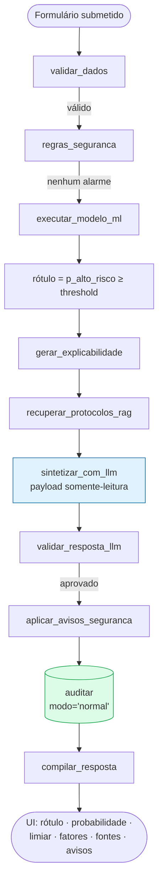
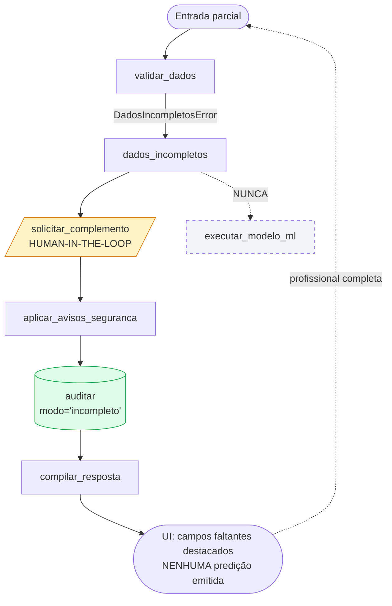
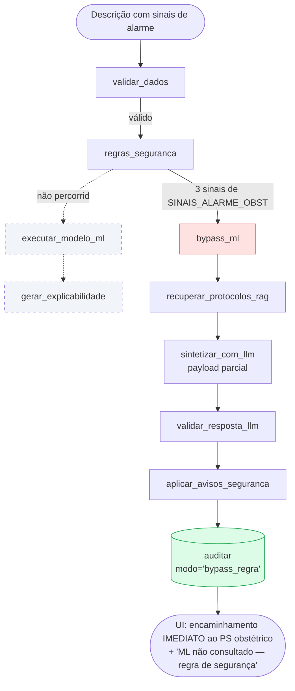
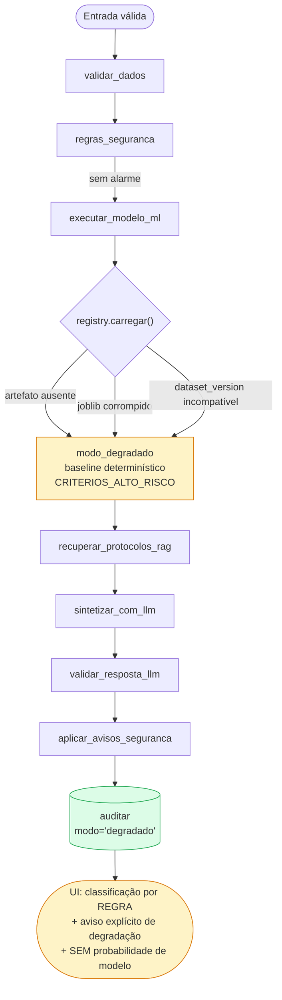
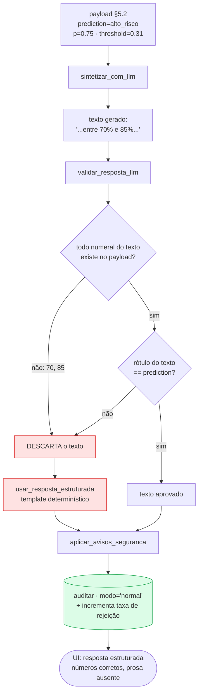
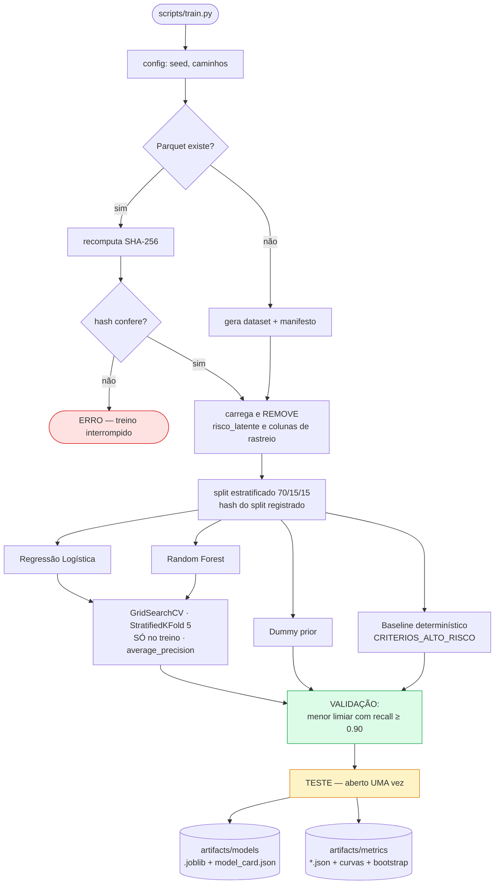
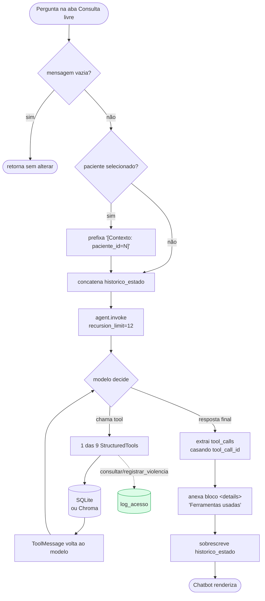

# Fluxos de Execução

**Agente responsável:** `ArchitectureAgent`
**Status:** Cenários 1 a 6 descrevem comportamento **projetado** — não implementado. O cenário 7
descreve o fluxo **existente**, lido do código.
**Objetivo:** dar, para cada cenário relevante, a sequência exata de passos e o desvio que ele
representa em relação ao caminho feliz.

---

## Índice dos cenários

| # | Cenário | Modo auditado | Status |
|---|---|---|---|
| 1 | Predição normal de risco gestacional | `normal` | projetado |
| 2 | Dados incompletos → human-in-the-loop | `incompleto` | projetado |
| 3 | Emergência obstétrica → bypass do ML | `bypass_regra` | projetado |
| 4 | Modelo indisponível → modo degradado | `degradado` | projetado |
| 5 | LLM contradizendo os números → descarte do texto | `normal` | projetado |
| 6 | Treinamento de modelo | — | projetado |
| 7 | Consulta livre pelo agente ReAct | — | **existente** |

---

## Cenário 1 — Predição normal de risco gestacional

**Gatilho.** Profissional preenche o formulário da aba "Risco Gestacional (ML)" com os 11 campos
obrigatórios e submete. Nenhum sinal de alarme obstétrico está presente.

### Passos

1. O handler da UI monta um dicionário com os campos do formulário e invoca
   `wf_risco_ml.invoke({'dados_clinicos': ..., 'paciente_id': ..., 'usuario': ...})`.
2. **`validar_dados`** constrói `GestanteFeatures`. Todos os obrigatórios presentes; domínios
   válidos; `partos + abortos ≤ gestacoes`; `pad_mmhg < pas_mmhg`. Acrescenta a `raciocinio`:
   campos recebidos e campos opcionais ausentes.
3. **`regras_seguranca`** avalia `SINAIS_ALARME_OBST` contra a descrição clínica. Nenhum casa.
   `regras_disparadas = []`. A rota condicional segue para o ML.
4. **`executar_modelo_ml`** chama `lib/ml/predict.py::prever`. O `registry` carrega o artefato e
   verifica compatibilidade de `dataset_version`. O `Pipeline` imputa os opcionais ausentes —
   registrando-os em `dados_imputados` — escala, codifica e chama `predict_proba`.
5. O rótulo é derivado comparando `probabilities['alto_risco']` com o `threshold` do
   `model_card.json`. **Não** com 0,5.
6. `features_hash` é calculado sobre a serialização canônica das features.
7. **`gerar_explicabilidade`** tenta SHAP `TreeExplainer`; se indisponível, cai para a contribuição
   linear ou para a importância por permutação. O método efetivo é registrado.
8. **`recuperar_protocolos_rag`** chama `rag_search(retriever, 'pré-natal alto risco ...',
   categoria='ginecologia_obstetricia', k=3)`. Lista vazia seria estado legítimo.
9. **`sintetizar_com_llm`** monta o payload (`ARQUITETURA_ALVO.md` §5.2) e chama o `chat_model`.
10. **`validar_resposta_llm`** extrai os numerais do texto e confere contra o payload; verifica
    contradição de rótulo; aplica as regras clínicas do `ValidadorDeterministico`. Aprovado.
11. **`aplicar_avisos_seguranca`** anexa `safety_notice` e `aviso_dados_sinteticos`.
12. **`auditar`** grava uma linha em `predicoes_ml` com `modo='normal'`.
13. **`compilar_resposta`** monta `resposta_estruturada`; a UI renderiza rótulo, probabilidade,
    limiar, faixa, fatores, método de explicação, campos imputados, fontes e avisos.

### Diagrama

### Invariantes exercidas

Princípio 2 (regra antes do ML, mesmo quando não dispara), 3 (payload somente-leitura),
4 (auditoria), 6 (incerteza exibida), 9 (avisos obrigatórios).

---

## Cenário 2 — Dados incompletos → human-in-the-loop

**Gatilho.** O profissional usa a ponte com o prontuário (`features_de_paciente`) ou deixa campos
obrigatórios em branco. `hospital.db` não tem pressão arterial, IMC nem comorbidades
estruturadas, então esse é o caminho **esperado** ao partir de uma paciente do banco
(`CONTRATO_DE_DADOS.md` §4).

### Passos

1. A entrada chega ao nó `validar_dados`.
2. A construção de `GestanteFeatures` falha porque `pas_mmhg`, `pad_mmhg` e
   `imc_pre_gestacional` estão ausentes. É levantada `DadosIncompletosError` com
   `campos_faltantes = ['pas_mmhg', 'pad_mmhg', 'imc_pre_gestacional']`.
3. A rota condicional leva a **`dados_incompletos`**, não a `erro_validacao` — a distinção
   importa: ausência não é o mesmo que valor inválido.
4. **`solicitar_complemento`** monta a resposta de human-in-the-loop: a lista de campos
   faltantes, o que cada um significa clinicamente e a faixa aceita.
5. **Nenhuma predição é emitida.** O modelo não é chamado. Nenhum valor é imputado.
6. `aplicar_avisos_seguranca` e `auditar` executam mesmo assim, com `modo='incompleto'`. O
   registro documenta que houve uma tentativa e que ela foi recusada.
7. A UI exibe o formulário com os campos faltantes destacados e a mensagem de que a predição
   **não foi realizada**.

### Diagrama

### Por que não imputar

Imputar a pressão arterial de uma gestante pela mediana da população e devolver uma probabilidade
como se fosse medida é o silêncio perigoso que o Princípio 5 proíbe. Campos **opcionais** são
imputados e declarados em `dados_imputados`; obrigatórios, nunca
(`CONTRATO_DE_DADOS.md` §5).

### Nota de implementação

O ciclo de volta ao formulário é feito pela UI, não por `interrupt`/`checkpointer` do LangGraph.
Nenhum workflow atual tem checkpointer, e introduzir persistência de estado seria escopo maior do
que o necessário. O human-in-the-loop aqui é **síncrono e sem estado**: o workflow termina, o
profissional completa, e uma nova invocação começa.

---

## Cenário 3 — Emergência obstétrica → bypass do ML

**Gatilho.** A descrição clínica contém sinais de `SINAIS_ALARME_OBST` — por exemplo cefaleia
intensa, escotomas e epigastralgia em barra, o tripé de suspeita de pré-eclâmpsia grave / HELLP.

### Passos

1. `validar_dados` aprova as features.
2. **`regras_seguranca`** casa três sinais de `SINAIS_ALARME_OBST`.
   `regras_disparadas = ['Cefaleia intensa...', 'Alterações visuais...', 'Dor epigástrica...']`.
3. A rota condicional vai para **`bypass_ml`**. **O modelo não é consultado.** Não existe
   probabilidade a ser ignorada: ela nunca é produzida.
4. `bypass_ml` monta encaminhamento imediato ao pronto-socorro obstétrico, com os sinais
   detectados listados explicitamente.
5. O payload é montado em forma parcial: sem `probabilities`, sem `top_features`, com
   `regras_disparadas` preenchido e com os dois avisos obrigatórios presentes.
6. O LLM ainda é chamado — para redigir a conduta a partir do protocolo recuperado — e a
   verificação continua valendo: ele não pode introduzir número nenhum.
7. `auditar` grava `modo='bypass_regra'`.
8. A UI exibe o encaminhamento em destaque, declarando que **o modelo de ML não foi consultado**
   e por quê.

### Diagrama

### Fundamento

ADR-006. Regras de alarme obstétrico codificam sinais de emergência com alta especificidade para
condições catastróficas. Permitir que uma probabilidade de 0,12 rebaixe "crise convulsiva em
gestante" é inaceitável. Não se trata de o ML "perder a disputa": ele não participa.

### Diferença em relação ao obstétrico atual

Hoje, em `obstetrico.py`, a detecção de alarme ocorre **depois** da classificação de risco, e não
desvia o fluxo — apenas marca `eh_emergencia`, lida mais adiante por dois nós. No workflow novo,
a regra vem antes e **desvia**. É a correção de ordem que a ADR-006 formaliza.

---

## Cenário 4 — Modelo indisponível → modo degradado

**Gatilho.** `artifacts/models/` está vazio (primeira execução, ou contêiner sem volume montado),
o `.joblib` está corrompido, ou a `dataset_version` do artefato tem MAJOR diferente da do dataset
presente.

### Passos

1. `validar_dados` aprova. `regras_seguranca` não dispara.
2. **`executar_modelo_ml`** chama `predict.prever`, que chama `registry.carregar`. A carga falha.
3. `registry` levanta `ModeloIndisponivelError` com a causa nomeada — ausente, corrompido ou
   incompatível. A exceção **não** sobe até a UI.
4. A rota leva a **`modo_degradado`**, que aplica o **baseline determinístico**: a regra
   "qualquer critério de `CRITERIOS_ALTO_RISCO` presente → alto risco". É o comportamento
   pré-ML do sistema, agora explícito.
5. A resposta declara, em texto visível ao usuário, que o modelo não está disponível, qual é a
   causa em linguagem operacional, e que a classificação abaixo veio da regra determinística.
6. Nenhuma probabilidade de modelo é apresentada. Apresentar uma seria inventar número.
7. `auditar` grava `modo='degradado'`.

### Diagrama

### O que caracteriza a degradação como aceitável

Três condições simultâneas, todas do Princípio 5:

| Condição | Implementação |
|---|---|
| O sistema continua útil | Cai para a regra, que é o comportamento pré-ML |
| A degradação é **declarada** ao usuário | Texto visível, não nota de rodapé |
| A degradação é **contável** | `modo='degradado'` na auditoria permite medir a taxa |

O contraexemplo — devolver a mesma tela de sempre, com uma probabilidade vinda de algum lugar —
é o que este cenário existe para impedir.

---

## Cenário 5 — LLM contradizendo os números → descarte do texto

**Gatilho.** O payload diz `probabilities: {alto_risco: 0.75}` e `threshold: 0.31`; o Llama 3B
gera "probabilidade estimada entre 70 % e 85 %" ou, pior, "risco habitual, com probabilidade de
0,25 de complicação".

### Passos

1. Passos 1 a 9 idênticos ao Cenário 1. A predição e a explicação já estão prontas e corretas.
2. **`validar_resposta_llm`** aplica as quatro regras da verificação:
   - extrai os numerais do texto: `70`, `85`;
   - confere contra o payload: `0.75`, `0.31`, `0.25`, mais as contribuições. Nem `70` nem `85`
     correspondem, dentro da tolerância de arredondamento;
   - resultado: `numeros_nao_justificados = ['70', '85']`, `aprovada = False`.
3. No caso da contradição de rótulo, a regra 2 dispara independentemente:
   `contradicao_rotulo = True`.
4. A rota leva a **`usar_resposta_estruturada`**: o texto gerado é **descartado por inteiro**.
   Não há tentativa de conserto nem de reescrita — consertar texto de LLM com heurística é
   introduzir um segundo gerador não auditado.
5. Uma resposta determinística é montada a partir do payload, por template: rótulo,
   probabilidade, limiar, fatores, fontes.
6. `aplicar_avisos_seguranca` e `auditar` seguem normalmente, com `modo='normal'` — o ML
   funcionou; o que falhou foi a redação.
7. O contador de rejeição do validador é incrementado, para que a taxa seja reportada.

### Diagrama

### Nota de honestidade

Com um modelo de 3 bilhões de parâmetros, essa taxa de descarte pode ser alta. Ela será **medida
e reportada**, não escondida nem contornada afrouxando a tolerância (ADR-007). Uma taxa de
rejeição de zero deve ser tratada como suspeita de que a verificação foi desligada, não como
prova de qualidade do modelo.

---

## Cenário 6 — Treinamento de modelo

**Gatilho.** `python scripts/train.py` — offline, CPU, sem LLM, sem rede.

### Passos

1. `lib/config.py` resolve `ARTIFACTS_PATH` e `RANDOM_SEED`.
2. Se o Parquet não existe, `lib/ml/dataset.py` o gera com `numpy.random.default_rng(42)` e
   escreve também o manifesto com SHA-256, contagem por classe e por split.
3. Se o Parquet existe, o hash é recomputado e comparado ao manifesto. Divergência **interrompe
   o treino** — não emite aviso e continua.
4. O carregador remove `risco_latente`, `registro_id`, `dataset_version` e `split` da matriz de
   features.
5. Split estratificado 70/15/15 com semente 42. O hash do split é registrado, para provar entre
   execuções que ele não mudou.
6. Para cada um dos 4 candidatos — `DummyClassifier(strategy='prior')`, baseline determinístico,
   Regressão Logística, Random Forest — é montado um `Pipeline` (`ColumnTransformer` + estimador)
   com `class_weight='balanced'`.
7. `GridSearchCV` com `StratifiedKFold(5)` **apenas sobre o treino**, otimizando
   `average_precision`.
8. No conjunto de **validação**, escolhe-se o limiar operacional: o menor que atinge recall ≥ 0,90,
   reportando a precisão resultante.
9. O conjunto de **teste** é aberto **uma única vez**, ao final, para o relatório.
10. São calculadas as métricas obrigatórias: matriz de confusão, precision/recall/F1 por classe e
    macro, ROC-AUC, PR-AUC, Brier, curva de calibração, especificidade, NPV, e intervalos de
    confiança por bootstrap com 1000 reamostragens.
11. `registry.salvar` grava `.joblib` + `model_card.json` com nome, versão, `dataset_version`,
    `threshold` e hiperparâmetros.
12. `evaluate.py` escreve `artifacts/metrics/*.json` e a tabela comparativa. Todo número que
    aparecer em documento precisa existir aqui (critério ML-AC-07).

### Diagrama

### A pergunta que o treino responde

Não é "o modelo tem boa métrica?", e sim **"o modelo supera a regra determinística que já
existe?"**. O baseline #2 é `CRITERIOS_ALTO_RISCO` implementado como regra booleana — ele **é** o
comportamento atual do sistema. Se o Random Forest não o superar em recall sem perda inaceitável
de precisão, a conclusão honesta é que o ML não se justifica, e essa conclusão deve ser
reportada (`DEFINICAO_DO_PROBLEMA.md` §4 e critério ML-AC-03).

---

## Cenário 7 — Consulta livre pelo agente ReAct  **(fluxo existente)**

**Gatilho.** Profissional digita uma pergunta na aba "Consulta livre".
**Fonte:** `lib/ui.py::on_chat`, `lib/agent.py::run_consulta`, `lib/tools.py`. Lido do código.

### Passos

1. `on_chat(mensagem, chat_history, paciente_id)` verifica se a mensagem não é vazia.
2. Chama `run_consulta(agent, pergunta, paciente_id, historico=historico_estado['mensagens'])`.
3. Se `paciente_id` foi selecionado na sidebar, a pergunta é prefixada com
   `[Contexto: paciente_id=N]` — o `SYSTEM_PROMPT` instrui o modelo a usar N nas tools sem
   perguntar de novo.
4. O histórico anterior é concatenado e um `HumanMessage` é acrescentado.
5. `agent.invoke({'messages': ...}, config={'recursion_limit': 12})` executa o laço ReAct do
   LangGraph: o modelo decide se chama uma tool, a tool executa, o resultado volta como
   `ToolMessage`, e o ciclo se repete.
6. As tools disponíveis são as 9 de `build_langchain_tools`. `consultar_violencia` exige motivo
   com pelo menos 5 caracteres e grava em `log_acesso`; `registrar_violencia` grava em
   `log_acesso` **antes** do `INSERT`.
7. `run_consulta` percorre as mensagens finais e casa cada `tool_call.id` com a `ToolMessage`
   correspondente, montando a lista `tool_calls`.
8. `on_chat` anexa um bloco `
` com as ferramentas usadas e seus argumentos.
9. O histórico da closure `historico_estado['mensagens']` é sobrescrito com o estado final.
10. A UI recebe a lista de mensagens no formato de dicionários `{role, content}`.

### Diagrama

### Limitações reais deste fluxo, hoje

| Limitação | Evidência |
|---|---|
| Sem tratamento de erro | Exceção em `agent.invoke` sobe até o Gradio |
| Histórico global ao processo | `historico_estado` é dicionário de closure de `build_ui`, compartilhado entre sessões |
| Identidade global ao processo | `_USUARIO_ATUAL` é variável de módulo em `tools.py` |
| Tool sem `args_schema` | `buscar_protocolo` depende de inferência de assinatura pelo LangChain |
| `max_iterations` inerte | Declarado em `build_agent` e nunca usado; o limite efetivo é `recursion_limit=12` |
| Sem auditoria da consulta | Só chamadas às tools de violência deixam rastro |

**Nenhuma dessas será alterada nesta fase** (ADR-001). Estão registradas para que a decisão de
não mexer seja consciente, e não omissão.

### Como a evolução toca este fluxo

Em um único ponto: a lista devolvida por `build_langchain_tools` passa a ter 10 itens em vez de 9.
Se o agente decidir chamar `predizer_risco_gestacional`, ela atravessa os contratos §1, §2, §3 e
§8 de `CONTRATOS_DE_COMPONENTES.md` e grava em `predicoes_ml`. Se não chamar, o fluxo é
idêntico ao atual.

---

## Tabela comparativa dos seis cenários do workflow de ML

| Aspecto | 1 Normal | 2 Incompleto | 3 Bypass | 4 Degradado | 5 LLM rejeitado |
|---|---|---|---|---|---|
| Modelo consultado | sim | **não** | **não** | tentado, falhou | sim |
| Probabilidade exibida | sim | não | não | **não** | sim |
| Explicabilidade | sim | não | não | não | sim |
| RAG | sim | não | sim | sim | sim |
| LLM chamado | sim | não | sim | sim | sim |
| Texto do LLM entregue | sim | — | sim | sim | **não** |
| `modo` auditado | `normal` | `incompleto` | `bypass_regra` | `degradado` | `normal` |
| Usuário informado do desvio | — | sim | sim | sim | implicitamente |

A última linha merece atenção: no cenário 5, o usuário recebe uma resposta estruturada correta,
mas mais seca. Se essa diferença deve ser explicitada na tela — "a redação automática foi
descartada por inconsistência numérica" — é decisão de produto a registrar em
`docs/llm/POLITICA_ANTI_ALUCINACAO.md`. A recomendação arquitetural é que **sim**, por coerência
com o Princípio 5.
