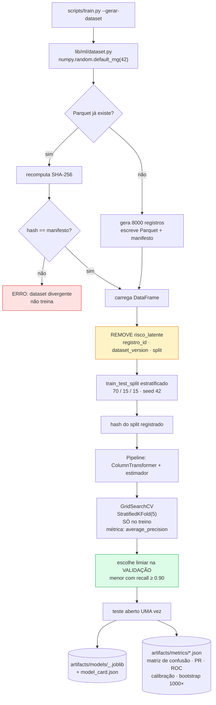
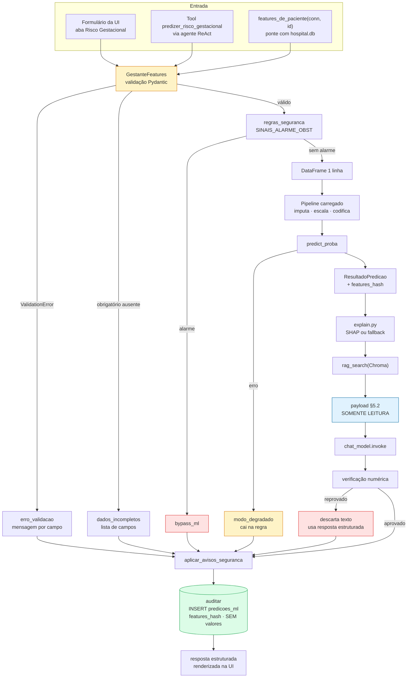
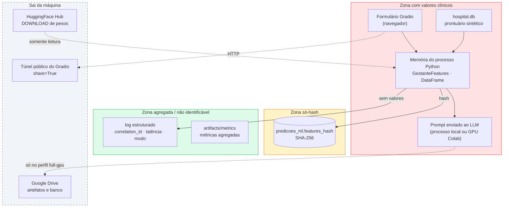

# Fluxo de Dados

**Agente responsável:** `ArchitectureAgent`
**Status:** Projeto. O fluxo de treino **não existe ainda**; o fluxo de inferência existe apenas
parcialmente (RAG, LLM, SQLite), sem a trilha de ML.
**Pergunta que o documento responde:** de onde cada dado vem, o que o transforma, onde ele para,
e em que ponto ele deixa de ser sensível.

---

## 1. Inventário de origens

Cinco origens distintas, com naturezas jurídicas e técnicas diferentes:

| # | Origem | Natureza | Sensível? | Versionada no git? | Onde vive |
|---|---|---|---|---|---|
| 1 | `lib/mock_data.py` → `hospital.db` | sintética (Faker `pt_BR`, semente 42) | **não** — nenhuma pessoa real | não (`.gitignore` exclui `*.db`) | Drive / volume local |
| 2 | 39 PDFs de protocolos → Chroma | pública (MS, FEBRASGO, INCA) | não | não (`.gitignore` exclui `files/`, `**/chroma/`) | Drive / volume local |
| 3 | `lib/ml/dataset.py` → Parquet *(novo)* | sintética (`numpy.default_rng(42)`) | **não** | **não** o Parquet; **sim** o manifesto (ADR-011) | `artifacts/data/` |
| 4 | Formulário da UI / argumentos da tool | **dado clínico digitado pelo profissional** | **sim, potencialmente** | jamais | memória do processo |
| 5 | Pesos do modelo (HF Hub + adapter LoRA) | modelo | não | não (`.gitignore` exclui `*.safetensors`, `**/adapter_final/`) | Hub / Drive |

A origem 4 é a única que pode conter dado de pessoa real, e é a única para a qual existem regras
de propagação neste documento. As demais são declaradamente sintéticas ou públicas.

---

## 2. Visão geral

```mermaid
flowchart LR
    subgraph TREINO["Tempo de TREINO — offline, CPU, sem LLM"]
        direction TB
        G["dataset.py<br/>gerador determinístico<br/>semente 42"]
        PQ[("Parquet<br/>8000 × 23+1")]
        MF[["manifesto JSON<br/>SHA-256<br/>VERSIONADO"]]
        SP["split estratificado<br/>70/15/15"]
        PL["Pipeline sklearn<br/>imputação→escala→codificação<br/>+ estimador"]
        AR[("artifacts/models<br/>.joblib + model_card.json")]
        MT[("artifacts/metrics<br/>*.json + curvas")]

        G --> PQ
        G --> MF
        PQ --> SP --> PL --> AR
        PL --> MT
    end

    subgraph INFER["Tempo de INFERÊNCIA — online"]
        direction TB
        IN["entrada clínica<br/>UI ou tool"]
        PD["GestanteFeatures<br/>Pydantic"]
        DF["DataFrame 1×N"]
        MD["Pipeline carregado<br/>predict_proba"]
        EX["explain.py"]
        RG[("Chroma<br/>protocolos")]
        PY["payload somente-leitura"]
        LM["LLM"]
        VR["verificação<br/>anti-alucinação"]
        UIO["resposta na UI"]
        AU[("predicoes_ml<br/>SÓ HASH")]

        IN --> PD --> DF --> MD --> EX --> PY
        RG --> PY
        PY --> LM --> VR --> UIO
        MD --> AU
    end

    AR -.carregado por registry.py.-> MD
    MF -.verificado por --verificar-dataset.-> PQ

    style TREINO fill:#f8fafc
    style INFER fill:#eff6ff
    style AU fill:#dcfce7,stroke:#16a34a
    style IN fill:#fee2e2,stroke:#dc2626
```

Em vermelho, o único ponto de entrada de dado potencialmente sensível. Em verde, o único ponto de
persistência dessa trilha — e ali só entra hash.

---

## 3. Fluxo de treino, passo a passo

Executado por `python scripts/train.py`, inteiramente em CPU, sem LLM e sem rede.



### Pontos em que o fluxo pode corromper o experimento

| Etapa | Vazamento possível | Controle |
|---|---|---|
| Carga | `risco_latente` entra como feature | Removida explicitamente; `tests/unit/test_dataset_sem_vazamento.py` falha se aparecer |
| Pré-processamento | `fit` do escalonador sobre treino + validação | Tudo dentro do `Pipeline`; `fit` só no treino |
| Seleção de limiar | Limiar escolhido no teste | Escolhido na validação; teste aberto uma vez |
| Múltiplos olhares | Teste consultado a cada iteração | Hash do split registrado para provar que não mudou |
| Rotulagem | Rótulo como função determinística das features | Modelo latente logístico + ruído de Bernoulli (ADR-004) |

Detalhe completo em `docs/dados/RISCOS_DE_VAZAMENTO.md`.

### O que fica persistido no fim do treino

| Artefato | Caminho | Versionado? | Conteúdo |
|---|---|---|---|
| Dataset | `artifacts/data/risco_gestacional_v1.parquet` | **não** | 8 000 linhas sintéticas |
| Manifesto | `artifacts/data/risco_gestacional_v1.manifest.json` | **sim** | SHA-256, semente, contagens por classe e split |
| Modelo | `artifacts/models/*.joblib` | **não** | `Pipeline` sklearn serializado |
| Model card | `artifacts/models/*/model_card.json` | **sim** | nome, versão, `dataset_version`, `threshold`, hiperparâmetros |
| Métricas | `artifacts/metrics/*.json` | **sim** | toda métrica citada em documento precisa estar aqui (ML-AC-07) |

O critério de versionamento é simples: **binário grande e regenerável, não; metadado pequeno e
probatório, sim** (ADR-011).

---

## 4. Fluxo de inferência, passo a passo



### Transformações, uma a uma

| # | De | Para | Quem transforma | O que muda |
|---|---|---|---|---|
| 1 | `dict` bruto | `GestanteFeatures` | `schema.py` | Tipos coeridos, domínios verificados, invariantes obstétricas checadas, campos desconhecidos rejeitados |
| 2 | `GestanteFeatures` | `pd.DataFrame` 1×23 | `predict.py` | Objeto → tabela, com ordem de colunas fixada pelo `model_card` |
| 3 | `DataFrame` | matriz numérica | `ColumnTransformer` | Imputação (mediana / `desconhecido`), escalonamento, codificação. **Aqui nascem os `dados_imputados`.** |
| 4 | matriz | `(probabilidades, rótulo)` | estimador + limiar | Vetor → dupla probabilidade/classe |
| 5 | modelo + linha | `top_features` | `explain.py` | Atribuição por variável, com o método declarado |
| 6 | consulta | `list[dict]` de trechos | `rag_search` | Texto → vizinhos com `doc_id`, `category`, `chunk_id` |
| 7 | tudo acima | payload JSON | `llm_contract.py` | Consolidação; **ponto a partir do qual os números são imutáveis** |
| 8 | payload | texto clínico | LLM | Números → prosa. **Nenhum número novo é legítimo aqui.** |
| 9 | texto + payload | texto aprovado ou descartado | `validacao.py` | Filtro; não reescreve, apenas aceita ou rejeita |
| 10 | features | `features_hash` | `predict.py` | **Dado sensível → hash irreversível** |

A transformação 10 é a fronteira de privacidade deste sistema. Antes dela, há valores clínicos em
memória; depois dela, no caminho de persistência, só há um digest de 64 caracteres hexadecimais.

---

## 5. Onde o dado sensível vive — e onde não vive



### Regras de propagação

| Regra | Consequência concreta |
|---|---|
| Valor clínico **nunca** entra em log | `observabilidade.py` recebe eventos com `correlation_id`, nome do nó, latência e modo — jamais `pas_mmhg`, nome ou CPF |
| Valor clínico **nunca** entra em `predicoes_ml` | Só `features_hash`, `predicao`, `probabilidade`, `threshold`, `top_features` |
| `top_features` contém nomes e contribuições **e também valores observados** | Ponto de atenção: o contrato do payload inclui `"value": true`. Para um booleano de comorbidade isso é dado clínico. Ver §7. |
| CPF nunca existe em claro | `pacientes.cpf_hash` já é hash, desde a Fase 2 |
| O prompt do LLM **contém** dados clínicos | Inevitável — é o que ele precisa redigir. No perfil `full-gpu`, isso significa que o dado trafega para a GPU do Colab. Declarado em `ESTRATEGIA_DE_SEGURANCA.md`. |

---

## 6. Saídas do sistema

Onde o dado **deixa** o processo:

| Saída | Conteúdo | Sensível? | Controle |
|---|---|---|---|
| Markdown renderizado na UI | Predição, probabilidade, limiar, fatores, protocolo, avisos | sim (é a resposta clínica) | Túnel público do Gradio, sem autenticação — limitação declarada |
| `predicoes_ml` | Metadados + hash | não | Persistente no volume/Drive |
| `log_acesso` | Usuário, tabela, `paciente_id`, motivo | parcialmente (associa profissional a paciente) | Já existente desde a Fase 2 |
| Log estruturado (stdout) | Eventos técnicos | não | Nunca contém valor clínico |
| `artifacts/metrics/` | Métricas agregadas sobre dados sintéticos | não | Versionado |
| Requisições ao HF Hub | Identificador do modelo + token | credencial | `HF_TOKEN` só por variável de ambiente |

**Nada é enviado a API de terceiros para inferência.** O LLM roda localmente (Colab conta como
"localmente" aqui: é o mesmo processo). Não há chamada a serviço externo de LLM, nem telemetria.

---

## 7. Pontos de atenção identificados no desenho

Três, que precisam de decisão antes da implementação:

### 7.1 `top_features` carrega valores clínicos para dentro da auditoria

O contrato do payload inclui `"value": true` em cada item de `top_features`
(`ARQUITETURA_ALVO.md` §5.2), e a DDL de `predicoes_ml` grava `top_features` como JSON. Isso
significa que, embora `features_hash` proteja as entradas, o **subconjunto explicativo** delas é
gravado em claro.

Três saídas possíveis, a decidir por ADR:

| Opção | Efeito |
|---|---|
| Gravar `top_features` sem o campo `value` na auditoria, mantendo-o no payload do LLM | Preserva a explicação para o usuário e reduz o dado persistido |
| Gravar tudo, declarando que são 5 variáveis, não as 23 | Mais útil para revisão retrospectiva; menos restritivo |
| Gravar valores discretizados (faixas em vez de números) | Meio-termo; adiciona complexidade |

Recomendação: primeira opção, por coerência com a decisão de guardar hash em vez de valores.
Registrado, não decidido unilateralmente.

### 7.2 O Parquet contém `risco_latente`, e ele é a resposta

A coluna `risco_latente` — a probabilidade real do processo gerador — está **no arquivo**, e é
removida apenas na carga. Qualquer código que leia o Parquet direto, sem passar pelo carregador
de `dataset.py`, tem acesso ao gabarito. É por isso que o teste de ausência de vazamento é
obrigatório, e por isso que `dataset.py` deve ser o **único** leitor do Parquet no código de
treino.

### 7.3 Os perfis de execução deslocam a fronteira do dado

| Perfil | Onde o dado clínico chega |
|---|---|
| `ml-only` | Memória do processo e `predicoes_ml`. Sem LLM, sem prompt. Menor superfície. |
| `demo-cpu` | Idem + prompt do `FakeChatModel`, que roda no mesmo processo |
| `full-gpu` | Idem + prompt enviado ao Llama na GPU do Colab, com o Drive montado |

O perfil de menor exposição é justamente o que roda em CI. Isso é coincidência útil, não projeto —
mas vale registrar.

---

## 8. Ciclo de vida e retenção

| Dado | Criado por | Vive enquanto | Removido por |
|---|---|---|---|
| Entrada do formulário | Ação do usuário | Duração da requisição | Coleta de lixo do Python |
| `GestanteFeatures` | `schema.py` | Duração da requisição | idem |
| Histórico de chat | `ui.py` closure | Duração do processo Gradio | Botão "Limpar conversa" ou fim do processo |
| `predicoes_ml` | Nó `auditar` | Indefinidamente | Nenhum mecanismo — não há política de expurgo |
| `log_acesso` | `tools._log_acesso` | Indefinidamente | idem |
| Parquet e modelos | `scripts/train.py` | Até nova geração | Regeneráveis por semente |

**Ausência declarada:** não existe política de retenção nem rotina de expurgo. Para uma
demonstração acadêmica com dados sintéticos isso é aceitável; para qualquer uso real, não seria.
A discussão de conformidade cabe aos documentos de `docs/seguranca/`.

---

## 9. Comparação com o fluxo atual

O que muda de fato, em termos de dados:

| Aspecto | Hoje | Depois |
|---|---|---|
| Dado tabular rotulado | não existe | 8 000 registros sintéticos, versionados por manifesto |
| Entrada clínica estruturada | texto livre interpretado por LLM | objeto Pydantic validado |
| Decisão de risco | string devolvida pelo LLM | probabilidade + limiar + atribuição por variável |
| Persistência da decisão | nenhuma | `predicoes_ml`, um registro por invocação |
| Rastro de execução | lista `raciocinio` dentro da resposta | idem **mais** log estruturado com `correlation_id` |
| Reprodutibilidade | não verificável | manifesto com SHA-256 + teste de predição estável |

O fluxo de dados **existente** — prontuário → tools → agente → resposta; PDFs → Chroma → RAG —
permanece exatamente como está. A evolução acrescenta uma trilha paralela; não redireciona a
existente (ADR-001).
