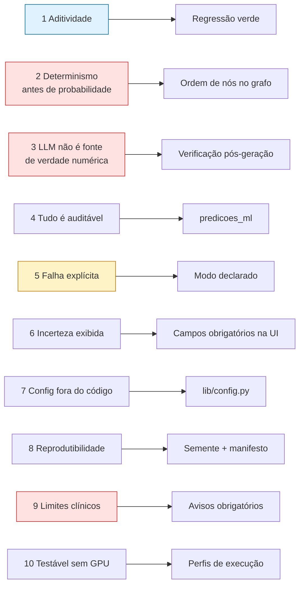

# Princípios de Arquitetura

**Agente responsável:** `ArchitectureAgent`
**Status:** Normativo para a evolução. **Nada aqui está implementado ainda.**
**Relação com as ADRs:** as ADRs decidem *o quê*; estes princípios explicam *por quê* e definem
como cada decisão será cobrada.

---

## Como ler este documento

São dez princípios. Cada um tem quatro partes, na mesma ordem:

| Parte | O que responde |
|---|---|
| **Enunciado** | A regra, em uma frase imperativa |
| **Razão** | Por que ela existe *neste* projeto, com referência ao código ou às ADRs |
| **Como é imposto** | O mecanismo concreto e verificável que a torna obrigatória |
| **Como se detecta violação** | O sinal observável que denuncia o descumprimento |

Um princípio sem mecanismo de imposição é um desejo. A terceira coluna é o que separa os dois.

Em vermelho, os princípios cuja violação tem consequência clínica. Em âmbar, os que tratam de
degradação. Em azul, o que protege o trabalho já entregue.

---

## Princípio 1 — Aditividade: nada que funciona é removido

**Enunciado.** A evolução só cria e estende. Remoção, renomeação ou alteração de semântica de
qualquer artefato existente exige uma ADR própria. Depois da evolução, os notebooks 05 a 10 devem
executar **sem uma linha de alteração**.

**Razão.** O projeto tem 14 módulos Python, 10 notebooks e três relatórios que descrevem um
sistema funcional da Fase 3. Reescrever destruiria a rastreabilidade entre fases, que faz parte da
avaliação, sem ganho técnico: os pontos de extensão existentes são limpos —
`build_langchain_tools` devolve uma lista, `build_ui` aceita um dicionário de workflows, cada
`build_*_workflow` tem assinatura uniforme. Ver **ADR-001**.

**Como é imposto.**
- Cada módulo tem classificação explícita em `COMPONENTES.md`: `existente` (intocado),
  `estendido` (só adições retrocompatíveis) ou `novo`.
- As extensões são aditivas por construção: `+1` tool na lista de `build_langchain_tools`,
  `+1` tabela em `SCHEMA_SQL`, `+1` aba em `build_ui`, `+1` nó opcional em `obstetrico.py` atrás
  da flag `ML_RISCO_HABILITADO` (**ADR-012**).
- `tests/regression/` verifica os contratos que os notebooks consomem: a lista de tools mantém os
  9 nomes originais; `build_ui` continua aceitando a assinatura anterior; os 4 workflows
  continuam devolvendo as mesmas chaves em `resposta_estruturada`.
- A flag de ML no obstétrico é testada **nos dois estados**: desligada, o comportamento deve ser
  idêntico ao atual.

**Como se detecta violação.**
- Teste de regressão vermelho.
- `git diff` mostrando remoção de linhas em `lib/alertas.py`, `lib/mock_data.py`, `lib/llm.py`,
  `lib/agent.py`, `lib/workflows/{triagem,violencia,prevencao}.py` ou nos notebooks.
- Qualquer nome de tool que desaparece da saída de `build_langchain_tools`.

---

## Princípio 2 — Determinismo antes de probabilidade

**Enunciado.** Quando existe uma regra determinística de segurança aplicável, ela é avaliada
**antes** do modelo probabilístico e pode anulá-lo. O inverso nunca ocorre: nenhuma probabilidade
rebaixa um alarme determinístico.

**Razão.** As regras de `SINAIS_ALARME_OBST` codificam sinais de emergência obstétrica — eclâmpsia
iminente, HELLP, descolamento. Têm alta especificidade para condições catastróficas. Permitir que
uma probabilidade de 0,12 rebaixe "crise convulsiva em gestante" é inaceitável. Este não é um
padrão novo: `triagem.py:127-136` já faz exatamente isso, checando `SINAIS_EMERGENCIA` antes de
consultar o LLM. O princípio generaliza um acerto existente. Ver **ADR-006**.

**Como é imposto.**
- Topologia do grafo: em `risco_ml.py`, o nó `regras_seguranca` é predecessor obrigatório de
  `executar_modelo_ml`, e a aresta condicional `bypass_ml` sai dele. Não existe caminho que chegue
  ao ML sem passar pelas regras.
- O caminho de bypass não consulta o modelo: ele não recebe `probabilities` para ignorar, ele
  simplesmente não as produz.
- A auditoria grava `modo='bypass_regra'`, tornando o desvio contável.
- Testes: um caso com sinal de alarme e probabilidade baixa deve terminar em encaminhamento
  imediato.

**Como se detecta violação.**
- Uma aresta no grafo que ligue a entrada diretamente a `executar_modelo_ml`.
- Um registro em `predicoes_ml` com `regras_disparadas` não vazio e `modo='normal'`.
- Um teste em que a presença de sinal de alarme não produz encaminhamento imediato.

---

## Princípio 3 — O LLM nunca é fonte de verdade numérica

**Enunciado.** Predições, probabilidades, limiares, contribuições de variáveis, escores e
contagens são produzidos exclusivamente pelas camadas determinística e de ML. O LLM recebe esses
valores prontos, em contrato somente-leitura, e pode apenas redigi-los. Todo número presente no
texto gerado é verificado contra o payload; havendo divergência, **o texto é descartado**.

**Razão.** O adapter em uso é um Llama 3.2 3B com tendência documentada a loops repetitivos — daí
os `repetition_penalty=1.2` e `no_repeat_ngram_size=4` fixados nos defaults de `lib/llm.py:80-88`.
Um modelo desse porte reescrevendo "0,75" como "75 % a 80 %" não é hipótese remota. Prompt não é
controle, é pedido: controle é verificação posterior. Ver **ADR-007**.

**Como é imposto.**
- `lib/ml/llm_contract.py` monta o payload (formato exato em `ARQUITETURA_ALVO.md` §5.2) e é o
  **único** caminho pelo qual números chegam ao prompt.
- `lib/validacao.py` (promovido de `referencias/validador_resposta_llm.py`, **ADR-010**) extrai
  todos os numerais do texto gerado e confere se cada um consta do payload, com tolerância de
  arredondamento; verifica também coerência de rótulo (`alto_risco` vs `habitual`).
- Em divergência, o nó `usar_resposta_estruturada` descarta o texto e entrega a saída estruturada
  determinística. A rejeição é registrada.
- A verificação é regex, não segunda chamada ao modelo: custa microssegundos, ao contrário do
  `ValidadorLLM`, que permanece desabilitado por padrão pelo motivo original (latência de 5–10 s).

**Como se detecta violação.**
- Um número no texto entregue ao usuário que não exista no payload correspondente.
- Qualquer código que escreva em `prediction`, `probabilities`, `threshold` ou `contribution`
  depois da chamada ao LLM.
- Taxa de rejeição do validador subitamente em zero — sinal de que a verificação foi desligada,
  não de que o modelo melhorou.

---

## Princípio 4 — Toda saída é auditável

**Enunciado.** Toda predição emitida gera um registro persistente que permite reconstruir, depois,
**o que** foi decidido, **por qual modelo e versão**, **sob qual limiar**, **a partir de quais
entradas** e **em que modo**.

**Razão.** Hoje, `log_acesso` cobre apenas acesso a `registros_violencia`; nenhuma triagem,
classificação de risco ou plano preventivo deixa rastro. Um sistema de apoio à decisão clínica que
não registra as decisões que apoiou não pode ser revisado, contestado nem melhorado.

**Como é imposto.**
- Tabela `predicoes_ml` (DDL em `ARQUITETURA_ALVO.md` §5.3) com `modelo_nome`, `modelo_versao`,
  `dataset_versao`, `features_hash`, `predicao`, `probabilidade`, `threshold`, `top_features`,
  `regras_disparadas` e `modo`.
- O nó `auditar` é predecessor obrigatório de `compilar_resposta` em **todos** os caminhos do
  workflow, inclusive `bypass_ml`, `modo_degradado` e `dados_incompletos` — daí o domínio de
  quatro valores em `modo`.
- `features_hash` é SHA-256 das features, **não** os valores: prova que duas predições partiram
  das mesmas entradas sem duplicar dado clínico sensível numa segunda tabela (Princípio 9 e
  `docs/seguranca/`).
- `registry.py` garante que `modelo_versao` e `dataset_versao` sejam lidos do `model_card.json`
  do artefato carregado, não escritos à mão.

**Como se detecta violação.**
- Contagem de respostas exibidas na UI maior que a contagem de linhas em `predicoes_ml` no mesmo
  intervalo.
- Um caminho no grafo que alcance `compilar_resposta` sem passar por `auditar`.
- Um registro com `modelo_versao` vazia ou literal (`'1.0.0'` escrito no código em vez de lido do
  artefato).

---

## Princípio 5 — Falha é explícita, nunca silenciosa

**Enunciado.** Nenhuma falha pode ser convertida em resultado plausível. Degradação é permitida;
degradação não declarada, não.

**Razão.** Este é o problema mais grave do código atual. `common.llm_json` devolve um `default`
quando o parse falha (`common.py:49`), e em `_avaliar_risco_gestacional` esse default é
`{'classificacao': 'habitual'}` (`obstetrico.py:135-136`). Uma gestante de alto risco cuja
avaliação falhou por erro de parse sai do sistema classificada como risco habitual, e nada na
saída indica que houve falha. O falso negativo silencioso é o pior erro possível neste domínio —
é o mesmo raciocínio que sustenta a escolha de recall como métrica primária
(`docs/ml/DEFINICAO_DO_PROBLEMA.md` §5.1).

**Como é imposto.**
- Quatro caminhos de exceção desenhados no grafo desde o início (`ARQUITETURA_ALVO.md` §4):
  `erro_validacao`, `dados_incompletos` → human-in-the-loop, `modo_degradado`,
  `usar_resposta_estruturada`.
- Cada um grava seu próprio valor em `predicoes_ml.modo`, e cada um produz uma mensagem visível
  ao usuário dizendo o que aconteceu — "o modelo não está disponível; a classificação abaixo veio
  da regra determinística" é uma resposta aceitável; devolver a mesma tela de sempre, não.
- Campo obrigatório ausente **não é imputado**. `GestanteFeatures` levanta `DadosIncompletosError`
  com a lista de campos faltantes (`docs/dados/CONTRATO_DE_DADOS.md` §5). Imputar pressão arterial
  pela mediana e devolver uma probabilidade como se fosse medida é precisamente o silêncio que
  este princípio proíbe.
- Campo **opcional** imputado aparece em `dados_imputados` no payload e na UI.

**Como se detecta violação.**
- Um `default=` em caminho de decisão estruturada sem sinalização correspondente no estado.
- Uma resposta ao usuário que não distingue modo `normal` de modo `degradado`.
- `except: pass` em qualquer lugar.

---

## Princípio 6 — A incerteza é sempre exibida

**Enunciado.** Nenhuma classificação é apresentada como fato. Probabilidade, limiar operacional,
lista de campos imputados e método de explicação acompanham a saída, na interface e no registro
de auditoria.

**Razão.** A decisão de usar limiar diferente de 0,5 (escolhido na validação como o menor que
atinge recall ≥ 0,90) só é interpretável se o limiar for visível: dizer "alto risco" sem dizer
"acima de 0,31" esconde que a operação foi deliberadamente calibrada para superestimar. E uma
probabilidade mal calibrada exibida sem o Brier score que a qualifica é desinformação travestida
de número.

**Como é imposto.**
- O payload de `ARQUITETURA_ALVO.md` §5.2 já carrega `threshold`, `probabilities` e
  `dados_imputados` como campos de primeira classe.
- A aba "Risco Gestacional (ML)" exibe os três, mais a faixa de probabilidade — que é como a
  granularidade perdida na escolha binária é parcialmente devolvida ao usuário (**ADR-003**).
- `explain.py` registra no payload **qual método** produziu as contribuições (SHAP `TreeExplainer`
  ou fallback), para que uma explicação por permutação nunca seja apresentada como SHAP
  (**ADR-008**).

**Como se detecta violação.**
- Uma tela que mostra o rótulo sem a probabilidade, ou a probabilidade sem o limiar.
- Um payload em que `dados_imputados` esteja ausente quando o pipeline imputou algo.
- Uma explicação sem identificação do método que a gerou.

---

## Princípio 7 — Configuração vive fora do código

**Enunciado.** Caminhos, credenciais, flags de funcionalidade e perfil de execução são resolvidos
por variável de ambiente através de um único módulo. Nenhum novo caminho absoluto é escrito em
código.

**Razão.** Hoje os defaults Colab estão em `db.py:13`, `llm.py:56` e em células de notebook; não
existe `.env.example`; e a constante de data está replicada em quatro arquivos, com **um deles
divergindo** (`prevencao.py:34` usa 2026-05-23 contra 2026-05-22 nos demais). Sem configuração
central, não há execução local, não há Docker e não há CI. Ver **ADR-009**.

**Como é imposto.**
- `lib/config.py` centraliza a resolução e **preserva os defaults atuais**, para que os notebooks
  continuem funcionando sem edição — requisito da ADR-001. É a generalização de um padrão que já
  existe: `db.get_db_path()` já lê `HOSPITAL_DB_PATH`.
- `.env.example` versionado lista todas as variáveis. `.env` continua excluído pelo `.gitignore`.
- `PERFIL_EXECUCAO` ∈ {`ml-only`, `demo-cpu`, `full-gpu`} seleciona o perfil (**ADR-005**).
- Segredo (`HF_TOKEN`) só por ambiente, nunca em arquivo versionado nem em argumento de linha de
  comando.

**Como se detecta violação.**
- Um literal começando com `/content/drive` em código novo.
- Uma variável de ambiente lida com `os.environ` fora de `lib/config.py`.
- Uma execução que funciona na máquina do autor e falha no contêiner por caminho não resolvido.

---

## Princípio 8 — Reprodutibilidade por semente e manifesto

**Enunciado.** Todo artefato gerado — dataset, split, modelo, métrica — é função determinística de
código versionado mais uma semente declarada. Onde o artefato não é versionado, um manifesto
versionado o descreve com hash criptográfico.

**Razão.** O dataset sintético tem 8 000 linhas em Parquet; versioná-lo incharia o repositório, e
não versioná-lo sem manifesto tornaria "é reprodutível" uma afirmação não verificável. O
manifesto com SHA-256 transforma a afirmação em teste executável. Ver **ADR-011**.

**Como é imposto.**
- `RANDOM_SEED = 42` fixado em geração, split, treino e bootstrap
  (`docs/ml/DEFINICAO_DO_PROBLEMA.md` §6).
- `artifacts/data/risco_gestacional_v1.manifest.json` — **versionado** — com SHA-256 do Parquet,
  semente, versão do contrato, contagem por classe e por split.
- `scripts/train.py --verificar-dataset` regenera e compara o hash.
- `numpy.random.default_rng`, estável por contrato, em vez do RNG global legado.
- `model_card.json` ao lado de cada `.joblib`, contendo `dataset_version` e `threshold`;
  carregar um modelo cuja `dataset_version` tenha MAJOR diferente do dataset presente é erro,
  não aviso (`docs/dados/CONTRATO_DE_DADOS.md` §6).
- Teste `tests/regression/test_predicao_estavel.py`: as mesmas features devem produzir a mesma
  probabilidade entre execuções.

**Como se detecta violação.**
- Hash recomputado diferente do manifesto.
- Duas execuções do gerador produzindo arquivos distintos.
- Um número em documento que não seja rastreável a um arquivo em `artifacts/metrics/`
  (critério ML-AC-07).

---

## Princípio 9 — Os limites clínicos são explícitos e inegociáveis

**Enunciado.** O sistema declara, em toda saída, que é apoio à decisão e não diagnóstico, e que
o modelo foi treinado em dados **sintéticos** sem validação clínica. Nenhuma métrica obtida neste
projeto pode ser apresentada como evidência de desempenho clínico.

**Razão.** As métricas medirão a capacidade do modelo de recuperar um processo gerador que nós
mesmos definimos — e nada além disso (`docs/ml/DEFINICAO_DO_PROBLEMA.md` §7). Um PR-AUC alto aqui
prova que o pipeline está correto, não que o modelo é útil. Essa distinção é a mais fácil de
perder na comunicação e a mais cara de perder na prática. É também por essa razão que a detecção
de violência foi deliberadamente **excluída** do escopo de ML: transformar suspeita de violência
doméstica em escore probabilístico de caixa-preta, treinado em dados sintéticos, é irresponsável;
a matriz determinística de `alertas.py` é auditável e permanece determinística (**ADR-002**).

**Como é imposto.**
- `safety_notice` e `aviso_dados_sinteticos` são campos **obrigatórios** do payload
  (`ARQUITETURA_ALVO.md` §5.2) — ausência é erro de contrato, não omissão de estilo.
- O nó `aplicar_avisos_seguranca` é atravessado por **todos** os caminhos do workflow, inclusive
  bypass e modo degradado.
- `lib/validacao.py` bloqueia padrões de diagnóstico definitivo e de prescrição sem referência a
  protocolo, e exige menção a serviços da rede em categorias sensíveis — lógica já implementada e
  testada em `referencias/validador_resposta_llm.py`, a ser promovida (**ADR-010**).
- Dado sensível não se propaga: a auditoria grava `features_hash`, não os valores clínicos.

**Como se detecta violação.**
- Um payload sem `safety_notice` ou sem `aviso_dados_sinteticos`.
- Um documento ou uma tela que apresente métrica sintética sem a qualificação correspondente.
- Valores clínicos brutos gravados em `predicoes_ml` ou em log.

---

## Princípio 10 — Testabilidade sem GPU

**Enunciado.** O pipeline completo — validação, regras, ML, explicabilidade, RAG, síntese,
verificação, auditoria — deve ser executável e testável em CPU, sem pesos de LLM e sem Drive.

**Razão.** O requisito de "Dockerfile funcional e comprovadamente testado" é incompatível com uma
imagem de 8 GB que exige CUDA: ela não pode ser executada na máquina de desenvolvimento
(Windows + Docker, sem GPU confirmada), e declarar que funciona sem rodá-la seria inventar
evidência. A camada de ML, que é o núcleo da nova fase, é inteiramente CPU. Ver **ADR-005**.

**Como é imposto.**
- Três perfis por `PERFIL_EXECUCAO`: `ml-only` (sem LLM, sem RAG), `demo-cpu` (`FakeChatModel`
  determinístico + Chroma local) e `full-gpu` (Llama real).
- Requisitos separados em `requirements.txt`, `requirements-ml.txt` e `requirements-llm.txt`,
  de modo que a imagem `demo-cpu` fique na casa das centenas de MB.
- `FakeChatModel` é um `BaseChatModel` que devolve respostas fixas por padrão de prompt. Ele
  **não** substitui o LLM na demonstração final; existe para tornar o pipeline verificável.
- Injeção de dependência já existente ajuda: `build_*_workflow(chat_model, conn, retriever)`
  aceita qualquer `chat_model`, inclusive um dublê.
- Nenhum teste pode depender de rede, de GPU ou do Drive.

**Como se detecta violação.**
- Um teste que falha sem GPU ou sem `HF_TOKEN`.
- Um `import torch` em módulo da camada de ML.
- `docker build` do perfil `demo-cpu` puxando `requirements-llm.txt`.

> Nota de honestidade, exigida pela própria ADR-005: nenhum documento deste conjunto pode afirmar
> que o Docker funciona antes de o log de `docker build` e `docker run` estar anexado em
> `docs/deploy/EXECUCAO_DOCKER.md`. Até lá, este princípio descreve um projeto, não um resultado.

---

## Conflitos entre princípios e como resolvê-los

Princípios colidem. Quando colidirem, esta é a precedência:

| Conflito | Precedência | Justificativa |
|---|---|---|
| 1 (aditividade) × 5 (falha explícita) | **5 vence** | Se preservar o comportamento atual significa preservar um falso negativo silencioso, corrija e registre em ADR. Aditividade protege funcionalidade, não defeito. |
| 2 (determinismo) × 6 (incerteza exibida) | **2 vence na decisão, 6 na exibição** | O bypass decide sem o ML; a tela ainda declara que o ML não foi consultado e por quê. |
| 3 (LLM não é fonte) × qualidade do texto | **3 vence** | Texto descartado é pior experiência e melhor sistema. A taxa de descarte é medida e reportada, não escondida. |
| 9 (limites clínicos) × concisão da UI | **9 vence** | Os avisos são campos obrigatórios do contrato, não decoração removível. |
| 10 (sem GPU) × fidelidade da demo | **Coexistem por perfil** | `demo-cpu` prova o pipeline; `full-gpu` demonstra o produto. A diferença é declarada no `GUIA_DEMO.md`. |

---

## Rastreabilidade princípio → ADR → mecanismo

| Princípio | ADRs | Mecanismo principal | Artefato de verificação |
|---|---|---|---|
| 1 Aditividade | 001, 012 | classificação de componentes + flag | `tests/regression/` |
| 2 Determinismo primeiro | 002, 006 | ordem de nós + `bypass_ml` | `predicoes_ml.modo` |
| 3 LLM sem verdade numérica | 007, 010 | `llm_contract.py` + `validacao.py` | taxa de descarte medida |
| 4 Auditabilidade | 006, 011 | tabela `predicoes_ml` | contagem UI × banco |
| 5 Falha explícita | 005, 007 | 4 caminhos de exceção no grafo | `modo` ≠ `normal` visível |
| 6 Incerteza exibida | 003, 008 | campos do payload §5.2 | inspeção de payload |
| 7 Config externa | 009, 005 | `lib/config.py` + `.env.example` | build Docker |
| 8 Reprodutibilidade | 004, 011 | semente + manifesto SHA-256 | `--verificar-dataset` |
| 9 Limites clínicos | 002, 004, 010 | avisos obrigatórios + validador | contrato do payload |
| 10 Testável sem GPU | 005 | perfis + requisitos separados | `docs/deploy/EXECUCAO_DOCKER.md` |
