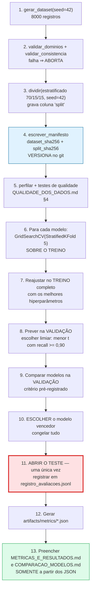

# Estratégia de Treino, Validação e Teste

**Agente responsável:** `DataEngineeringAgent` (em coordenação com `MachineLearningAgent`)
**Status:** Especificação aprovada — **nenhum split foi materializado, nenhum modelo treinado**
**Base normativa:** `docs/ml/DEFINICAO_DO_PROBLEMA.md` §6, `docs/dados/CONTRATO_DE_DADOS.md` §3.6
**Implementação alvo:** `lib/ml/dataset.py::dividir()`, `lib/ml/train.py`, `tests/unit/test_split_estratificado.py`

---

> ## ⚠ NENHUM SPLIT FOI GERADO
>
> O dataset não existe. A coluna `split` não foi atribuída a registro algum. Nenhum
> `GridSearchCV` foi executado. Nenhum limiar foi escolhido. O conjunto de teste **nunca foi
> aberto**, porque não existe.
>
> Os números deste documento — 70/15/15, semente 42, `StratifiedKFold(5)`, recall ≥ 0,90 — são
> **parâmetros de projeto declarados antes da execução**. É exatamente essa anterioridade que os
> torna um compromisso verificável em vez de uma racionalização posterior.

---

## 1. Resumo da estratégia

| Item | Definição |
|---|---|
| Proporção | **70 % treino / 15 % validação / 15 % teste** |
| Estratificação | Pela variável alvo `alto_risco` |
| Semente | **42** (`RANDOM_SEED`, a mesma da geração) |
| Tipo de divisão | **Aleatória simples estratificada** — sem agrupamento, sem ordenação temporal |
| Momento da atribuição | **Durante a geração do dataset**, gravada na coluna `split` do Parquet |
| Validação cruzada | `StratifiedKFold(n_splits=5, shuffle=True, random_state=42)` **apenas sobre o treino** |
| Busca de hiperparâmetros | `GridSearchCV` otimizando `average_precision` (PR-AUC) |
| Uso da validação | (a) escolha do limiar operacional; (b) comparação entre modelos |
| Uso do teste | **Uma única vez**, ao final, para o relatório |
| Prova de imutabilidade | Hash SHA-256 do manifesto de split, versionado no git |

### Tamanhos planejados

| Split | Proporção | n planejado | Positivos esperados a 22 % |
|---|---|---|---|
| Treino | 70 % | 5 600 | ≈ 1 232 |
| Validação | 15 % | 1 200 | ≈ 264 |
| Teste | 15 % | 1 200 | ≈ 264 |
| **Total** | 100 % | **8 000** | ≈ 1 760 |

Os valores de "positivos esperados" são **aritmética sobre a prevalência-alvo de projeto**
(8 000 × 0,70 × 0,22 = 1 232), não contagens observadas. As contagens reais serão registradas em
`QUALIDADE_DOS_DADOS.md` §4.7 após a geração.

---

## 2. Por que 70/15/15 e não outra coisa

Três partições, não duas, porque há **duas decisões distintas** a tomar antes de reportar:

| Decisão | Onde é tomada | Por que não no teste |
|---|---|---|
| Hiperparâmetros | Validação cruzada **dentro do treino** | Selecionar hiperparâmetro no teste é o vazamento mais banal e mais comum |
| **Limiar operacional** | **Validação** | O limiar é o parâmetro que mais influencia o recall — a métrica primária. Escolhê-lo no teste tornaria o recall reportado autoconfirmatório |
| Modelo vencedor | **Validação** | Comparar quatro modelos no teste e reportar o melhor é seleção sobre o teste, com viés de otimismo proporcional ao número de candidatos |
| Nada | **Teste** | O teste só é lido. Nunca decide |

Uma arquitetura de duas partições (treino/teste) obrigaria a escolher o limiar por validação cruzada
dentro do treino. É defensável, mas cria uma complicação concreta: o limiar ótimo depende da
calibração do modelo, e a calibração de um modelo ajustado em 4/5 dos dados difere da do modelo
final ajustado em 5/5. O limiar escolhido no *fold* não é o limiar correto para o modelo final.

Uma partição de validação separada evita esse descompasso: o limiar é escolhido sobre as
probabilidades do **modelo final**, em dados que ele nunca viu.

**Sobre o tamanho de 15 %:** 1 200 registros com ≈ 264 positivos é o mínimo defensável para estimar
um recall com intervalo de confiança utilizável. Um teste de 10 % (800 registros, ≈ 176 positivos)
produziria intervalos largos o bastante para que qualquer comparação entre modelos fosse
inconclusiva — e o documento teria que dizer isso, o que anularia o propósito do experimento. Um
teste de 20 % reduziria o treino a 4 800 registros sem ganho proporcional de precisão na estimativa.

---

## 3. Por que uma divisão aleatória simples é válida AQUI

Esta é a seção que justifica a escolha metodológica mais facilmente criticável do documento.
Divisão aleatória é o padrão *default* e, na maioria dos problemas clínicos reais, é **errada**. É
válida aqui por quatro razões específicas, e cada uma deixaria de valer com dado real.

### 3.1 Os registros são i.i.d. por construção

Cada um dos 8 000 registros é gerado independentemente, a partir do seu próprio índice, de uma
distribuição fixa. Não há dependência entre registros, nem estrutura hierárquica, nem
autocorrelação.

Isso é **verificável**, não presumido: `ESTRATEGIA_DE_ROTULAGEM.md` §5 estabelece que a geração é
"sem dependência de ordem — cada registro é gerado a partir do seu índice, paralelizável sem mudar
resultado". Um gerador com essa propriedade produz, por definição, uma amostra i.i.d.

Sob i.i.d., a divisão aleatória é o estimador **não-viesado** do desempenho em novas amostras da
mesma distribuição — que é exatamente e somente o que este experimento se propõe a medir.

### 3.2 Uma linha = uma gestação = uma paciente

Não existe `paciente_id` no dataset sintético. Cada registro é uma gestação avaliada num ponto do
pré-natal, e **nenhuma paciente aparece duas vezes**. Não há, portanto, o vazamento clássico de
"mesma paciente no treino e no teste".

Note a diferença com `hospital.db`, onde uma paciente **pode** ter múltiplos exames, múltiplos
ciclos e múltiplos registros de violência (`mock_data.py:299-320` gera até 3 eventos por vítima).
Se o dataset de ML fosse construído a partir daquele banco, a divisão por paciente seria
obrigatória. Ele não é — e a razão pela qual não é está em `CONTRATO_DE_DADOS.md` §1.

### 3.3 Não há estrutura temporal

Não há data de coleta, data de consulta, nem ordem cronológica. `ig_semanas` é idade **gestacional**,
não tempo de calendário: uma gestante de 30 semanas não é "posterior" a uma de 12.

Sem eixo temporal, não há deriva de distribuição a respeitar e não há sentido em uma divisão
temporal — não existe "antes" e "depois" a separar.

### 3.4 Não há agrupamento por centro, profissional ou equipamento

Confirmado em `QUALIDADE_DOS_DADOS.md` §7.4: não existe variável de unidade de saúde. Todos os
registros vêm de uma única distribuição homogênea. Sem *clusters*, `GroupKFold` não tem nada para
agrupar.

### 3.5 O que mudaria com dados reais

Tabela de correspondência, para que a escolha feita aqui não seja transportada por inércia:

| Característica do dado real | Consequência | Estratégia correta |
|---|---|---|
| Mesma paciente com múltiplas consultas no pré-natal | Registros correlacionados; divisão aleatória infla a métrica | `GroupShuffleSplit` / `StratifiedGroupKFold` **por `paciente_id`** |
| Coleta ao longo de meses ou anos | Deriva de protocolo, de população e de prática | **Divisão temporal**: treino no passado, teste no futuro. É o único desenho que estima desempenho prospectivo |
| Múltiplas unidades de saúde | Efeito de centro; modelo aprende o centro em vez da paciente | **Validação externa por centro** (*leave-one-site-out*) |
| Prevalência variável por região ou por período | Calibração não transfere | Recalibração por sítio; reportar calibração **por subgrupo** |
| Desfecho observado com atraso | Risco de usar informação do futuro | Corte temporal explícito por *feature*; auditoria de disponibilidade no momento da predição |
| Registros duplicados por erro de cadastro | Mesma paciente em dois splits sem identificador comum | Deduplicação por *fuzzy matching* **antes** do split |

**Em dado real, o desenho mínimo defensável seria:** divisão temporal para o teste final, divisão
por grupo (paciente) para a validação cruzada, e validação externa em pelo menos um centro não
usado no treino. Nenhuma dessas três coisas é possível ou necessária no dataset sintético — e essa
é precisamente a razão pela qual **o desempenho medido aqui não transfere**.

Registrado também em `LIMITACOES_DO_MODELO.md` §2.

---

## 4. Estratificação

### 4.1 Por que estratificar

Com 22 % de positivos e 1 200 registros no teste, a divisão puramente aleatória produziria variação
amostral na prevalência de cada partição. Um teste com 19 % e uma validação com 25 % tornariam a
comparação entre limiar escolhido e desempenho medido parcialmente ilusória — parte da diferença
seria diferença de prevalência, não de modelo.

A estratificação por `alto_risco` fixa a prevalência das três partições na prevalência global, e
elimina essa fonte de ruído.

### 4.2 Por que estratificar APENAS pelo alvo

Seria tecnicamente possível estratificar também por `gemelaridade` (prevalência 1,6 %), por
`cardiopatia` (1,5 %) ou por faixa etária. **Não faremos**, por três razões:

1. **Estratificação múltipla cria estratos minúsculos.** Cruzar alvo × gemelaridade × cardiopatia
   produz células com poucas unidades, e a divisão passa a ser instável — a menor mudança no
   gerador realoca registros inteiros entre splits.
2. **Estratificar por feature é uma forma branda de olhar os dados antes de dividi-los.** Ainda
   que legítima quando declarada, ela reduz a variância entre splits de um jeito que **não estaria
   disponível em produção** e torna a estimativa levemente otimista.
3. **A análise de subgrupo ficaria comprometida.** Se estratificássemos por faixa etária, a
   comparação de desempenho entre faixas perderia parte do seu significado, porque a composição
   teria sido imposta e não amostrada.

**Consequência aceita e declarada:** com `cardiopatia` a 1,5 %, o teste terá aproximadamente 18
casos. Qualquer análise de subgrupo sobre cardiopatas será **inconclusiva por tamanho de amostra**,
e o relatório dirá isso em vez de reportar um recall calculado sobre 18 observações como se fosse
informativo. Registrado como limitação antecipada em `METRICAS_E_RESULTADOS.md` §9.

### 4.3 Verificação

`tests/unit/test_split_estratificado.py`:

| Assertiva | Critério |
|---|---|
| Proporções dos três splits | 70/15/15 ± 0,5 pp |
| Prevalência por split vs. global | ± 1,0 pp |
| Soma dos splits == total | Igualdade exata |
| Todo registro tem exatamente um `split` | Sem nulos, sem valor fora do domínio |
| Interseção de `registro_id` entre splits | **Vazia** (`VAZ-06`) |
| Positivos no teste | ≥ 200 |

---

## 5. Validação cruzada dentro do treino

### 5.1 Configuração

```python
StratifiedKFold(n_splits=5, shuffle=True, random_state=42)
```

| Parâmetro | Valor | Justificativa |
|---|---|---|
| `n_splits` | **5** | Com 5 600 registros no treino, cada *fold* de validação tem 1 120 registros e ≈ 246 positivos — suficiente para uma estimativa estável de `average_precision`. 10 *folds* dobrariam o custo por um ganho marginal; 3 aumentariam a variância da estimativa |
| `shuffle` | `True` | O Parquet pode ter ordem correlacionada ao índice de geração |
| `random_state` | **42** | Mesma semente de tudo. Dois `GridSearchCV` idênticos produzem o mesmo resultado |
| Estratificado | Sim | Mesmo motivo de §4.1, agora dentro de cada *fold* |

### 5.2 O que a validação cruzada seleciona — e o que não seleciona

| Seleciona | Não seleciona |
|---|---|
| Hiperparâmetros do modelo (grid em `MODELOS_AVALIADOS.md` §3) | O **limiar operacional** — é escolhido na validação, §6 |
| — | O **modelo vencedor** entre os quatro — é escolhido na validação, §7 |
| — | Features (não há seleção de features na v1.0.0; as 24 entram) |

A ausência de seleção de features é decisão explícita: com 24 features e 5 600 registros de treino,
não há problema dimensional que a justifique, e uma seleção baseada em desempenho acrescentaria mais
uma camada de escolhas a auditar. As features entram todas; a importância relativa é assunto da
explicabilidade, não do treino.

### 5.3 Métrica otimizada: `average_precision`

`GridSearchCV(scoring='average_precision')`, não `accuracy`, não `roc_auc`, não `f1`.

| Métrica | Por que não |
|---|---|
| `accuracy` | Com 22 % de positivos, prever sempre "habitual" já dá 78 %. Proibida como critério isolado (`DEFINICAO_DO_PROBLEMA.md` §5.3) |
| `roc_auc` | Insensível ao desbalanceamento de um jeito que **engana** aqui: a taxa de falso-positivo tem 78 % dos casos como denominador, então um aumento absoluto grande de falsos positivos mal move a curva ROC |
| `f1` | Depende de um limiar — e o limiar ainda não foi escolhido. Otimizar F1 em 0,5 selecionaria hiperparâmetros bons para um limiar que não usaremos |
| `recall` | Maximizado trivialmente por prever sempre positivo. Só faz sentido **restrito** a um nível de precisão |
| **`average_precision`** | **Escolhida.** Resume a curva precisão-recall em todos os limiares, é sensível à classe minoritária, e não depende de limiar |

O ponto sutil: a métrica **primária do projeto** é o recall, mas a métrica de **seleção de
hiperparâmetros** é a PR-AUC. Não é contradição. Recall isolado não é otimizável (o ótimo é
degenerado); PR-AUC seleciona o modelo que **ranqueia melhor**, e o limiar é escolhido depois para
converter esse ranqueamento no recall desejado. Separar as duas coisas é o que permite fixar o
recall em ≥ 0,90 e ainda assim comparar modelos de forma significativa — pela precisão que cada um
entrega naquele recall.

---

## 6. Escolha do limiar operacional — na validação

### 6.1 Regra, declarada antes da execução

> **O limiar operacional é o MENOR limiar `t ∈ [0, 1]` tal que o recall da classe positiva no
> conjunto de VALIDAÇÃO seja ≥ 0,90.**
>
> A precisão resultante nesse limiar é reportada, não otimizada.

### 6.2 Procedimento

```
1. Treinar o modelo no conjunto de TREINO (com os hiperparâmetros da CV)
2. Prever probabilidades no conjunto de VALIDAÇÃO
3. Varrer t de 0,01 a 0,99 em passos de 0,01
4. Para cada t, calcular recall e precisão na validação
5. Selecionar o menor t com recall >= 0,90
6. Se NENHUM t atinge recall >= 0,90 → registrar a falha explicitamente (ver 6.4)
7. Gravar t em artifacts/models/<modelo>/model_card.json, campo "threshold"
8. O mesmo t é aplicado sem alteração ao conjunto de TESTE
```

### 6.3 Por que o *menor* limiar que atinge o alvo

Recall é monotonicamente **não-crescente** em `t`: quanto menor o limiar, mais casos são
classificados como positivos, mais positivos verdadeiros são capturados. Precisão é, em geral,
não-decrescente em `t`.

Portanto o **menor** `t` com recall ≥ 0,90 é o ponto de **maior precisão** entre todos os que
satisfazem a restrição de recall. Escolher qualquer `t` menor sacrificaria precisão sem ganho de
recall relevante; escolher um maior quebraria a restrição.

A regra é, em resumo: *maximize a precisão sujeito a recall ≥ 0,90*. A formulação em termos de
"menor limiar" é apenas a forma operacional de resolver essa restrição.

### 6.4 Se nenhum limiar atingir recall ≥ 0,90

Este caso precisa estar previsto **antes**, porque decidir o que fazer depois de ver o resultado é
como se produz um critério enviesado.

| Situação | Ação |
|---|---|
| Nenhum `t` atinge recall ≥ 0,90 | Registrar em `METRICAS_E_RESULTADOS.md` que o alvo **não foi atingido**, com o recall máximo alcançável e a precisão correspondente. **Não** relaxar o alvo para 0,85 para que o número fique bonito |
| Recall ≥ 0,90 só com precisão muito baixa | Reportar ambos. A decisão de aceitar ou não é **clínica e operacional**, não estatística, e não cabe a este documento antecipá-la |
| Modelos diferentes atingem 0,90 em limiares muito distintos | Normal e esperado — os limiares não são comparáveis entre modelos com calibrações diferentes. A comparação é feita pela **precisão no recall fixo**, não pelo limiar |

O terceiro item merece ênfase: comparar o limiar de um Random Forest com o de uma Regressão
Logística não tem sentido. `t = 0,31` num modelo e `t = 0,44` noutro não dizem nada sobre qual é
melhor. O que compara é a **precisão ao recall de 0,90**.

### 6.5 O limiar é um artefato versionado

O limiar faz parte do modelo, não do código de inferência. Gravado em
`artifacts/models/<modelo>/model_card.json` junto com `model_version`, `dataset_version` e as
métricas de validação. Carregar o modelo carrega o limiar; não há valor padrão de 0,5 em lugar
nenhum do caminho de inferência.

`tests/regression/test_predicao_estavel.py` verifica que a mesma entrada, com o mesmo modelo e o
mesmo limiar, produz a mesma saída — probabilidade e rótulo.

---

## 7. Comparação entre modelos — na validação

Os quatro modelos (`MODELOS_AVALIADOS.md`) são comparados **no conjunto de validação**, com cada um
usando o **seu próprio limiar** calibrado para recall ≥ 0,90 conforme §6.

O critério de decisão está pré-registrado em `COMPARACAO_MODELOS.md` §4 e é reproduzido aqui para
que os dois documentos não possam divergir:

> O modelo escolhido será aquele com **maior precisão** entre os que atingem **recall ≥ 0,90 no
> conjunto de validação**. Empate dentro do intervalo de confiança resolve-se pelo **modelo mais
> interpretável**.

Uma vez escolhido, **só o modelo vencedor** — e os baselines, para referência — é avaliado no teste.
Avaliar os quatro no teste e então escolher seria fazer a seleção no teste por outro nome.

---

## 8. O conjunto de teste

### 8.1 Regra de abertura única

> O conjunto de teste é avaliado **uma única vez**, ao final, depois de fixados: features,
> hiperparâmetros, limiar e modelo vencedor.

### 8.2 O que conta como "abrir o teste"

Definição operacional, porque a regra é fácil de violar sem perceber:

| Ação | Abre o teste? |
|---|---|
| Calcular métricas no teste | **Sim** |
| Olhar a matriz de confusão do teste | **Sim** |
| Rodar `predict` no teste "só para conferir" | **Sim** |
| Ajustar o limiar depois de ver o recall no teste | **Sim — e é a violação mais grave** |
| Trocar o modelo vencedor depois de ver o teste | **Sim** |
| Contar quantos registros e quantos positivos o teste tem | Não — é verificação de qualidade (D6), não usa `X` |
| Verificar que `registro_id` do teste não está no treino | Não — usa só a coluna de rastreabilidade |
| Reexecutar o teste após corrigir um **bug** no pipeline | **Sim, tecnicamente** — e por isso exige registro explícito (§8.4) |

### 8.3 Controle: manifesto de split com hash

A regra "o teste foi aberto uma vez" é uma afirmação sobre o processo, e afirmações sobre processo
não se verificam lendo documentação. O controle concreto:

```
artifacts/data/risco_gestacional_v1.manifest.json   (VERSIONADO no git)
├── dataset_sha256          SHA-256 do Parquet completo
├── split_sha256            SHA-256 da lista ordenada (registro_id, split)
├── seed                    42
├── contrato_versao         v1.0.0
├── gerador_commit          hash do commit de lib/ml/dataset.py
├── timestamp               ISO-8601 da geração
├── n_por_split             {treino, validacao, teste}
├── positivos_por_split     {treino, validacao, teste}
└── perfil                  saída completa de perfilar() (QUALIDADE_DOS_DADOS.md §3.1)
```

**`split_sha256` é o elemento decisivo.** Ele é o hash da correspondência
`registro_id → split`, ordenada de forma canônica. Ele prova que:

- a composição do teste não mudou entre a execução do treino e a do relatório;
- ninguém regerou o split com outra semente para obter uma partição mais favorável;
- o modelo salvo e as métricas reportadas referem-se à **mesma** divisão.

`scripts/evaluate.py` recarrega o manifesto, recomputa `split_sha256` a partir do Parquet e
**aborta** se divergir. `scripts/train.py --verificar-dataset` faz o mesmo para `dataset_sha256`.

Como o manifesto é versionado no git enquanto o Parquet não é (ADR-011), o histórico do git passa a
ser o registro auditável: **qualquer mudança no split aparece como um diff em um arquivo
versionado**, com autor, data e mensagem de commit. Um split silenciosamente substituído é
impossível de esconder.

### 8.4 Registro de execuções do teste

`scripts/evaluate.py` acrescenta uma linha a `artifacts/metrics/registro_avaliacoes.jsonl` a cada
execução que toca o teste:

| Campo | Conteúdo |
|---|---|
| `timestamp` | ISO-8601 |
| `split_sha256` | Para provar que a partição é a mesma |
| `modelos_avaliados` | Lista |
| `motivo` | Texto livre **obrigatório** |
| `commit` | Estado do repositório |

Se houver mais de uma entrada, **todas aparecem no relatório final**, com os motivos. Uma segunda
avaliação legítima existe: correção de um bug de pipeline invalida a primeira. O que não é legítimo
é uma segunda avaliação **sem motivo declarado**, ou com motivo do tipo "reexecutar após ajuste do
limiar".

O arquivo é *append-only* por convenção e versionado. Não é um controle técnico infalível — quem
escreve o código pode reescrevê-lo. É um controle **de auditoria**: torna a violação visível no
diff em vez de invisível.

---

## 9. Ordem de execução do protocolo



O passo 11 é o único ponto do fluxo em que o teste é tocado, e está marcado em vermelho por isso.
Os passos 6 a 10 podem ser repetidos quantas vezes for necessário sem contaminar coisa alguma — é
justamente para isso que a partição de validação existe.

O passo 13 é o compromisso que fecha o ciclo: os documentos de resultado são preenchidos **a partir
dos arquivos JSON**, não a partir de números lidos na tela ou lembrados. Idealmente, por um script
de renderização — o que torna impossível um número aparecer no Markdown sem existir no JSON.

---

## 10. Estrutura de código planejada

Assinaturas previstas. **Nada disto está implementado.**

### 10.1 `lib/ml/dataset.py`

```python
"""Geração, divisão e carregamento do dataset sintético de risco gestacional."""

RANDOM_SEED: int = 42
N_REGISTROS: int = 8_000
PROPORCOES: dict[str, float] = {'treino': 0.70, 'validacao': 0.15, 'teste': 0.15}
CONTRATO_VERSAO: str = 'v1.0.0'

# Allow-list — ver DICIONARIO_DE_DADOS.md §8.2.
# A exclusão é por omissão desta lista, nunca por lista de exclusão.
FEATURES: tuple[str, ...] = (...)          # as colunas de feature
COLUNAS_RASTREABILIDADE: tuple[str, ...] = (
    'registro_id', 'dataset_version', 'split', 'risco_latente',
)
ALVO: str = 'alto_risco'


def gerar_dataset(seed: int = RANDOM_SEED, n: int = N_REGISTROS) -> pd.DataFrame:
    """Gera o dataset completo na ordem vinculante de DICIONARIO_DE_DADOS.md §7.2."""


def dividir(df: pd.DataFrame, seed: int = RANDOM_SEED) -> pd.DataFrame:
    """Atribui a coluna 'split' por divisão estratificada 70/15/15.

    Implementação em dois passos com train_test_split(stratify=y):
      (1) 70 / 30
      (2) o bloco de 30 % é dividido ao meio → 15 / 15
    A estratificação é aplicada nos DOIS passos.
    """


def carregar(caminho: Path | None = None) -> pd.DataFrame:
    """Carrega o Parquet e valida o hash contra o manifesto. Diverge ⇒ erro."""


def carregar_features(df: pd.DataFrame, split: str) -> tuple[pd.DataFrame, pd.Series]:
    """Devolve (X, y) de um split.

    X contém EXCLUSIVAMENTE as colunas de FEATURES (allow-list).
    risco_latente, registro_id, dataset_version e split NUNCA entram em X.
    """


def hash_split(df: pd.DataFrame) -> str:
    """SHA-256 da lista canônica ordenada de (registro_id, split)."""


def perfilar(df: pd.DataFrame) -> dict:
    """Perfil de qualidade (D1, D4, D5, D6). Nunca levanta; reporta."""
```

### 10.2 `lib/ml/train.py`

```python
def selecionar_hiperparametros(modelo, grid, X_tr, y_tr) -> GridSearchCV:
    """GridSearchCV(cv=StratifiedKFold(5, shuffle=True, random_state=42),
    scoring='average_precision', n_jobs=-1, refit=True). APENAS sobre o treino."""


def escolher_limiar(y_val, p_val, recall_alvo: float = 0.90) -> tuple[float, dict]:
    """Menor limiar com recall >= recall_alvo na VALIDAÇÃO.

    Devolve (limiar, diagnostico). Se nenhum limiar atingir o alvo,
    devolve (None, {...}) com o recall máximo alcançável — NUNCA relaxa o alvo
    silenciosamente.
    """
```

### 10.3 `scripts/`

| Script | Responsabilidade | Toca o teste? |
|---|---|---|
| `scripts/train.py --gerar-dataset` | Gera, valida, divide, escreve o manifesto | Não |
| `scripts/train.py --verificar-dataset` | Regenera e compara os dois hashes | Não |
| `scripts/train.py` | Treina os 4 modelos; CV no treino; limiar na validação | **Não** |
| `scripts/evaluate.py` | **Única entrada que lê o teste.** Produz `artifacts/metrics/*.json` e registra a execução | **Sim** |
| `scripts/predict.py` | Inferência unitária a partir de um JSON de entrada | Não |

A concentração do acesso ao teste em **um único script** é o que torna a regra de abertura única
verificável por leitura de código: qualquer outro módulo que carregue
`carregar_features(df, split='teste')` é uma violação detectável por busca textual, e
`tests/integration/test_avaliacao_uma_vez.py` assere exatamente isso.

---

## 11. Testes associados

| Teste | Verifica |
|---|---|
| `tests/unit/test_split_estratificado.py` | Proporções, prevalência por split, ausência de interseção, mínimo de positivos no teste |
| `tests/unit/test_dataset_reprodutivel.py` | Mesma semente ⇒ mesmo dataset **e mesmo split** |
| `tests/unit/test_dataset_sem_vazamento.py` | `X` sem colunas de rastreabilidade; nenhum `registro_id` em dois splits |
| `tests/unit/test_limiar_origem_validacao.py` | O limiar gravado no `model_card.json` é reproduzível a partir das probabilidades de **validação** — e **não** das de teste |
| `tests/integration/test_treino_completo.py` | O pipeline treina de ponta a ponta sem tocar no teste (monitorado por espião sobre `carregar_features`) |
| `tests/integration/test_avaliacao_uma_vez.py` | Só `scripts/evaluate.py` acessa `split='teste'`; o registro de avaliações é escrito |
| `tests/regression/test_predicao_estavel.py` | Mesma entrada + mesmo modelo + mesmo limiar ⇒ mesma saída |

O teste `test_limiar_origem_validacao.py` é o mais específico e o mais valioso: ele recalcula o
limiar a partir das probabilidades de validação e confirma que bate com o gravado. Se alguém
ajustasse o limiar olhando o teste, o valor gravado deixaria de ser reproduzível pela validação e o
teste falharia. É a diferença entre **prometer** que o limiar veio da validação e **provar** que
veio.

---

## 12. Estado atual

| Item | Estado |
|---|---|
| Dataset gerado | **Não** |
| Coluna `split` atribuída | **Não** |
| `artifacts/data/*.manifest.json` | **Não existe** |
| `GridSearchCV` executado | **Não** |
| Limiar operacional escolhido | **Não** |
| Modelo vencedor escolhido | **Não** |
| **Conjunto de teste aberto** | **NUNCA — não existe** |
| `artifacts/metrics/registro_avaliacoes.jsonl` | **Não existe (zero execuções)** |

Todos os parâmetros deste documento são decisões de projeto registradas **antes** de qualquer
execução. **Nenhum resultado foi medido.**
