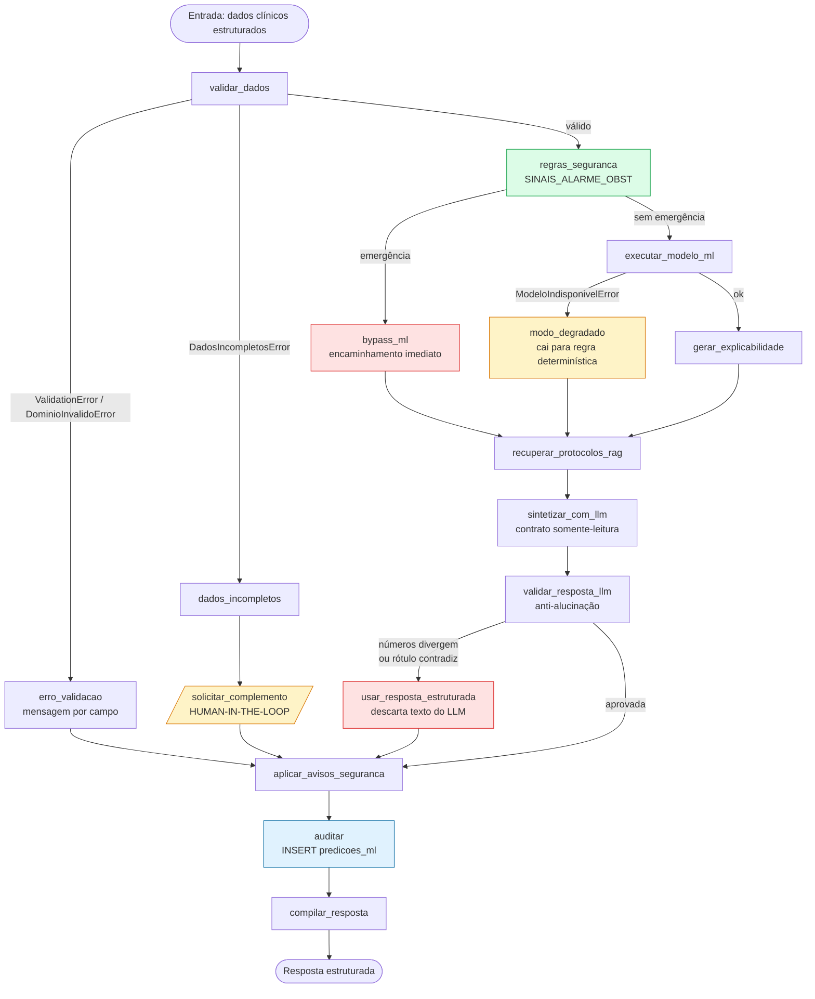
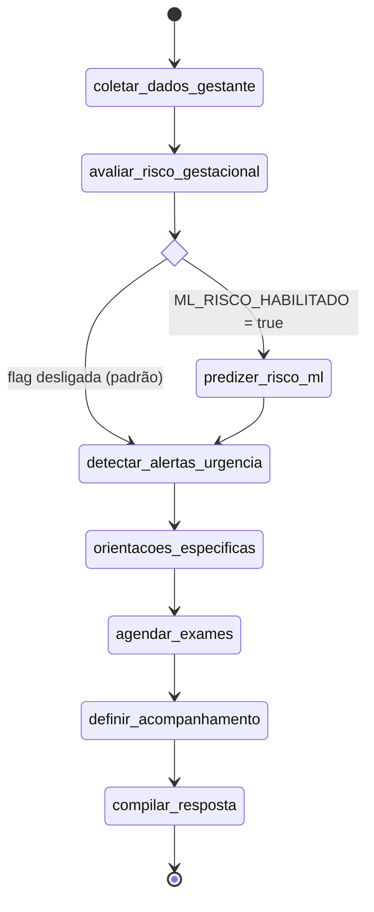

# Workflow de ML — `lib/workflows/risco_ml.py`

**Agente responsável:** `LangGraphAgent`
**Status:** Especificação completa. **O arquivo `lib/workflows/risco_ml.py` não existe.**
**Vinculado a:** `ARQUITETURA_ALVO.md` §4 · ADR-006 · ADR-012 ·
`docs/arquitetura/DIAGRAMA_LANGGRAPH.md` §5 · `CONTRATOS_DE_COMPONENTES.md`

---

> ### Banner de estado
> Nenhum nó foi implementado, nenhum grafo foi compilado, nenhuma execução ocorreu. Todas as
> assinaturas abaixo são **projetadas**. A topologia é a mesma já fixada em
> `DIAGRAMA_LANGGRAPH.md` §5 — este documento a detalha, não a redefine. Divergência entre os dois
> é defeito deste documento.

---

## 1. Por que um workflow novo, e não só um nó no obstétrico

Decidido pela **ADR-012**, alternativa 3: cria-se `risco_ml.py` **e** acrescenta-se ao obstétrico um
nó de ML opcional sob flag.

O workflow mínimo exigido tem 11 etapas, incluindo validação de entrada, caminho de dados
incompletos, human-in-the-loop, explicabilidade e auditoria. Enxertar isso em `obstetrico.py`
dobraria o arquivo e misturaria "orquestrar um atendimento obstétrico" com "executar um pipeline de
inferência auditada" — duas responsabilidades distintas.

A peça demonstrável é `risco_ml.py`. O nó opcional no obstétrico (§9) é a evidência de integração
real num fluxo existente, e é reversível: com a flag desligada, o comportamento é idêntico ao atual.

---

## 2. As 11 etapas exigidas e onde cada uma vive

| # | Etapa exigida | Nó(s) | Natureza |
|---|---|---|---|
| 1 | entrada | `START` + contrato de invocação (§4) | — |
| 2 | validar dados | `validar_dados` | determinístico (Pydantic) |
| 3 | verificar dados incompletos | `validar_dados` + `_rota_validacao` → `dados_incompletos` → `solicitar_complemento` | determinístico |
| 4 | executar regras de segurança | `regras_seguranca` | **determinístico** |
| 5 | executar modelo ML | `executar_modelo_ml` | ML |
| 6 | gerar explicabilidade | `gerar_explicabilidade` | ML (SHAP / fallback) |
| 7 | recuperar protocolos no RAG | `recuperar_protocolos_rag` | RAG |
| 8 | gerar síntese com LLM | `sintetizar_com_llm` + `validar_resposta_llm` | **LLM** + determinístico |
| 9 | aplicar avisos de segurança | `aplicar_avisos_seguranca` | determinístico |
| 10 | auditar | `auditar` | escrita em banco |
| 11 | responder | `compilar_resposta` | determinístico |

16 nós no total: as 11 etapas mais os 5 nós dos caminhos de exceção (`erro_validacao`,
`bypass_ml`, `modo_degradado`, `usar_resposta_estruturada` e `solicitar_complemento`, este último
contado em ambas as colunas por ser o ponto de HIL).

**Um único nó é baseado em LLM.** Em `obstetrico.py` são três. Essa é a mudança que a ADR-002
justifica: o LLM deixa de decidir e passa a redigir.

---

## 3. Diagrama

Corresponde ao fluxograma de `ARQUITETURA_ALVO.md` §4, com os quatro caminhos de exceção
destacados.



### 3.1 Diferença em relação ao §4 de `ARQUITETURA_ALVO.md`

Uma só, e é uma correção: no fluxograma original, `HIL` e `ERRV` vão direto para `RESP`
(`compilar_resposta`), contornando `AVI` e **`AUD`**. Aqui eles passam por `aplicar_avisos_seguranca`
e `auditar`.

Motivo: a própria `ARQUITETURA_ALVO.md` §5.3 define `modo='incompleto'` como um dos quatro valores
da coluna `predicoes_ml.modo`, e `CONTRATOS_DE_COMPONENTES.md` §8 exige "exatamente **uma** linha
por invocação do workflow que chegue a `compilar_resposta`, em qualquer modo". Se o caminho de
dados incompletos pulasse `auditar`, o valor `incompleto` nunca seria gravado — e a tentativa de
predição que foi barrada não deixaria rastro.

Registrado como **divergência resolvida a favor do contrato**, não silenciada.

---

## 4. Estado tipado — `RiscoMLState`

```python
# lib/workflows/risco_ml.py  — PROJETADO

from typing import Literal, TypedDict

ModoExecucao = Literal['normal', 'degradado', 'bypass_regra', 'incompleto']


class RiscoMLState(TypedDict, total=False):
    # ---------- Entrada ----------
    dados_clinicos:      dict              # bruto, como veio da UI/tool. Nada assumido
    paciente_id:         int | None
    usuario:             str               # para auditoria; default 'sessao_demo'
    descricao_clinica:   str | None        # texto livre, alimenta regras_seguranca e RAG
    publico:             Literal['clinico', 'tecnico']

    # ---------- Validação ----------
    features:            object | None     # GestanteFeatures; None se inválido/incompleto
    campos_faltantes:    list[str]
    erros_validacao:     list[dict]        # [{campo, valor_recebido, faixa, mensagem}]

    # ---------- Regras de segurança ----------
    regras_disparadas:   list[str]
    eh_emergencia:       bool

    # ---------- ML ----------
    resultado_predicao:  object | None     # ResultadoPredicao
    dados_imputados:     list[str]
    falha_modelo:        str | None

    # ---------- Explicabilidade ----------
    resultado_explicacao: object | None    # ResultadoExplicacao

    # ---------- RAG ----------
    fontes:              list[dict]        # {trecho, doc_id, category, chunk_id}
    fontes_sem_filtro:   bool
    falha_rag:           str | None

    # ---------- LLM ----------
    payload_llm:         dict
    variante_prompt:     str
    texto_llm:           str
    falha_llm:           str | None
    verificacao:         object | None     # ResultadoVerificacao
    texto_descartado:    bool
    resposta_texto:      str

    # ---------- Human-in-the-loop ----------
    requer_intervencao_humana: bool
    intervencao:         dict              # {tipo, campos, pergunta, opcoes}
    decisao_humana:      dict | None       # preenchido na reinvocação

    # ---------- Controle ----------
    modo:                ModoExecucao
    correlation_id:      str
    falhas:              list[dict]        # taxonomia de TRATAMENTO_DE_ERROS.md

    # ---------- Trace ----------
    raciocinio:          list[str]

    # ---------- Auditoria ----------
    auditoria_id:        int | None
    auditoria_falhou:    bool

    # ---------- Saída ----------
    resposta_estruturada: dict
```

Contrato campo a campo, com quem escreve cada um, em
`docs/langgraph/ESTADOS_E_TRANSICOES.md` §5.

### 4.1 Contrato de invocação

```python
grafo.invoke({
    'dados_clinicos': {...},        # obrigatório; pode estar incompleto
    'paciente_id': 7,               # opcional
    'usuario': 'dra_silva',         # opcional, default 'sessao_demo'
    'descricao_clinica': '...',     # opcional
    'publico': 'clinico',           # opcional, default 'clinico'
})
```

Nenhuma outra chave é aceita como entrada. Tudo o mais é produzido pelos nós.

---

## 5. Especificação dos 16 nós

Legenda de natureza: **D** = determinístico · **ML** = modelo · **RAG** = recuperação ·
**LLM** = geração · **IO** = escrita em banco.

### 5.1 `validar_dados` — **D**

```python
def _validar_dados(state: RiscoMLState) -> dict:
    """Constrói GestanteFeatures a partir de dados_clinicos.

    Não imputa campo obrigatório em nenhuma circunstância
    (CONTRATOS_DE_COMPONENTES.md §1, invariante iv).
    """
```

| Aspecto | Especificação |
|---|---|
| Lê | `dados_clinicos` |
| Escreve | `features`, `campos_faltantes`, `erros_validacao`, `modo` (se falhar), `raciocinio`, `falhas` |
| Sucesso | `features` preenchido; `campos_faltantes == []`; `erros_validacao == []` |
| `DadosIncompletosError` | `features=None`; `campos_faltantes` preenchido; `modo='incompleto'` |
| `ValidationError` / `DominioInvalidoError` | `features=None`; `erros_validacao` com uma entrada **por campo** |
| Invariantes cruzados verificados | `partos + abortos <= gestacoes`; `pad_mmhg < pas_mmhg` |
| Erro não tratado | Nenhum. As duas exceções são capturadas; qualquer outra é defeito e propaga |

**Por que `erros_validacao` é lista de dicionários e não string.** A UI precisa destacar o campo
inválido no formulário. Uma mensagem concatenada obrigaria a UI a fazer parse de texto.

### 5.2 `erro_validacao` — **D**

| Aspecto | Especificação |
|---|---|
| Lê | `erros_validacao` |
| Escreve | `resposta_texto`, `modo='incompleto'`, `raciocinio` |
| Comportamento | Renderiza uma mensagem por campo, com valor recebido e faixa aceita. **Não chama LLM** |
| Segue para | `aplicar_avisos_seguranca` |

Não chamar LLM aqui é deliberado: erro de domínio é informação estruturada e exata; passá-la por um
modelo de linguagem só introduziria chance de distorção.

### 5.3 `dados_incompletos` — **D**

| Aspecto | Especificação |
|---|---|
| Lê | `campos_faltantes` |
| Escreve | `requer_intervencao_humana=True`, `intervencao`, `modo='incompleto'`, `raciocinio` |
| Comportamento | Monta o descritor de intervenção com os campos faltantes, o nome clínico de cada um e a faixa aceita |

**Este é o caminho padrão, não o excepcional.** `DICIONARIO_DE_DADOS.md` §9.4: das 11 features
obrigatórias, apenas 5 são extraíveis de `hospital.db`. As 6 restantes faltam para **toda** paciente
do banco. Uma invocação a partir do prontuário chega aqui sempre.

### 5.4 `solicitar_complemento` — **D** (ponto de HIL)

| Aspecto | Especificação |
|---|---|
| Lê | `intervencao`, `decisao_humana` |
| Escreve | `resposta_texto`, `raciocinio` |
| Sem `decisao_humana` | Devolve o estado marcado `requer_intervencao_humana=True`. A UI renderiza formulário |
| Com `decisao_humana` | **Não ocorre neste nó** — o complemento produz nova invocação do grafo desde `START` |
| Segue para | `aplicar_avisos_seguranca` |

O mecanismo (retorno de estado em vez de `interrupt` + checkpointer) e sua justificativa estão em
`HUMAN_IN_THE_LOOP.md` §6.

### 5.5 `regras_seguranca` — **D** (precede o ML — ADR-006)

```python
def _regras_seguranca(state: RiscoMLState) -> dict:
    """Aplica SINAIS_ALARME_OBST sobre descricao_clinica e features.

    Reusa obstetrico._detectar_alertas_urgencia para a parte textual —
    não reimplementa (ADR-001, ponto único de verdade).
    """
```

| Aspecto | Especificação |
|---|---|
| Lê | `descricao_clinica`, `features` |
| Escreve | `regras_disparadas`, `eh_emergencia`, `raciocinio` |
| Fonte textual | `obstetrico.SINAIS_ALARME_OBST` via `obstetrico._detectar_alertas_urgencia` |
| Fonte estrutural | Limiares sobre features validadas: `pas_mmhg >= 160`, `pad_mmhg >= 110`, `proteinuria_fita in {'2+','3+'}` com `pas_mmhg >= 140` |
| Determinístico | Sim, integralmente. Nenhum LLM |

**A parte estrutural é acréscimo em relação ao obstétrico atual**, que só faz matching de keyword na
descrição. Com features validadas disponíveis, deixar de olhar uma PA de 170/115 porque o texto não
menciona "cefaleia" seria desperdiçar informação que o sistema tem em mãos.

**Precedência.** Se `regras_disparadas` não é vazio, o modelo **não roda**. Não há ponderação, não
há combinação. `ARQUITETURA_ALVO.md` §8: "regra determinística > inferência probabilística".

### 5.6 `bypass_ml` — **D**

| Aspecto | Especificação |
|---|---|
| Lê | `regras_disparadas` |
| Escreve | `modo='bypass_regra'`, `variante_prompt='bypass'`, `resultado_predicao=None`, `raciocinio` |
| Comportamento | Marca encaminhamento imediato. Nenhuma inferência é executada |
| Auditoria | `probabilidade=NULL`, `threshold=NULL`, `regras_disparadas` preenchido |

### 5.7 `executar_modelo_ml` — **ML**

| Aspecto | Especificação |
|---|---|
| Lê | `features` |
| Escreve | `resultado_predicao`, `dados_imputados`, `modo='normal'`, `falha_modelo`, `raciocinio` |
| Delega a | `lib/ml/predict.py::prever` — **ponto único de inferência** (ADR-012) |
| Pós-condição | `predicao == 'alto_risco'` ⟺ `probabilidades['alto_risco'] >= threshold` |
| `ModeloIndisponivelError` | `resultado_predicao=None`, `falha_modelo` preenchido → rota para `modo_degradado` |
| Retry | **Não.** Ver `TRATAMENTO_DE_ERROS.md` §6: artefato ausente não melhora com nova tentativa |

### 5.8 `modo_degradado` — **D**

| Aspecto | Especificação |
|---|---|
| Lê | `features`, `falha_modelo` |
| Escreve | `modo='degradado'`, `variante_prompt='degradado'`, `regras_disparadas` (critérios atendidos), `raciocinio` |
| Comportamento | Aplica `CRITERIOS_ALTO_RISCO` (`obstetrico.py:50-66`) como regra booleana sobre as features validadas |
| Declaração | A degradação é dita ao usuário na **primeira** seção da resposta, nunca em rodapé |

Este nó implementa, em código, o **baseline determinístico** que `DEFINICAO_DO_PROBLEMA.md` §4
descreve como modelo #1. Mesma lógica, dois usos: fallback em produção e piso de comparação na
avaliação. Implementá-la uma vez, em `lib/ml/baseline.py`, e consumir dos dois lados evita que o
fallback e o baseline divirjam.

### 5.9 `gerar_explicabilidade` — **ML**

| Aspecto | Especificação |
|---|---|
| Lê | `features`, `resultado_predicao` |
| Escreve | `resultado_explicacao`, `raciocinio` |
| Delega a | `lib/ml/explain.py::explicar` |
| Cascata (ADR-008) | `shap_tree` → `contribuicao_linear` → `permutacao` |
| Nunca falha | Se tudo falhar, `top_features=[]` com `aviso` preenchido. Nenhuma exceção sobe |
| Escopo global | `escopo == 'global'` ⟹ `aviso` obrigatório, propagado ao prompt e à UI |

### 5.10 `recuperar_protocolos_rag` — **RAG**

| Aspecto | Especificação |
|---|---|
| Lê | `resultado_predicao`, `resultado_explicacao`, `regras_disparadas`, `modo` |
| Escreve | `fontes`, `fontes_sem_filtro`, `falha_rag`, `raciocinio` |
| Consulta | Montada por `_montar_consulta` (`docs/rag/ESTRATEGIA_RAG.md` §6.1) |
| Filtro | `ginecologia_obstetricia`; se vazio, repete sem filtro e marca `fontes_sem_filtro` |
| Falha do Chroma | Capturada. `fontes=[]`, `falha_rag` preenchido. **Não derruba a predição** |
| Convergência | Recebe de `gerar_explicabilidade`, `bypass_ml` e `modo_degradado` |

### 5.11 `sintetizar_com_llm` — **LLM**

| Aspecto | Especificação |
|---|---|
| Lê | `resultado_predicao`, `resultado_explicacao`, `fontes`, `regras_disparadas`, `modo`, `publico` |
| Escreve | `payload_llm`, `variante_prompt`, `texto_llm`, `falha_llm`, `raciocinio` |
| Monta o payload | `llm_contract.montar_payload(...)` — 13 chaves, sem exceção |
| Variante | Matriz de `PROMPTS_DE_EXPLICACAO.md` §10 |
| Exceção de geração | Capturada; `texto_llm=''`, `falha_llm` preenchido. Tratada como reprovação a jusante |
| **Não** verifica nada | A verificação é do nó seguinte. Separação deliberada (§5.12) |

### 5.12 `validar_resposta_llm` — **D**

| Aspecto | Especificação |
|---|---|
| Lê | `texto_llm`, `payload_llm`, `modo`, `variante_prompt`, `falha_llm` |
| Escreve | `verificacao`, `texto_descartado`, `resposta_texto`, `raciocinio` |
| Delega a | `lib/validacao.py::verificar` — 5 camadas de `POLITICA_ANTI_ALUCINACAO.md` |
| Custo | Regex. Nenhuma segunda chamada ao modelo (ADR-010) |
| Aprovada | `resposta_texto = texto_llm` |
| Reprovada | Rota para `usar_resposta_estruturada` |

**A separação entre gerar e verificar é o que torna a suíte de testes viável sem GPU**: 24 dos 53
casos de `CASOS_DE_TESTE_LLM.md` injetam texto neste nó e não tocam no modelo.

### 5.13 `usar_resposta_estruturada` — **D**

| Aspecto | Especificação |
|---|---|
| Lê | `payload_llm`, `verificacao` |
| Escreve | `resposta_texto`, `texto_descartado=True`, `raciocinio` |
| Comportamento | `llm_contract.resposta_estruturada(payload)` + faixa explicativa (`POLITICA_ANTI_ALUCINACAO.md` §7.3) |
| Modo | **Inalterado.** Descarte do texto não é degradação do ML |

### 5.14 `aplicar_avisos_seguranca` — **D** (atravessado por todos os caminhos)

| Aspecto | Especificação |
|---|---|
| Lê | `resposta_texto`, `modo`, `dados_imputados`, `resultado_explicacao`, `fontes`, `falha_rag` |
| Escreve | `resposta_texto` (acrescido), `raciocinio` |
| Sempre acrescenta | `safety_notice` e `aviso_dados_sinteticos`, se ainda não presentes literalmente |
| Condicionalmente | Aviso de imputação; aviso de escopo global; aviso de degradação; aviso de falha do RAG; aviso de busca fora da categoria |

**Concatenação determinística, não geração.** Os avisos são anexados por código depois da
verificação. Consequência importante: se a taxa de descarte por `aviso_ausente` se mostrar alta
(`POLITICA_ANTI_ALUCINACAO.md` §9.4), a mitigação prevista é **remover os avisos do que o LLM
precisa copiar** e deixá-los inteiramente a cargo deste nó. Este desenho já comporta essa mudança.

### 5.15 `auditar` — **IO** (atravessado por todos os caminhos)

| Aspecto | Especificação |
|---|---|
| Lê | quase tudo |
| Escreve | `auditoria_id`, `auditoria_falhou`, `raciocinio` |
| Destino | `INSERT` em `predicoes_ml` (DDL em `ARQUITETURA_ALVO.md` §5.3) |
| `features_hash` | SHA-256 das features canonicalizadas. **Nunca os valores** |
| `top_features` | JSON **sem** o campo `value` |
| `probabilidade`/`threshold` | `NULL` nos modos `bypass_regra`, `degradado` e `incompleto` |
| Exatamente uma linha | Por invocação que alcance `compilar_resposta`, em qualquer modo |
| Falha de `INSERT` | **Não silenciada.** `auditoria_falhou=True`, log crítico, e a resposta declara que não foi auditada |
| Ordem | Antes de `compilar_resposta`, para que falha de renderização não apague o rastro |

### 5.16 `compilar_resposta` — **D**

| Aspecto | Especificação |
|---|---|
| Lê | todo o estado |
| Escreve | `resposta_estruturada` |
| Conteúdo | Predição, probabilidades, limiar, fatores, fontes, regras, modo, avisos, `raciocinio`, `auditoria_id`, flags de HIL e de descarte |
| Compatibilidade | Mantém a convenção dos 4 workflows: a UI lê `state['resposta_estruturada']` |

---

## 6. Arestas e funções de roteamento

### 6.1 Arestas incondicionais

```
START                       → validar_dados
dados_incompletos           → solicitar_complemento
solicitar_complemento       → aplicar_avisos_seguranca
erro_validacao              → aplicar_avisos_seguranca
bypass_ml                   → recuperar_protocolos_rag
modo_degradado              → recuperar_protocolos_rag
gerar_explicabilidade       → recuperar_protocolos_rag
recuperar_protocolos_rag    → sintetizar_com_llm
sintetizar_com_llm          → validar_resposta_llm
usar_resposta_estruturada   → aplicar_avisos_seguranca
aplicar_avisos_seguranca    → auditar
auditar                     → compilar_resposta
compilar_resposta           → END
```

### 6.2 Arestas condicionais

```python
g.add_conditional_edges('validar_dados', _rota_validacao, {
    'erro_validacao':    'erro_validacao',
    'dados_incompletos': 'dados_incompletos',
    'regras_seguranca':  'regras_seguranca',
})

g.add_conditional_edges('regras_seguranca', _rota_regras, {
    'bypass_ml':           'bypass_ml',
    'executar_modelo_ml':  'executar_modelo_ml',
})

g.add_conditional_edges('executar_modelo_ml', _rota_modelo, {
    'modo_degradado':        'modo_degradado',
    'gerar_explicabilidade': 'gerar_explicabilidade',
})

g.add_conditional_edges('validar_resposta_llm', _rota_validacao_llm, {
    'usar_resposta_estruturada': 'usar_resposta_estruturada',
    'aplicar_avisos_seguranca':  'aplicar_avisos_seguranca',
})
```

### 6.3 As quatro funções de rota

```python
def _rota_validacao(state: RiscoMLState) -> str:
    if state.get('erros_validacao'):
        return 'erro_validacao'
    if state.get('campos_faltantes'):
        return 'dados_incompletos'
    return 'regras_seguranca'


def _rota_regras(state: RiscoMLState) -> str:
    return 'bypass_ml' if state.get('regras_disparadas') else 'executar_modelo_ml'


def _rota_modelo(state: RiscoMLState) -> str:
    return ('modo_degradado' if state.get('resultado_predicao') is None
            else 'gerar_explicabilidade')


def _rota_validacao_llm(state: RiscoMLState) -> str:
    ver = state.get('verificacao')
    return ('aplicar_avisos_seguranca' if ver is not None and ver.aprovada
            else 'usar_resposta_estruturada')
```

Quatro propriedades que estas funções respeitam, e que valem como critério de revisão:

1. **São puras.** Leem o estado, devolvem string. Nenhum efeito colateral, nenhuma chamada externa.
   Testáveis com um dicionário literal.
2. **Não repetem o trabalho do nó.** `_rota_modelo` não tenta prever de novo; consulta o campo que
   `executar_modelo_ml` escreveu.
3. **Têm caso padrão seguro.** `_rota_validacao_llm` roteia para o descarte quando `verificacao` é
   `None` — o caminho conservador. Um `None` inesperado entrega a resposta estruturada, não o texto
   não verificado.
4. **A ordem de `_rota_validacao` importa.** Erro de domínio é checado antes de campo faltante: um
   payload com PA de 300 mmHg **e** IMC ausente deve reportar o erro de domínio, que é o problema
   mais grave.

---

## 7. Construção do grafo

```python
def build_risco_ml_workflow(chat_model, conn, retriever):
    """Compila o StateGraph do fluxo de Risco Gestacional por ML.

    Assinatura idêntica à dos 4 workflows existentes — build_ui aceita um
    dicionário de workflows e nada precisa mudar para acomodá-lo (ADR-001).
    """
    from langgraph.graph import StateGraph, START, END

    g = StateGraph(RiscoMLState)

    g.add_node('validar_dados',             _validar_dados)
    g.add_node('erro_validacao',            _erro_validacao)
    g.add_node('dados_incompletos',         _dados_incompletos)
    g.add_node('solicitar_complemento',     _solicitar_complemento)
    g.add_node('regras_seguranca',          _regras_seguranca)
    g.add_node('bypass_ml',                 _bypass_ml)
    g.add_node('executar_modelo_ml',        _executar_modelo_ml)
    g.add_node('modo_degradado',            _modo_degradado)
    g.add_node('gerar_explicabilidade',     _gerar_explicabilidade)
    g.add_node('recuperar_protocolos_rag',  _recuperar_protocolos_rag(retriever))
    g.add_node('sintetizar_com_llm',        _sintetizar_com_llm(chat_model))
    g.add_node('validar_resposta_llm',      _validar_resposta_llm)
    g.add_node('usar_resposta_estruturada', _usar_resposta_estruturada)
    g.add_node('aplicar_avisos_seguranca',  _aplicar_avisos_seguranca)
    g.add_node('auditar',                   lambda s: _auditar(s, conn))
    g.add_node('compilar_resposta',         _compilar_resposta)

    # ... arestas de §6.1 e §6.2 ...

    return g.compile()
```

**Convenções preservadas dos quatro workflows existentes:**

| Convenção | Onde já existe |
|---|---|
| `build_*_workflow(chat_model, conn, retriever)` | todos os quatro |
| Nós com dependência via closure | `_parse_sintomas(chat_model)`, `_orientacoes_especificas(chat_model, retriever)` |
| `conn` injetada por `lambda s: _no(s, conn)` | `violencia.py:278`, `prevencao.py:280-281` |
| Nó final `compilar_resposta` escrevendo `resposta_estruturada` | todos os quatro |
| `raciocinio` concatenado manualmente | todos os quatro |

O ganho de seguir a convenção é concreto: `build_ui` recebe um dicionário de workflows e a nova aba
entra sem alterar nada na assinatura.

---

## 8. Cobertura dos modos pelos caminhos

| Caminho | Nós atravessados (resumido) | `modo` | Predição? | RAG? | LLM? | Auditado? |
|---|---|---|---|---|---|---|
| Feliz | V → REG → ML → EXP → RAG → LLM → VAL → AVI → AUD → RESP | `normal` | sim | sim | sim | sim |
| LLM rejeitado | ... → VAL → FALL → AVI → AUD → RESP | `normal` | sim | sim | sim (descartado) | sim |
| Emergência | V → REG → BYP → RAG → LLM → VAL → AVI → AUD → RESP | `bypass_regra` | **não** | sim | sim | sim |
| Modelo indisponível | V → REG → ML → DEG → RAG → LLM → VAL → AVI → AUD → RESP | `degradado` | por regra | sim | sim | sim |
| Dados incompletos | V → INC → HIL → AVI → AUD → RESP | `incompleto` | **não** | **não** | **não** | sim |
| Erro de domínio | V → ERRV → AVI → AUD → RESP | `incompleto` | **não** | **não** | **não** | sim |

Duas observações:

**O caminho de dados incompletos não passa pelo RAG.** Decisão T-04 do ciclo 1: `WORKFLOW_ML.md` §8
prevalece; `docs/rag/ESTRATEGIA_RAG.md` §7 foi alinhada. Orientação de pré-natal genérica permanece
como extensão futura (`dados_incompletos → recuperar_protocolos_rag`), fora desta fase.

**Erro de domínio audita como `incompleto`.** O domínio de `predicoes_ml.modo` tem quatro valores e
nenhum deles é `erro_validacao`. Alternativas: (a) reusar `incompleto`, que é o que se faz aqui;
(b) alterar o DDL. Opção (a) preserva o DDL publicado ao custo de agrupar duas situações distintas
na mesma categoria. Registrado.

---

## 9. Nó de ML opcional em `obstetrico.py` (ADR-012)

### 9.1 Flag

```python
# lib/config.py — PROJETADO
ML_RISCO_HABILITADO: bool = os.environ.get('ML_RISCO_HABILITADO', '0') == '1'
```

Default **desligado**. Com a flag em `0`, o grafo compilado é byte a byte o atual.

### 9.2 Topologia



### 9.3 O nó

```python
def _predizer_risco_ml(state: ObstetricoState) -> dict:
    """Sobrepõe a classificação do LLM pela do modelo, quando disponível.

    Só roda com ML_RISCO_HABILITADO. Delega a lib/ml/predict.py — o MESMO
    ponto usado por risco_ml.py (ADR-012, mitigação do caminho duplo).
    """
    from ..ml import predict, schema

    try:
        features = schema.features_de_dados_gestante(state.get('dados_gestante', {}))
        res = predict.prever(features)
    except (schema.DadosIncompletosError, predict.ModeloIndisponivelError) as e:
        # Fallback: preserva a classificação do LLM, já no estado
        return {
            'raciocinio': state.get('raciocinio', []) + [
                f'ML não aplicado ({type(e).__name__}); '
                f'mantida a classificação do LLM: {state.get("classificacao_risco")}'
            ],
        }

    return {
        'classificacao_risco': res.predicao,
        'classificacao_origem': 'modelo_ml',
        'probabilidade_ml': res.probabilidades[res.predicao],
        'threshold_ml': res.threshold,
        'raciocinio': state.get('raciocinio', []) + [
            f'Classificação por ML: {res.predicao} '
            f'(p={res.probabilidades[res.predicao]:.2f}, limiar={res.threshold:.2f}); '
            f'substitui a classificação do LLM.'
        ],
    }
```

### 9.4 Como o caminho do LLM é preservado

Três camadas de preservação, em ordem:

| # | Camada | Efeito |
|---|---|---|
| 1 | Flag desligada por padrão | O nó nem entra no grafo |
| 2 | `avaliar_risco_gestacional` continua rodando **antes** | Com a flag ligada, o LLM ainda classifica; o ML sobrescreve. Se o ML falhar, a classificação do LLM já está no estado |
| 3 | `except` explícito sobre as duas exceções esperadas | Dados incompletos ou modelo ausente devolvem `{}` de sobrescrita, mantendo o valor anterior |

A camada 2 tem um custo assumido: com a flag ligada, roda-se um nó de LLM cujo resultado é
descartado na maior parte das vezes. Vale a latência porque garante que o fallback esteja pronto no
estado, sem `try/except` aninhado nem nó extra. Numa versão posterior, a rota poderia pular
`avaliar_risco_gestacional` quando o modelo estiver carregado — otimização fora de escopo agora.

### 9.5 Campos acrescentados a `ObstetricoState`

```python
classificacao_origem: str          # 'llm' | 'modelo_ml' | 'regra'
probabilidade_ml:     float | None
threshold_ml:         float | None
```

Aditivos, em `TypedDict` com `total=False`. Nenhum consumidor atual quebra: `lib/ui.py`
`_render_obstetrico` lê por `.get()` e ignora chaves que não conhece.

`classificacao_origem` é o campo que resolve um problema real: hoje, olhando a resposta do
obstétrico, é impossível saber se `classificacao_risco` veio do LLM ou de outro lugar.

### 9.6 Regressão exigida

| Teste | Verifica |
|---|---|
| `test_obstetrico_flag_desligada` | Grafo compilado idêntico ao atual; mesmos nós, mesmas arestas |
| `test_obstetrico_flag_ligada_modelo_ok` | `classificacao_risco` vem do ML; `classificacao_origem == 'modelo_ml'` |
| `test_obstetrico_flag_ligada_modelo_ausente` | Classificação do LLM preservada; rastro registra o fallback |
| `test_notebooks_intactos` | Notebooks 05–10 seguem executando sem alteração (ADR-001) |

---

## 10. Perfis de execução

| Perfil | `sintetizar_com_llm` | `recuperar_protocolos_rag` | `executar_modelo_ml` | Caminho resultante |
|---|---|---|---|---|
| `ml-only` | pulado; vai direto a `usar_resposta_estruturada` | pulado; `fontes=[]` | sim | normal, sem texto gerado |
| `demo-cpu` | `FakeChatModel` | Chroma local reindexado | sim | completo, determinístico |
| `full-gpu` | Llama 3.2 3B + LoRA | Chroma completo | sim | completo, real |

Em `ml-only`, a saída é `resposta_estruturada(payload)`. É justamente por isso que essa função
precisa ser boa sozinha (`CONTRATO_ENTRADA_SAIDA_LLM.md` §10): num dos três perfis, ela é a única
saída que existe.

---

## 11. Estado atual

| Item | Estado |
|---|---|
| `lib/workflows/risco_ml.py` | **Não existe** |
| `lib/ml/` (predict, explain, schema, baseline) | **Não existe** |
| `lib/validacao.py` | **Não existe** |
| `lib/ml/llm_contract.py` | **Não existe** |
| `lib/config.py` com `ML_RISCO_HABILITADO` | **Não existe** |
| Tabela `predicoes_ml` | **Não existe** |
| Nó opcional em `obstetrico.py` | **Não implementado** |
| Aba "Risco Gestacional (ML)" na UI | **Não implementada** |
| Grafo compilado alguma vez | **Não** |
