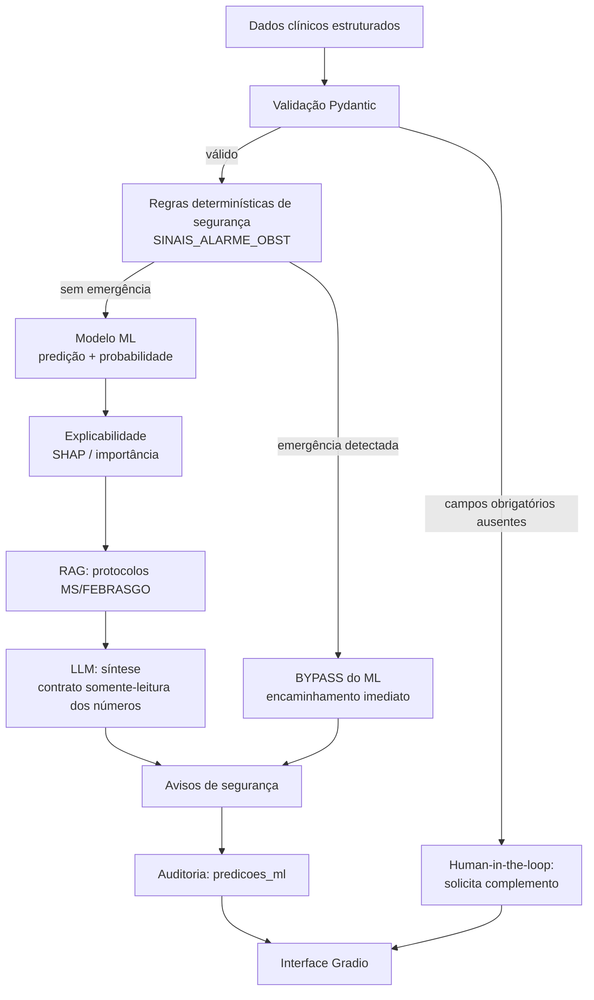

# Definição do Problema de Machine Learning

**Agente responsável:** `MachineLearningAgent`
**Status:** Proposta aprovada para implementação (Ciclo 1) — **nenhum modelo treinado ainda**
**Depende de:** `docs/dados/CONTRATO_DE_DADOS.md`, `docs/dados/ESTRATEGIA_DE_ROTULAGEM.md`

---

## 1. Ponto de partida: por que este problema

A escolha **não é arbitrária**. Ela vem de um achado concreto na leitura do código.

Em `lib/workflows/obstetrico.py`, o nó `_avaliar_risco_gestacional` decide hoje se uma gestante é
`habitual` ou `alto_risco` — e essa decisão é tomada **pelo LLM**, recebendo a lista de critérios
como texto livre dentro do prompt:

```124:144:lib/workflows/obstetrico.py
def _avaliar_risco_gestacional(chat_model):
    def node(state: ObstetricoState) -> dict:
        dados = state.get('dados_gestante', {})
        sistema = ('Você é obstetra. Classifique como "habitual" ou "alto_risco" '
                   'conforme os critérios MS/FEBRASGO.')
        criterios = '; '.join(CRITERIOS_ALTO_RISCO)
        prompt = (
            f'Dados da gestante:\n{dados}\n\n'
            f'Critérios de alto risco (qualquer um basta): {criterios}\n\n'
            'Responda: {"classificacao": "habitual|alto_risco", "fatores": ["..."]}'
        )
        out = common.llm_json(chat_model, prompt, sistema,
                             default={'classificacao': 'habitual', 'fatores': []})
```

Isto é exatamente o tipo de decisão que **não deveria** estar num LLM de 3B:

- é uma **classificação binária sobre variáveis estruturadas**;
- o resultado precisa ser **estável e reprodutível** (dois prompts idênticos devem dar o mesmo rótulo);
- precisa de **probabilidade calibrada**, não de um rótulo categórico sem grau de confiança;
- precisa de **explicabilidade auditável** por variável, não de uma lista de "fatores" que o
  modelo pode inventar;
- o `default` em caso de falha de parse é `'habitual'` — ou seja, **a falha silenciosa do LLM
  produz um falso negativo**, que é o pior erro possível neste domínio.

Substituir essa decisão por um classificador supervisionado é, portanto, uma evolução
**tecnicamente justificada pela arquitetura existente**, e não um enxerto de ML para cumprir
requisito de entrega.

---

## 2. Enunciado formal

> **Dado um conjunto de variáveis clínicas estruturadas de uma gestante no momento da consulta
> de pré-natal, estimar a probabilidade de que a gestação se enquadre como de ALTO RISCO,
> exigindo encaminhamento ao pré-natal de alto risco e vigilância intensificada.**

| Atributo | Definição |
|---|---|
| **Tipo de tarefa** | Classificação binária supervisionada |
| **Unidade de observação** | Uma gestação, avaliada num ponto do pré-natal |
| **Variável alvo** | `alto_risco` ∈ {0, 1} |
| **Classe positiva** | `1` = alto risco (encaminhamento a pré-natal de alto risco) |
| **Saída do modelo** | `P(alto_risco = 1 | X)` ∈ [0, 1] + rótulo sob limiar operacional |
| **Cardinalidade de features** | **24** variáveis (enumeração de `docs/dados/CONTRATO_DE_DADOS.md` §3.1–3.4; pendência PC-01 encerrada) |
| **Prevalência da classe positiva** | ≈ 22 % (desbalanceamento moderado, deliberado) |
| **Horizonte temporal** | Nenhum — é classificação de estado atual, não predição de evento futuro |

### 2.1 O que o modelo NÃO é

Declaração obrigatória, replicada em toda a saída do sistema:

- **Não é diagnóstico.** "Alto risco" é uma categoria de *estratificação assistencial* do
  Ministério da Saúde, não uma doença.
- **Não prediz desfecho materno ou fetal.** Não estima mortalidade, prematuridade, nem
  complicação específica.
- **Não substitui a avaliação do obstetra.** É camada de apoio à decisão.
- **Não foi validado clinicamente.** Foi treinado em dados sintéticos — ver seção 7.

---

## 3. Por que binário e não multiclasse

Foram consideradas três formulações:

| Formulação | Prós | Contras | Decisão |
|---|---|---|---|
| Binária `habitual` / `alto_risco` | Alinhada ao vocabulário já usado em `ObstetricoState.classificacao_risco`; compatível com a UI existente; métricas simples de interpretar; permite ajuste de limiar por recall | Perde granularidade | **Escolhida** |
| Ternária `baixo` / `medio` / `alto` | Mais granular; combina com o exemplo de payload do prompt mestre (§5.7) | Não existe correspondente na estratificação MS/FEBRASGO (que é binária); fronteira `medio` seria arbitrária num dataset sintético | Rejeitada |
| Regressão de escore contínuo | Rico em informação | Não há escore de referência para calibrar; difícil de auditar | Rejeitada |

**Compatibilidade com o prompt mestre:** o exemplo de payload em §5.7 mostra três classes
(`baixo_risco`, `medio_risco`, `alto_risco`). O contrato implementado preserva o **formato**
(dicionário `probabilities` nomeado por classe) mas com duas chaves: `{"habitual": 0.25,
"alto_risco": 0.75}`. A estrutura do contrato é respeitada; a cardinalidade segue a realidade clínica.
Registrado como **ADR-003**.

---

## 4. Modelos a treinar

Quatro, em ordem crescente de complexidade. Os dois primeiros são **baselines** e existem para
provar que os modelos de ML agregam valor real.

| # | Modelo | Papel | Por quê |
|---|---|---|---|
| 0 | `DummyClassifier(strategy='prior')` | Baseline trivial | Piso absoluto. Qualquer modelo abaixo disto é inútil. Expõe o quanto a acurácia é enganosa em classe desbalanceada. |
| 1 | **Baseline determinístico por regra** | Baseline forte | Implementa `CRITERIOS_ALTO_RISCO` de `obstetrico.py:50-66` como regra "qualquer critério presente → alto risco". **É o comportamento atual do sistema.** O ML só se justifica se superá-lo. |
| 2 | **Regressão Logística** | Modelo linear | Interpretável por coeficientes/odds ratio; probabilidades bem calibradas; padrão-ouro em escores de risco clínico. Exigido pelo prompt mestre §5.5. |
| 3 | **Random Forest** | Modelo de ensemble | Captura interações não-lineares (ex.: idade × HAS crônica) sem engenharia manual; robusto a outliers; suporta SHAP `TreeExplainer` (rápido e exato). Exigido pelo prompt mestre §5.5. |

O baseline #1 é a peça mais importante desta lista. Ele transforma a pergunta de *"o modelo tem
boa métrica?"* em *"o modelo é melhor do que a regra que já temos?"* — que é a única pergunta que
justifica adicionar ML a um sistema que já funciona.

**Modelos adicionais** (`GradientBoosting`, `XGBoost`) ficam fora do escopo obrigatório. Só serão
incluídos se LogReg e RF empatarem dentro do intervalo de confiança, e a inclusão será registrada
como decisão em `MODELOS_AVALIADOS.md`.

---

## 5. Métricas e critério de decisão

### 5.1 Métrica primária

**Recall da classe positiva (sensibilidade)**, com **PR-AUC** como métrica de ranqueamento.

Justificativa: em estratificação de risco gestacional, os dois erros não são simétricos.

| Erro | Consequência clínica | Custo |
|---|---|---|
| **Falso negativo** — gestante de alto risco classificada como habitual | Perde vigilância intensificada; consultas espaçadas (30 dias em vez de 7–14, conforme `_definir_acompanhamento`); risco de desfecho grave não detectado | **Alto e potencialmente irreversível** |
| **Falso positivo** — gestante habitual classificada como alto risco | Consultas e exames adicionais desnecessários; ansiedade; custo assistencial | Moderado e reversível |

Portanto: **o limiar de decisão NÃO será 0,5.** Será selecionado no conjunto de validação como o
menor limiar que atinja **recall ≥ 0,90**, reportando a precisão resultante. O limiar escolhido é
um artefato versionado junto ao modelo.

### 5.2 Métricas reportadas (obrigatórias, em treino / validação / teste)

- Matriz de confusão (valores absolutos e normalizados)
- Precision, Recall, F1 — **por classe** e macro
- ROC-AUC e **PR-AUC** (esta última é a mais informativa com 22 % de positivos)
- Brier score e curva de calibração (uma probabilidade mal calibrada que vai para o LLM é
  desinformação travestida de número)
- Especificidade e NPV
- Intervalos de confiança por bootstrap (1000 reamostragens) sobre o conjunto de teste

### 5.3 Métrica proibida como critério isolado

**Acurácia.** Com 22 % de prevalência, prever sempre "habitual" já entrega 78 % de acurácia. A
acurácia será reportada, mas nunca usada para escolher modelo. Exigência explícita do prompt
mestre §5.5.

### 5.4 Análise de erros obrigatória

- Perfil das gestantes em falso negativo: quais fatores de risco estavam presentes e foram
  ignorados pelo modelo?
- Perfil dos falsos positivos: o modelo está superponderando alguma variável isolada?
- Análise de subgrupo por faixa etária e por idade gestacional, para detectar desempenho desigual.

Documentado em `docs/ml/METRICAS_E_RESULTADOS.md` e `docs/ml/LIMITACOES_DO_MODELO.md`.

---

## 6. Protocolo experimental

| Item | Definição |
|---|---|
| Divisão | 70 % treino / 15 % validação / 15 % teste, **estratificada** pela variável alvo |
| Semente | `RANDOM_SEED = 42`, fixada em geração, split, treino e bootstrap |
| Seleção de hiperparâmetros | `GridSearchCV` com `StratifiedKFold(n_splits=5)` **apenas sobre o treino**, otimizando `average_precision` |
| Uso do conjunto de validação | Escolha do limiar operacional e comparação entre modelos |
| Uso do conjunto de teste | **Uma única vez**, ao final, para o relatório. Nunca para seleção. |
| Pré-processamento | Dentro de um `Pipeline` sklearn (imputação → escalonamento → codificação), ajustado **só no treino** — impede vazamento pelo escalonador |
| Desbalanceamento | `class_weight='balanced'` nos dois modelos. Sem SMOTE: com dados sintéticos, oversampling sintético sobre dados já sintéticos não agrega e dificulta a interpretação |

### Prevenção de vazamento de dados

Riscos mapeados e controles, detalhados em `docs/dados/RISCOS_DE_VAZAMENTO.md`:

1. **Vazamento pelo pré-processamento** → tudo dentro do `Pipeline`; `fit` só no treino.
2. **Vazamento pelo rótulo** → nenhuma feature pode ser função determinística do rótulo. Controle:
   auditoria de correlação; qualquer feature com |correlação| > 0,95 com o alvo é investigada.
3. **Vazamento pelo limiar** → limiar escolhido na validação, nunca no teste.
4. **Vazamento por múltiplos olhares no teste** → o teste é aberto uma vez; o script registra hash
   do split para provar que não mudou entre execuções.

---

## 7. Aviso central sobre a natureza dos dados

> **Os dados de treinamento são SINTÉTICOS e gerados por um processo estatístico conhecido.**
>
> Não existe dataset clínico real neste projeto (confirmado em `docs/00_INVENTARIO_PROJETO.md` §5).
> As métricas obtidas medem **a capacidade do modelo de recuperar um processo gerador que nós
> mesmos definimos** — e nada além disso.
>
> Elas **não** constituem:
> - validação clínica,
> - evidência de desempenho em população real,
> - base para qualquer uso assistencial.
>
> Um modelo com PR-AUC alto aqui prova que o pipeline de ML está correto — não que o modelo é
> clinicamente útil. Essa distinção é o ponto mais importante deste documento e deve aparecer na
> interface, no relatório técnico e na apresentação.

Para atenuar a circularidade, o processo gerador de rótulos **não é** a regra
`CRITERIOS_ALTO_RISCO` usada pelo baseline #1. Ele é um modelo latente logístico com interações e
ruído de Bernoulli, de modo que nenhum modelo — nem mesmo o gerador — atinge desempenho perfeito.
Detalhamento completo em `docs/dados/ESTRATEGIA_DE_ROTULAGEM.md`.

---

## 8. Integração ao sistema existente

O modelo não é um artefato isolado; ele entra no fluxo clínico em um ponto definido.



Dois pontos não negociáveis desse desenho:

1. **A regra de segurança vem ANTES do ML e pode anulá-lo.** Se `SINAIS_ALARME_OBST` detecta
   cefaleia intensa + escotomas + epigastralgia, o encaminhamento é imediato **independentemente
   da probabilidade do modelo**. Inferência probabilística nunca rebaixa uma regra determinística
   de segurança. (Prompt mestre §11.11.)
2. **O LLM recebe os números prontos e não pode alterá-los.** Ver
   `docs/llm/CONTRATO_ENTRADA_SAIDA_LLM.md` e `docs/llm/POLITICA_ANTI_ALUCINACAO.md`.

---

## 9. Critérios de aceite deste componente

| ID | Critério | Como será evidenciado |
|---|---|---|
| ML-AC-01 | ≥ 2 modelos treinados além dos baselines | `artifacts/models/` com `.joblib` + `model_card.json` |
| ML-AC-02 | Modelos comparados em métrica comum no mesmo split | `docs/ml/COMPARACAO_MODELOS.md` + `artifacts/metrics/comparacao.json` |
| ML-AC-03 | Modelo escolhido supera o baseline determinístico em recall **sem** perda inaceitável de precisão | Tabela comparativa com IC por bootstrap |
| ML-AC-04 | Falsos negativos analisados caso a caso | Seção dedicada em `METRICAS_E_RESULTADOS.md` |
| ML-AC-05 | Limiar operacional justificado e versionado | Campo `threshold` no `model_card.json` |
| ML-AC-06 | Pipeline de inferência reproduz exatamente o de treino | Teste de regressão `tests/regression/test_predicao_estavel.py` |
| ML-AC-07 | Nenhuma métrica inventada em documento | Todo número rastreável a um arquivo em `artifacts/metrics/` |

---

## 10. Estado atual

**Nenhum modelo foi treinado.** Este documento define o problema; ele não relata resultados.
`docs/ml/METRICAS_E_RESULTADOS.md` e `docs/ml/COMPARACAO_MODELOS.md` existem como estruturas
vazias e **serão preenchidos exclusivamente com saída real de execução** dos scripts
`scripts/train.py` e `scripts/evaluate.py`.
