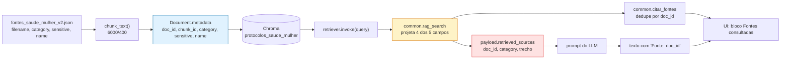

# Metadados das Fontes

**Agente responsável:** `RAGAgent`
**Status:** Descrição do esquema **existente** (`[COD]`, lido de `06_indexar_protocolos.ipynb`) +
registro das lacunas. Nenhuma alteração de metadado foi implementada.
**Vinculado a:** `ESTRATEGIA_RAG.md` · `POLITICA_DE_CITACAO.md` · `CONTRATOS_DE_COMPONENTES.md` §6

---

> ### Banner de estado
> O índice Chroma não está no repositório (gitignored). O esquema abaixo é lido do **código de
> indexação**, que é versionado, não de uma inspeção do índice. Nenhuma contagem de chunks por
> categoria foi verificada nesta fase.

---

## 1. Esquema: cinco campos por chunk `[COD]`

Gravado em `06_indexar_protocolos.ipynb`, célula 3:

```python
'metadata': {
    'doc_id':    d['filename'],
    'chunk_id':  f"{d['filename']}::{i}",
    'category':  d['category'],
    'sensitive': d['sensitive'],
    'name':      d['name'],
}
```

| Campo | Tipo | Origem | Semântica | Unicidade |
|---|---|---|---|---|
| `doc_id` | `str` | `filename` do JSON de fontes | Nome do arquivo PDF de origem. É a chave de citação | Um por documento; repetido em todos os chunks dele |
| `chunk_id` | `str` | `f"{filename}::{i}"` | Identificador do fragmento. `i` é o índice sequencial dentro do documento | **Único no índice** |
| `category` | `str` | campo `category` do JSON | Uma das 5 categorias | Repetido |
| `sensitive` | `bool` | campo `sensitive` do JSON | Marca conteúdo de violência doméstica ou saúde mental | Repetido |
| `name` | `str` | campo `name` do JSON | Nome legível do protocolo | Um por documento |

### 1.1 `chunk_id` carrega a ordem, e isso é útil

O sufixo `::i` é o índice sequencial do chunk dentro do documento. Consequências aproveitáveis:

- `chunk_id.split('::')[-1]` dá a posição relativa no documento — usado no smoke test do notebook 06
  e útil para a hipótese H-2 de `AVALIACAO_RECUPERACAO.md`;
- chunks vizinhos são recuperáveis por construção de id (`doc::6`, `doc::8` ao redor de `doc::7`),
  o que abriria caminho para expansão de contexto sem nova busca vetorial. Não implementado, mas
  possível **porque o id é ordenado** — não seria, se fosse UUID.

### 1.2 `doc_id` é um nome de arquivo

`doc_id` = `filename`, com extensão. Ele aparece cru na citação ao profissional:

```markdown
- `manual_tecnico_prenatal_2022.pdf` (ginecologia_obstetricia)
```

Nome de arquivo é razoável como identificador técnico e ruim como referência clínica. O campo
`name` existe exatamente para isso — e **não é usado na citação**. Ver §5.2.

### 1.3 `sensitive` é redundante com `category`, e a redundância é boa

`sensitive == True` ⟺ `category ∈ {violencia_domestica, saude_mental}`. O campo é derivável.

Manter os dois é defensável: `sensitive` é a condição que o `ValidadorDeterministico` testa
(regra 3), e testá-la diretamente em vez de derivá-la de um conjunto de categorias significa que
acrescentar uma sexta categoria sensível no futuro não exige alterar código de validação — exige
alterar dado.

O risco da redundância é divergência: se o JSON de fontes marcar `sensitive: false` num documento de
`violencia_domestica`, os dois campos discordam e nada detecta. **Recomendação:** um teste de
consistência do índice (`tests/unit/test_metadados_indice.py`) que assere a equivalência. Não
implementado.

---

## 2. As cinco categorias e sua flag

| # | `category` | `sensitive` | Conteúdo | Chunks no índice |
|---|---|---|---|---|
| 1 | `ginecologia_obstetricia` | `false` | Pré-natal, emergências obstétricas, conduta ginecológica | — |
| 2 | `cancer_mama_colo` | `false` | Rastreamento e conduta em câncer de mama e colo | — |
| 3 | `planejamento_familiar` | `false` | Contracepção e planejamento reprodutivo | — |
| 4 | `violencia_domestica` | **`true`** | Acolhimento, notificação, profilaxia pós-violência sexual | — |
| 5 | `saude_mental` | **`true`** | Saúde mental na gestação e puerpério, ideação suicida | — |

> A coluna "Chunks no índice" está vazia porque o índice não está no repositório e nenhuma
> contagem foi verificada nesta fase. Ela será preenchida junto com §5.1 de
> `AVALIACAO_RECUPERACAO.md`, a partir da mesma execução.

### 2.1 O que `sensitive` aciona

| Consumidor | Efeito |
|---|---|
| `ValidadorDeterministico` regra 3 | Exige menção a serviço da rede. **Bloqueante** |
| `PROMPTS_DE_EXPLICACAO.md` bloco G | Acrescenta ao system prompt a lista de serviços e a seção "Rede de apoio" |
| `POLITICA_DE_CITACAO.md` §6 | Citação de `doc_id` deixa de ser suficiente |

Hoje, o único desses três que existe em código é o validador — e ele não está integrado. Na
prática, **a flag `sensitive` está indexada e não é lida por ninguém no caminho de execução.**

---

## 3. Fluxo do metadado, da indexação à tela



Duas perdas de informação neste caminho, marcadas em amarelo e vermelho.

### 3.1 Perda 1 — `rag_search` projeta 4 dos 5 campos `[COD]`

```python
out.append({
    'trecho':   d.page_content,
    'doc_id':   meta.get('doc_id', '?'),
    'category': meta.get('category', '?'),
    'chunk_id': meta.get('chunk_id', '?'),
})
```

**`sensitive` e `name` não são propagados.** Consequências:

| Campo perdido | O que deixa de ser possível |
|---|---|
| `sensitive` | Nenhum consumidor a jusante sabe se a fonte é sensível sem reinferir a partir de `category` |
| `name` | A citação não pode usar o nome legível do protocolo; fica presa ao nome de arquivo |

A reinferência de `sensitive` a partir de `category` é trivial e é o que a regra 3 do validador já
faz, via a constante `CATEGORIAS_SENSITIVE`. Funciona — mas duplica em código uma informação que
está no dado, que é exatamente o que §1.3 argumenta ser desejável evitar.

**Correção `[PROJ]`, de uma linha cada:** acrescentar `sensitive` e `name` ao dicionário
devolvido. Aditivo e retrocompatível — consumidores atuais ignoram chaves extras.

### 3.2 Perda 2 — o payload carrega 3 dos 4 campos

`ARQUITETURA_ALVO.md` §5.2 fixa `retrieved_sources` como `{doc_id, category, trecho}`. **`chunk_id`
fica de fora.**

Isso é fixado pela forma normativa do payload e não será alterado unilateralmente. O efeito é que a
rastreabilidade disponível ao LLM e ao que dele deriva é de **documento**, não de fragmento. Para
citação isso basta (o formato é `Fonte: doc_id, categoria`); para depurar "de onde exatamente saiu
essa frase", não basta.

**Mitigação:** `chunk_id` permanece no estado do workflow (`state['fontes']`), mesmo não indo ao
payload. A UI pode exibi-lo no bloco de rastreamento, e a análise de erros de
`AVALIACAO_RECUPERACAO.md` §5.7 pode usá-lo. A informação não se perde do sistema — se perde do
payload.

### 3.3 Perda 3 — `citar_fontes` dedupa por `doc_id` `[COD]`

```python
unicas: dict[str, dict] = {}
for f in fontes:
    key = f.get('doc_id', '?')
    if key not in unicas:
        unicas[key] = f
```

Quatro chunks do mesmo PDF viram uma linha, e o `chunk_id` que sobrevive é o do **primeiro**. Se a
resposta se apoiou no chunk 7 e o chunk 3 veio primeiro, a citação preserva o 3.

Correto do ponto de vista de legibilidade — ninguém quer quatro linhas do mesmo documento. Incorreto
do ponto de vista de rastreabilidade fina. É o trade-off que produz a assimetria da §4.

---

## 4. Rastreabilidade: da resposta de volta ao documento

O que é possível hoje, e o que não é:

| Pergunta | Respondível? | Como |
|---|---|---|
| Quais documentos fundamentaram esta resposta? | **Sim** | Bloco "Fontes consultadas" na UI |
| Qual a categoria de cada documento? | **Sim** | Vem junto na citação |
| Quais chunks exatos foram recuperados? | **Parcial** | Está em `state['fontes']`, não é renderizado para o usuário |
| Qual chunk fundamentou **esta frase** específica? | **Não** | Nem o sistema sabe; o LLM recebeu tudo concatenado |
| Em que página do PDF está o trecho? | **Não** | Metadado inexistente (§6) |
| De que ano é o protocolo? | **Não** | Metadado inexistente (§6) |
| Que órgão emitiu? | **Não** | Metadado inexistente (§6) |
| Esta é a versão vigente do protocolo? | **Não** | Metadado inexistente (§6) |
| Quais fontes foram citadas nesta predição auditada? | **Não** | `predicoes_ml` não guarda citação (`POLITICA_DE_CITACAO.md` §8.1) |

A rastreabilidade atual é **de resposta para documento**. Não é de frase para trecho, nem de
registro de auditoria para documento.

### 4.1 O elo mais fraco

A quarta linha é a que mais importa clinicamente e é a que o desenho atual não consegue sustentar:
o prompt recebe os trechos concatenados e truncados em `[:2500]`, e o texto sai como uma síntese.
Não há, no caminho, nenhum mecanismo que amarre uma frase gerada ao trecho que a originou.

A `POLITICA_DE_CITACAO.md` §4.2 mitiga isso pedindo `Fonte:` por bullet, e V-2 verifica que o
`doc_id` citado foi de fato recuperado. Isso garante **procedência declarada e verificada no nível
de documento** — não garante que aquele documento realmente contenha aquela conduta. Verificar isso
exigiria *entailment* entre texto gerado e trecho, que está declarado fora de escopo em
`POLITICA_ANTI_ALUCINACAO.md` §10.

O limite é este, e está dito.

---

## 5. Uso dos metadados na citação

### 5.1 Forma atual `[COD]`

```markdown
**Fontes consultadas:**
- `manual_tecnico_prenatal_2022.pdf` (ginecologia_obstetricia)
```

Usa `doc_id` e `category`. Ignora `name`, `chunk_id` e `sensitive`.

### 5.2 Forma proposta `[PROJ]`

```markdown
**Fontes consultadas:**
- **Manual Técnico de Pré-Natal e Puerpério** — `manual_tecnico_prenatal_2022.pdf`
  (ginecologia_obstetricia, trechos 7 e 12)
```

Mudanças e motivos:

| Mudança | Motivo |
|---|---|
| `name` em destaque, `doc_id` como identificador técnico | O profissional reconhece o protocolo pelo nome, não pelo arquivo |
| Agrega os `chunk_id` em vez de descartar os duplicados | Recupera a rastreabilidade perdida em §3.3, sem multiplicar linhas |
| Mantém `category` | Contexto e consistência com o formato normativo |

Exige as duas correções de §3.1 (propagar `name`) e uma alteração em `citar_fontes` para agregar em
vez de descartar. Ambas aditivas.

**Nota de escopo:** `citar_fontes` é usada pelos quatro workflows existentes. Alterá-la muda a saída
dos quatro, o que contraria o "não tocar" de `ARQUITETURA_ALVO.md` §1 para
`triagem/violencia/prevencao`. Duas saídas: (a) nova função `citar_fontes_v2` usada só pelo workflow
novo; (b) alteração de `citar_fontes` com teste de regressão nos quatro. A opção (a) é mais
conservadora e é a recomendada, ao custo de duas funções que fazem quase a mesma coisa — o mesmo
custo que o projeto já paga em `rag_search` vs `buscar_protocolo`.

---

## 6. Lacunas do esquema de metadados

Quatro campos que **não existem** e que importam especificamente para protocolo clínico.

### 6.1 `page` — número de página

| Aspecto | Situação |
|---|---|
| Existe? | **Não** |
| Por que importa | Uma citação de protocolo sem página é inverificável na prática. O profissional que quiser conferir precisa ler o PDF inteiro |
| Foi previsto? | **Sim.** `ARQUITETURA.md` linha 68 diz: "Cada chunk guarda `doc_id`, `category`, `page` (se possível extrair)". O "se possível" foi resolvido como "não" |
| Por que não existe | `01_extrair_protocolos.ipynb` concatena o texto do PDF inteiro em `content`; a fronteira de página se perde antes do chunking |
| O que custaria | Extrair com offsets de página no notebook 01 e mapear offset de chunk → intervalo de páginas. Exige reprocessar os 39 PDFs, que não estão no repositório |

Esta é a lacuna mais significativa das quatro, e é a única que já estava prevista na documentação e
não foi cumprida.

### 6.2 `ano_publicacao`

| Aspecto | Situação |
|---|---|
| Existe? | **Não** |
| Por que importa | Protocolo clínico envelhece. Rastreamento de colo mudou entre diretrizes do INCA; conduta em pré-eclâmpsia mudou com a FEBRASGO. Citar sem ano é citar sem validade |
| Contorno parcial | Alguns `doc_id` contêm o ano no nome do arquivo. Depender disso é frágil: depende de convenção de nomenclatura, não de dado |
| O que custaria | Campo manual no JSON de fontes, 39 preenchimentos. Barato — o caro é ter os PDFs à mão |

### 6.3 `orgao_emissor`

| Aspecto | Situação |
|---|---|
| Existe? | **Não** |
| Por que importa | MS, FEBRASGO, INCA e OMS têm pesos normativos diferentes no SUS. Uma conduta do MS é política pública; uma recomendação de sociedade é orientação técnica |
| Contorno parcial | O `ValidadorDeterministico` regra 4 procura `febrasgo\|inca\|ms\|oms` **no texto da resposta**, não nos metadados — o que é heurística sobre a saída, não rastreabilidade da fonte |
| O que custaria | Campo manual, 39 preenchimentos |

### 6.4 `versao` / `vigencia`

| Aspecto | Situação |
|---|---|
| Existe? | **Não** |
| Por que importa | Sem versão, não há como saber se o índice está desatualizado em relação à diretriz vigente, nem como invalidar seletivamente um documento superado |
| Consequência | Uma diretriz revogada continuaria sendo recuperada e citada com a mesma autoridade de uma vigente, e nada no sistema sinalizaria isso |
| O que custaria | Campo manual + processo de curadoria. O processo é o caro, não o campo |

### 6.5 Consolidado

| Campo ausente | Impacto clínico | Custo de acrescentar | Bloqueio atual |
|---|---|---|---|
| `page` | **Alto** — citação inverificável | Médio — exige reprocessar PDFs | PDFs fora do repositório |
| `ano_publicacao` | **Alto** — validade desconhecida | Baixo — 39 campos manuais | PDFs fora do repositório |
| `orgao_emissor` | Médio — peso normativo desconhecido | Baixo | idem |
| `versao`/`vigencia` | **Alto** — protocolo revogado indistinguível | Alto — exige curadoria | idem + processo inexistente |

**Todos os quatro estão bloqueados pela mesma causa:** os 39 PDFs e o
`fontes_saude_mulher_v2.json` não estão no repositório (`00_INVENTARIO_PROJETO.md` §5). Não é
possível acrescentar metadado ao que não se pode reindexar.

Registrar isso como limitação é o que se pode fazer honestamente nesta fase. Prometer os campos
seria prometer um reprocessamento cujas entradas não temos.

---

## 7. O que a interface deve declarar

Consequência direta de §6: a UI não pode apresentar a citação como se fosse referência bibliográfica
completa. Junto ao bloco de fontes, `lib/ui.py` deve exibir:

> As fontes citadas identificam o documento de origem, **não a página, o ano nem a versão do
> protocolo**. Confirme a vigência da diretriz antes de aplicar a conduta.

Isto é aplicação do princípio "incerteza é exibida" (`ARQUITETURA_ALVO.md` §8) a uma dimensão que o
princípio, tal como escrito, cobre para a predição de ML mas não para a citação documental.
`[PROJ]` — não implementado.

---

## 8. Estado atual

| Item | Estado |
|---|---|
| Esquema de 5 campos | `[COD]` — existe |
| Índice Chroma disponível localmente | **Não** |
| Contagem de chunks por categoria | **Não verificada** |
| `sensitive` lida por algum consumidor no caminho de execução | **Não** |
| `name` propagado por `rag_search` | **Não** |
| `chunk_id` no payload | **Não** — fixado assim por `ARQUITETURA_ALVO.md` §5.2 |
| Teste de consistência `sensitive` ⟺ `category` | **Não existe** |
| `page`, `ano_publicacao`, `orgao_emissor`, `versao` | **Não existem** e estão bloqueados |
| Aviso de limitação na UI | **Não implementado** |
