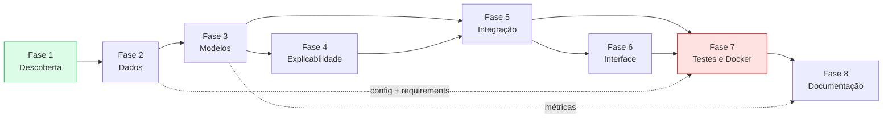
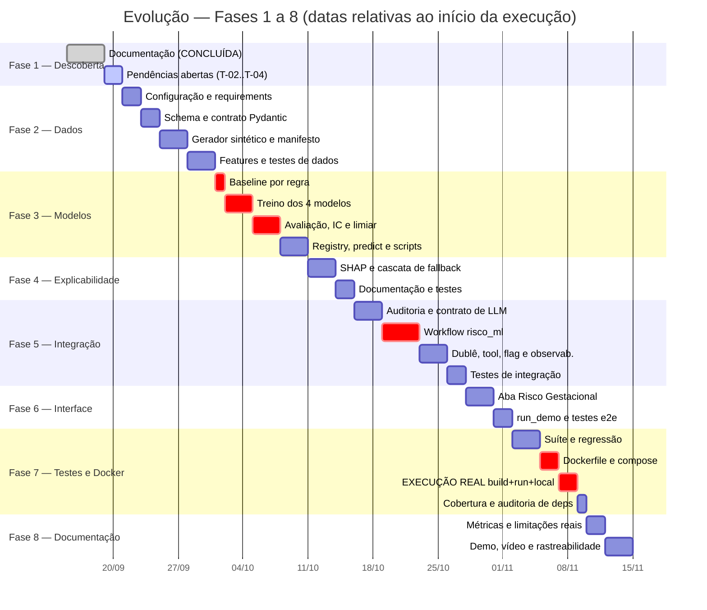

# Roadmap Executivo da Evolução

**Agente responsável:** `EvolutionOrchestratorAgent`
**Público-alvo:** coordenação, avaliação e qualquer pessoa que precise saber *onde a entrega está*
sem ler código
**Documentos vinculantes:** `docs/requisitos/BACKLOG_PRIORIZADO.md` (BL-01…BL-58) ·
`docs/requisitos/CRITERIOS_DE_ACEITE.md` §13 (os 20 critérios da evolução) ·
`docs/arquitetura/ARQUITETURA_ALVO.md` · `docs/arquitetura/DECISOES_ARQUITETURAIS.md` (ADR-001…012)

> ## Banner de estado
>
> **Nada da nova fase foi implementado.** Não existem `lib/ml/`, `tests/`, `scripts/`,
> `Dockerfile`, `requirements.txt`, `artifacts/` nem dataset. Nenhum modelo foi treinado, nenhuma
> métrica foi medida, nenhum contêiner foi construído.
>
> As únicas entregas concluídas são **documentos** — o conjunto em `docs/`, incluindo este arquivo.
> Documento não é implementação. Toda linha de status deste roadmap que não seja de documentação
> está em `Não iniciado`, e os 20 critérios de aceite da evolução estão em `Pendente` — **0 de 20**.

---

## 1. Objetivo da evolução

O sistema atual (Fase 3) é um assistente clínico de saúde da mulher com LLM fine-tuned, RAG sobre
39 protocolos, 9 ferramentas LangChain, 4 workflows LangGraph e interface Gradio com 5 abas. Ele
funciona. O que falta não é qualidade — é **cobertura**.

O objetivo da evolução tem uma formulação curta e uma justificativa concreta:

> **Substituir uma decisão clínica estruturada que hoje é tomada por um LLM de 3 bilhões de
> parâmetros por um classificador supervisionado auditável, explicável, versionado e integrado ao
> fluxo existente — sem remover nada do que já funciona.**

A decisão em questão está em `lib/workflows/obstetrico.py:124-144`
(`_avaliar_risco_gestacional`): a classificação `habitual` / `alto_risco` de uma gestante é feita
pelo LLM, recebendo os critérios MS/FEBRASGO como texto dentro do prompt, sem probabilidade, sem
explicabilidade por variável e com `default='habitual'` em caso de falha de parse — ou seja, **a
falha silenciosa produz o pior erro possível neste domínio, o falso negativo.**

Essa é a razão pela qual o ML entra neste projeto. Não é ML enxertado para cumprir requisito de
entrega; é a correção de um ponto identificado por leitura de código.

### 1.1 O que a evolução entrega, em uma frase por camada

| Camada | Entrega |
|---|---|
| Dados | Dataset sintético de 8 000 gestações, determinístico por semente 42, com contrato, dicionário e manifesto SHA-256 versionado |
| Modelos | 4 modelos comparáveis no mesmo split — `DummyClassifier`, baseline determinístico por regra, Regressão Logística, Random Forest — com intervalo de confiança por bootstrap |
| Decisão | Limiar operacional escolhido na **validação** por recall ≥ 0,90, versionado junto ao modelo |
| Explicabilidade | Contribuição por variável em toda predição, com o método declarado (SHAP ou fallback) |
| Segurança | Regra determinística de alarme obstétrico que **precede e pode anular** a inferência |
| Orquestração | Workflow LangGraph novo com 16 nós, 4 arestas condicionais e 4 caminhos de exceção |
| LLM | Síntese sob contrato somente-leitura dos números, com verificação pós-geração e descarte em divergência |
| Interface | 6ª aba "Risco Gestacional (ML)", sem tocar nas 5 existentes |
| Auditoria | Tabela `predicoes_ml` com uma linha por invocação, inclusive nas que não predizem |
| Operação | Execução local sem Colab/Drive/GPU, Docker do perfil `demo-cpu` **com log de build e run anexado** |
| Verificação | Suíte `pytest` em 4 níveis (unit, integration, e2e, regression) com cobertura ≥ 80 % em `lib/ml/` |

### 1.2 O que a evolução explicitamente NÃO entrega

Registrado aqui para que a ausência não seja lida como esquecimento. A lista completa com
justificativa está em `BACKLOG_PRIORIZADO.md` §"Fora de escopo declarado (`Won't`)".

- **Validação clínica.** Os dados são sintéticos. Nenhuma métrica desta fase é evidência de
  desempenho em população real.
- **Escore probabilístico para violência doméstica** (ADR-002, recusa ética).
- **Classificação multiclasse de urgência na triagem** (registrada como extensão futura).
- **Alteração do schema de `hospital.db`** (quebraria os notebooks 05, 07 e 10).
- **Migração para FastAPI ou reescrita em camadas** (ADR-001: evolução aditiva).
- **Rechunking do RAG de 6000 para ~1200 caracteres** — provavelmente a melhoria de maior impacto
  no sistema, mas invalida o índice existente e todos os números da Fase 3. Ver §7.

---

## 2. As 8 fases

Uma fase = uma sprint do `BACKLOG_PRIORIZADO.md`. A correspondência é 1:1 e não há renumeração.

| Fase | Nome | Itens de backlog | Tarefas técnicas | Entregável principal |
|---|---|---|---|---|
| **1** | Descoberta e diagnóstico | BL-01…BL-08 | T-01…T-07 | O conjunto `docs/` — inventário, arquitetura alvo, ADRs, requisitos, contratos, backlog e este roadmap |
| **2** | Dados | BL-09…BL-16 | T-08…T-18 | Dataset de 8 000 registros reprodutível + `lib/config.py` + `requirements*.txt` + schema Pydantic |
| **3** | Modelos | BL-17…BL-24 | T-19…T-29 | 4 modelos treinados, comparados com IC, limiar justificado e registrados com `model_card.json` |
| **4** | Explicabilidade | BL-25…BL-28 | T-30…T-34 | `lib/ml/explain.py` com cascata SHAP → linear → permutação e método declarado no payload |
| **5** | Integração | BL-29…BL-38 | T-35…T-49 | `lib/workflows/risco_ml.py`, tabela `predicoes_ml`, contrato de LLM e validador anti-alucinação |
| **6** | Interface e experiência | BL-39…BL-43 | T-50…T-54 | 6ª aba Gradio + `scripts/run_demo.py` com os 4 cenários |
| **7** | Testes e Docker | BL-44…BL-52 | T-55…T-64 | Suíte de testes verde + imagem Docker **construída e executada**, com log |
| **8** | Documentação e apresentação | BL-53…BL-58 | T-65…T-71 | Métricas reais publicadas, matriz de rastreabilidade fechada, roteiro de vídeo e demonstração |

Detalhamento tarefa a tarefa em `ROADMAP_TECNICO.md`; escopo, critério de saída e riscos por sprint
em `ROADMAP_SPRINTS.md`.

### 2.1 Entregáveis por fase, em detalhe

#### Fase 1 — Descoberta e diagnóstico
- Inventário do repositório com marcadores de origem (`[COD]`/`[CFG]`/`[DOC]`/`[INF]`/`[AUS]`/`[VAL]`)
- 28 lacunas (LAC-01…LAC-28) e 16 riscos (RIS-01…RIS-16) catalogados
- 26 requisitos funcionais, 20 não funcionais, 40 critérios de aceite, matriz de rastreabilidade
- Arquitetura alvo, 12 ADRs, contratos de componentes
- Contrato de dados, dicionário, estratégia de rotulagem, definição do problema de ML
- **Esta é a única fase com trabalho concluído.** O que resta dela está em `ROADMAP_SPRINTS.md` §1.

#### Fase 2 — Dados
- `lib/config.py` + `.env.example`: o sistema deixa de depender de caminhos Colab fixos
- `requirements.txt`, `requirements-ml.txt`, `requirements-llm.txt` com versões pinadas
- `lib/ml/schema.py`: `GestanteFeatures` com 11 campos obrigatórios, 13 opcionais, validadores cruzados
- `lib/ml/dataset.py`: gerador determinístico + manifesto SHA-256 versionado
- `lib/ml/features.py`: `ColumnTransformer` dentro de `Pipeline`
- Perfilamento, qualidade e mapa de vazamentos

#### Fase 3 — Modelos
- `lib/ml/baseline.py`: `CRITERIOS_ALTO_RISCO` como regra — **o comportamento atual do sistema**
- `lib/ml/train.py`: 4 modelos, `GridSearchCV` + `StratifiedKFold(5)` só sobre o treino
- `lib/ml/evaluate.py`: matriz de confusão, PR-AUC, ROC-AUC, Brier, calibração, IC por bootstrap
- Limiar operacional na validação por recall ≥ 0,90
- `lib/ml/registry.py` + `model_card.json` + recusa de MAJOR incompatível
- `lib/ml/predict.py` + `scripts/train.py` + `scripts/evaluate.py`
- Análise de erros: perfil de falsos negativos, falsos positivos e desempenho por subgrupo

#### Fase 4 — Explicabilidade
- `lib/ml/explain.py` com detecção de `shap` em tempo de importação
- Cascata `shap_tree_explainer` → `coef_linear` → `permutacao`, com o método no payload e na auditoria
- `EXPLICABILIDADE.md` e `INTERPRETACAO_DAS_PREDICOES.md` preenchidos com saída real
- Teste que roda com `shap` desinstalado

#### Fase 5 — Integração
- Tabela `predicoes_ml` (aditiva, `CREATE TABLE IF NOT EXISTS`)
- `lib/validacao.py`: promoção do validador determinístico de `referencias/` + coerência numérica
- `lib/ml/llm_contract.py`: payload de 13 chaves, prompt de síntese, resposta estruturada
- `lib/workflows/risco_ml.py`: 16 nós, 4 arestas condicionais, 4 caminhos de exceção
- `FakeChatModel` determinístico (viabiliza Docker e testes sem GPU)
- Nó de ML opcional em `obstetrico.py` sob `ML_RISCO_HABILITADO` (padrão desligado)
- 10ª tool `predizer_risco_gestacional` com `args_schema`
- `lib/observabilidade.py` com correlação por execução

#### Fase 6 — Interface e experiência
- 6ª aba "Risco Gestacional (ML)" com formulário das 24 variáveis, 11 obrigatórias destacadas
- Exibição de probabilidade, limiar, campos imputados, regras disparadas, fontes e os dois avisos
- Mensagens específicas para os 4 modos — nenhum traceback chega ao usuário
- `scripts/run_demo.py` com os 4 cenários

#### Fase 7 — Testes e Docker
- `tests/` em 4 níveis + `conftest.py` + `pyproject.toml`
- Regressão: 9 tools intactas, 4 grafos existentes inalterados, flag desligada, predição estável
- `Dockerfile`, `.dockerignore`, `docker-compose.yml` do perfil `demo-cpu`
- **Execução real** de `docker build` + `docker run`, com log anexado
- **Execução real** do pipeline em ambiente local limpo, com log anexado
- Relatório de testes, cobertura, `pip-audit` e varredura de credenciais

#### Fase 8 — Documentação e apresentação
- `METRICAS_E_RESULTADOS.md` e `COMPARACAO_MODELOS.md` preenchidos **exclusivamente** com saída real
- `LIMITACOES_DO_MODELO.md` e consolidação dos avisos de uso clínico
- `GUIA_DEMO.md`, `LOG_DEMO.md`, roteiro de vídeo atualizado com os números reais
- Matriz de rastreabilidade fechada com status e evidências
- `README.md`, relatório técnico e `CHANGELOG.md`

---

## 3. Dependências entre fases



Em verde, a única fase com trabalho concluído. Em vermelho, a fase que concentra os dois riscos de
maior severidade do projeto (ver §6).

### 3.1 Dependências que costumam ser subestimadas

Três dependências não aparecem no caminho crítico mas bloqueiam silenciosamente:

| Dependência | Fase de origem | O que trava se atrasar |
|---|---|---|
| `lib/config.py` (T-08) | 2 | Treino local, Docker, CI e todos os testes. Enquanto os caminhos do Colab estiverem fixos em `lib/db.py:12` e `lib/llm.py:51`, nada roda fora do Colab |
| `requirements*.txt` pinados (T-10) | 2 | Reprodutibilidade (RNF-02) e Docker (RF-19). Sem pin, "mesma métrica em duas execuções" é sorte |
| `FakeChatModel` (T-44) | 5 | Imagem Docker de algumas centenas de MB em vez de 8 GB, testes e2e sem GPU e o próprio `docker run` validável (ADR-005) |

Antecipar `lib/config.py` e `requirements*.txt` para a Fase 2 — em vez de deixá-los para a fase de
Docker, que é o padrão comum — é uma decisão deliberada do backlog e a principal mitigação do
risco de estouro de escopo (RIS-15).

### 3.2 Caminho crítico

```
BL-08 → BL-12 → BL-13 → BL-17 → BL-19 → BL-22 → BL-25 → BL-32 → BL-39 → BL-42 → BL-47 → BL-48
 (T-13)  (T-15)  (T-20)  (T-21)  (T-26)  (T-30)  (T-41)  (T-50)  (T-53)  (T-58)  (T-60)
```

Doze itens em sequência estrita, das fases 2 a 7. Atraso em qualquer um desloca a entrega inteira.
Os demais 46 itens têm folga.

---

## 4. Cronograma



> As datas são **relativas** e servem para mostrar ordem, paralelismo e duração proporcional. A
> data-base `2026-09-15` é um marcador de referência da produção documental da Fase 1, não um
> compromisso de calendário. Nenhuma data de entrega foi acordada neste documento.

---

## 5. Marcos

Um marco só é atingido quando o **critério objetivo** for satisfeito por um artefato existente —
não pela afirmação de que o trabalho foi feito.

| Marco | Nome | Critério objetivo de atingimento | Verificação | Status |
|---|---|---|---|---|
| **M1** | Diagnóstico fechado | PC-01 resolvida (24 features); RAG no modo `incompleto` decidido (não chama RAG); divergência do encoder (`max_seq_length`) **adiada com registro** até T-03 executar o modelo | `DICIONARIO_DE_DADOS.md` §1 · `ESTRATEGIA_RAG.md` §7 · T-03 em `ROADMAP_TECNICO.md` | **Parcial** (encoder `[VAL]`) |
| **M2** | Dados prontos | `scripts/train.py --gerar-dataset` produz 8 000 registros; `--verificar-dataset` confere o SHA-256 do manifesto versionado; `test_dataset_sem_vazamento.py` passa | Execução dos dois comandos + `pytest tests/unit/test_dataset_*.py` | **Pendente** |
| **M3** | Modelos comparáveis | `artifacts/metrics/comparacao.json` contém os 4 modelos, no mesmo split identificado por hash, com ponto e IC por bootstrap em cada métrica | Leitura do JSON + conferência do hash de split | **Pendente** |
| **M4** | Predição explicável | Um payload válido produz `top_features` com ≥ 3 entradas e `explanation_method` preenchido; o mesmo ocorre com `shap` desinstalado, com método diferente | `pytest tests/unit/test_explicabilidade_fallback.py` | **Pendente** |
| **M5** | Fluxo integrado | O grafo compilado de `risco_ml` tem ≥ 3 arestas condicionais e os 4 caminhos de exceção são alcançados por teste; cada execução grava exatamente 1 linha em `predicoes_ml` | `pytest tests/integration/test_workflow_risco_ml.py tests/integration/test_auditoria_predicoes.py` | **Pendente** |
| **M6** | Demonstrável | `python scripts/run_demo.py` termina com código 0 e produz as 4 saídas em `artifacts/demo/`; a 6ª aba renderiza os 4 modos sem traceback | Execução do comando + `pytest tests/e2e/` | **Pendente** |
| **M7** | Comprovadamente executável | `docs/deploy/EXECUCAO_DOCKER.md` e `EXECUCAO_LOCAL.md` contêm o **log real** de `docker build`, `docker run` e da sessão local limpa; a suíte completa passa em ≤ 5 min sem GPU e sem rede | Leitura dos logs anexados + `pytest` no perfil `ml-only` | **Pendente** |
| **M8** | Entrega fechada | Os 20 critérios de aceite da evolução têm status definido com evidência apontada; nenhum número publicado em `docs/ml/` sem chave em `artifacts/metrics/` | Conferência cruzada documento × JSON + matriz de rastreabilidade | **Pendente** |

**8 de 8 marcos pendentes.**

### 5.1 O marco que decide a entrega

**M7.** Os critérios 3, 19 e 20 da lista dos 20 (§6 de `CRITERIOS_DE_ACEITE.md`) são os mais
frequentemente declarados atendidos sem evidência, porque dependem de **execução** e não de código
escrito. Enquanto o log de `docker build` + `docker run` não existir em
`docs/deploy/EXECUCAO_DOCKER.md`, o requisito RF-19 permanece **não atendido** — e nenhum documento
desta entrega pode afirmar o contrário. Isso está fixado na ADR-005, cujo status é literalmente
*"Aceita — pendente de validação por execução real do build"*.

---

## 6. Riscos por fase

Visão executiva. O registro completo, com indicadores de materialização, mitigação, contingência e
responsável, está em `ROADMAP_RISCOS.md`. Os identificadores `RIS-xx` são os de
`docs/03_LACUNAS_E_RISCOS.md` Parte II e **não foram renumerados**.

| Fase | Riscos principais | Classificação | Efeito se materializar |
|---|---|---|---|
| **1** | RIS-16 reimportar números não verificáveis da Fase 3 | Alto | Documento novo publica métrica sem origem, contaminando a rastreabilidade da fase inteira |
| **2** | RIS-04 vazamento de dados · RIS-11 RNG/versões quebrando a reprodutibilidade | Alto · Alto | Métricas infladas sem que ninguém perceba; SHA-256 do manifesto deixa de conferir |
| **3** | **RIS-03 o ML não superar o baseline determinístico** · RIS-02 métrica sintética lida como clínica | Alto · **Crítico** | O ML fica sem justificativa técnica; ou pior, um resultado sintético é apresentado como evidência clínica |
| **4** | RIS-07 `shap` não instalar em Python 3.13 | Alto | Explicabilidade — requisito obrigatório — indisponível |
| **5** | RIS-05 o LLM de 3B inventar números · RIS-08 quebra dos notebooks 05–10 · RIS-13 flag criando dois caminhos divergentes | **Crítico** · Alto · Moderado | Número falso chega ao usuário; retrocompatibilidade perdida |
| **6** | RIS-06 taxa de descarte alta fazer a demo parecer quebrada · RIS-14 avaliador não regenerar banco e índice | Moderado · Alto | A demonstração perde impacto ou simplesmente não roda na máquina de quem avalia |
| **7** | **RIS-01 declarar Docker funcional sem ter executado** · imagem grande demais · RIS-15 estouro de escopo | **Crítico** · Alto · Alto | Afirmação falsa publicada; testes e Docker ficam para o fim, sem evidência |
| **8** | RIS-02 (persiste) · RIS-16 (persiste) | **Crítico** · Alto | Relatório final com número sem lastro ou sem o aviso de dados sintéticos |

### 6.1 Os dois riscos que dominam o projeto

RIS-01 e RIS-02 são os únicos de **probabilidade alta e impacto crítico** — e nenhum dos dois é
técnico:

- **RIS-01 é dizer que algo funciona sem ter executado.** Contramedida: log anexado, sempre.
- **RIS-02 é apresentar métrica sintética como validação clínica.** Contramedida:
  `aviso_dados_sinteticos` é campo obrigatório do payload em todos os modos, aparece na interface,
  no relatório e na narração do vídeo.

Ambos são evitáveis por disciplina de redação. Nenhum exige tecnologia adicional. São, por isso
mesmo, os mais fáceis de cometer sob pressão de prazo.

### 6.2 O risco que precisa de uma decisão antecipada

**RIS-03 — o modelo de ML não superar o baseline determinístico por regra.**

Esse é um desfecho **possível e legítimo**. A postura está decidida antes do experimento, e isso
importa: se `artifacts/metrics/comparacao.json` mostrar que o recall do Random Forest é menor ou
estatisticamente indistinguível do recall da regra `CRITERIOS_ALTO_RISCO`, o resultado será
**reportado como está**, discutido em `docs/ml/LIMITACOES_DO_MODELO.md`, e a conclusão será que,
neste dataset, o ML não se justifica sobre a regra.

Nenhuma tarefa do roadmap prevê ajustar o experimento até o ML vencer. Um empate honesto,
documentado e com intervalo de confiança vale mais — técnica e eticamente — que um experimento
reconfigurado para produzir superioridade.

---

## 7. Achado técnico que atravessa o roadmap

Um achado de leitura de código merece visibilidade executiva porque afeta a interpretação de todo
resultado de RAG desta e da fase anterior:

> **Os chunks do índice de protocolos têm 6 000 caracteres, mas o encoder
> `paraphrase-multilingual-MiniLM-L12-v2` trunca a entrada antes de gerar o vetor. O embedding de
> cada chunk representa apenas o começo do seu texto; o restante está armazenado e é devolvido como
> `page_content`, mas não influenciou a decisão de recuperá-lo.**

O efeito é que o sistema cita quatro fontes enquanto o LLM leu aproximadamente o início de uma
delas — porque os workflows ainda truncam o contexto concatenado em `[:2500]` caracteres
(`triagem.py:106`, `obstetrico.py:196`, `prevencao.py:158`).

**Há uma divergência aberta entre dois documentos desta mesma entrega** sobre a magnitude do
truncamento: `00_INVENTARIO_PROJETO.md` §7.1 afirma janela de **128 tokens** (~10 % do chunk
representado); `docs/rag/ESTRATEGIA_RAG.md` §3.1 afirma **512 tokens** (~1/3 do chunk). As duas
não podem estar certas. A tarefa **T-03** resolve isso por medição direta
(`SentenceTransformer(EMB_MODEL).max_seq_length`) antes de qualquer conclusão sobre qualidade de
recuperação.

O **rechunking** que corrigiria o problema está **fora do escopo** desta fase: invalidaria o índice
de ~1392 chunks e todos os números de documentação da Fase 3, exigindo reindexação completa e nova
avaliação. Fica registrado como recomendação principal para a fase seguinte
(`ESTRATEGIA_RAG.md` §8.2). O que entra no escopo são as mitigações R-01 a R-04: filtro nativo de
categoria no Chroma, `args_schema` em `buscar_protocolo`, truncamento proporcional por fonte e
registro observável de quantas fontes sobreviveram ao filtro.

---

## 8. Critérios de conclusão da evolução

A evolução está concluída quando os **20 critérios de aceite** da seção 13 do desafio
(`docs/requisitos/CRITERIOS_DE_ACEITE.md`) estiverem atendidos **com a evidência apontada
existindo no repositório**.

| # | Critério | Marco | Evidência que o encerra | Status |
|---|---|---|---|---|
| 1 | Problema de ML formalmente definido, com justificativa ancorada no código existente | M1 | `docs/ml/DEFINICAO_DO_PROBLEMA.md` + referência a `obstetrico.py:124-144` | **Pendente** |
| 2 | Origem e natureza dos dados declaradas, incluindo a ausência de dataset real | M1 | `docs/dados/CONTRATO_DE_DADOS.md` §1–2 + manifesto | **Pendente** |
| 3 | Dataset reprodutível de forma **verificável** | M2 | Manifesto SHA-256 versionado + log das duas gerações | **Pendente** |
| 4 | Sem vazamento entre treino, validação e teste | M2 | `tests/unit/test_dataset_sem_vazamento.py` verde | **Pendente** |
| 5 | Ao menos dois modelos supervisionados treinados, além dos baselines | M3 | `artifacts/models/` com 4 `.joblib` + 4 `model_card.json` | **Pendente** |
| 6 | Modelos comparados na mesma métrica, no mesmo split, com intervalo de confiança | M3 | `artifacts/metrics/comparacao.json` | **Pendente** |
| 7 | Métrica primária adequada; acurácia não é critério isolado | M3 | `docs/ml/METRICAS_E_RESULTADOS.md` | **Pendente** |
| 8 | Limiar justificado, versionado e escolhido fora do conjunto de teste | M3 | Campo `threshold` em `model_card.json` + `artifacts/metrics/limiar.json` | **Pendente** |
| 9 | Explicabilidade por variável, com o método declarado | M4 | `artifacts/explainability/` + `docs/ml/EXPLICABILIDADE.md` | **Pendente** |
| 10 | Regra determinística precede e pode anular a inferência | M5 | `tests/integration/test_regra_precede_ml.py` verde | **Pendente** |
| 11 | Dados incompletos tratados sem imputação silenciosa, com acionamento humano | M5 | `tests/unit/test_dados_incompletos.py` + `tests/e2e/test_fluxo_dados_incompletos.py` | **Pendente** |
| 12 | Modelo integrado a workflow LangGraph com ramificação e tratamento de erro | M5 | `lib/workflows/risco_ml.py` + diagrama do grafo compilado | **Pendente** |
| 13 | O LLM comunica o resultado sem poder alterar os números | M5 | `docs/llm/POLITICA_ANTI_ALUCINACAO.md` + `tests/unit/test_validador_anti_alucinacao.py` | **Pendente** |
| 14 | RAG fornece suporte documental com fonte citada | M5 | `tests/integration/test_rag_no_fluxo_ml.py` | **Pendente** |
| 15 | Avisos de segurança e limites de uso em toda saída | M5 | `tests/unit/test_avisos_obrigatorios.py` (4 modos) + capturas | **Pendente** |
| 16 | Toda predição auditável, sem dado clínico em claro | M5 | Tabela `predicoes_ml` + dump de exemplo | **Pendente** |
| 17 | Interface expõe predição com probabilidade, explicação e incerteza | M6 | Capturas em `docs/demo/` | **Pendente** |
| 18 | Demonstração ponta a ponta por comando único | M6 | `scripts/run_demo.py` + `docs/demo/LOG_DEMO.md` | **Pendente** |
| 19 | Execução local e Docker documentada e **comprovada por log real** | M7 | `docs/deploy/EXECUCAO_LOCAL.md` e `EXECUCAO_DOCKER.md` | **Pendente** |
| 20 | Suíte de testes com evidência e o sistema anterior continua funcionando | M7 | `docs/testes/RELATORIO_DE_TESTES.md` + `tests/regression/` verde | **Pendente** |

### 8.1 Placar

| Indicador | Valor |
|---|---|
| Critérios de aceite da evolução atendidos | **0 de 20** |
| Marcos atingidos | **0 de 8** |
| Itens de backlog concluídos | **0 de 58** |
| Tarefas técnicas concluídas | **0 de 71** (3 de documentação entregues; ver §8.2) |
| Requisitos verificados | **0 de 46** (26 RF + 20 RNF) |
| Linhas de código de produção da nova fase | **0** |

### 8.2 Sobre o que já está entregue

Três tarefas da Fase 1 (T-05, T-06 e T-07) produziram **documentos** e estão concluídas enquanto
documentos: o inventário/estado atual/mapa de componentes; a análise de lacunas e riscos com os
requisitos, critérios de aceite e matriz; e o conjunto de arquitetura, ADRs, contratos e
especificações de ML, dados, LLM, RAG e LangGraph. Elas não movem o placar de §8.1 porque
**nenhuma delas produz código, artefato de modelo ou evidência de execução**.

As quatro tarefas restantes da Fase 1 (T-01 a T-04) continuam abertas: reconciliar o status do
backlog, fechar a pendência PC-01 (23 vs 24 features), medir o `max_seq_length` real do encoder e
resolver a divergência do RAG no caminho `incompleto`.

> Há uma divergência declarada com `BACKLOG_PRIORIZADO.md`, que mantém BL-01…BL-08 em
> `Não iniciado` mesmo com os documentos correspondentes existindo. A leitura adotada aqui é que
> BL-01…BL-08 estão **concluídos como documentação** e o backlog precisa ser atualizado (tarefa
> T-01). Enquanto isso não ocorre, os dois documentos discordam e a discordância está registrada em
> vez de silenciada.

---

## 9. Como acompanhar

| Pergunta | Onde a resposta está |
|---|---|
| "Em que fase estamos?" | §5 deste documento — o último marco com critério satisfeito |
| "O que exatamente falta nesta sprint?" | `ROADMAP_SPRINTS.md`, seção da sprint corrente, campo *critério de saída* |
| "Quem faz o quê e em qual arquivo?" | `ROADMAP_TECNICO.md` — 71 tarefas com agente, arquivos, dependências e definição de pronto |
| "O que pode dar errado e o que fazemos?" | `ROADMAP_RISCOS.md` — indicadores de materialização e plano de contingência |
| "Como demonstrar o sistema?" | `docs/demo/ROTEIRO_DEMO.md` e `docs/demo/CASOS_DE_USO.md` |
| "Um requisito específico está atendido?" | `docs/requisitos/MATRIZ_DE_RASTREABILIDADE.md` — 46 linhas, coluna *Evidência esperada* |

**Regra de atualização de status:** nenhuma linha muda de `Não iniciado` / `Pendente` sem que o
artefato da coluna "evidência" exista no repositório. Status é consequência de artefato, não de
esforço.
