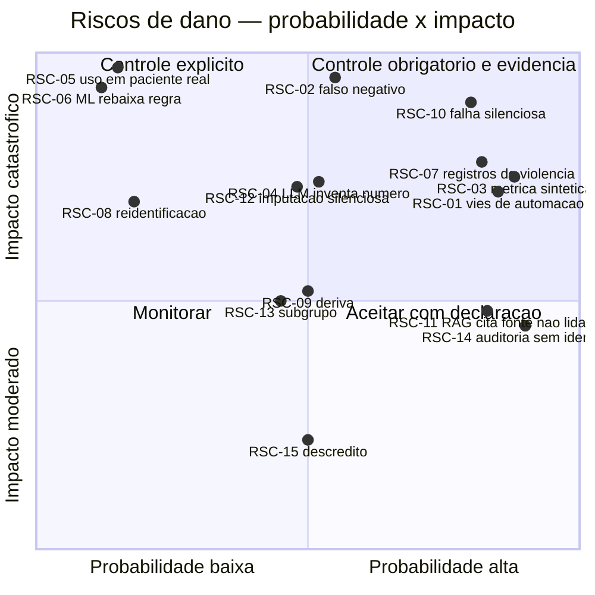

# Análise de Riscos — Clínicos, Técnicos e Éticos

**Agente responsável:** `SecurityAndComplianceAgent`
**Escopo:** riscos de **dano** decorrentes do uso do sistema e da nova camada de ML. Riscos de
**projeto** (prazo, escopo, entrega) estão em `docs/03_LACUNAS_E_RISCOS.md` Parte II (`RIS-xx`);
riscos de **vazamento estatístico** estão em `docs/dados/RISCOS_DE_VAZAMENTO.md` (`VAZ-xx`).
**Faixa de IDs:** `RSC-01` a `RSC-15`.

---

> ## Banner de estado
>
> **Nenhum controle descrito neste documento está implementado.** Nenhum modelo foi treinado,
> nenhum teste foi escrito ou executado, nenhuma imagem Docker foi construída. A coluna
> "Situação do controle" da matriz consolidada (§4) está `Projetado` em 100 % das linhas.
>
> Este é um registro de riscos **antes** do código, para que cada risco tenha um controle nomeado
> e um teste que o detecte. Um risco sem teste associado é uma intenção.

---

## 1. Por que este documento é separado do registro de riscos de projeto

`docs/03_LACUNAS_E_RISCOS.md` responde "o que pode dar errado na **entrega**". Este documento
responde "o que pode causar **dano** se o sistema for usado". São perguntas diferentes e produzem
controles diferentes: um atraso de sprint se resolve com replanejamento; um falso negativo de
estratificação de risco gestacional não.

Há sobreposição deliberada em dois pontos, e ela está declarada: `RSC-03` aprofunda `RIS-02`
(métrica sintética apresentada como clínica) e `RSC-04` aprofunda `RIS-05` (LLM inventando número).
Nos dois casos, o registro de projeto trata da **afirmação publicada** e este documento trata do
**dano ao paciente**.

### 1.1 Escalas

| Probabilidade | Critério |
|---|---|
| **Alta** | Ocorre por padrão, salvo ação deliberada de controle |
| **Média** | Plausível em uso normal do sistema como demonstração |
| **Baixa** | Exige conjunção de fatores ou uso fora do escopo declarado |

| Impacto | Critério |
|---|---|
| **Catastrófico** | Dano físico grave, irreversível ou morte materna/fetal |
| **Crítico** | Dano clínico relevante, violação de dados sensíveis ou afirmação falsa publicada |
| **Alto** | Decisão clínica degradada, perda de rastreabilidade, dano reputacional |
| **Moderado** | Ineficiência, ruído, desconfiança no sistema |

| Severidade | Derivação |
|---|---|
| **S1 — Inaceitável sem controle** | Catastrófico/Crítico com probabilidade Alta ou Média |
| **S2 — Requer controle explícito** | Crítico/Alto com probabilidade Baixa, ou Alto com Média |
| **S3 — Monitorar** | Moderado, ou Alto com probabilidade Baixa |

**Risco residual** é o que sobra **depois** do controle projetado — assumindo que o controle seja
implementado como descrito. Enquanto nada está implementado, o risco corrente é o **inerente**, e
o residual é uma projeção.

---

## 2. Registro de riscos clínicos

### RSC-01 — Viés de automação: o profissional confia na probabilidade

| Campo | Conteúdo |
|---|---|
| **ID** | RSC-01 |
| **Categoria** | Clínico / fator humano |
| **Descrição** | O profissional adota a saída do modelo como conclusão em vez de insumo, deixando de exercer julgamento clínico independente. É o modo de falha mais estudado de sistemas de apoio à decisão e não depende de o modelo estar errado — depende de ele parecer autoritativo |
| **Cenário concreto** | A aba "Risco Gestacional (ML)" devolve `habitual` com `P(alto_risco) = 0,28` e limiar `0,31`. A gestante tem 34 anos, IMC 29 e PA 138/88 — abaixo de todos os cortes. O obstetra, com 12 minutos por consulta, lê "habitual · 28 %" em destaque, não solicita proteinúria e agenda retorno em 30 dias. A probabilidade de 0,28 é **próxima do limiar**, e essa proximidade não foi lida |
| **Probabilidade** | **Alta** — é o comportamento padrão de qualquer interface que exibe um número com aparência de certeza |
| **Impacto** | **Crítico** |
| **Severidade** | **S1** |
| **Controle** | (1) Probabilidade **sempre** exibida ao lado do `threshold`, nunca isolada (RF-06, RF-07). (2) `safety_notice` como campo obrigatório do payload, não texto decorativo da UI (RF-14). (3) `top_features` com direção e contribuição, para que a decisão seja inspecionável em vez de aceita. (4) Faixa de proximidade ao limiar declarada na interface: quando \|p − threshold\| ≤ 0,05, a UI exibe o aviso de decisão-limite definido em `AVISOS_DE_USO_CLINICO.md` §3.6. (5) Nenhuma linguagem imperativa na saída: o texto do LLM descreve, não prescreve |
| **Risco residual** | **Médio, e irredutível por software.** Nenhum aviso de interface elimina viés de automação; a literatura é consistente nisso. O que o sistema pode garantir é que a informação necessária para duvidar dele esteja visível. A mitigação real seria treinamento de usuário e avaliação de impacto — ambos fora do escopo de uma demonstração acadêmica, e essa ausência é parte do risco |
| **Teste que detecta** | `tests/unit/test_avisos_obrigatorios.py` (presença dos campos nos 4 modos); `tests/e2e/test_ui_aba_ml.py` (probabilidade e limiar renderizados juntos) |

### RSC-02 — Falso negativo na estratificação de risco

| Campo | Conteúdo |
|---|---|
| **ID** | RSC-02 |
| **Categoria** | Clínico |
| **Descrição** | Gestante de alto risco classificada como `habitual`. Perde vigilância intensificada, periodicidade de consulta e exames de acompanhamento |
| **Cenário concreto** | Gestante de 37 anos, primigesta, IMC 31, PA 132/86 na 28ª semana, sem comorbidade registrada. O modelo devolve `P = 0,29` contra limiar `0,31` → `habitual`. `_definir_acompanhamento` agenda retorno em 30 dias em vez de 7–14. Entre as duas consultas, instala-se pré-eclâmpsia que seria detectada com vigilância mais frequente |
| **Probabilidade** | **Média** — falso negativo é consequência estatística de qualquer classificador, e o dataset tem erro de Bayes irredutível por construção (ADR-004) |
| **Impacto** | **Catastrófico** |
| **Severidade** | **S1** |
| **Controle** | (1) Métrica primária é **recall da classe positiva**, não acurácia (`DEFINICAO_DO_PROBLEMA.md` §5.1). (2) Limiar operacional escolhido como o **menor** que atinja recall ≥ 0,90 na validação — explicitamente não 0,5 (RF-06). (3) Falsos negativos analisados caso a caso, com perfil publicado (ML-AC-04). (4) A regra determinística `SINAIS_ALARME_OBST` executa **antes** e independe do modelo (ADR-006, RF-04), cobrindo os sinais de emergência. (5) O baseline determinístico `CRITERIOS_ALTO_RISCO` permanece disponível como modo degradado (RF-22) |
| **Risco residual** | **Alto por natureza da tarefa.** Recall 0,90 significa 1 em 10 casos positivos perdidos. Nenhum limiar elimina o falso negativo; ele é deslocado para falso positivo. O que este projeto pode afirmar é que a assimetria de custo foi **declarada e usada na escolha do limiar**, e que o número de falsos negativos será reportado, não omitido |
| **Teste que detecta** | `tests/unit/test_limiar_operacional.py` (limiar do card é o aplicado); `tests/integration/test_regra_precede_ml.py` (o alarme determinístico não é rebaixado) |

### RSC-06 — A regra determinística é rebaixada pela inferência probabilística

| Campo | Conteúdo |
|---|---|
| **ID** | RSC-06 |
| **Categoria** | Clínico / arquitetural |
| **Descrição** | Um sinal de alarme obstétrico de alta especificidade é sobreposto por uma probabilidade baixa do modelo, resultando em não-encaminhamento |
| **Cenário concreto** | Gestante de 22 anos, IMC 23, primigesta, sem comorbidade, na 33ª semana, apresentando cefaleia intensa refratária + escotomas + epigastralgia em barra. Todas as features estruturadas são de baixo risco, então o modelo devolve `P(alto_risco) = 0,09`. Se a arquitetura permitisse a combinação ponderada, a saída seria `habitual` — para um quadro de suspeita de HELLP/eclâmpsia iminente |
| **Probabilidade** | **Baixa** — a ADR-006 já veda a combinação por projeto. O risco é de **regressão** na implementação, não de desenho |
| **Impacto** | **Catastrófico** |
| **Severidade** | **S1** |
| **Controle** | (1) ADR-006: o nó `regras_seguranca` precede `executar_modelo_ml` no grafo; com alarme, o fluxo vai para `bypass_ml` e o modelo **não é invocado**. (2) A precedência é uma **aresta do grafo**, não um peso — é estrutural e inspecionável em `graph.get_graph()`. (3) A auditoria registra `modo='bypass_regra'` com `probabilidade = NULL`, o que prova que não houve inferência |
| **Risco residual** | **Baixo.** A propriedade é testável de forma binária: um caso com sinal de alarme produz encaminhamento imediato sem chamada ao modelo. O residual é a **cobertura da lista** `SINAIS_ALARME_OBST` (10 sinais) — um sinal de emergência ausente da lista não dispara bypass, e essa lista não passou por revisão clínica formal neste projeto |
| **Teste que detecta** | `tests/integration/test_regra_precede_ml.py` — espião sobre `predict` assertando **zero** chamadas no caminho de bypass |

### RSC-12 — Imputação silenciosa de valor clínico

| Campo | Conteúdo |
|---|---|
| **ID** | RSC-12 |
| **Categoria** | Clínico |
| **Descrição** | Um campo clínico ausente é substituído pela mediana da população e a probabilidade resultante é apresentada como se tivesse sido calculada sobre medida real |
| **Cenário concreto** | O formulário é preenchido sem pressão arterial. O `SimpleImputer` do `Pipeline` insere a mediana do treino (≈ 118/75). O modelo devolve `P = 0,14` e a interface exibe "habitual". O profissional entende que a PA foi considerada. Ela nunca foi medida |
| **Probabilidade** | **Média** — é o comportamento padrão de qualquer pipeline sklearn com imputador |
| **Impacto** | **Crítico** |
| **Severidade** | **S1** |
| **Controle** | (1) Distinção contratual entre campo **obrigatório** e **opcional** (`CONTRATO_DE_DADOS.md` §5): `pas_mmhg` e `pad_mmhg` são obrigatórios e **nunca** imputados. (2) Obrigatório ausente ⇒ `DadosIncompletosError`, caminho human-in-the-loop, `modo='incompleto'`, `probabilidade = NULL` (RF-03, RF-21, RNF-18). (3) Opcional ausente ⇒ imputado **e declarado** em `dados_imputados`, presente no payload, na UI e na auditoria |
| **Risco residual** | **Baixo.** O residual é de apresentação: `dados_imputados` precisa estar visível, não escondido em bloco colapsável. A regra de posicionamento está em `AVISOS_DE_USO_CLINICO.md` §4 |
| **Teste que detecta** | `tests/unit/test_dados_incompletos.py`; `tests/e2e/test_fluxo_dados_incompletos.py` |

### RSC-13 — Desempenho desigual entre subgrupos

| Campo | Conteúdo |
|---|---|
| **ID** | RSC-13 |
| **Categoria** | Ético / clínico |
| **Descrição** | O modelo tem recall sistematicamente menor em um subgrupo, distribuindo os falsos negativos de forma desigual |
| **Cenário concreto** | Adolescentes (13–17 anos) são ≈ 3 % do dataset. Com 22 % de prevalência, o subgrupo tem poucas dezenas de positivos. O Random Forest, otimizado para `average_precision` global, aprende pouco sobre a faixa e erra mais nela. A métrica agregada não mostra isso, e adolescência é ela própria critério de alto risco em `CRITERIOS_ALTO_RISCO` (`idade <16`) |
| **Probabilidade** | **Média** |
| **Impacto** | **Alto** |
| **Severidade** | **S2** |
| **Controle** | (1) Análise de subgrupo **obrigatória** por faixa etária e idade gestacional (`DEFINICAO_DO_PROBLEMA.md` §5.4, RF-09). (2) Publicação de recall por subgrupo em `METRICAS_E_RESULTADOS.md`, não apenas do agregado. (3) Registro em `LIMITACOES_DO_MODELO.md` de qualquer subgrupo com desempenho fora do intervalo de confiança do agregado |
| **Risco residual** | **Médio, com ressalva metodológica importante.** Como o dataset é sintético e as **frequências** por subgrupo foram escolhidas por nós (`CONTRATO_DE_DADOS.md` §2), uma disparidade observada aqui **não** é evidência de disparidade em população real, e a ausência de disparidade aqui **não** é evidência de equidade. A análise de subgrupo neste projeto valida o *procedimento*, não o *modelo* |
| **Teste que detecta** | `tests/integration/test_metricas_reportadas.py` — falha se o relatório de métricas não contiver as fatias por subgrupo |

---

## 3. Registro de riscos éticos, de privacidade e técnicos

### RSC-03 — Métrica obtida em dado sintético apresentada como validação clínica

| Campo | Conteúdo |
|---|---|
| **ID** | RSC-03 |
| **Categoria** | Ético / integridade científica |
| **Descrição** | Um número de desempenho medido sobre dados que nós mesmos geramos é lido como evidência de utilidade clínica |
| **Cenário concreto** | O relatório técnico traz "PR-AUC de 0,87 na estratificação de risco gestacional". O avaliador, o espectador do vídeo ou um leitor futuro entende isso como "o modelo identifica corretamente 87 % das gestantes de alto risco". O que o número mede é a capacidade do modelo de **recuperar um processo gerador logístico que está escrito num documento versionado deste repositório** — e nada além disso |
| **Probabilidade** | **Alta** — é o modo de leitura natural de qualquer métrica, e exige contra-ação deliberada em cada ponto de exibição |
| **Impacto** | **Crítico** |
| **Severidade** | **S1** |
| **Controle** | (1) `aviso_dados_sinteticos` é campo **obrigatório** do payload em todos os 4 modos (RF-14, RNF-19). (2) Texto final definido em `AVISOS_DE_USO_CLINICO.md` §3.3, replicado em UI, payload, README, relatório e roteiro de vídeo. (3) `DEFINICAO_DO_PROBLEMA.md` §7 já fixa a formulação: métrica alta prova que o **pipeline** está correto, não que o modelo é clinicamente útil. (4) Nenhuma métrica publicada sem origem em `artifacts/metrics/` (RNF-16, ML-AC-07) |
| **Risco residual** | **Médio.** O aviso reduz, não elimina, a leitura errada — um número em destaque compete com um aviso em rodapé. A mitigação estrutural adotada é de **linguagem**: os documentos de resultado não usam a palavra "validação" para descrever a avaliação, reservando-a para o que não existe aqui |
| **Teste que detecta** | `tests/unit/test_avisos_obrigatorios.py` (parametrizado pelos 4 modos); `tests/unit/test_documentos_sem_metrica_orfa.py` (VAZ-12) |

### RSC-05 — O modelo é usado em paciente real

| Campo | Conteúdo |
|---|---|
| **ID** | RSC-05 |
| **Categoria** | Ético / regulatório |
| **Descrição** | O artefato desta demonstração é aplicado à decisão assistencial de uma gestante real |
| **Cenário concreto** | O repositório é clonado, `scripts/train.py` roda, o `.joblib` é produzido e a aba do Gradio fica funcional. Nada no software impede que alguém digite os dados de uma paciente real e leia o resultado. O modelo não tem validação clínica, não tem registro sanitário, não foi avaliado quanto a desempenho em população real e foi treinado em 8 000 registros inventados por um gerador logístico |
| **Probabilidade** | **Baixa** — exige uso deliberado fora do escopo declarado |
| **Impacto** | **Catastrófico** |
| **Severidade** | **S1** (impacto catastrófico com probabilidade baixa é tratado como S1 por decisão deste documento) |
| **Controle** | (1) Declaração de uso pretendido e **usos fora de escopo** no `model_card.json` (RF-25, `VERSIONAMENTO_MODELOS.md` §2). (2) Banner permanente na interface (`AVISOS_DE_USO_CLINICO.md` §3.1). (3) `aviso_dados_sinteticos` no payload, que acompanha o resultado mesmo se consumido por outra via que não a UI. (4) `hospital.db` contém exclusivamente dados Faker; não há caminho de importação de prontuário real |
| **Risco residual** | **Alto e não mitigável por este projeto.** Nenhum controle técnico impede uso indevido de um modelo local. O que existe é declaração. Em uso real seriam necessários: validação em coorte prospectiva, avaliação de impacto, aprovação ética, registro do software como dispositivo médico e supervisão profissional documentada — nenhum deles está presente |
| **Teste que detecta** | `tests/unit/test_versoes_declaradas.py` — falha se `model_card.json` não declarar `intended_use` e `out_of_scope_uses` |

### RSC-04 — O LLM inventa ou altera um número da predição

| Campo | Conteúdo |
|---|---|
| **ID** | RSC-04 |
| **Categoria** | Técnico-clínico |
| **Descrição** | O texto de síntese apresenta probabilidade, limiar ou contribuição que não existem no payload do modelo |
| **Cenário concreto** | O payload traz `P(alto_risco) = 0,75` e `threshold = 0,31`. O Llama 3.2 3B — com ~60 % de respostas em loop degenerativo registradas em `lib/llm.py:84-88` — escreve "probabilidade estimada de 85 %, acima do limiar de 50 %". Ambos os números são falsos e ambos têm aparência de saída de modelo. O profissional lê o texto, não o JSON |
| **Probabilidade** | **Média** |
| **Impacto** | **Crítico** |
| **Severidade** | **S1** |
| **Controle** | ADR-007 e `POLITICA_ANTI_ALUCINACAO.md`: (1) prompt com lista fechada de numerais permitidos (preventivo, não bloqueia); (2) verificação numérica pós-geração por regex — todo numeral do texto precisa existir no payload com tolerância de arredondamento; (3) verificação de coerência de rótulo; (4) `ValidadorDeterministico` promovido para `lib/validacao.py` (ADR-010); (5) **descarte** do texto e entrega da resposta estruturada determinística em qualquer divergência (RF-23) |
| **Risco residual** | **Baixo para o número, médio para o texto.** A verificação impede que um numeral inventado chegue à tela, porque o caminho de entrega não depende do texto do LLM. O que ela **não** detecta é alucinação **qualitativa** sem número — "recomenda-se internação" numa paciente `habitual`. Três das cinco regras do validador determinístico bloqueiam; as outras duas apenas sinalizam. A taxa de descarte será medida e reportada (RIS-06), não estimada |
| **Teste que detecta** | `tests/unit/test_validador_anti_alucinacao.py`; `tests/unit/test_contrato_llm.py` |

### RSC-10 — Falha silenciosa produzindo falso negativo: o `default` do `llm_json`

| Campo | Conteúdo |
|---|---|
| **ID** | RSC-10 |
| **Categoria** | Técnico-clínico |
| **Descrição** | Uma falha de execução é absorvida por um valor padrão benigno, e a saída resultante é indistinguível de uma avaliação bem-sucedida |
| **Cenário concreto** | Confirmado no código atual. `lib/workflows/obstetrico.py:124-144` classifica risco gestacional pelo LLM com `common.llm_json(..., default={'classificacao': 'habitual', 'fatores': []})`. Se o modelo devolve JSON malformado — comportamento documentado num 3B —, o nó retorna `habitual` **sem qualquer sinal de que a classificação não aconteceu**. A falha do parser produz exatamente o erro mais grave do domínio: um falso negativo, entregue com a mesma aparência de um resultado válido. Este é o achado que motivou a ADR-002 |
| **Probabilidade** | **Alta** no fluxo atual; **Baixa** no fluxo projetado |
| **Impacto** | **Catastrófico** |
| **Severidade** | **S1** |
| **Controle** | (1) A decisão sai do LLM e vai para a camada 4 (ADR-002) — a causa raiz é removida, não contornada. (2) Falha do modelo de ML segue para `modo_degradado`, que **declara** a degradação ao usuário e registra `modo='degradado'` com `probabilidade = NULL` (RF-22). (3) Os quatro caminhos de exceção são **nós explícitos do grafo**, não `except` genéricos (RNF-09). (4) Nenhum caminho novo usa valor sentinela clínico como default: a ausência de inferência é representada por `NULL`, não por `0.0` nem por `habitual` (`ARQUITETURA_ALVO.md` §5.3) |
| **Risco residual** | **Baixo no fluxo novo; inalterado no fluxo antigo.** Com `ML_RISCO_HABILITADO=false`, `obstetrico.py` mantém o comportamento atual, inclusive o `default='habitual'` — e isso é exigência de retrocompatibilidade (ADR-001, RNF-20). O risco permanece no caminho legado por decisão registrada, e a flag desligada é o estado em que ele existe |
| **Teste que detecta** | `tests/integration/test_modo_degradado.py`; `tests/integration/test_caminhos_de_erro.py` (injeção de falha nas 4 dependências) |

### RSC-11 — O sistema cita fontes que o LLM não leu

| Campo | Conteúdo |
|---|---|
| **ID** | RSC-11 |
| **Categoria** | Técnico-clínico / integridade |
| **Descrição** | A resposta lista protocolos como "fontes consultadas" quando o conteúdo correspondente não entrou no contexto do modelo |
| **Cenário concreto** | Confirmado no código atual e detalhado em `docs/00_INVENTARIO_PROJETO.md` §7.1. Três defeitos compostos: (a) os chunks são indexados com 6 000 caracteres, mas o encoder `paraphrase-multilingual-MiniLM-L12-v2` tem `max_seq_length` de 128 tokens — o vetor representa ~10 % do chunk, e a *escolha* do trecho é feita olhando só o começo dele; (b) os workflows concatenam os trechos e cortam em `[:2500]` caracteres, o que com chunks de 6 000 faz o corte cair **dentro do primeiro trecho**; (c) `citar_fontes` lista as quatro fontes recuperadas como consultadas. Resultado: a resposta exibe `doc_id` de documentos cujo texto nunca chegou ao prompt, o que é uma citação falsa com aparência de rastreabilidade |
| **Probabilidade** | **Alta** no comportamento atual |
| **Impacto** | **Alto** |
| **Severidade** | **S2** |
| **Controle** | (1) `retrieved_sources` no payload traz o **trecho** efetivamente anexado, não apenas o `doc_id` (`ARQUITETURA_ALVO.md` §5.2). (2) A lista de fontes exibida é derivada do que entrou no prompt, não do que o retriever devolveu. (3) O descompasso de `max_seq_length` está registrado como `[VAL]` — precisa ser confirmado por execução (`SentenceTransformer(EMB_MODEL).max_seq_length`) antes de qualquer correção, e a correção do `CHUNK_SIZE` implica reindexação |
| **Risco residual** | **Médio e declarado.** A correção do tamanho de chunk **não** está no escopo obrigatório desta fase; `lib/workflows/common.py` está na lista de módulos inalterados (`ARQUITETURA_ALVO.md` §1). O que esta fase entrega é a **honestidade da citação** no fluxo novo: o que é listado é o que foi enviado. O defeito de recuperação permanece e está documentado |
| **Teste que detecta** | `tests/integration/test_rag_no_fluxo_ml.py` (fontes do payload ⊆ trechos anexados); `tests/integration/test_rag_indisponivel.py` (`retrieved_sources: []` sem exceção) |

### RSC-07 — Exposição de registros de violência

| Campo | Conteúdo |
|---|---|
| **ID** | RSC-07 |
| **Categoria** | Privacidade / segurança do paciente |
| **Descrição** | Informação de `registros_violencia` — dado pessoal sensível cuja divulgação pode causar dano físico direto — é acessada ou exibida fora do caminho auditado |
| **Cenário concreto** | Confirmado no código. `lib/ui.py:63-66` executa `SELECT COUNT(*) FROM registros_violencia WHERE paciente_id = ?` **diretamente**, sem passar por `tools.consultar_violencia`. Consequência dupla: (a) contorna a exigência de `motivo ≥ 5` caracteres (`lib/tools.py:188-190`); (b) **não grava em `log_acesso`**. A sidebar então renderiza "🔒 2 registro(s) prévio(s) em `registros_violencia`" — o fato de haver histórico de violência é revelado a quem tiver a tela à vista, sem justificativa e sem rastro. Em contexto real, com o agressor acompanhando a consulta, esse indicador na tela é risco de dano físico |
| **Probabilidade** | **Alta** — ocorre em toda seleção de paciente com registro |
| **Impacto** | **Crítico** |
| **Severidade** | **S1** |
| **Controle** | (1) Correção do caminho de leitura: a contagem passa por função auditada, ou o indicador é removido da sidebar. Registrado como LAC-11, vinculado a RNF-05 e RNF-06. (2) `_log_acesso` antes de toda leitura e de todo `INSERT` — padrão já correto em `registrar_violencia` (`tools.py:168`) e `consultar_violencia` (`tools.py:190`). (3) Nenhum caminho novo escreve ou lê `registros_violencia` |
| **Risco residual** | **Médio até a correção; depois, o residual é a ausência de autorização.** Com `motivo` obrigatório e log, o acesso é *atribuível e justificado* — mas não *restrito*: qualquer usuário do sistema pode consultar qualquer paciente, porque não há autenticação nem RBAC (§6 de `ESTRATEGIA_DE_SEGURANCA.md`). A auditoria é detectiva, não preventiva |
| **Teste que detecta** | Teste de caminho auditado: nenhuma consulta a `registros_violencia` fora de `lib/tools.py`; `tests/integration/test_auditoria_predicoes.py` como padrão análogo |

### RSC-08 — Reidentificação

| Campo | Conteúdo |
|---|---|
| **ID** | RSC-08 |
| **Categoria** | Privacidade |
| **Descrição** | Um indivíduo é reidentificado a partir dos dados armazenados, do modelo ou dos artefatos de auditoria |
| **Cenário concreto** | Três vetores, com naturezas diferentes. **(a) `hospital.db`:** contém `nome` completo em claro (Faker) e `cpf_hash` = SHA-256 do CPF truncado em 16 hexadecimais (`lib/mock_data.py:100-101`). Um hash de CPF **sem sal** é reversível por força bruta — o espaço de CPF válido é ~10¹⁰, enumerável em minutos. Se o banco contivesse CPF real, o hash não protegeria. **(b) Modelo:** inversão de modelo ou inferência de pertinência ao conjunto de treino. **(c) `predicoes_ml`:** cruzar `features_hash` com um dicionário de combinações plausíveis de features |
| **Probabilidade** | **Baixa** |
| **Impacto** | **Crítico** se houvesse dado real; **nulo** no estado atual |
| **Severidade** | **S2** |
| **Controle** | (1) **O controle decisivo é a ausência de titular:** 100 % dos dados são gerados por Faker `pt_BR` com semente 42; não existe pessoa real no banco nem no conjunto de treino. Inversão de modelo é inaplicável quando não há indivíduo a reidentificar. (2) `predicoes_ml` persiste `features_hash`, não os valores (RNF-06). (3) `top_features` é persistido **sem** o campo `value` (`ARQUITETURA_ALVO.md` §5.3) |
| **Risco residual** | **Nulo no escopo atual; alto se dados reais fossem introduzidos.** As duas fragilidades que se tornariam imediatamente relevantes: o hash de CPF sem sal e truncado, e o `features_hash` sem sal — ambos vulneráveis a dicionário por terem espaço de entrada pequeno e enumerável. Em uso real, o correto seria HMAC com chave gerenciada, não hash simples. Declarado em `LGPD_E_PRIVACIDADE.md` §5 |
| **Teste que detecta** | `tests/unit/test_schema_auditoria.py` — falha se o DDL de `predicoes_ml` ganhar coluna de valor clínico ou se `top_features` persistir `value` |

### RSC-09 — Deriva de modelo e de dados (*drift*)

| Campo | Conteúdo |
|---|---|
| **ID** | RSC-09 |
| **Categoria** | Técnico / operacional |
| **Descrição** | A distribuição das entradas em uso se afasta da distribuição de treino, e o desempenho degrada sem que nada no sistema o sinalize |
| **Cenário concreto** | Dois cenários distintos. **(a) Deriva real:** o modelo é treinado com prevalência de 22 % e distribuições escolhidas por nós; aplicado a uma população com perfil diferente, as probabilidades ficam sistematicamente descalibradas — e o sistema não tem monitoramento, então nada avisa. **(b) Deriva de artefato, que é o cenário plausível aqui:** `artifacts/` não é versionado no git; um `.joblib` de uma execução antiga permanece no volume após o gerador do dataset mudar. O modelo carrega, prediz e não reclama, porque as colunas ainda casam — mas foi treinado sobre outra distribuição |
| **Probabilidade** | **Média** para (b); **Baixa** para (a), que exige uso em produção |
| **Impacto** | **Alto** |
| **Severidade** | **S2** |
| **Controle** | (1) Vínculo modelo ↔ dataset: `model_card.json` registra `dataset_version`, e `registry.carregar()` **recusa** carregar modelo cuja MAJOR de `dataset_version` seja incompatível (RF-25, RNF-14). (2) Manifesto do dataset com SHA-256 versionado no git; `--verificar-dataset` recomputa e compara (ADR-011). (3) `predicoes_ml` grava `modelo_versao` e `dataset_versao` em cada linha, permitindo reconstruir qual artefato produziu qual decisão. (4) `features_hash` permite detectar entradas idênticas com saídas divergentes entre versões |
| **Risco residual** | **Alto quanto à deriva real, e isso é uma ausência declarada.** Não há monitoramento de distribuição de entrada, não há alarme de calibração, não há retreino programado — nada disso está no escopo. O controle implementado cobre apenas **incompatibilidade de versão**, que é deriva de artefato. Deriva populacional é indetectável por este sistema, e a única contramedida é o aviso de que ele não deve ser usado em população real (RSC-05) |
| **Teste que detecta** | `tests/unit/test_registry_compatibilidade.py`; `tests/unit/test_dataset_reprodutivel.py` |

### RSC-14 — A auditoria registra um nome digitado, não uma identidade

| Campo | Conteúdo |
|---|---|
| **ID** | RSC-14 |
| **Categoria** | Segurança / governança |
| **Descrição** | A trilha de auditoria é apresentada como controle de responsabilização, mas o campo `usuario` não é autenticado |
| **Cenário concreto** | Confirmado no código. `lib/tools.py:21` declara `_USUARIO_ATUAL: str = 'sessao_demo'` como **variável global de módulo**, escrita a partir de uma caixa de texto da sidebar (`lib/ui.py:318`) e também por `violencia.py:157`. Qualquer string é aceita. Consequências: (a) `log_acesso.usuario` e `predicoes_ml.usuario` registram o que foi digitado; (b) como o Gradio cria uma thread por requisição — fato reconhecido em `lib/db.py:22-24` pelo uso de `check_same_thread=False` —, duas sessões simultâneas **compartilham** o identificador, e a última escrita vence. A auditoria pode atribuir um acesso ao usuário errado |
| **Probabilidade** | **Alta** |
| **Impacto** | **Alto** |
| **Severidade** | **S2** |
| **Controle** | Nenhum controle técnico é adicionado nesta fase. O que existe é **declaração obrigatória**: toda vez que a auditoria for apresentada como controle — em `POLITICA_DE_AUDITORIA.md`, no relatório técnico, no vídeo —, a limitação é declarada junto. `predicoes_ml` herda exatamente a mesma fragilidade do `log_acesso` |
| **Risco residual** | **Alto e assumido.** Sem autenticação, a auditoria é rastro de sessão, não de identidade. É a primeira coisa que faltaria em produção — antes de criptografia, antes de rate limiting. Registrado como LAC-10 e em `ESTRATEGIA_DE_SEGURANCA.md` §3.6 |
| **Teste que detecta** | Nenhum. Não há o que testar: é uma ausência de funcionalidade, não um defeito de implementação. Declará-la é o controle |

### RSC-15 — Descrédito do sistema por excesso de alarme ou por descarte frequente do texto

| Campo | Conteúdo |
|---|---|
| **ID** | RSC-15 |
| **Categoria** | Fator humano / operacional |
| **Descrição** | O sistema perde credibilidade e passa a ser ignorado — o espelho de RSC-01 |
| **Cenário concreto** | Duas fontes somadas. (a) O limiar escolhido por recall ≥ 0,90 produz precisão baixa: muitas gestantes `habitual` classificadas como `alto_risco`. Em uso repetido, o profissional aprende a descartar o alerta — e descarta também o verdadeiro positivo. (b) A taxa de descarte do texto do LLM (RF-23) é alta num modelo 3B; a interface exibe com frequência a resposta estruturada com aviso de substituição, e o sistema **parece quebrado** mesmo operando exatamente como projetado |
| **Probabilidade** | **Média** |
| **Impacto** | **Moderado** |
| **Severidade** | **S3** |
| **Controle** | (1) Precisão resultante do limiar é **reportada junto** com o recall, não omitida (`DEFINICAO_DO_PROBLEMA.md` §5.1). (2) A taxa de descarte é medida e publicada em vez de escondida (RIS-06). (3) A resposta estruturada é completa por si só: o descarte do texto degrada a redação, não o conteúdo clínico. (4) A distinção entre "substituição do texto" e "falha do sistema" é explicitada na mensagem ao usuário (`AVISOS_DE_USO_CLINICO.md` §3.5) |
| **Risco residual** | **Médio.** É a contrapartida inevitável da escolha de limiar por recall, e a escolha está justificada pela assimetria de custo em RSC-02. Trocar uma por outra seria trocar um risco moderado e reversível por um catastrófico |
| **Teste que detecta** | Nenhum teste automatizado é adequado — é propriedade de uso, não de código. A contramedida é medição e relato |

---

## 4. Matriz consolidada

| ID | Categoria | Risco | Prob. | Impacto | Sev. | Controle principal | Risco residual | Situação |
|---|---|---|---|---|---|---|---|---|
| **RSC-01** | Clínico / humano | Viés de automação | Alta | Crítico | **S1** | Probabilidade sempre com limiar + avisos estruturados | **Médio** — irredutível por software | Projetado |
| **RSC-02** | Clínico | Falso negativo na estratificação | Média | Catastrófico | **S1** | Recall como métrica primária; limiar ≥ 0,90; regra precede ML | **Alto** — inerente à tarefa | Projetado |
| **RSC-03** | Ético | Métrica sintética como validação clínica | Alta | Crítico | **S1** | `aviso_dados_sinteticos` obrigatório nos 4 modos | **Médio** | Projetado |
| **RSC-04** | Técnico-clínico | LLM inventa número | Média | Crítico | **S1** | Verificação pós-geração + descarte (ADR-007) | **Baixo** p/ número, **médio** p/ texto | Projetado |
| **RSC-05** | Ético / regulatório | Uso em paciente real | Baixa | Catastrófico | **S1** | Declaração de uso pretendido e fora de escopo | **Alto** — não mitigável aqui | Projetado |
| **RSC-06** | Clínico / arquitetural | ML rebaixa regra determinística | Baixa | Catastrófico | **S1** | ADR-006: bypass como aresta do grafo | **Baixo** | Projetado |
| **RSC-07** | Privacidade | Exposição de registros de violência | Alta | Crítico | **S1** | Corrigir `ui.py:63-66`; leitura só por caminho auditado | **Médio** — sem autorização | Projetado |
| **RSC-08** | Privacidade | Reidentificação | Baixa | Crítico | **S2** | Ausência de titular real; `features_hash`; sem `value` | **Nulo** hoje; **alto** com dado real | Projetado |
| **RSC-09** | Técnico / operacional | Deriva de modelo e de artefato | Média | Alto | **S2** | Vínculo modelo ↔ `dataset_version` com recusa de carga | **Alto** p/ deriva populacional | Projetado |
| **RSC-10** | Técnico-clínico | Falha silenciosa (`default='habitual'`) | Alta → Baixa | Catastrófico | **S1** | Decisão sai do LLM; modo degradado declarado | **Baixo** no fluxo novo; mantido no legado | Projetado |
| **RSC-11** | Técnico-clínico | RAG cita fonte não lida | Alta | Alto | **S2** | Fontes derivadas do que entrou no prompt | **Médio** — defeito de chunk não corrigido | Projetado |
| **RSC-12** | Clínico | Imputação silenciosa | Média | Crítico | **S1** | Obrigatório nunca imputado; opcional declarado | **Baixo** | Projetado |
| **RSC-13** | Ético / clínico | Desempenho desigual por subgrupo | Média | Alto | **S2** | Análise de subgrupo obrigatória | **Médio** — sem transferência a população real | Projetado |
| **RSC-14** | Governança | Auditoria sobre identidade não verificada | Alta | Alto | **S2** | **Nenhum** — apenas declaração | **Alto** e assumido | Declarado |
| **RSC-15** | Fator humano | Descrédito por excesso de alarme/descarte | Média | Moderado | **S3** | Reportar precisão e taxa de descarte | **Médio** | Projetado |

**Situação:** `Projetado` em 14 linhas, `Declarado` em 1. **Nenhuma linha está `Implementado`.**

### 4.1 Mapa probabilidade × impacto

---

## 5. Os três riscos que este projeto não pode eliminar

Distinção necessária para que a análise não seja lida como um plano de mitigação completo.

| Risco | Por que não é eliminável | Qual é a única contramedida honesta |
|---|---|---|
| **RSC-01** viés de automação | É propriedade da interação humano–máquina, não do software. Avisos reduzem, não removem | Tornar visível a informação necessária para duvidar: probabilidade, limiar, proximidade do corte, contribuições, campos imputados |
| **RSC-05** uso em paciente real | Nenhum controle técnico impede uso local indevido de um artefato | Declaração explícita de uso pretendido e de usos fora de escopo, em todos os pontos de saída |
| **RSC-14** auditoria sem identidade | Exige autenticação, que está fora de escopo por decisão declarada | Nunca apresentar a auditoria como responsabilização sem dizer, na mesma frase, que a identidade não é verificada |

Os três têm a mesma estrutura: o controle é **linguístico**, não técnico. Isso não os torna menos
sérios — torna a redação dos documentos e da interface parte do sistema de segurança, o que é a
razão de `AVISOS_DE_USO_CLINICO.md` conter texto final em vez de diretrizes.

---

## 6. Vínculo com os demais registros

| Registro | Escopo | Sobreposição com este documento |
|---|---|---|
| `docs/03_LACUNAS_E_RISCOS.md` Parte I (`LAC-xx`) | Defeitos do presente | LAC-10, LAC-11, LAC-18, LAC-20, LAC-21, LAC-27 são causas de RSC-07, RSC-10, RSC-14 |
| `docs/03_LACUNAS_E_RISCOS.md` Parte II (`RIS-xx`) | Riscos de entrega | RIS-02 ⊂ RSC-03; RIS-05 ⊂ RSC-04; RIS-07 ⊂ RSC-10; RIS-12 ⊂ RSC-08 |
| `docs/dados/RISCOS_DE_VAZAMENTO.md` (`VAZ-xx`) | Vazamento estatístico | VAZ-12 é a causa metodológica de RSC-03 |
| `docs/arquitetura/ESTRATEGIA_DE_SEGURANCA.md` | Postura de segurança do desenho | Superfície de ataque e fronteiras de confiança; este documento trata de dano, não de vetor |
| `docs/seguranca/CONTROLES_DE_SEGURANCA.md` | Catálogo de controles | Cada controle citado aqui tem ID `CTR-xx` lá |
| `docs/ml/LIMITACOES_DO_MODELO.md` | Limitações do modelo | RSC-02, RSC-09, RSC-13 alimentam a seção de limitações |
