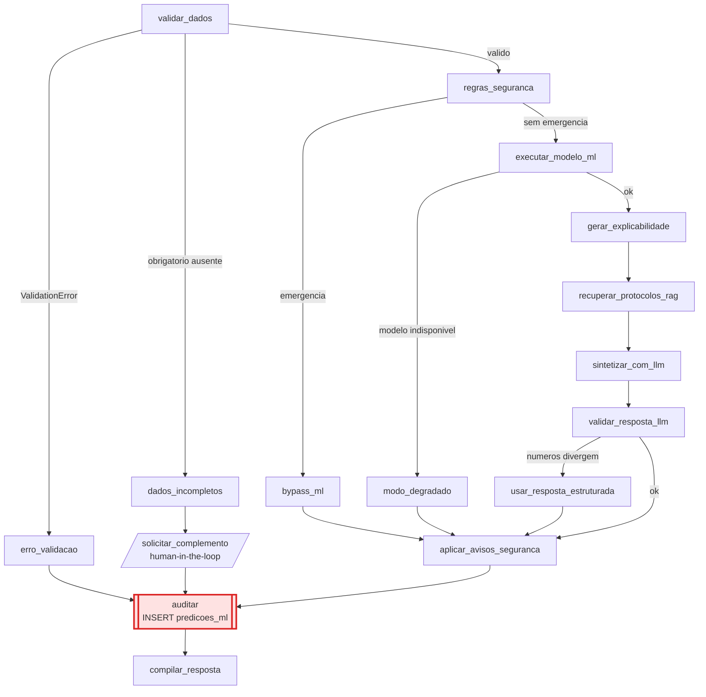

# Política de Auditoria

**Agente responsável:** `SecurityAndComplianceAgent`
**Escopo:** o que é auditado, por quem, com que retenção, com que garantias de imutabilidade, e
como uma decisão é reconstruída depois do fato.
**Vinculado a:** RF-15, RNF-03, RNF-06, `ARQUITETURA_ALVO.md` §4 e §5.3, ADR-006, ADR-012

---

> ## Banner de estado
>
> A tabela `predicoes_ml` **não existe**. `lib/db.py` hoje declara 7 tabelas
> (`lib/db.py:30-103`) e nenhuma delas registra decisão clínica. Nenhuma linha de auditoria de
> predição foi gravada, porque não há modelo, não há workflow de ML e não há código.
>
> O que existe e foi verificado no código é `log_acesso` (§2). Todo o restante — DDL, invariante de
> escrita, receitas de consulta, retenção — é **política projetada**, a ser implementada.

---

## 1. Princípio e escopo

A auditoria deste sistema responde a duas perguntas distintas, e é importante que sejam mantidas
distintas porque exigem mecanismos diferentes:

| Pergunta | Mecanismo | Estado |
|---|---|---|
| **Quem acessou qual dado sensível, e com que justificativa?** | `log_acesso` | Existe **`[COD]`** |
| **Que decisão o sistema produziu, com qual modelo, sobre quais entradas, e em que modo?** | `predicoes_ml` | Projetada |

A segunda é a lacuna central: hoje o projeto audita **acesso a dados** e não audita **decisões do
sistema** (LAC-20). Uma classificação de urgência, um plano preventivo ou uma estratificação de
risco gestacional não deixam nenhum rastro persistente. Quem quisesse revisar uma decisão tomada
ontem não teria por onde começar.

### 1.1 O que a auditoria precisa permitir

A política é derivada de três capacidades exigidas, não de uma lista de campos:

| Capacidade | Consequência de desenho |
|---|---|
| **Reconstruir** uma decisão passada com precisão suficiente para revisá-la | Exige modelo, versão, limiar, modo e identificação das entradas |
| **Provar** que duas execuções partiram das mesmas entradas | Exige `features_hash`, não os valores |
| **Distinguir** ausência de inferência de inferência com valor baixo | Exige `probabilidade` anulável e `modo` explícito |

A terceira é a menos óbvia e a mais importante. Se `probabilidade` fosse `NOT NULL`, um bypass por
regra de emergência precisaria gravar um valor sentinela — e `0.0` gravado como probabilidade é um
número falso sobre um dado clínico sensível.

---

## 2. Auditoria de acesso: `log_acesso` — o que existe hoje

### 2.1 Schema

```74:82:lib/db.py
CREATE TABLE IF NOT EXISTS log_acesso (
    id           INTEGER PRIMARY KEY,
    timestamp    DATETIME NOT NULL DEFAULT CURRENT_TIMESTAMP,
    usuario      TEXT NOT NULL,
    tabela       TEXT NOT NULL,
    paciente_id  INTEGER,
    motivo       TEXT
);
CREATE INDEX IF NOT EXISTS idx_log_pac ON log_acesso(paciente_id, timestamp);
```

Quatro decisões de desenho já presentes, e todas corretas:

| Decisão | Efeito |
|---|---|
| `timestamp` com `DEFAULT CURRENT_TIMESTAMP` | A aplicação não escolhe a hora do registro |
| **Sem `FOREIGN KEY` para `pacientes`** | O log sobrevive à remoção do cadastro da paciente — pré-requisito de qualquer política de eliminação (`LGPD_E_PRIVACIDADE.md` §6.1) |
| `paciente_id` anulável | Permite registrar operação que não é sobre paciente específica |
| Índice por `(paciente_id, timestamp)` | A consulta natural da auditoria é "o histórico de acessos desta paciente" |

### 2.2 O que é efetivamente registrado

Não há *trigger* de banco. O registro é feito por chamada explícita a `_log_acesso`
(`lib/tools.py:33-39`), e apenas em **duas** funções:

| Função | Linha | Momento do log | Motivo gravado |
|---|---|---|---|
| `registrar_violencia` | `lib/tools.py:168` | **Antes** do `INSERT` | `f'Registro novo: {tipo}'` — gerado pelo sistema |
| `consultar_violencia` | `lib/tools.py:190` | **Depois** da validação do motivo, antes do `SELECT` | `motivo.strip()` — informado pelo chamador, mínimo de 5 caracteres |

A ordem em `registrar_violencia` é deliberada e merece registro: o log precede o `INSERT`, então uma
tentativa de registro que falhe por erro de banco **ainda deixa rastro**. Auditar depois do efeito
perde a tentativa frustrada, que é justamente o evento que mais interessa a uma investigação.

### 2.3 O que NÃO é registrado hoje

| Operação | Registrada? |
|---|---|
| Leitura de `registros_violencia` via `consultar_violencia` | **Sim** |
| Escrita em `registros_violencia` | **Sim** |
| **Contagem** de `registros_violencia` pela sidebar (`lib/ui.py:63-66`) | **Não** — é o achado LAC-11 / RSC-07 |
| Leitura de `pacientes`, `prontuario_gineco`, `exames`, `ciclos_menstruais` | **Não** |
| Consulta a `medicamentos` | Não — e é correto: é tabela de referência sem `paciente_id` |
| Qualquer decisão de workflow (urgência, risco, plano preventivo) | **Não** — LAC-20 |
| Invocação de tool pelo agente ReAct | **Não** |

A segunda linha em negrito é a falha mais séria: a contagem de registros de violência é lida
diretamente pelo `conn`, sem motivo e sem log, e o resultado é renderizado na sidebar. Análise
completa em `LGPD_E_PRIVACIDADE.md` §4.1.

### 2.4 Cobertura desta política sobre `log_acesso`

Esta política **não amplia** `log_acesso` a todas as leituras de prontuário. Ampliar significaria
tocar em 8 funções de `lib/tools.py`, e `lib/tools.py` é módulo **estendido de forma aditiva** por
decisão da ADR-001 — acrescentar log a funções existentes muda comportamento observável e ameaça a
regressão dos notebooks 05–10 (RNF-20). A decisão é:

| Item | Decisão |
|---|---|
| Ampliar `log_acesso` a todas as leituras | **Fora de escopo desta fase.** Registrado como exigência de produção em `LGPD_E_PRIVACIDADE.md` §5.2 |
| Corrigir o caminho não auditado de `ui.py:63-66` | **Em escopo** — é correção de defeito, não ampliação |
| Criar `predicoes_ml` para decisões de ML | **Em escopo** — RF-15 |

---

## 3. Auditoria de decisão: `predicoes_ml` — projetada

### 3.1 DDL completo

Reproduzido de `ARQUITETURA_ALVO.md` §5.3. Este é o contrato vinculante; qualquer divergência na
implementação é defeito.

```sql
CREATE TABLE IF NOT EXISTS predicoes_ml (
    id                INTEGER PRIMARY KEY,
    timestamp         DATETIME NOT NULL DEFAULT CURRENT_TIMESTAMP,
    usuario           TEXT NOT NULL,
    paciente_id       INTEGER,
    modelo_nome       TEXT NOT NULL,
    modelo_versao     TEXT NOT NULL,
    dataset_versao    TEXT NOT NULL,
    features_hash     TEXT NOT NULL,   -- SHA-256 das features; NÃO os valores
    predicao          TEXT NOT NULL,
    probabilidade     REAL,            -- NULL quando não houve inferência (ver nota)
    threshold         REAL,            -- NULL nos mesmos casos
    explicacao_metodo TEXT,            -- 'shap_tree_explainer'|'coef_linear'|'permutacao'|NULL
    top_features      TEXT,            -- JSON: apenas feature/contribution/direction, SEM value
    regras_disparadas TEXT,            -- JSON
    modo              TEXT NOT NULL,   -- 'normal'|'degradado'|'bypass_regra'|'incompleto'
    FOREIGN KEY (paciente_id) REFERENCES pacientes(paciente_id)
);
```

Índices a criar junto, seguindo o padrão de `log_acesso`:

```sql
CREATE INDEX IF NOT EXISTS idx_pred_pac    ON predicoes_ml(paciente_id, timestamp);
CREATE INDEX IF NOT EXISTS idx_pred_modelo ON predicoes_ml(modelo_nome, modelo_versao);
CREATE INDEX IF NOT EXISTS idx_pred_modo   ON predicoes_ml(modo, timestamp);
```

O terceiro índice serve à consulta operacional mais frequente da política: "quantas execuções caíram
em modo degradado nas últimas 24 horas".

A tabela é criada por `CREATE TABLE IF NOT EXISTS` dentro do `SCHEMA_SQL` existente
(`lib/db.py:30-103`), de forma aditiva. Bancos já existentes ganham a tabela na próxima chamada a
`init_schema`; nenhuma tabela atual é alterada. Isso preserva RNF-20 e é a mitigação de RIS-08.

### 3.2 Semântica de cada coluna

| Coluna | Semântica | Anulável | Regra |
|---|---|---|---|
| `id` | Chave sequencial | não | Ordem de inserção é a ordem de execução |
| `timestamp` | Momento da gravação | não | `DEFAULT CURRENT_TIMESTAMP` — a aplicação não fornece |
| `usuario` | Identificador declarado da sessão | não | Vem de `tools.get_usuario_atual()`. **Não é identidade verificada** — ver §7.1 |
| `paciente_id` | Paciente avaliada | **sim** | `NULL` quando a predição é sobre um caso digitado sem vínculo a cadastro (uso da aba de ML com dados manuais) |
| `modelo_nome` | Classe do estimador, ex. `RandomForestClassifier` | não | Nos modos sem inferência, grava o identificador do mecanismo que decidiu: `regra_alarme_obstetrico`, `baseline_criterios_alto_risco` ou `validacao_pydantic` |
| `modelo_versao` | SemVer do artefato | não | Mesma regra: `n/a` nos modos sem modelo, nunca vazio |
| `dataset_versao` | `dataset_version` do `model_card.json` do artefato carregado | não | Permite detectar deriva de artefato (RSC-09) |
| `features_hash` | SHA-256 da representação canônica das features validadas | não | Ver §3.3 |
| `predicao` | Rótulo entregue ao usuário | não | `habitual` \| `alto_risco` \| `encaminhamento_imediato` \| `sem_predicao` |
| `probabilidade` | `P(alto_risco = 1)` | **sim** | `NULL` ⇔ não houve inferência de modelo |
| `threshold` | Limiar aplicado | **sim** | `NULL` nos mesmos casos. Quando preenchido, é o valor do `model_card.json`, nunca 0,5 literal |
| `explicacao_metodo` | Método efetivamente usado | **sim** | `shap_tree_explainer` \| `coef_linear` \| `permutacao` \| `NULL`. `NULL` quando não houve explicação a gerar |
| `top_features` | JSON com as variáveis mais influentes | **sim** | **Sem o campo `value`** — ver §3.4 |
| `regras_disparadas` | JSON com as **chaves** de `SINAIS_ALARME_OBST` que dispararam | **sim** | Lista vazia `[]` quando nenhuma disparou; nunca `NULL` no modo `normal` |
| `modo` | Caminho efetivamente percorrido | não | Um dos quatro valores, sem exceção |

**Por que `probabilidade` e `threshold` são anuláveis.** Em três dos quatro modos não existe
probabilidade de modelo: `bypass_regra` (a regra decidiu, o ML não rodou), `degradado` (o modelo não
carregou) e `incompleto` (a validação barrou antes da inferência). Declarar `NOT NULL` obrigaria a
gravar um valor sentinela, e um `0.0` gravado como se fosse probabilidade é exatamente o tipo de
número falso que este sistema existe para evitar. `NULL` significa "não houve inferência", que é a
verdade. Esta é a nota referenciada no comentário do DDL.

### 3.3 `features_hash`: contrato de cálculo

O hash só cumpre sua função — provar igualdade de entradas — se for calculado de forma canônica. A
regra é vinculante:

| Passo | Regra |
|---|---|
| 1. Fonte | O objeto `GestanteFeatures` **já validado**, não o dicionário bruto recebido |
| 2. Serialização | JSON com `sort_keys=True`, `separators=(',', ':')`, `ensure_ascii=False` |
| 3. Nulos | Campo opcional ausente serializa como `null`, nunca omitido — a ausência é parte da entrada |
| 4. Tipos | Booleanos como `true`/`false`; floats com `repr` de precisão plena, sem arredondamento |
| 5. Hash | `hashlib.sha256(payload.encode('utf-8')).hexdigest()` — **64 hexadecimais, sem truncamento** |

O não-truncamento é uma diferença deliberada em relação a `hash_cpf` (`lib/mock_data.py:100-101`),
que trunca em 16. Truncar aumenta colisão sem ganho de privacidade, e colisão em `features_hash`
destruiria a única propriedade que justifica a coluna.

Ressalva declarada: SHA-256 sem sal sobre um espaço de features enumerável é vulnerável a ataque de
dicionário por perfis plausíveis. Em uso real, o correto seria HMAC com chave gerenciada. Registrado
em RSC-08 e `LGPD_E_PRIVACIDADE.md` §5.3.

### 3.4 `top_features`: o que vai e o que não vai

| Destino | Formato |
|---|---|
| Payload para o LLM e para a UI | `{"feature": "has_cronica", "value": true, "contribution": 0.31, "direction": "aumenta"}` |
| **Auditoria** | `{"feature": "has_cronica", "contribution": 0.31, "direction": "aumenta"}` |

A explicação precisa do valor para fazer sentido clínico na tela. A auditoria não precisa dele para
permitir revisão: direção e magnitude da contribuição são o que se audita, e o valor está no
prontuário. Gravar os 5 valores mais informativos em claro, na mesma linha em que as 24 features
estão protegidas por hash, seria proteção decorativa.

Este ponto estava **em aberto** em `ESTRATEGIA_DE_SEGURANCA.md` §5.1, com recomendação do
`ArchitectureAgent`. Esta política o fecha, e a decisão é vinculante para o DDL e verificada por
`tests/unit/test_schema_auditoria.py`.

---

## 4. A invariante central: uma linha por invocação, sempre

> **Toda invocação do workflow `risco_ml` grava exatamente uma linha em `predicoes_ml` — inclusive
> quando não houve inferência, inclusive nos caminhos de erro.**

Uma invocação que não deixa rastro é indistinguível de uma que nunca aconteceu, e é precisamente
nos caminhos de exceção que a auditoria mais importa: o registro de um erro de validação é a única
evidência de que alguém tentou avaliar aquela paciente naquele momento.

### 4.1 Os quatro modos

| `modo` | Gatilho | `probabilidade` | `threshold` | `explicacao_metodo` | `modelo_nome` | `predicao` |
|---|---|---|---|---|---|---|
| `normal` | Inferência bem-sucedida | valor | valor | método usado | classe do estimador | `habitual` \| `alto_risco` |
| `bypass_regra` | Sinal de `SINAIS_ALARME_OBST` detectado | **`NULL`** | **`NULL`** | **`NULL`** | `regra_alarme_obstetrico` | `encaminhamento_imediato` |
| `degradado` | Modelo não carrega ou inferência falha | **`NULL`** | **`NULL`** | **`NULL`** | `baseline_criterios_alto_risco` | `habitual` \| `alto_risco` |
| `incompleto` | Campo obrigatório ausente ou `ValidationError` | **`NULL`** | **`NULL`** | **`NULL`** | `validacao_pydantic` | `sem_predicao` |

Em `bypass_regra`, `regras_disparadas` é obrigatoriamente não vazio — é a justificativa do bypass.
Em `incompleto`, `features_hash` é calculado sobre o payload **parcial**, com os campos ausentes
serializados como `null`, o que permite verificar depois exatamente o que faltava.

### 4.2 Posição do nó `auditar` no grafo



Todos os caminhos convergem para `auditar` **antes** de `compilar_resposta`. Nenhuma aresta alcança
a resposta sem passar pelo nó de auditoria. Essa é a propriedade que o teste verifica — não a
existência do nó, mas a inalcançabilidade da saída sem ele.

### 4.3 O que acontece se a auditoria falhar

Caso limite que precisa de decisão explícita: o `INSERT` falha (banco somente leitura, disco cheio,
arquivo travado).

| Opção | Consequência | Decisão |
|---|---|---|
| Ignorar e responder | Decisão clínica entregue sem rastro, silenciosamente | **Rejeitada** |
| Levantar exceção e não responder | Falha de infraestrutura de auditoria impede o atendimento | **Rejeitada** — auditoria não deve bloquear cuidado |
| **Responder, declarando a falha ao usuário e emitindo log `CRITICAL`** | O usuário sabe que aquela decisão não ficou registrada | **Adotada** |

A resposta inclui o aviso de auditoria indisponível definido em `AVISOS_DE_USO_CLINICO.md` §3.7, e
`lib/observabilidade.py` emite evento de nível `CRITICAL` com o identificador de correlação. Falha
silenciosa de auditoria é proibida pelo mesmo princípio que proíbe modo degradado silencioso
(RF-22, RNF-09).

Verificação: `ESTRATEGIA_DE_SEGURANCA.md` §7 item 10 — teste com banco somente leitura.

---

## 5. Retenção, imutabilidade e acesso

### 5.1 Imutabilidade

| Garantia | Mecanismo | Força |
|---|---|---|
| Nenhum `UPDATE` em `predicoes_ml` no caminho da aplicação | Não existe função que emita `UPDATE` sobre a tabela | **Convenção verificável** por busca textual |
| Nenhum `DELETE` no caminho da aplicação | idem | **Convenção verificável** |
| `timestamp` não fornecido pela aplicação | `DEFAULT CURRENT_TIMESTAMP` | **Estrutural** |
| Ordem de inserção preservada | `id INTEGER PRIMARY KEY` autoincremental | **Estrutural** |

**Honestidade sobre o limite.** Isto é imutabilidade *por convenção de aplicação*, não por
mecanismo. `hospital.db` é um arquivo SQLite; qualquer processo com acesso ao filesystem pode abrir
e alterá-lo. Não há *append-only*, não há WORM, não há encadeamento de hash entre linhas, não há
assinatura. Uma trilha de auditoria realmente imutável exigiria armazenamento apartado com
permissões distintas das da aplicação — fora de escopo, e declarado como exigência de produção.

O mesmo vale para `log_acesso` hoje. A diferença entre as duas é só que `predicoes_ml` nasce com a
convenção escrita.

### 5.2 Retenção

Não existe hoje nenhum mecanismo de expiração — nem em `log_acesso`, nem previsto para
`predicoes_ml`. A política abaixo é o que se aplicaria em uso real, e fica registrada para que a
ausência seja dimensionada.

| Registro | Prazo de retenção proposto | Fundamento |
|---|---|---|
| `log_acesso` de leitura de dado sensível | 5 anos | Prazo suficiente para investigação de acesso indevido |
| `log_acesso` de escrita em `registros_violencia` | Acompanha o registro clínico | Notificação compulsória; não eliminável a pedido (art. 11, II, "a") |
| `predicoes_ml` modo `normal` | Acompanha o prontuário — 20 anos pela Res. CFM nº 1.821/2007 | A predição é parte do raciocínio que sustentou a conduta |
| `predicoes_ml` modos `incompleto` e `degradado` | 2 anos | Valor operacional, não clínico: servem para medir qualidade de dado e disponibilidade de modelo |
| Log estruturado de `lib/observabilidade.py` | 90 dias | Diagnóstico técnico. Não contém valor clínico (RNF-07) |

**Estado atual:** `Não implementado`. Sem dado pessoal, a retenção indefinida não gera risco legal;
com dado real, violaria o art. 15/16 da LGPD.

### 5.3 Quem pode consultar

| Perfil | `log_acesso` | `predicoes_ml` | Estado |
|---|---|---|---|
| Profissional de saúde | Não | Não | Não há controle: qualquer usuário do processo pode consultar o arquivo |
| Encarregado / auditoria interna | Sim | Sim | Perfil inexistente |
| Titular (paciente), quanto às decisões que a afetam | — | Sim (art. 20) | Canal inexistente |
| Equipe de desenvolvimento | Sim, em base de demonstração | Sim | É o único caso real hoje |

Não há RBAC, não há autenticação e não há segregação entre consultar a auditoria e consultar o
prontuário — tudo é o mesmo arquivo SQLite. Declarado em `LGPD_E_PRIVACIDADE.md` §5.2.

---

## 6. Receitas de consulta: reconstruir uma decisão depois do fato

As consultas abaixo são o produto operacional desta política. Todas partem exclusivamente das duas
tabelas de auditoria.

### 6.1 Histórico completo de decisões de uma paciente

```sql
SELECT timestamp, usuario, modo, predicao,
       probabilidade, threshold,
       modelo_nome, modelo_versao, dataset_versao,
       explicacao_metodo, regras_disparadas
FROM predicoes_ml
WHERE paciente_id = ?
ORDER BY timestamp DESC;
```

Responde: o que o sistema disse sobre esta paciente, quando, com qual artefato e em que modo.

### 6.2 Reconstrução de uma decisão específica

```sql
SELECT * FROM predicoes_ml WHERE id = ?;
```

Com a linha em mãos, a reconstrução é:

| Passo | Fonte | O que se obtém |
|---|---|---|
| 1 | `modelo_nome` + `modelo_versao` | Localiza `artifacts/models/<nome>/<versao>/` |
| 2 | `model_card.json` do artefato | Hiperparâmetros, semente, lista e ordem de features, limiar registrado |
| 3 | Conferir `threshold` da linha contra o do card | Prova que o limiar aplicado foi o versionado, não 0,5 |
| 4 | `dataset_versao` + manifesto em `artifacts/data/` | Prova qual dataset treinou o modelo; SHA-256 permite regerar |
| 5 | `features_hash` | Reexecutar a predição com as features do prontuário e comparar o hash. **Se bater, a entrada era a mesma**; se a probabilidade divergir, há deriva de artefato ou de biblioteca |
| 6 | `top_features` | Quais variáveis sustentaram a decisão, com direção e contribuição |
| 7 | `modo` + `regras_disparadas` | Se houve bypass, por qual sinal |

O passo 5 é o que transforma a auditoria em prova em vez de relato. Ele só funciona porque
`features_hash` é canônico (§3.3) e porque o `Pipeline` serializado contém o pré-processamento junto
com o estimador (VAZ-10).

### 6.3 Invariante de auditoria: nenhuma inconsistência de modo

```sql
-- Deve retornar ZERO linhas. Qualquer linha é defeito de implementação.
SELECT id, modo, probabilidade, threshold FROM predicoes_ml
WHERE (modo <> 'normal' AND (probabilidade IS NOT NULL OR threshold IS NOT NULL))
   OR (modo  = 'normal' AND (probabilidade IS     NULL OR threshold IS     NULL))
   OR (modo  = 'bypass_regra' AND (regras_disparadas IS NULL OR regras_disparadas = '[]'))
   OR  modo NOT IN ('normal','degradado','bypass_regra','incompleto');
```

Esta consulta é o corpo de `tests/integration/test_auditoria_predicoes.py`: em vez de conferir
campo a campo, o teste executa os quatro caminhos do workflow e exige conjunto vazio.

### 6.4 Taxa de modo degradado — saúde operacional

```sql
SELECT modo, COUNT(*) AS n,
       ROUND(100.0 * COUNT(*) / (SELECT COUNT(*) FROM predicoes_ml), 1) AS pct
FROM predicoes_ml
GROUP BY modo ORDER BY n DESC;
```

Um percentual alto de `degradado` indica problema de artefato ou de ambiente; alto de `incompleto`
indica problema de qualidade de dado de entrada, não de modelo. A distinção é acionável.

### 6.5 Entradas idênticas com saídas divergentes — detecção de deriva

```sql
SELECT features_hash,
       COUNT(DISTINCT predicao)             AS rotulos_distintos,
       COUNT(DISTINCT modelo_versao)        AS versoes,
       MIN(probabilidade), MAX(probabilidade)
FROM predicoes_ml
WHERE modo = 'normal'
GROUP BY features_hash
HAVING rotulos_distintos > 1;
```

Mesmo hash com rótulos diferentes significa que **algo mudou**: versão de modelo, versão de dataset
ou versão de biblioteca. Se `versoes = 1`, a divergência é mais grave — o mesmo artefato produziu
resultados diferentes para a mesma entrada, o que contradiz o determinismo exigido por RNF-02.

### 6.6 Cruzamento com o log de acesso

```sql
SELECT p.timestamp AS pred_em, p.usuario, p.modo, p.predicao,
       l.timestamp AS acesso_em, l.tabela, l.motivo
FROM predicoes_ml p
LEFT JOIN log_acesso l
       ON l.paciente_id = p.paciente_id
      AND l.timestamp BETWEEN datetime(p.timestamp, '-10 minutes')
                          AND datetime(p.timestamp, '+10 minutes')
WHERE p.paciente_id = ?
ORDER BY p.timestamp DESC;
```

Reconstrói a sessão: que dados sensíveis foram consultados na janela em que a decisão foi tomada. A
janela de ±10 minutos é heurística — não há identificador de sessão compartilhado entre as duas
tabelas, o que é uma limitação do desenho atual e seria resolvida propagando o `correlation_id` de
`lib/observabilidade.py` para ambas. Fica registrado como melhoria conhecida.

---

## 7. Limitações declaradas desta política

### 7.1 `usuario` não é identidade

`predicoes_ml.usuario` vem de `tools.get_usuario_atual()`, que devolve `_USUARIO_ATUAL` — variável
**global de módulo** (`lib/tools.py:21`) escrita por uma caixa de texto da sidebar
(`lib/ui.py:318`). Qualquer string é aceita e não há verificação. Pior: como o Gradio cria uma
thread por requisição — reconhecido em `lib/db.py:22-24` pelo `check_same_thread=False` —, duas
sessões simultâneas compartilham a variável e a última escrita vence.

Consequência: **esta auditoria é rastro de sessão, não responsabilização.** Ela responde "o que foi
decidido, com que artefato, sobre quais entradas e em que modo" com precisão. Não responde "por
quem". Sempre que a auditoria for apresentada como controle — na UI, no relatório, no vídeo —, a
limitação vai na mesma frase. Registrado como LAC-10 e RSC-14.

### 7.2 Imutabilidade é convenção, não mecanismo

Ver §5.1. Não há append-only, encadeamento de hash nem assinatura.

### 7.3 Cobertura parcial

`predicoes_ml` audita as decisões do workflow `risco_ml` e do nó de ML do obstétrico. As decisões
dos workflows `triagem`, `violencia` e `prevencao` continuam **não auditadas**, porque esses módulos
estão na lista de inalterados (`ARQUITETURA_ALVO.md` §1). O sistema passa de zero decisões
auditadas para uma classe de decisões auditada — não para auditoria completa.

### 7.4 Sem identificador de sessão entre tabelas

`log_acesso` e `predicoes_ml` só se correlacionam por `paciente_id` + proximidade temporal (§6.6).

---

## 8. Checklist de verificação

| # | Verificação | Teste |
|---|---|---|
| 1 | Toda invocação do workflow grava exatamente 1 linha, nos 4 modos | `tests/integration/test_auditoria_predicoes.py` |
| 2 | A consulta de invariante da §6.3 retorna conjunto vazio | idem |
| 3 | Nenhuma aresta alcança `compilar_resposta` sem passar por `auditar` | `tests/integration/test_ordem_dos_nos.py` |
| 4 | `predicoes_ml` não tem coluna de valor clínico | `tests/unit/test_schema_auditoria.py` |
| 5 | `top_features` persistido sem a chave `value` | idem |
| 6 | `features_hash` é estável para a mesma entrada e sensível a qualquer mudança de campo | `tests/unit/test_features_hash_estavel.py` |
| 7 | `features_hash` tem 64 caracteres (sem truncamento) | idem |
| 8 | No modo `bypass_regra`, `predict` não é invocado e `regras_disparadas` é não vazio | `tests/integration/test_regra_precede_ml.py` |
| 9 | Falha de `INSERT` de auditoria produz log `CRITICAL` e aviso ao usuário, sem bloquear a resposta | Teste com banco somente leitura |
| 10 | `predicoes_ml` só recebe `INSERT` parametrizado; nenhum `UPDATE`/`DELETE` nos módulos novos | Busca textual + revisão (RNF-05) |
| 11 | A tabela é criada com `IF NOT EXISTS` e nenhuma tabela existente é alterada | `tests/regression/test_schema_existente_intacto.py` |

**Situação de todas as linhas:** nenhum teste existe; nenhum foi executado.
